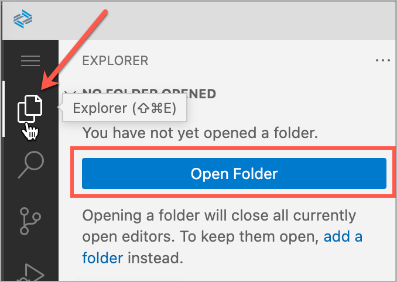

## Prerequisites

## Details
### You will learn
  - How to create a development space in SAP Business Application Studio
  - How to connect to your Cloud Foundry target in SAP Business Application Studio

SAP Business Application Studio is the next-generation web-based IDE hosted on SAP Business Technology Platform (BTP) in the Cloud Foundry environment. In this tutorial, you will set up your SAP Business Application Studio for developing mobile apps.

---

[ACCORDION-BEGIN [Step 1: ](Open SAP Business Application Studio and create your Dev Space)]

Before you can start using SAP Business Application Studio, you need to create your developer space, where your project will run. Depending on the application you want to develop, you can create different types of dev spaces.

For this tutorial, you will create a dev space personalized for Mobile development.

1. Log into your Business Application Studio and click **Create Dev Space**.

2. Choose `Tutorial` as the name for your dev space and **SAP Mobile Application** as the application type. Continue with **Create Dev Space**.

    !

    By selecting **SAP Mobile Application**, your space comes with several extensions out of the box that you will need to develop Mobile applications. The creation of the dev space takes a few seconds.

3. When it's ready, open your dev space by clicking on the name.

    !

    >Please note that you're using the trial version of SAP Business Application Studio. See section [Restrictions](https://help.sap.com/products/SAP%20Business%20Application%20Studio/9d1db9835307451daa8c930fbd9ab264/a45742a719704bdea179b4c4f9afa07f.html) in the SAP Business Application Studio documentation for more details on how your development environment can be affected.

[VALIDATE_1]
[ACCORDION-END]

---

Congratulations, you have successfully configured SAP Business Application Studio to build multi-channel applications.

You can now build [**Mobile Development Kit apps**](mission.mobile-dev-kit-get-started) or [**SAP Mobile Cards apps**](https://developers.sap.com/tutorial-navigator.html?tag=products:content-and-collaboration/sap-mobile-cards) using Business Application studio.

---
