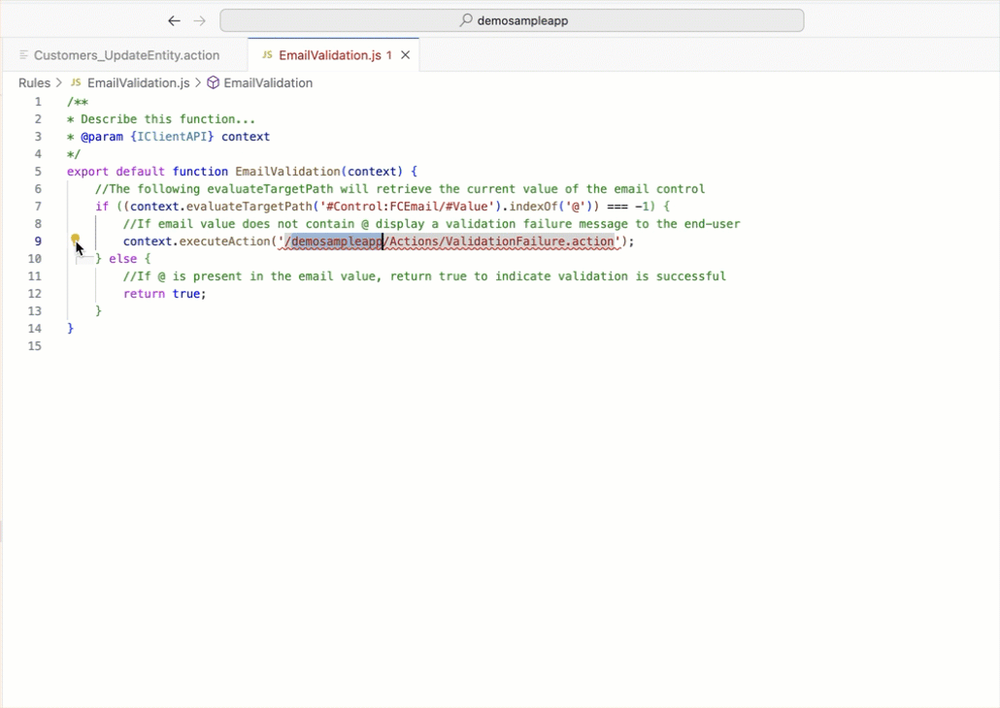
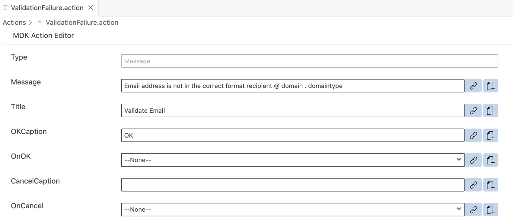

# Define a Validation Rule in an MDK App
<!-- description --> Write a JavaScript logic to validate an email address format in an MDK app.

## You will learn
  - How to write a rule to validate an UI field

---


## Intro
When allowing end-users to make updates to data, it is important to add validation rules to verify that they are entering valid information.
If the Update action fails due to the validation rule, the application will display a validation failure message to the end-user.


### Add a Validation Rule to the Customer Update action


You will add a rule to the Update action to run the validation before saving any data. If the validation rule is successful, the Update action will save the changes as expected. If the validation rule fails, the end-user receives the validation failure message telling them useful information so they can fix the problem before continuing.

1. Open `Customers_UpdateEntity.action` by double clicking on the action in the project explorer pane.

2. Expand the **Common Action Properties** and click the `Create a rule` icon to create a new *Validation Rule*.  

    <!-- border -->

3. Keep the default selection for the *Object Type* as Rule and *Folders* path.

    <!-- border -->

4. In the **Base Information** step, enter the Rule **Name** as `EmailValidation` and then click  **Finish**.

    <!-- border -->

    >You can find more details about [writing a Rule](https://help.sap.com/doc/f53c64b93e5140918d676b927a3cd65b/Cloud/en-US/docs-en/guides/getting-started/mdk/development/rules.html).

6. Replace the generated snippet with below code.

    ```JavaScript
    /**
    * Describe this function...
    * @param {IClientAPI} clientAPI
    */
    export default function EmailValidation(clientAPI) {
        //The following evaluateTargetPath will retrieve the current value of the email control
        if ((clientAPI.evaluateTargetPath('#Control:FCEmail/#Value').indexOf('@')) === -1) {
            //If email value does not contain @ display a validation failure message to the end-user
            clientAPI.executeAction('/DemoSampleApp/Actions/ValidationFailure.action');
        } else {
            //If @ is present in the email value, return true to indicate validation is successful
            return true;
        }
    }
    ```

    This rule will handle validation if a **@** symbol exists in the email address. In this validation rule, you will grab the data entered by the end-user, validate it and check for the **@** symbol then return true if the email address is of a valid format or false if it is not. The returning result of the validation rule can be used in the Update action to determine whether the action succeeds or fails.

7. Save the changes.

    >The [`indexOf()` method](https://www.w3schools.com/jsref/jsref_indexof.asp) returns the index within the calling String object of the first occurrence of the specified value and -1, if no occurrence is found.

    >In above code there is a reference to `ValidationFailure.action`, which doesn't yet exist in your metadata project. You will create this action in next step.

8. In the generated `EmailValidation.js` rule, double-click the red line. You will notice a bulb icon suggesting some fixes, click on it, select `MDK: Create action for this reference`, and click `Message Action`.

    <!-- border -->

9. Provide the below information in the `ValidationFailaure.action`:

    | Field | Value |
    |----|----|
    | `Message`| `Email address is not in the correct format recipient @ domain . domaintype` |
    | `Title` |  `Validate Email` |
    | `OKCaption`| `OK` |
    | `OnOK` | `--None--` |
    | `CancelCaption` | leave it blank |
    | `OnCancel` | `--None--` |

    <!-- border -->


### Deploy the application


Deploy the updated application to your MDK client.

1. Right-click `Application.app` and select **MDK: Deploy**.

    <!-- border -->

2. Select deploy target as **Mobile & Cloud**.

    <!-- border -->

    You should see success message for both deployments.

    <!-- border -->

    >Alternatively, you can select *MDK: Redeploy* in the command palette (View menu>Find Command OR press Command+Shift+p on Mac OR press Ctrl+Shift+P on Windows machine), it will perform the last deployment.

    ><!-- border -->


### Run the app

>Make sure you are choosing the right device platform tab above.

[OPTION BEGIN [Android]]

1. Tap **Check for Updates** in the user menu on the Main page, you will see a _New Version Available_ pop-up, tap **Now**.

    

2. While update a customer record, enter a Email value with no contain of **@**, it throws a validation failure message on saving the record.

    
    

[OPTION END]

[OPTION BEGIN [iOS]]

1. Tap **Check for Updates** in the user menu on the Main page, you will see a _New Version Available_ pop-up, tap **Now**.

    

2. While update a customer record, enter a Email value with no contain of **@**, it throws a validation failure message on saving the record.

    
    

[OPTION END]

[OPTION BEGIN [Web]]

1. Either click the highlighted button or refresh the web page to load the changes.

    <!-- border -->

    >If you see the error `404 Not Found: Requested route ('xxxxx-dev-nsdemosampleapp-approuter.cfapps.xxxx.hana.ondemand.com') does not exist.` while accessing the web application, make sure that in your space cockpit, highlight applications are in started state.

    ><!-- border -->

2. While update a customer record, enter a Email value with no contain of **@**, it throws a validation failure message on saving the record.

    <!-- border -->
    <!-- border -->


[OPTION END]

Once you complete this tutorial you can continue with [Enhance Your First MDK App with Additional Functionalities](mission.mobile-dev-kit-enhance) mission.


---
