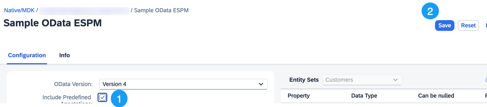
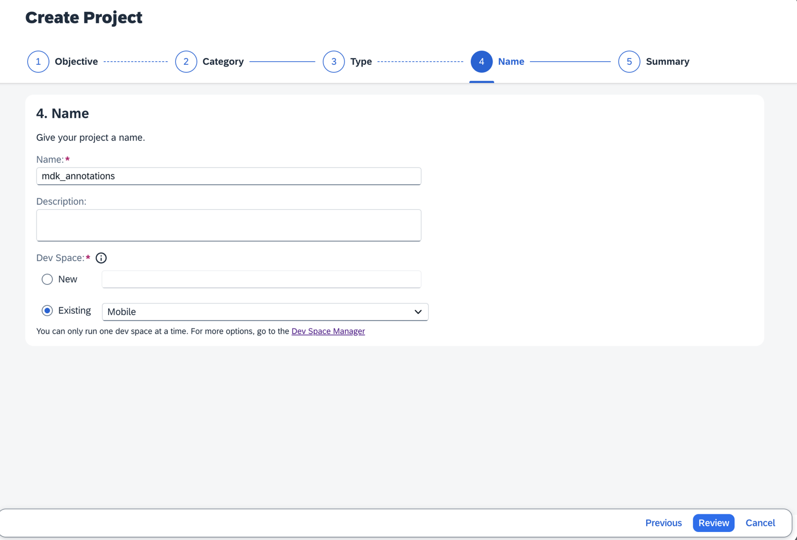
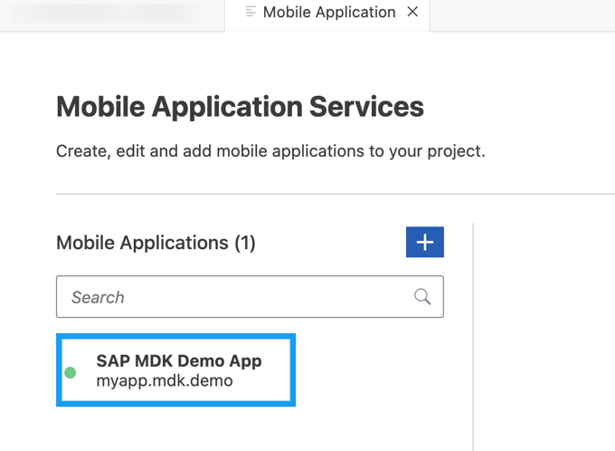
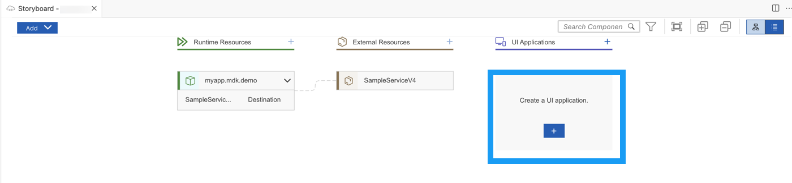
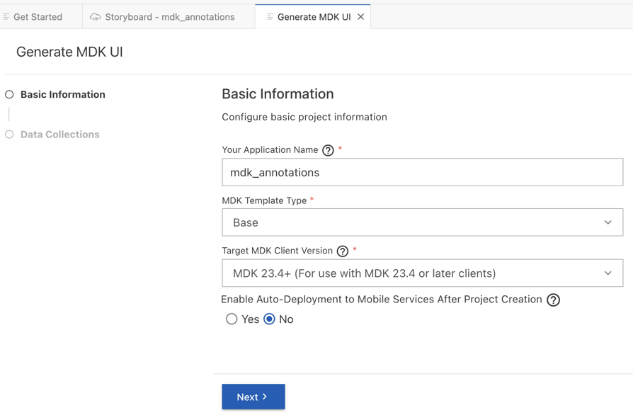
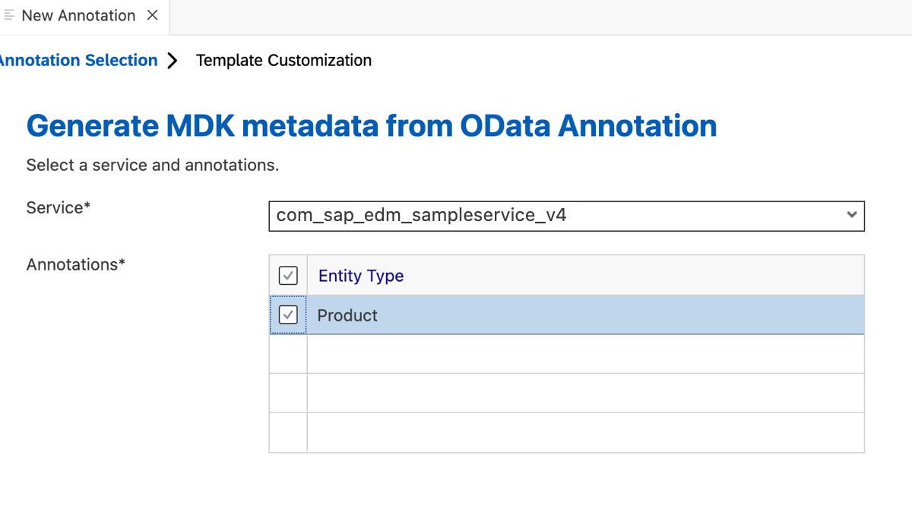
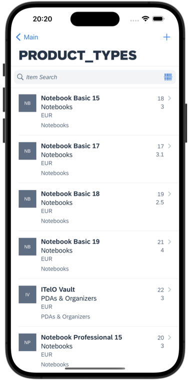
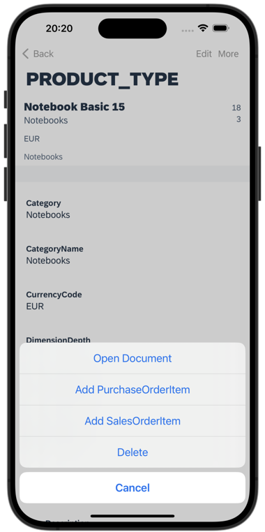

# Use OData Annotations to Add CRUD Functionality to an MDK App
<!-- description --> Generate a fully functional CRUD cross-platform application based on OData annotations.

## Prerequisites
- **Tutorial group:** [Set Up for the Mobile Development Kit (MDK)](https://developers.sap.com/group.mobile-dev-kit-setup.html)
- **Install SAP Mobile Services Client** on your [Android](https://play.google.com/store/apps/details?id=com.sap.mobileservices.client) device or [iOS](https://apps.apple.com/us/app/sap-mobile-services-client/id1413653544)
<table><tr><td align="center"><!-- border --> Android</td><td align="center"> iOS</td></tr></table>
(If you are connecting to `AliCloud` accounts, you will need to brand your [custom MDK client](https://developers.sap.com/tutorials/cp-mobile-dev-kit-build-client.html) by allowing custom domains.)

## You will learn
  - How MDK editor parses OData Annotations for a given OData service
  - How to create a fully functional cross-platform application

## Intro
You may clone an existing metadata project from the [MDK Tutorial GitHub repository](https://github.com/SAP-samples/cloud-mdk-tutorial-samples/tree/main/4-Level-Up-with-the-Mobile-Development-Kit/4-Use-OData-Annotations-to-Add-CRUD-Functionality-to-an-MDK-App) and start directly with step 5 in this tutorial but make sure you complete step 2.

---

Mobile Development Kit brings OData annotations capabilities to your cross-platform applications. MDK editor supports generating List-Detail pages based on annotations. List-Detail pages are similar to a Master-Detail page, but it is two pages instead of one. The MDK editor parses existing annotations to give you a huge leap forward in your cross-platform applications.

### Understand the SAP Fiori Elements

SAP Fiori Elements is a framework comprising of templates for commonly used application patterns, for example List Report, Worklist, Object Page, Overview Page and Analytical list page. Predefined templates combined with OData service and annotations generates SAP Fiori application at startup.

### Add annotation information in the backend destination

Sample backend in SAP Mobile Services provides annotation functionality for **Products**. If you add annotation path in given backend endpoint, the same annotation information can be leveraged by MDK editor to generate related CRUD pages.

Make sure you have already configured an app in Mobile Services admin UI and have added Sample service as per step 2 in [Set Up Initial Configuration for an MDK App](https://developers.sap.com/tutorials/cp-mobile-dev-kit-ms-setup.html) tutorial. The `com.sap.edm.sampleservice.v4` destination is immutable, hence, for this tutorial you need to create a new destination by copying the settings from this destination.

1. In SAP MDK Demo App configuration, click **Mobile Connectivity**.

    <!-- border -->

2. Copy the URL from existing destination and click the **Create** icon to add a new destination.

    <!-- border -->

3. In the **Basic Info** step, provide the required information and click **Next**.

    | Field | Value |
    |----|----|
    | `Destination Name`| `SampleServiceV4` |
    | `URL` | paste the URL from above step |

    <!-- border -->

4. For this tutorial, there is no Custom Headers, Annotations required. Click **Next** to navigate to further steps.

5. In **Annotations** step, click **Add Annotation URL** to add OData Annotations to the Sample service.

    Provide the below information, click on the empty area to trigger the Next button clickable and then click **Next**:

    | Field | Value |
    |----|----|
    | `Annotation Name`| `Product` |
    | `Path/File` | `/annotations/Products` |

    <!-- border -->

6. In the **Destination Configuration** step, select **SSO Mechanism** as **Forward Authentication**, click **Next**.

    <!-- border -->

7. For this tutorial, there is no certificate configuration needed. Click Finish.

    <!-- border -->

    You can see that OData Annotation information is updated in the `SampleServiceV4` destination.

    <!-- border -->

### Create a New Project Using SAP Build Code

This step includes creating a mobile project in SAP Build Lobby. 

1. In the SAP Build Lobby, click **Create** > **Create** to start the creation process.

    <!-- border -->

2. Click the **Build an Application** tile.    

    <!-- border -->

3. Click the **SAP Build Code** tile to develop your project in SAP Business Application Studio, the SAP Build Code development environment, leveraging the capabilities of the services included in SAP Build Code.

    <!-- border -->

4. Click the **Mobile Application** tile. 

    <!-- border -->

5. Enter the project name `mdk_annotations` (used for this tutorial) , add a description (optional), and click **Create**. 

    <!-- border -->
    
    >SAP Build Code recommends the dev space it deems most suitable, and it will automatically create a new one for you if you don't already have one. If you have other dev spaces of the Mobile Application type, you can select between them. If you want to create a different dev space, go to the Dev Space Manager. See [Working in the Dev Space Manager](https://help.sap.com/docs/build_code/d0d8f5bfc3d640478854e6f4e7c7584a/ad40d52d0bea4d79baaf9626509caf33.html).

6. Your project is being created in the Project table of the lobby. The creation of the project may take a few moments.

    <!-- border -->

7. After you see a message stating that the project has been created successfully, click the project to open it. The project opens in SAP Business Application Studio, the SAP Build Code development environment.

    <!-- border -->  

    >When you open the SAP Business Application Studio for the first time, a consent window may appear asking for permission to track your usage. Please review and provide your consent accordingly before proceeding.
    > 

### Configure the Project Using Storyboard

The Storyboard provides a graphical view of the application's runtime resources, external resources, UI of the application, and the connections between them. This allows for a quick understanding of the application's structure and components.

- **Runtime Resources**: In the Runtime Resources section, you can see the mobile services application and mobile destination used in the project, with a dotted-line connected to the External Resources.
- **External Resources**: In the External Resources section, you can see the external services used in the project, with a dotted-line connection to the Runtime Resource or the UI app.
- **UI Application**: In the UI Applications section, you can see the mobile applications.

1. Click on **+** button in the **Runtime Resources** column to add a mobile services app to your project. 

    <!-- border --> 

    >This screen will only show up when your CF login session has expired. Use either `Credentials` OR  `SSO Passcode` option for authentication. After successful signed in to Cloud Foundry, select your Cloud Foundry Organization and Space where you have set up the initial configuration for your MDK app and click Apply.

    > 

2. Choose `myapp.mdk.demo` from the applications list in the **Mobile Application Services** editor.

    <!-- border -->  

3. Select `com.sap.edm.sampleservice.v4` from the destinations list and click **Add App to Project**.

    <!-- border -->  

    >You can access the mobile services admin UI by clicking on the Mobile Services option on the right hand side.

    In the storyboard window, the app and mobile destination will be added under the Runtime Resources column. The mobile destination will also be added under the External Resources with a dotted-line connection to the Runtime Resource. The External Resource will be used to create the UI application.

    <!-- border -->      

4. Click the **+** button in the UI application column header to add mobile UI for your project.

    <!-- border -->     

5. In the **Basic Information** step, select the **MDK Template Type** as **Base**, leave the other options as they are, and click **Next**.

    <!-- border -->  

    >The `Base` template creates the offline or online actions, rules, messages and an empty page (`Main.page`). After using this template, you can focus on creating your pages, other actions, and rules needed for your application. More details on _MDK template_ is available in [help documentation](https://help.sap.com/doc/f53c64b93e5140918d676b927a3cd65b/Cloud/en-US/docs-en/guides/getting-started/mdk/bas.html#creating-a-new-project-cloud-foundry).

6. In the **Data Collections** step, provide the below information and click **Finish**:

    | Field | Value |
    |----|----|
    | `Enter a path to service (e.g. /sap/opu/odata/sap/SERVICE_NAME)` | Leave it as it is  |
    | `Select the Service Type` | Leave the default value as `OData` |
    | `Enable Offline` | Select `No` |

    <!-- border --> 

    Regardless of whether you are creating an online or offline application, this step is needed for app to connect to an OData service. When building an MDK Mobile application, it assumes the OData service created and the destination that points to this service is set up in Mobile Services.  

    >Since you have Enable Offline set to *Yes*, the generated application will be offline enabled in the MDK Mobile client.

    >Data Collections step retrieves the entity sets information for the selected destination.

7. After clicking **Finish**, the storyboard is updated displaying the UI component. The MDK project is generated in the project explorer based on your selections.
 
    <!-- border --> 

### Add MDK Annotation component to MDK project

1. Right-click `Application.app` and select **MDK:New Annotation Component**.

    <!-- border -->

2. In the **Annotation Selection** step, MDK editor fetches annotation details. Select **Product** Annotation and click **Next**.

    <!-- border -->

3. In **Template Customization** step, select **CRUD** Template and click **Finish**.

    <!-- border -->

    In MDK project, you will see new pages, actions, and rules have been generated for **Products**.

    <!-- border -->

    You will also notice a button control has been generated on the `Main.page` to navigate to `Product_List.page`.

    Pages, actions and rules created are a starting point. You can edit those pages and make it your own.  At this point the MDK editor is no longer reading the annotations from OData.

    >If the OData designer updates the backend services data schema (annotations), the MDK pages will stay as originally created. It will not automatically update the pages or overwrite your changes. You are *disconnected* from the annotations at this point.

### Deploy the Project

So far, you have learned how to build an MDK application in the SAP Business Application Studio editor. Now, you will Deploy the Project definitions to Mobile Services to run it in the Mobile client.

1. Right-click `Application.app` and select **MDK: Deploy**.

    <!-- border -->

2. Select deploy target as **Mobile Services**.

    <!-- border -->

    If you want to enable source for debugging the deployed bundle, then choose **Yes**.

    <!-- border -->

    You should see **Deploy to Mobile Services successfully!** message.

    <!-- border -->

### Display the QR code for onboarding the Mobile app

SAP Business Application Studio has a feature to display the QR code for onboarding in the Mobile client. Click on `Application.app` to open it in MDK Application Editor, and then click the **Application QR Code** icon.

<!-- border -->

The On-boarding QR code is now displayed.

<!-- border -->

>Leave the Onboarding dialog box open for the next step.

### Run the Project

[OPTION BEGIN [Android]]

>Ensure that you choose the correct device platform tab above. Once you have scanned and onboarded using the onboarding URL, it will be remembered. If you log out and onboard again, you will be prompted to either continue using the current application or scan a new QR code.

1. Follow [these steps](https://github.com/SAP-samples/cloud-mdk-tutorial-samples/blob/main/Onboarding-Android-client/Onboarding-Android-client.md) to successfully on-board the MDK client on your Android device.

    After you accept app update, tap on the **Products** to navigate to the Products List page.

    

2. In following pages, you can create a new record, modify an existing record, open the product image, add a purchase order item, add a sales order item and even delete the record.

    
    

[OPTION END]

[OPTION BEGIN [iOS]]

>Ensure that you choose the correct device platform tab above. Once you have scanned and onboarded using the onboarding URL, it will be remembered. If you log out and onboard again, you will be prompted to either continue using the current application or scan a new QR code.

1. Follow [these steps](https://github.com/SAP-samples/cloud-mdk-tutorial-samples/blob/main/Onboarding-iOS-client/Onboarding-iOS-client.md) to successfully on-board the MDK client on your iOS device.

    After you accept app update, tap on the **Products** to navigate to the Products List page.

    

2. In following pages, you can create a new record, modify an existing record, open the product image, add a purchase order item, add a sales order item and even delete the record.

    
    

[OPTION END]

---
