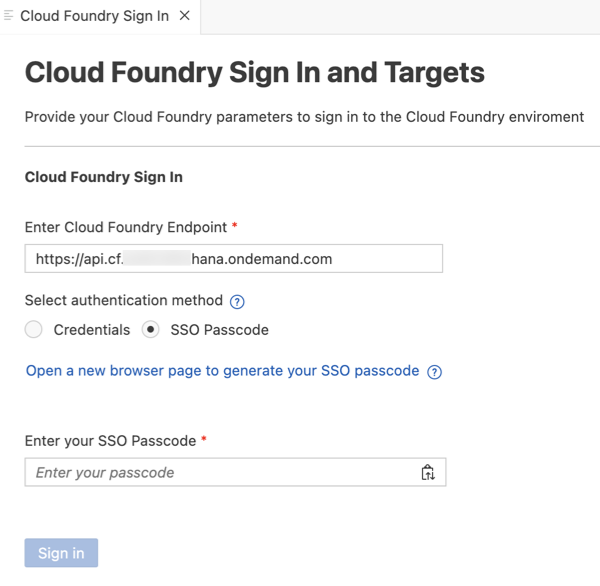
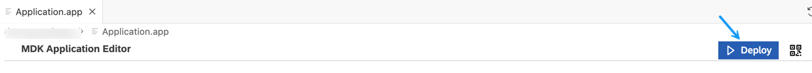
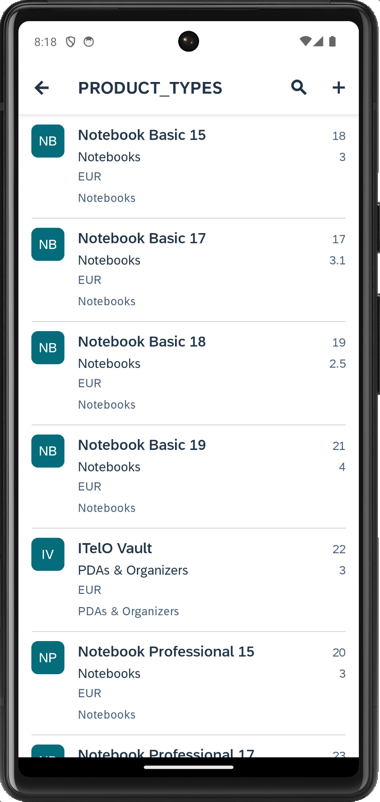
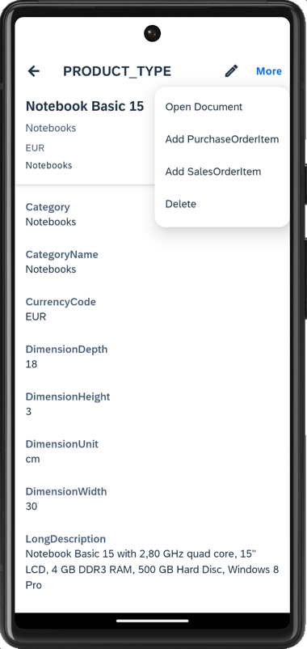
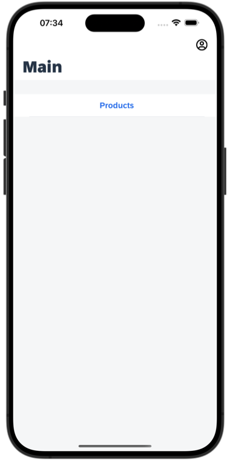

# Use OData Annotations to Add CRUD Functionality to an MDK App
<!-- description --> Generate a fully functional CRUD multi-channel application based on OData annotations.

## Prerequisites
- **Tutorial group:** [Set Up for the Mobile Development Kit (MDK)](group.mobile-dev-kit-setup)
- **Install SAP Mobile Services Client** on your [Android](https://play.google.com/store/apps/details?id=com.sap.mobileservices.client) device or [iOS](https://apps.apple.com/us/app/sap-mobile-services-client/id1413653544)
<table><tr><td align="center"><!-- border --> Android</td><td align="center"> iOS</td></tr></table>
(If you are connecting to `AliCloud` accounts, you will need to brand your [custom MDK client](cp-mobile-dev-kit-build-client) by allowing custom domains.)

## You will learn
  - How MDK editor parses OData Annotations for a given OData service
  - How to create a fully functional multi-channel application

## Intro
You may clone an existing metadata project from the [MDK Tutorial GitHub repository](https://github.com/SAP-samples/cloud-mdk-tutorial-samples/tree/main/4-Level-Up-with-the-Mobile-Development-Kit/4-Use-OData-Annotations-to-Add-CRUD-Functionality-to-an-MDK-App) and start directly with step 5 in this tutorial but make sure you complete step 2.

---

Mobile Development Kit brings OData annotations capabilities to your multi-channel applications. MDK editor supports generating List-Detail pages based on annotations. List-Detail pages are similar to a Master-Detail page, but it is two pages instead of one. The MDK editor parses existing annotations to give you a huge leap forward in your multi-channel applications.

### Understand the SAP Fiori Elements

SAP Fiori Elements is a framework comprising of templates for commonly used application patterns, for example List Report, Worklist, Object Page, Overview Page and Analytical list page. Predefined templates combined with OData service and annotations generates SAP Fiori application at startup.

### Add annotation information in the backend destination

Sample backend in SAP Mobile Services provides annotation functionality for **Products**. If you add annotation path in given backend endpoint, the same annotation information can be leveraged by MDK editor to generate related CRUD pages.

Make sure you have already configured an app in Mobile Services cockpit and have added Sample service as per step 3 in [Set Up Initial Configuration for an MDK App](cp-mobile-dev-kit-ms-setup) tutorial.

1. In SAP MDK Demo App configuration, click **Mobile Connectivity**.

    <!-- border -->

2. Click **Edit** icon to add annotation path to the `SampleServiceV4` destination.

    <!-- border -->

3. In following steps, let the existing settings as it is.

    In **Annotations** step, click **Add Annotation URL** to add OData Annotations to the Sample service.

    Provide the below information, click on the empty area to trigger the Next button clickable and then click **Next**:

    | Field | Value |
    |----|----|
    | `Annotation Name`| `Product` |
    | `Path/File` | `/annotations/Products` |

    <!-- border -->

4. In the following steps, let the default settings as it is. Click **Finish**.

    Navigate to the `SampleServiceV4` destination info, you can see that OData Annotation information is updated in the `SampleServiceV4` destination.

    <!-- border -->

### Create a new MDK project in SAP Business Application Studio

This step includes creating the mobile development kit project in the editor.

1. Launch the [Dev space](cp-mobile-bas-setup) in SAP Business Application Studio.

2. Click **New Project from Template** on the `Get Started` page.

    <!-- border -->

    >If you do not see the `Get Started` page, you can access it by typing `>get started` in the center search bar.

    <!-- border -->

3. Select **MDK Project** and click **Start**. If you do not see the **MDK Project** option check if your Dev Space has finished loading or reload the page in your browser and try again.

    <!-- border -->

    >This screen will only show up when your CF login session has expired. Use either `Credentials` OR  `SSO Passcode` option for authentication. After successful signed in to Cloud Foundry, select your Cloud Foundry Organization and Space where you have set up the initial configuration for your MDK app and click Apply.

    ><!-- border -->

4. In *Basic Information* step, select or provide the below information and click **Next**:

    | Field | Value |
    |----|----|
    | `MDK Template Type`| Select `Base` from the dropdown |
    | `Your Project Name` | Provide a name of your choice. `MDK_Annotations` is used for this tutorial |
    | `Your Application Name` | <default name is same as project name, you can provide any name of your choice> |
    | `Target MDK Client Version` | Leave the default selection as `MDK 23.4+ (For use with MDK 23.4 or later clients)` |
    | `Choose a target folder` | By default, the target folder uses project root path. However, you can choose a different folder path |

    <!-- border -->

    >More details on _MDK template_ is available in [help documentation](https://help.sap.com/doc/f53c64b93e5140918d676b927a3cd65b/Cloud/en-US/docs-en/guides/getting-started/mdk/bas.html#creating-a-new-project-cloud-foundry).  

5. In *Service Configuration* step, provide or select the below information and click **Finish**:

    | Field | Value |
    |----|----|
    | `Data Source` | Select `Mobile Services` from the dropdown |
    | `Mobile Services Landscape` | Select `standard` from the dropdown |
    | `Application Id` | Select `com.sap.mdk.demo` from the dropdown |
    | `Destination` | Select `SampleServiceV4` from the dropdown |
    | `Enter a path to the OData service` | Leave it as it is |
    | `Enable Offline` | Choose `No` |   

    <!-- border -->

    Regardless of whether you are creating an online or offline application, this step is needed for the app to connect to an OData service. When building an Mobile Development Kit application, it assumes the OData service created and the destination that points to this service is set up in Mobile Services and SAP Business Technology Platform.

    Since you will create an online based app, hence _Enable Offline Store_ option is unchecked.

6. After clicking **Finish**, the wizard will generate your MDK Application based on your selections. You should now see the `MDK_Annotations` project in the project explorer.

### Add MDK Annotation component to MDK project

1. Right-click `Application.app` and select **MDK:New Annotation Component**.

    <!-- border -->

2. In the **Annotation Selection** step, MDK editor fetches annotation details. Select **Product** Annotation and click **Next**.

    <!-- border -->

3. In **Template Customization** step, select **CRUD** Template and click **Finish**.

    <!-- border -->

    In MDK project, you will see new pages, actions, and rules have been generated for **Products**.

    <!-- border -->

    You will also notice a button control has been generated on the `Main.page` to navigate to `Product_List.page`.

    Pages, actions and rules created are a starting point. You can edit those pages and make it your own.  At this point the MDK editor is no longer reading the annotations from OData.

    >If the OData designer updates the backend services data schema (annotations), the MDK pages will stay as originally created. It will not automatically update the pages or overwrite your changes. You are *disconnected* from the annotations at this point.

### Deploy the application

So far, you have learned how to build an MDK application in the SAP Business Application Studio editor. Now, you will deploy the application definitions to Mobile Services and Cloud Foundry to use it in the Mobile client and Web application respectively.

1. Right-click `Application.app` and select **MDK: Deploy**.

    <!-- border -->

2. Select deploy target as **Mobile & Cloud**.

    MDK editor will deploy the metadata to Mobile Services (for Mobile application) followed by to Cloud Foundry (for Web application).

    <!-- border -->

    Ensure that you see successful messages for both deployments.

    <!-- border -->

### Display the QR code for onboarding the Mobile app

SAP Business Application Studio has a feature to display the QR code for onboarding in the Mobile client. Click on `Application.app` to open it in MDK Application Editor, and then click the **Application QR Code** icon.

<!-- border -->

The On-boarding QR code is now displayed.

<!-- border -->

>Leave the Onboarding dialog box open for the next step.

### Run the app

[OPTION BEGIN [Android]]

>Ensure that you choose the correct device platform tab above. Once you have scanned and onboarded using the onboarding URL, it will be remembered. If you log out and onboard again, you will be prompted to either continue using the current application or scan a new QR code.

1. Follow [these steps](https://github.com/SAP-samples/cloud-mdk-tutorial-samples/blob/main/Onboarding-Android-client/Onboarding-Android-client.md) to successfully on-board the MDK client on your Android device.

    After you accept app update, tap on the **Products** to navigate to the Products List page.

    

2. In following pages, you can create a new record, modify an existing record, open the product image, add a purchase order item, add a sales order item and even delete the record.

    
    

[OPTION END]

[OPTION BEGIN [iOS]]

>Ensure that you choose the correct device platform tab above. Once you have scanned and onboarded using the onboarding URL, it will be remembered. If you log out and onboard again, you will be prompted to either continue using the current application or scan a new QR code.

SAP Business Application Studio has a feature to display the QR code for onboarding in the Mobile client. Click on `Application.app` to open it in MDK Application Editor, and then click the **Application QR Code** icon.

1. Follow [these steps](https://github.com/SAP-samples/cloud-mdk-tutorial-samples/blob/main/Onboarding-iOS-client/Onboarding-iOS-client.md) to successfully on-board the MDK client on your iOS device.

    After you accept app update, tap on the **Products** to navigate to the Products List page.

    

2. In following pages, you can create a new record, modify an existing record, open the product image, add a purchase order item, add a sales order item and even delete the record.

    
    

[OPTION END]

[OPTION BEGIN [Web]]

1. Click the highlighted button to open the MDK Web application in a browser. Enter your SAP BTP credentials if asked.

    <!-- border -->

    >You can also open the MDK web application by accessing its URL from `.project.json` file.
    <!-- border -->

2.  After you accept app update, click on the **Products** to navigate to the Products List page.

    <!-- border -->

3.  In following pages, you can create a new record, modify an existing record, open the product image, add a purchase order item, add a sales order item and even delete the record.

    <!-- border -->
    <!-- border -->

[OPTION END]

---
