# Enable Certificate-Based Authentication in your MDK Client
<!-- description --> Create a branded MDK client that can on-board using certificates for authentication.

## Prerequisites
- **Tutorial:** [Access SAP Mobile Services](fiori-ios-hcpms-setup)
- **Download the latest version of Mobile Development Kit SDK** either from the SAP community [trial download](https://developers.sap.com/trials-downloads.html?search=Mobile+Development+Kit) or [SAP Software Center](https://launchpad.support.sap.com/#/softwarecenter/template/products/%20_APP=00200682500000001943&_EVENT=DISPHIER&HEADER=Y&FUNCTIONBAR=N&EVENT=TREE&NE=NAVIGATE&ENR=73554900100900007726&V=MAINT&TA=ACTUAL&PAGE=SEARCH/MDK%20CLIENT%2023.0) if you are a SAP Mobile Services customer

## You will learn
  - How to define your Mobile Services app to support certificate authentication
  - How to configure the MDK client
  - How to build a branded client

---

### Configure a new MDK application in Mobile Services cockpit

1. Navigate to [SAP Mobile Services cockpit](fiori-ios-hcpms-setup).

2. On the home screen, select **Create new app**.

    <!-- border -->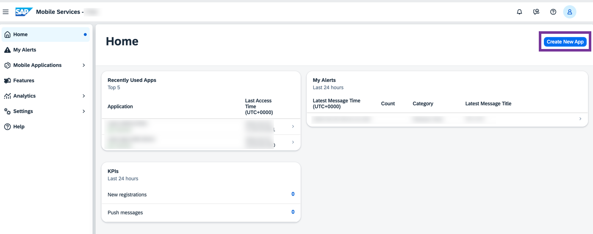

3.  In **Basic Info** step, provide the required information and click **Next**.

    | Field | Value |
    |----|----|
    | `ID` | com.sap.mdk.certs |
    | `Name` | SAP MDK cert auth App |

    <!-- border -->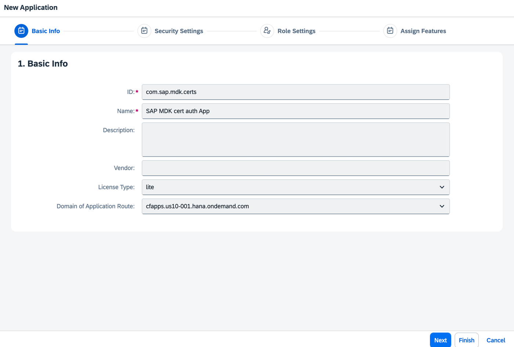    

    > If you are configuring this app in a trial account, make sure to select **License Type** as *lite*.  

4. In the **XSUAA Settings** step, continue with the default settings and click **Next** to navigate to further steps.

    <!-- border -->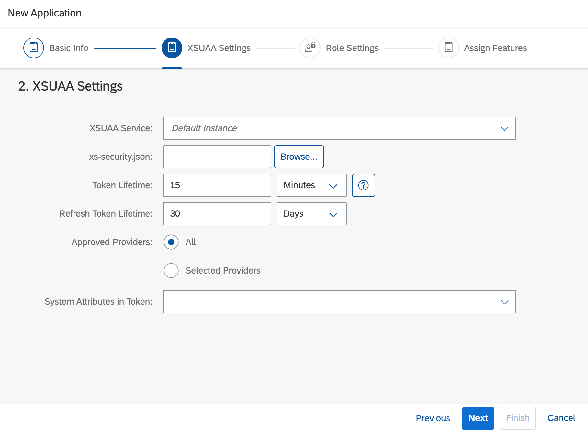

5. In the **Role Settings** step, uncheck **Enable Role Settings** option and click **Next** to navigate to further steps.

    <!-- border -->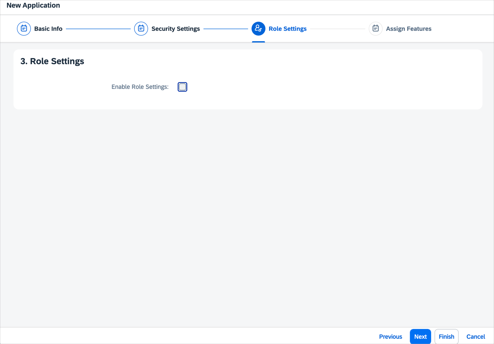    

6. In **Assign Features** step, choose **Mobile Development Kit Application** from the dropdown, and click **Finish**.

    <!-- border -->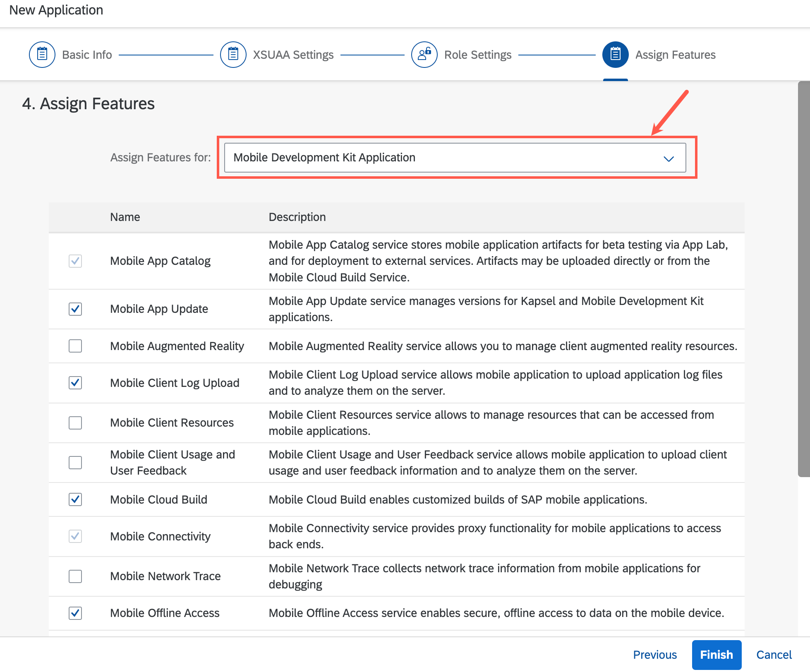

    >If you see a _Application without Role Settings_ warning message, click **OK**. You may assign roles after the app has been configured, if needed.

### Modify default OAuth security settings

When you configure an MDK app in Mobile Service cockpit, OAuth security is assigned to the app by default.

To enable certificate based authentication, you need to modify **Redirect URL** in **Security** configuration.

1. Click **Security**.

    <!-- border -->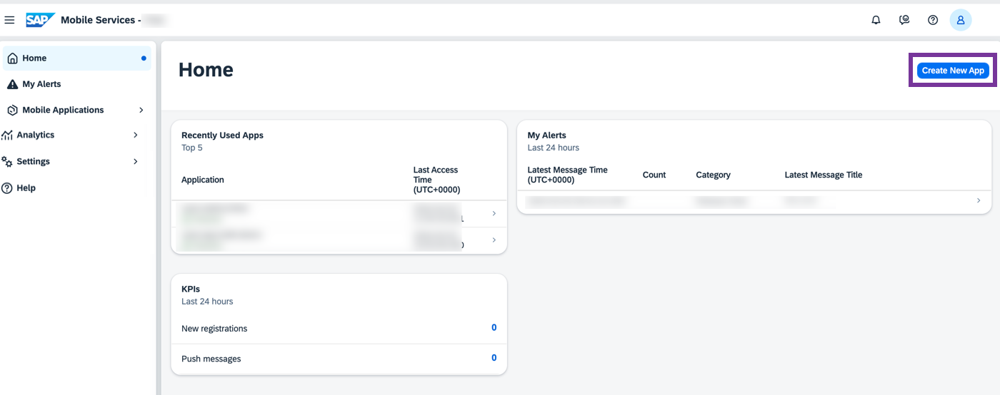

2. Click **pencil** icon to make changes to default configuration.

    <!-- border -->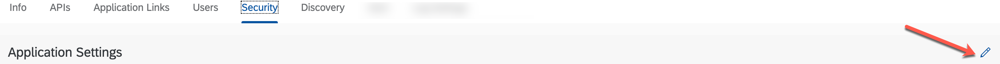

3. Replace the *Redirect URL* with `mdkcertclient://oauth2redirect` parameter, and click **OK** to save the changes. This *Redirect URL* needs to be added in the `AllowedDomains` property while building your branded client (step 3.5).

    <!-- border -->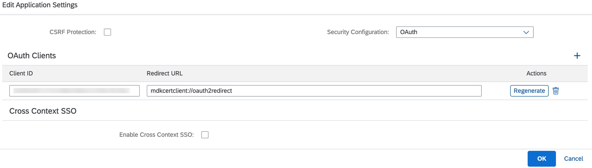

    >`mdkcertclient` is an URL scheme for your branded MDK client, you will use this value in step 3.3.

    >`oauth2redirect` is just a random path. It could be any value.

To build your client, 

- you can either use [Cloud Build service](cp-mobile-dev-kit-cbs-client) option to build a standard MDK client by selecting _Allow Certificate_ option or upload the `mdkproject` to build a customized MDK client. 
- OR build your branded client locally using MDK SDK as mentioned in below steps.

### Create your .mdkproject folder

>Make sure you are choosing the right development platform tab above.

Make sure that you have already completed steps 1 & 2 from [Build Your Mobile Development Kit Client Using MDK SDK](cp-mobile-dev-kit-build-client) tutorial.

[OPTION BEGIN [Mac]]

1. In the `MDKClient_SDK` folder, you will find the `template.mdkproject` folder.

    <!-- border -->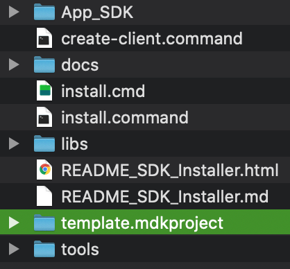

    It is recommended that you copy this folder to another location so that you can to use it for future builds. Copy and paste it anywhere, and then rename the template to `MDKCertApp.mdkproject`.

    <!-- border -->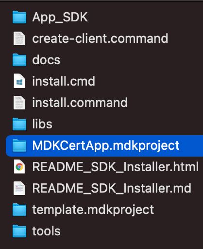

2. Next, you will need to update the `BrandedSettings.json` and `MDKProject.json` files as needed for your client. Go into the `MDKCertApp.mdkproject` folder.

    <!-- border -->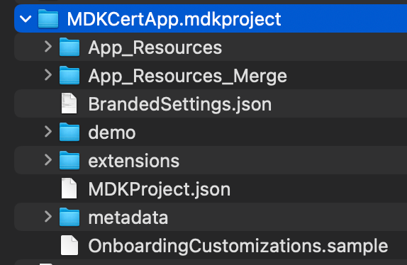

3. Open the `MDKProject.json` file and update it as needed. This file has some build-time configurations such as the application name, version and bundle ID.

    <!-- border -->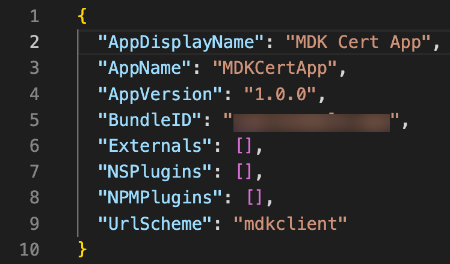

    >`AppDisplayName`: This is the name of the application on the home screen of the device.

    >`AppName`: This is the name of the folder where the client is created.

    >`BundleID`: It should be a unique identifier for your application.  This controls if the client can be installed side by side with other applications on the device.  Two applications with the same Bundle ID cannot be installed at the same time on a device.  For iOS this is the Identifier `(AppID)` that is registered in Apple Developer account since that determines if the application can be installed alongside other applications. If the `XCode` project is set up to use _Automatically manage signing_ then when building, `XCode` will automatically generate a signing profile for the specified bundle id. Without matching them, trying to run the custom client in iOS device will result in failure. In Android, it is known as [application ID](https://developer.android.com/build/configure-app-module#set_the_application_id).

    >`UrlScheme`: Allows you to specify a custom URL scheme which opens the client. This value is provided in step 2 for **Redirect URL**.
     If the URL includes connection settings as URL parameters, these settings will override the ones used by the client. This value `mdkcertclient` needs to match the value provided in step 2 for the Redirect URL. This value also needs to be unique across applications on your device.  If the value is not unique the wrong application may be referenced when redirecting.      

4. Open the `BrandedSettings.json` file and update the `ConnectionSettings` with the values for your MDK application in Mobile Services. To update the `AppId`, `ClientId`, `ServerUrl`, `AuthorizationEndPointUrl`, `RedirectUrl` and `TokenUrl` in the `ConnectionSettings` block, navigate to the [Mobile Services cockpit](cp-mobile-dev-kit-ms-setup), click `com.sap.mdk.certs` > **Mobile Security Exchange** > **Info** tab, copy the highlighted block and paste it in `BrandedSettings.json`.

    <!-- border -->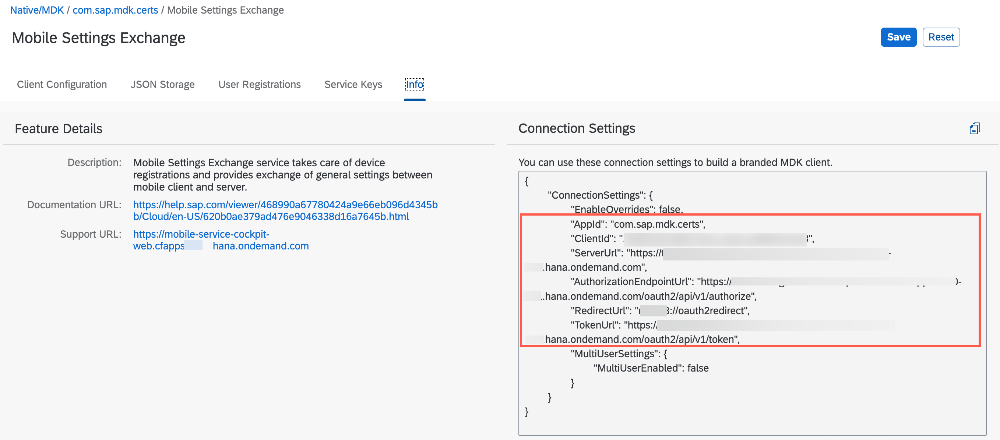

    <!-- border -->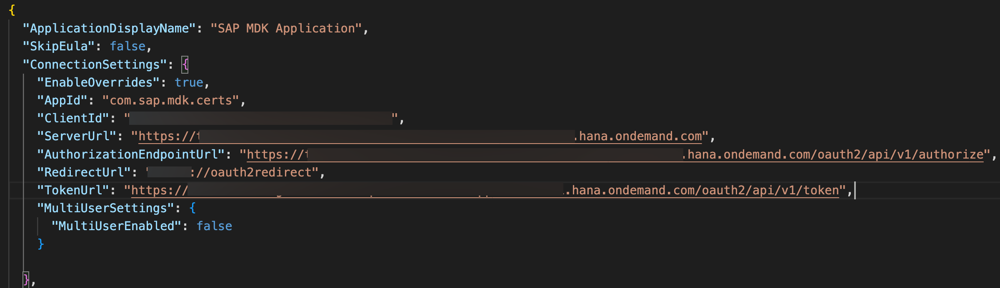
   
5.  You also need to update the `AllowCerts` property to **true** into the `ConnectionSettings` block.

    <!-- border -->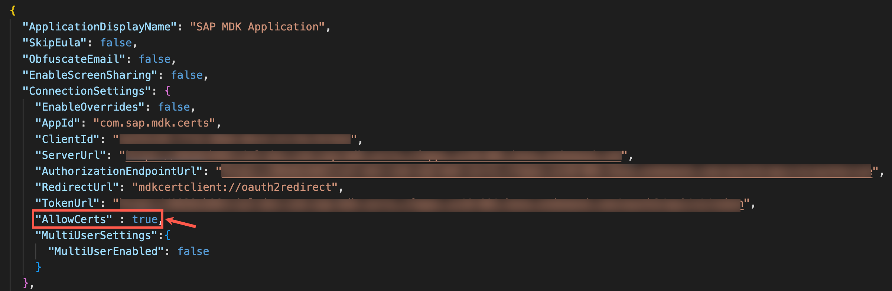

    >`AllowCerts` property allows MDK client to access the certificate on the device during on-boarding if requested by the Identity provider (IdP). You can find more information about this property in [help](https://help.sap.com/doc/f53c64b93e5140918d676b927a3cd65b/Cloud/en-US/docs-en/guides/getting-started/mdk/custom-client/branding-custom-client.html#allow-certs) documentation. 

    To find the correct URLs for your client, you should navigate to  [Mobile Services cockpit](cp-mobile-dev-kit-ms-setup) and find your MDK application that you want to link to this client.

    Regarding other properties:
    **Debug settings**: The settings in the `DebugSettings` property are for development use and should not be enabled in a production setting.

    **Log Settings**: Set this to the log level to be used when the client is launched.

    **Demo**: If you want to access the app in the demo mode, you can configure required settings.   

    >If you are connecting to `AliCloud` accounts, you will also need to add your custom domains under `URLWhitelist` property in the same file. You can find more details in [documentation](https://help.sap.com/doc/f53c64b93e5140918d676b927a3cd65b/Cloud/en-US/docs-en/guides/getting-started/mdk/custom-client/branding-custom-client.html#connection-settings-allowlist).     

6.  Add `mdkcertclient://oauth2redirect` in the `AllowedDomains` property.

    <!-- border -->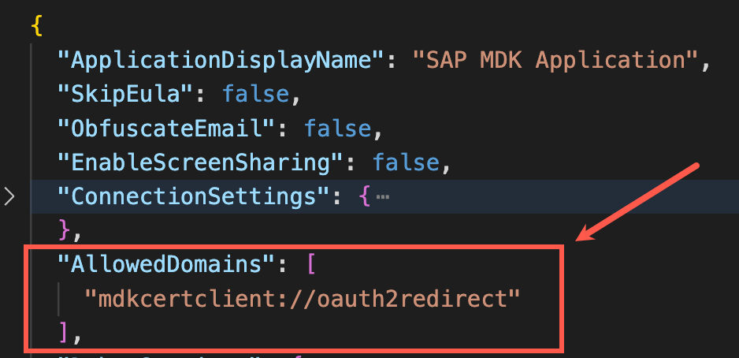

    >If you are connecting to `AliCloud` accounts, you will also need to add your custom domains under the same `AllowedDomains` property. You can find more details in [documentation](https://help.sap.com/doc/f53c64b93e5140918d676b927a3cd65b/Cloud/en-US/docs-en/guides/getting-started/mdk/custom-client/branding-custom-client.html#connection-settings-allowlist).     

7.  In the last section of `BrandedSettings.json` file, make these changes:

    | Field | Value |
    |----|----|
    | `DetailLabelViewText` | `Branded client that can on-board using certificates for authentication` |
    | `SigninButtonText` | `Start` |

    <!-- border -->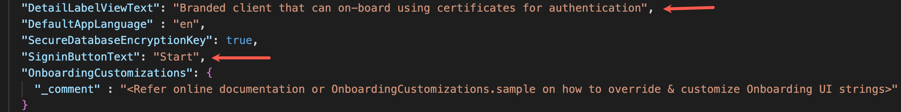        

[OPTION END]

[OPTION BEGIN [Windows]]

1. In the `MDKClient_SDK` folder, you will find the `template.mdkproject` folder.

    <!-- border -->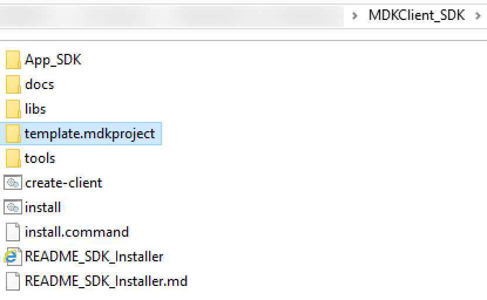

    It is recommended that you copy this folder to another location so that you can to use it for future builds. Copy and paste it anywhere, and then rename template to `MDKCertApp.mdkproject`.

    <!-- border -->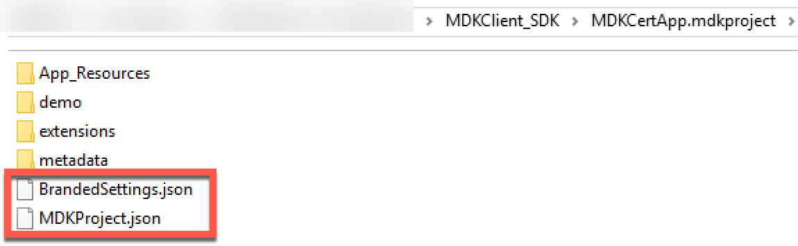

2. Next, you will need to update the `MDKProject.json` and `BrandedSettings.json` files as needed for your client. Go into the `MDKCertApp.mdkproject` folder.

    <!-- border -->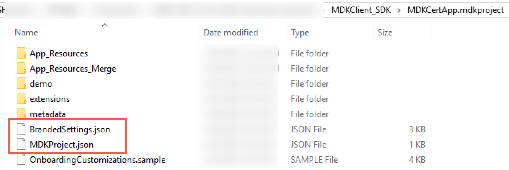

3. Open the `MDKProject.json` file and update it as needed. This file has some build-time configurations such as the application name, version and bundle ID.

    <!-- border -->

    >`AppDisplayName`: This is the name of the application on the home screen of the device.

    >`AppName`: This is the name of the folder where the client is created.

    >`BundleID`: It should be a unique identifier for your application.  This controls if the client can be installed side by side with other applications on the device.  Two applications with the same Bundle ID cannot be installed at the same time on a device. In Android, it is known as [application ID](https://developer.android.com/studio/build/application-id).

    >`UrlScheme`: Allows you to specify a custom URL scheme which opens the client. This value is provided in step 2 for **Redirect URL**.
     If the URL includes connection settings as URL parameters, these settings will override the ones used by the client. This value `mdkcertclient` needs to match the value provided in step 2 for the Redirect URL. This value also needs to be unique across applications on your device.  If the value is not unique the wrong application may be referenced when redirecting.              

4. Open the `BrandedSettings.json` file and update the `ConnectionSettings` with the values for your MDK application in Mobile Services. To update the `AppId`, `ClientId`, `ServerUrl`, `AuthorizationEndPointUrl`, `RedirectUrl` and `TokenUrl` in the `ConnectionSettings` block, navigate to the [Mobile Services cockpit](cp-mobile-dev-kit-ms-setup), click `com.sap.mdk.certs` > **Mobile Security Exchange** > **Info** tab, copy the highlighted block and paste it in `BrandedSettings.json`.

    <!-- border -->

    <!-- border -->
   
5. You also need to update the `AllowCerts` property to **true** into the `ConnectionSettings` block.

    <!-- border -->

    >`AllowCerts` property allows MDK client to use the certificate. You can find more information about this property in [help](https://help.sap.com/doc/f53c64b93e5140918d676b927a3cd65b/Cloud/en-US/docs-en/guides/getting-started/mdk/custom-client/branding-custom-client.html#allow-certs) documentation. To access the certificate on the device during on-boarding if requested by the Identity provider (IdP).

    To find the correct URLs for your client, you should navigate to  [Mobile Services cockpit](cp-mobile-dev-kit-ms-setup) and find your MDK application that you want to link to this client.

    Regarding other properties:
    **Debug settings**: The settings in the `DebugSettings` property are for development use and should not be enabled in a production setting.

    **Log Settings**: Set this to the log level to be used when the client is launched.

    **Demo**: If you want to access the app in the demo mode, you can configure required settings.    

8. Add `mdkcertclient://oauth2redirect` in the `AllowedDomains` property.

    <!-- border -->

    >If you are connecting to `AliCloud` accounts, you will also need to add your custom domains under the same `AllowedDomains` property. You can find more details in [documentation](https://help.sap.com/doc/f53c64b93e5140918d676b927a3cd65b/Cloud/en-US/docs-en/guides/getting-started/mdk/custom-client/branding-custom-client.html#connection-settings-allowlist).   

9. In the last section of `BrandedSettings.json` file, make these changes:

    | Field | Value |
    |----|----|
    | `DetailLabelViewText` | `Branded client that can on-board using certificates for authentication` |
    | `SigninButtonText` | `Start` |

    <!-- border -->                  

[OPTION END]

### Create the MDK Client

>Make sure you are choosing the right development platform tab above.

[OPTION BEGIN [Mac]]

1. Run `./create-client.command` to create the client. You will be asked to provide the path to the `.mdkproject` file. You can also provide optional arguments such as output directory and log verbosity. You can run `create-client.command --help` to find out how to specify these options as arguments.

    <!-- border -->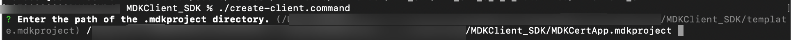

    >You can run the `create-client command` from any directory.  The resulting MDK client will be created in the directory where the `create-client command` is run from.

2. You will be asked whether you would like to build for iOS or android or all?

    <!-- border -->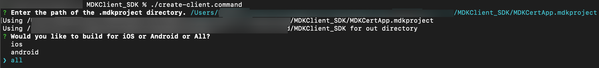

    >**All** option was chosen in this tutorial as you will learn how to create the MDK client for iOS and Android.

    Once the `create-client.command` script executed successfully, you will see **Application ready** message in terminal console.

    You will also find your MDK Client app created under the `MDKClient_SDK` folder.

    <!-- border -->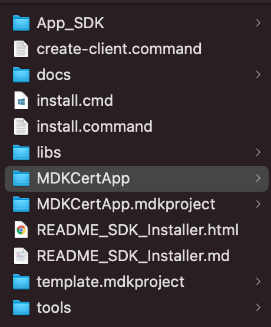

[OPTION END]

[OPTION BEGIN [Windows]]

1. Run `./create-client.cmd` to create the client. You will be asked to provide the path to the `.mdkproject` file. You can also provide optional arguments such as output directory and log verbosity. You can run `create-client.cmd --help` to find out how to specify these options as arguments.

    <!-- border -->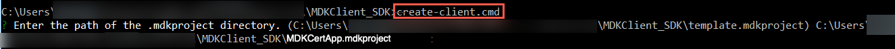

    >You can run the `create-client command` from any directory. The resulting MDK client will be created in the directory where the `create-client command` is run from.

2. Once the `create-client.cmd` script executed successfully, you will see **Application ready** message in terminal console.

    <!-- border -->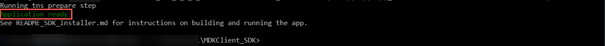

     You will also find your app created under the `MDKClient_SDK` folder.

    <!-- border -->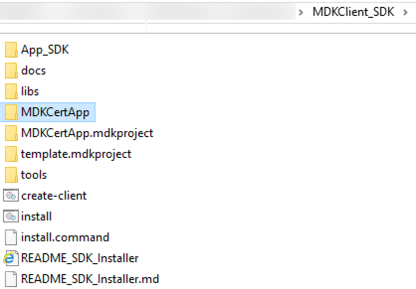

[OPTION END]

>This name of this folder is based on the `<App Name>` provided in the `MDKProject.json file` and this is the MDK client application generated project.

### Run the MDK Client

>Make sure you are choosing the right device platform tab above.

[OPTION BEGIN [Android]]

1. In this step, you will run the app on an android device. First attach your device to your machine. Then run `tns device android` command to print a list of attached devices. 
    <!-- border -->

    >Make sure **Developer option** and **USB debugging** option is enabled in android device.

2. Copy the **Device Identifier** value for your device.

3. In terminal or command line window, navigate to the app name folder **`MDKCertApp`** (in `MDClient_SDK` path) and use `tns run android --device <device identifier>` command to run the MDK client on android device.

    <!-- border -->

    Once, above command gets successfully executed, you will see new MDK client up and running in Android device.

4. Tap **Agree** on `End User License Agreement`.

    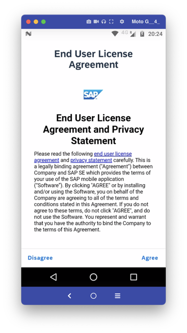    

5. In Welcome screen, you will notice that **app name**, **detailed label text** and **signing button text** have been updated as per changes done in step 3.4 & 3.6. Tap **Start** to connect the MDK client to SAP Business Technology Platform (BTP).

    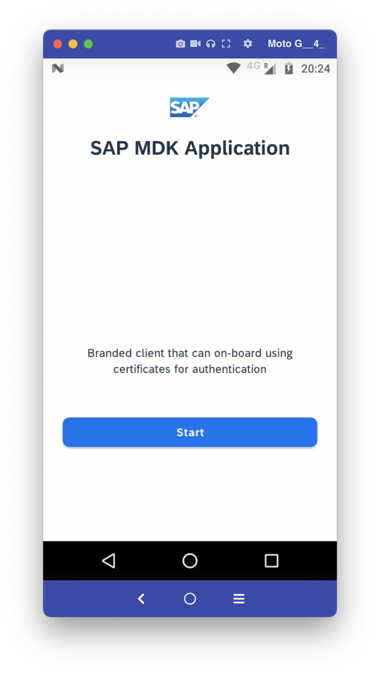

6.  As you enabled the certificate based authentication, MDK client detects a valid certificate installed on the device and connects successfully to the SAP BTP.

    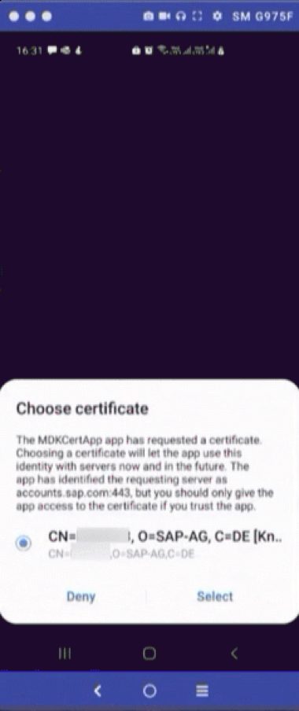

    >If the user certificate is not valid or not detectable, then you will see an SAP BTP login page.

7. Choose a passcode with at least 8 characters for unlocking the app and tap **Next**.

    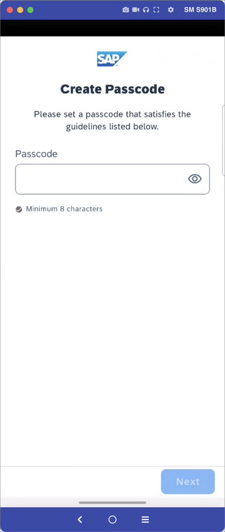

8. Confirm the passcode and tap **Done**.

    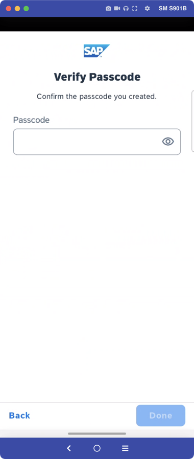

9. If you want your MDK client to send you notification, click **Next**. 

    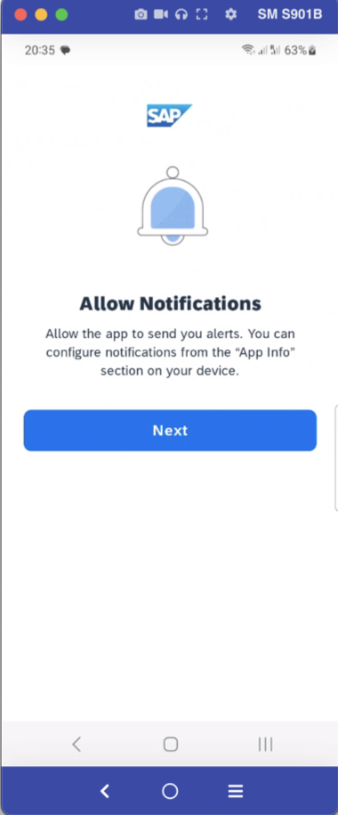

10.  Optionally, you can enable biometric authentication to get faster access to the app data.

    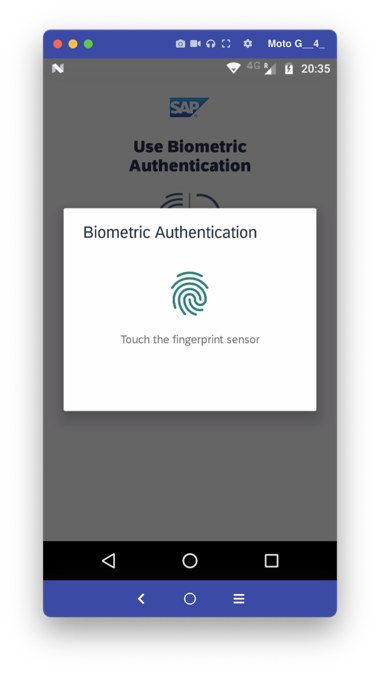

    Since you have not deployed any metadata yet you will not see the `Update Now?` dialog.

    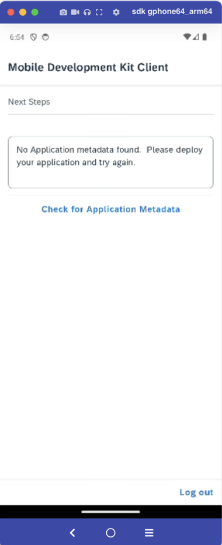

[OPTION END]

[OPTION BEGIN [iOS]]

1. In this step, In this step, you will run the app on an iOS device. First attach the device to your Mac. Then run `tns device ios` command to print a list of attached devices.

    <!-- border -->

2. Copy the **Device Identifier** value for your device.

3. In terminal window, navigate to the app name folder **`MDKCertApp`** (in `MDClient_SDK` path) and use `tns run ios --device <device identifier>` command to run the MDK client on iOS device.

    <!-- border -->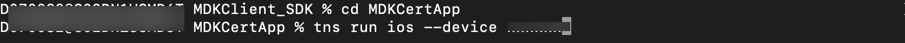

    You can also run the app in Xcode. Open the project in Xcode with the command `open platforms/ios/<app name>.xcworkspace`, or open the workspace using the `File -> Open...` dialog in Xcode. Configure the application's code signing settings, then run the application for the target device.

    Once, above command gets successfully executed, you will see new MDK client up and running in your device.

4. Tap **Agree** on `End User License Agreement`.

    <!-- border -->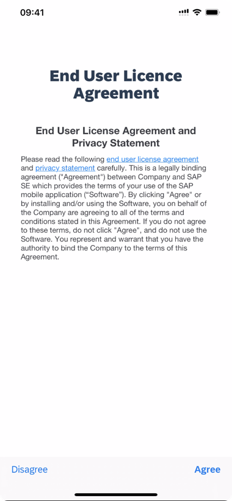

5. In Welcome screen, you will notice that **app name**, **detailed label text** and **signing button text** have been updated as per changes done in step 3.4 & 3.6.

    <!-- border -->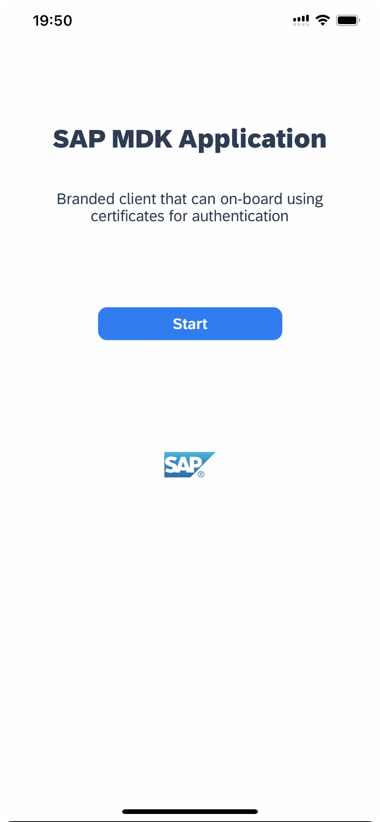

6. Tap **Start** to connect the MDK client to SAP Business Technology Platform (BTP). As you enabled the certificate based authentication, MDK client detects a valid certificate installed on the device and connects successfully to the SAP BTP.

    <!-- border -->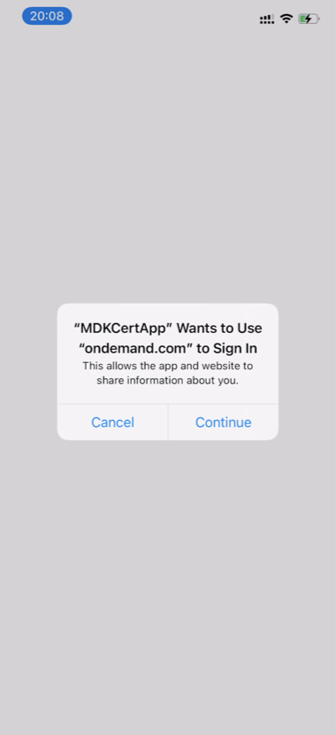
    <!-- border -->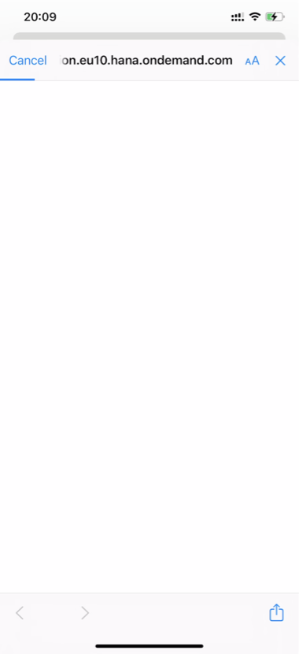

    >If the user certificate is not valid or not detectable, then you will see an SAP BTP login page.

7. Choose a passcode with at least 8 characters for unlocking the app and tap **Next**.

    <!-- border -->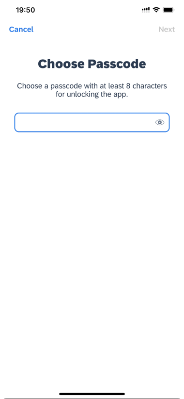

8. Confirm the passcode and tap **Done**.

    <!-- border -->

9. Optionally, you can enable biometric authentication to get faster access to the app data, tap **Enable**.

    <!-- border -->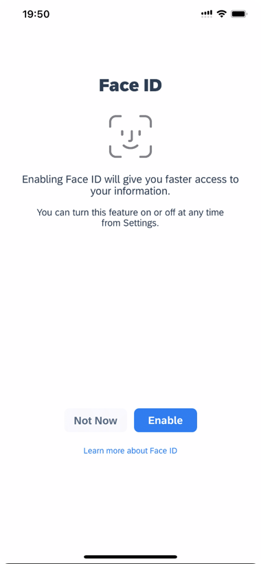

    Since you have not deployed any metadata yet you will not see the `Update Now?` dialog.

    <!-- border -->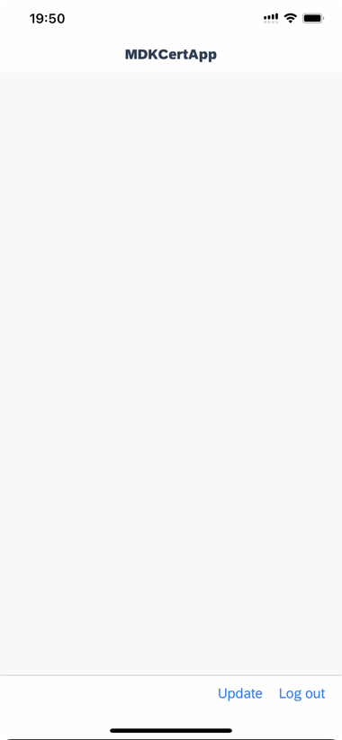

[OPTION END]

---
