## Prerequisites
- You have created an MDK app as described in [Create Your First Mobile App with the Mobile Development Kit (MDK)](mission.mobile-dev-kit-get-started).

## Details
### You will learn
  - How to create a customer record
  - How to store changes locally on Mobile app and sync these changes with backend
  - How to update a record in web application

If you didn't follow the prerequisite then you may clone an existing project from [GitHub repository](https://github.com/SAP-samples/cloud-mdk-tutorial-samples/tree/master/2-Create-Your-First-Mobile-App-with-the-Mobile-Development-Kit) to start with this tutorial.

---

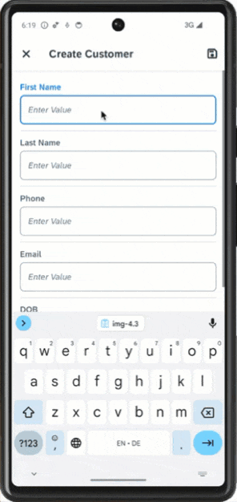

[ACCORDION-BEGIN [Step 1: ](Create new page for new customer record)]

In this step, you will create the `Customers_Create.page` as a **Form Cell Page**. This type of page allows for form input style changes. The page will provide only a subset of items available on the Customer Detail page. You will add the fields that will be editable by the end-user.

1. Right-click the **Pages** folder | **MDK: New Page** | **Form Cell Page** | **Next**.

    !

    >A Form Cell Page is suitable for pages that generate new objects or modify existing objects. It includes a form cell container by default. You can add form sections, multiple containers or action controls to this page. Under each container section, you can add various container items.

    >You can find more details about [Form Cell page](https://help.sap.com/doc/f53c64b93e5140918d676b927a3cd65b/Cloud/en-US/docs-en/guides/features/fiori-ui/mdk/formcell-page.html).

2. Enter the Page Name `Customers_Create` and click **Next** and the **Finish** on the Confirmation step.

    !

3. In the **Properties** pane, set the **Caption** to **Create Customer**.

    !

    Now, you will add the fields (like first name, last name, phone, email address & date of birth) for creating a new customer record by the end-user.

4. In the Layout Editor, expand the **Controls** section, drag and drop a **Simple Property** onto the Page area.

    !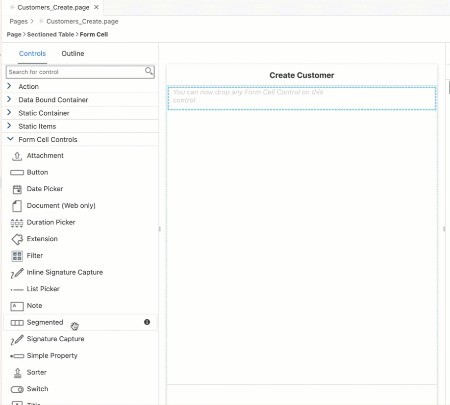

    >You can find more details about [available controls in Form Cell page](https://help.sap.com/doc/69c2ce3e50454264acf9cafe6c6e442c/Latest/en-US/docs-en/reference/schemadoc/Page/FormCell/Container.schema.html).

5. Drag and drop three additional Simple Property controls onto the page so you have four total controls.

    !

6. Select the first **Simple Property control** and provide the below information:

    | Property | Value |
    |----|----|
    | `Name`| `FCCreateFirstName` |
    | `Caption` | `First Name` |
    | `PlaceHolder`| `Enter Value` |

    !

7. Select the second **Simple Property control** and provide the below information:

    | Property | Value |
    |----|----|
    | `Name`| `FCCreateLastName` |
    | `Caption` | `Last Name` |
    | `PlaceHolder`| `Enter Value` |

    !

8. Select the third **Simple Property control** and provide the below information:

    | Property | Value |
    |----|----|
    | `Name`| `FCCreatePhone` |
    | `Caption` | `Phone` |
    | `KeyboardType` | `Phone` |
    | `PlaceHolder`| `Enter Value` |

    !

    >To streamline data entry, the keyboard displayed when editing a `SimplePropertyFormCell` should be appropriate for the type of content in the field. If your app asks for number, for example, it should display the phone keyboard.

9. Select the last **Simple Property control** and provide the below information:

    | Property | Value |
    |----|----|
    | `Name`| `FCCreateEmail` |
    | `Caption` | `Email` |
    | `KeyboardType` | `Email` |
    | `PlaceHolder`| `Enter Value` |

    !

    >[`KeyboardType`](https://help.sap.com/doc/69c2ce3e50454264acf9cafe6c6e442c/Latest/en-US/docs-en/reference/schemadoc/Page/FormCell/SimpleProperty.schema.html#keyboardtype) streamlines the data entry. When entering an email address, it would display the email address keyboard in mobile clients.

10. Drag and drop a **Date Picker** control onto the page area for date of birth parameter.

    !

    Provide the below information:

    | Property | Value |
    |----|----|
    | `Name`| `FCCreateDOB` |
    | `Caption` | `DOB` |

[VALIDATE_2]
[ACCORDION-END]

[ACCORDION-BEGIN [Step 2: ](Add a cancel button on the Create Customer page)]

While creating a customer record, you may want to close the current page and cancels or interrupts any execution in process.

Now, you will add a button on the Create Customer page and set it's `onPress` to `CloseModalPage_Cancel.action`.

1. Drag and drop an **Action Bar Item** to the upper left corner of the action bar.

    >Action Bar Item is a button that users can use to fire actions when pressed. You can add an Action Bar Item only to the Action Bar (at the top of the page).

    !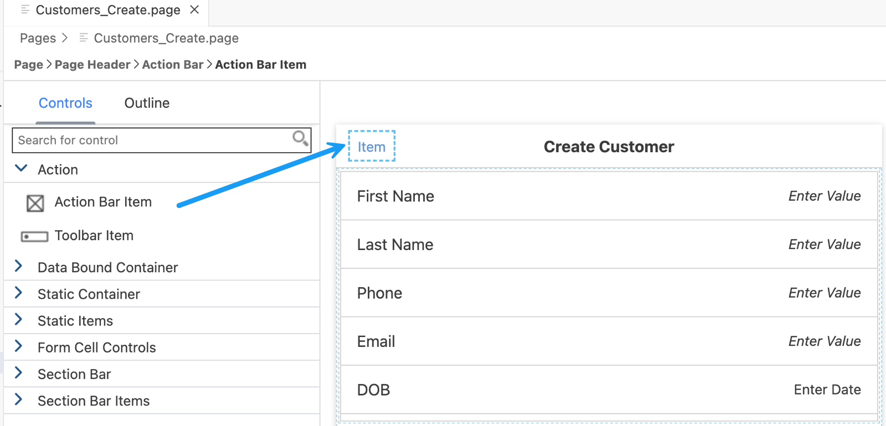

2. In the **Properties** pane, click the **link icon** to open the **Object Browser** for the **System Item** property. Double click the **Cancel** type and click **OK**.

    !

    >System Item are predefined system-supplied icon or text. Overwrites _Text_ and _Icon_ if specified.

3. Now, you will set the `onPress` event to `CloseModalPage_Cancel.action`.

    In **Events** tab, click the 3 dots icon for the `OnPress` property to open the object browser. Double click the `CloseModalPage_Cancel.action` and click **OK** to set it as the `OnPress` Action.

    !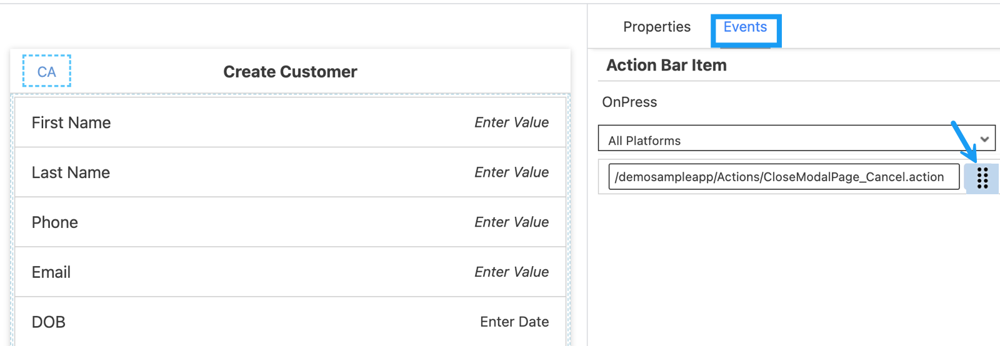

[DONE]
[ACCORDION-END]

[ACCORDION-BEGIN [Step 3: ](Store the created data locally)]

The next step is to store newly created record locally for an offline application or send the new record directly back to the backed for online applications. 

* You will add an Action Bar item on the `Customers_Create.page` that will call an OData Create Entity action to save the record
* You may want to close the page when the OData Create Entity action is successful
* You may want to show a failure message if the OData Create Entity action fails to save the changes

First, add an action bar item on the `Customers_Create.page`.

1.  In `Customers_Create.page`, **drag and drop** an **Action Bar Item** to the upper right corner of the action bar.

    !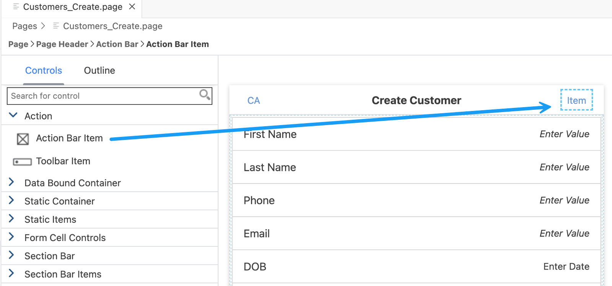

2. Click the **link** icon to open the object browser for the **System Item** property. Double-click the **Save** type and click **OK**.

3. Navigate to the **Events** tab. Click the 3 dots icon for the `OnPress` property and select the `Create a rule/action`.

    !

4. Keep the default selection for the *Object Type* as Action and *Folders* path.

    !  

5. Choose **MDK Data Actions** in **Category** | click **OData Action** | **Next**.

    !  

6. In the **Operation and Service Selection** step, provide the below information:

    | Property | Value |
    |----|----|
    | `Action Name`| `Customers_CreateEntity` |
    | `Type` | Select `CreateEntity` from the dropdown |
    | `Service`| Select `SampleServiceV2.service` from the dropdown |
    | `EntitySet` | Select `Customers` from the dropdown |

    !

7. Click **Next**.

8. In **Property and Create Links** step, uncheck **City**.

    Since in `Customer_Create.page`, you defined five properties (First Name, Last Name, Phone, Email & date of birth) to be added, now in this step, you will bind them to respective UI Controls.

    Check the `DateOfBirth` property and click the **link icon** to open the object browser.

    Change the drop down in the object browser to `Controls & ClientData`, click the **Current Page** radio button.

    In the search box start typing the control name `FCCreateDOB`. The list will filter down to show the matching values. Double click the **Value (Value)** entry under the `FCCreateDOB` field and click **OK** to set binding.

    !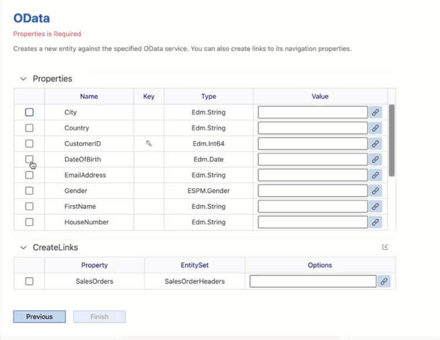

9. Repeat the above step for remaining properties: `EmailAddress`, `FirstName`, `LastName` and `PhoneNumber`.

    !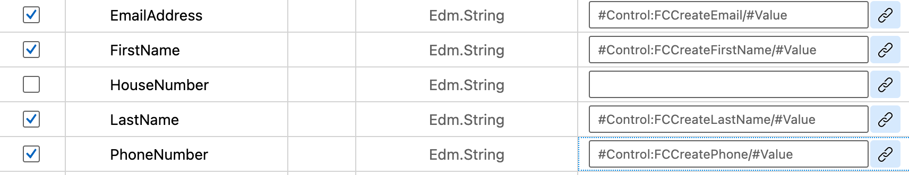

    !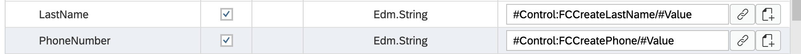

 10. Click **Next** and **Finish** on the confirmation screen. The action editor will open with the `Customers_CreateEntity.action` loaded.

    >You can find more details about [Create Entity Action](https://help.sap.com/doc/69c2ce3e50454264acf9cafe6c6e442c/Latest/en-US/docs-en/reference/schemadoc/Action/ODataService/CreateEntity.schema.html).     

 11. When the above OData action is executed, you may want to display messages on its success and failure behavior. For example, on its success, you may want to close the page and allow any execution to continue. On its failure, you may want to display an error.  

    In the `Customers_CreateEntity.action`, scroll down and expand the *Common Action Properties* section. Click the link icon to open the object browser for the *Success Action* and bind it to `CloseModalPage_Complete.action`.

    !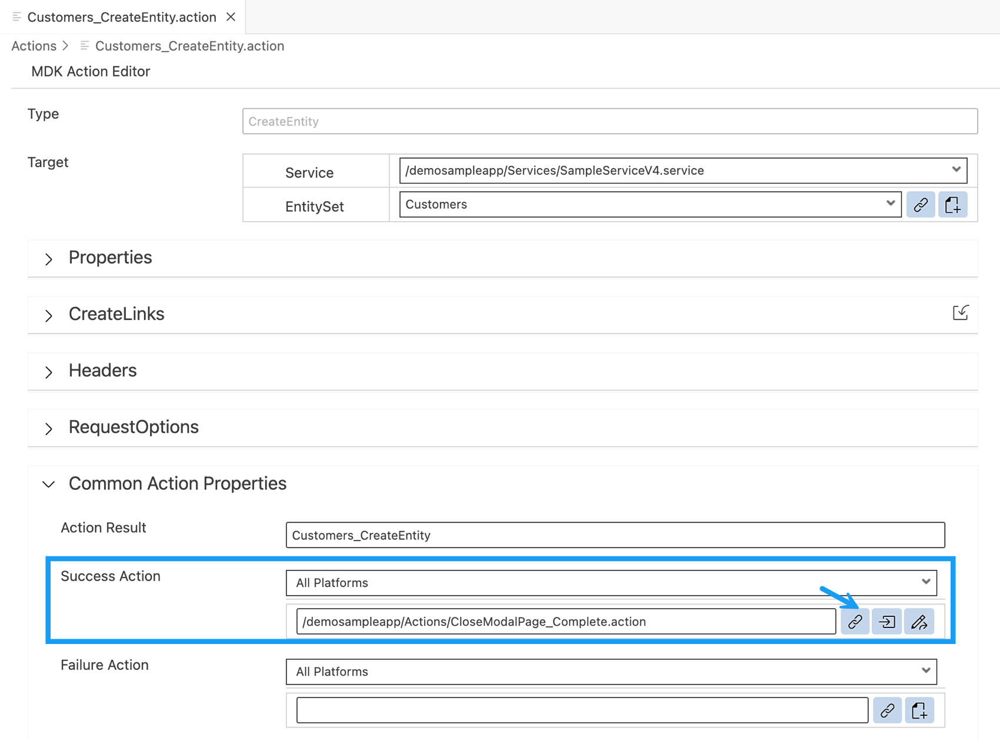

 12. Create a message action displaying error in case of the update failure. In the `Customers_CreateEntity.action`, provide value as **create** for the *Action Result* and click the `Create a rule/action` icon for the *Failure Action*.

    !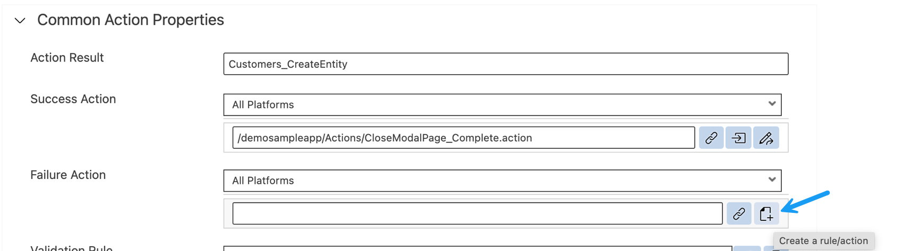

 13. Keep the default selection for the *Object Type* as Action and *Folders* path.

    !     

14. Choose **MDK Message Actions** in **Category** | click **Message Action** | **Next**.

    !

    Provide the below information:

    | Property | Value |
    |----|----|
    | `Action Name`| `CreateCustomerEntityFailureMessage` |
    | `Type` | Select `Message` from the dropdown |
    | `Message` | `Failed to Create Customer record - {#ActionResults:create/error}` |
    | `Title` | `Create Customer` |
    | `OKCaption` | `OK` |
    | `OnOK` | `--None--` |
    | `CancelCaption` | leave it blank |
    | `OnCancel` | `--None--`|

    !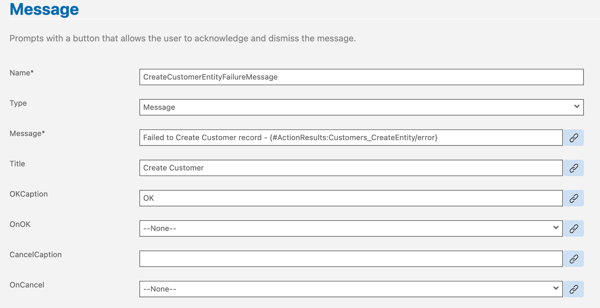

    >`create` is the Action Result value of the `Customers_CreateEntity.action`. This reference is used to pass the results to subsequent actions in the chain. These actions can reference the action result as needed. In this case if there is a failure, you access the error property of the action result to display the OData failure message.

    >This is the standard Binding Target Path (also called Dynamic Target Path) syntax used when you need to include a binding with other bindings or within a string as used in the message here.

    >You could exclude above expression and can just display a generic message.

15. Click **Next** and then **Finish** on the Confirmation step.

When `Customers_CreateEntity.action` gets executed successfully then `CloseModalPage_Complete.action` will be triggered or if `Customers_CreateEntity.action` fails then `CreateCustomerEntityFailureMessage.action` will be triggered.

[VALIDATE_3]
[ACCORDION-END]

[ACCORDION-BEGIN [Step 4: ](Navigate to the Customer Create page)]

You will open the `Customers_Create.page` from the Customer List page. For this, you will add an action bar item on the List page and will link it to a navigation action. When the action bar item is pressed by the end-user that will open the `Customers_Create.page`.

1. In `Customers_List.page`, drag and drop an **Action Bar Item** to the upper right of the action bar.

    !

2. Click the **link icon** to open the object browser for the `SystemItem` property. Double click the **Add** type and click **OK**.

    !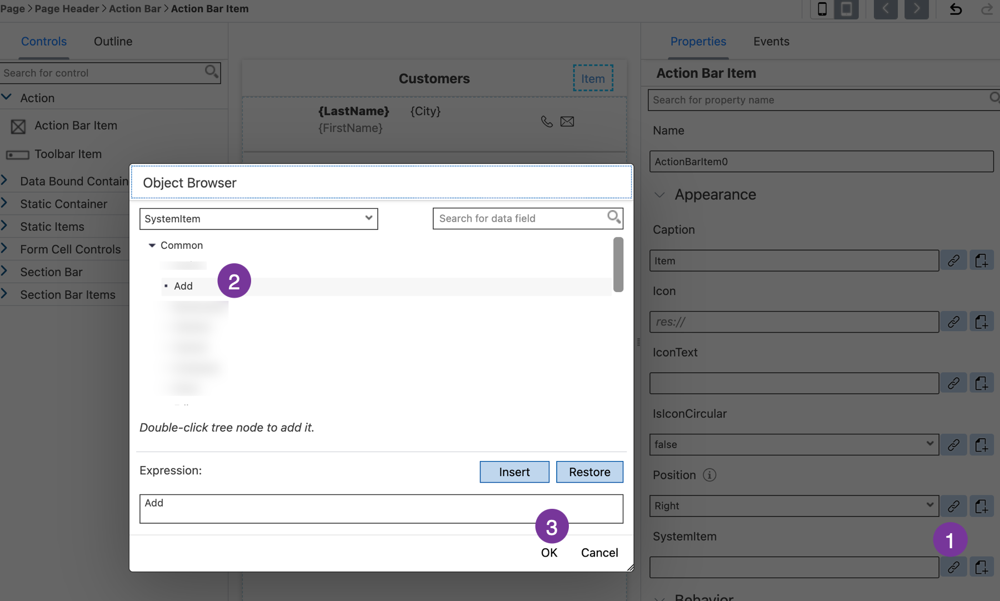

3. Navigate to the **Events** tab. Click the 3 dots icon for the `OnPress` property and select the `Create a rule/action`.    

    !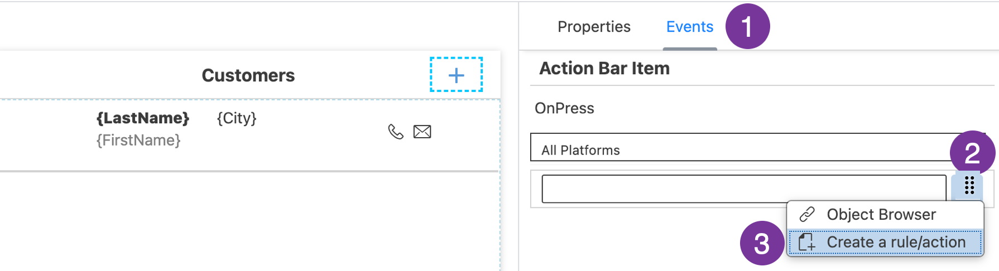

4. Keep the default selection for the *Object Type* as Action and *Folders* path.

    !       

5. Choose **MDK UI Actions** in **Category** | click **Navigation Action** | **Next**.

    !

6. Provide the below information:

    | Property | Value |
    |----|----|
    | `Action Name`| `NavToCustomers_Create` |
    | `PageToOpen` | Select `Customers_Create.page` from the dropdown |
    | `ModalPage`| Select `true` from the dropdown |

    !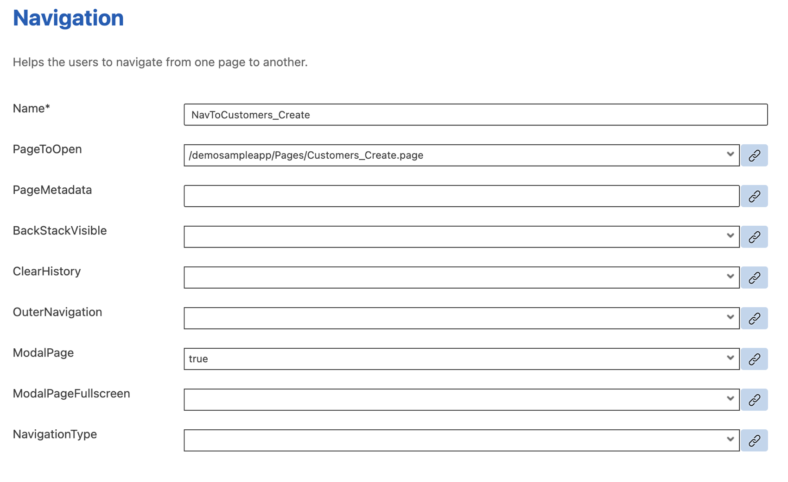

7. Click **Next** and then **Finish** on the confirmation step.

[DONE]
[ACCORDION-END]

[ACCORDION-BEGIN [Step 6: ](Deploy the application)]

Deploy the updated application to your MDK client.

1. Right-click `Application.app` and select **MDK: Deploy**.

    !

2. Select deploy target as **Mobile & Cloud**.

    !

    You should see success message for both deployments.

    !

    >Alternatively, you can select *MDK: Redeploy* in the command palette (View menu>Find Command OR press Command+Shift+p on Mac OR press Ctrl+Shift+P on Windows machine), it will perform the last deployment.

    >!

[DONE]
[ACCORDION-END]

[ACCORDION-BEGIN [Step 7: ](Run the app)]

>Make sure you are choosing the right device platform tab above.

[OPTION BEGIN [Android]]

1. Tap **Update** on the Main page, you will see a _New Version Available_ pop-up, tap **Now**.

    

2. Tap **Customers**, click **+** icon to create a new record.

    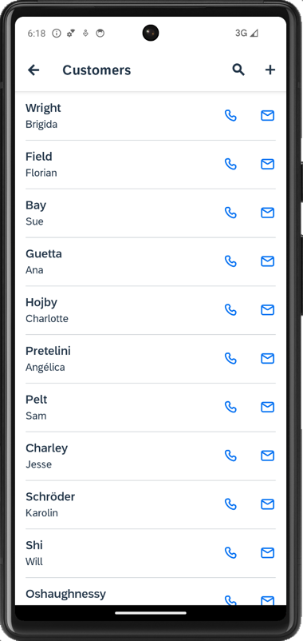

3. Enter the values, and tap save icon. Local record gets created accordingly.

    

    Since this is an Offline application, new entry is added to the request queue of the local store which needs to be sent or uploaded to the backend explicitly.  

    >MDK base template has added a **Sync** button on main page of the app to upload local changes from device to the backend and to download the latest changes from backend to the device. Actions | Service | `UploadOffline.action` & `DownloadOffline.action`.

4. On Main page, tap **Sync**, a successful message will be shown.

    

[OPTION END]

[OPTION BEGIN [iOS]]

1. Tap **Update** on the Main page, you will see a _New Version Available_ pop-up, tap **Now**.

    

2. Tap **Customers**, click **+** icon to create a new record.

    

3. Enter the values, and tap **Save**.

    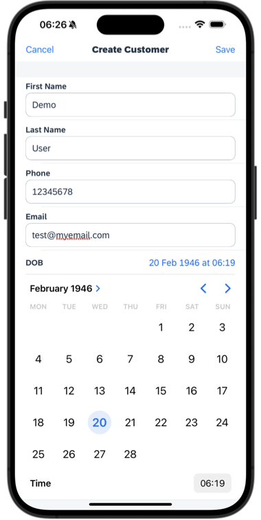

    Local record gets created accordingly.

    

    Since this is an Offline application, new entry is added to the request queue of the local store which needs to be sent or uploaded to the backend explicitly.  

    >MDK base template has added a **Sync** button on main page of the app to upload local changes from device to the backend and to download the latest changes from backend to the device. Actions | Service | `UploadOffline.action` & `DownloadOffline.action`.

4. On `Main` page, tap **Sync**, a successful message will be shown. As Sync is pressed, `UploadOffline.action` gets triggered to upload local changes from device to the backend and on success of this call, `DownloadOffline.action` is being called.

    

[OPTION END]

[OPTION BEGIN [Web]]

1. Either click the highlighted button or refresh the web page to load the changes.

    !

    >If you see the error `404 Not Found: Requested route ('xxxxx-dev-nsdemosampleapp-approuter.cfapps.xxxx.hana.ondemand.com') does not exist.` while accessing the web application, make sure that in your space cockpit, highlight applications are in started state.

    >!   

2. Click **Customers**, click **+ Add** icon to create a new record.

    !

3. Enter the values, and click **Save**.

    !

    Record gets created accordingly.

    !

[OPTION END]

You can cross verify if a record has been updated in the backend.

>Backend URL can be found in [Mobile Services Cockpit](cp-mobile-dev-kit-ms-setup).

>**Mobile Applications** | **Native/MDK** | click the MDK App **com.sap.mdk.demo** | **Mobile Connectivity** | click **Launch in Browser** icon

>!

>It will open the URL in a new tab, remove `?auth=uaa` and add `/Customers` at the end of the URL.

[VALIDATE_1]
[ACCORDION-END]

---
