# Extend an MDK App with Customer Orders
<!-- description --> Display a customer order list and its details.

## You will learn
  - How to enhance customer details with its order information
  - How to create a new page for displaying the order details

## Intro
You may clone an existing project from [GitHub repository](https://github.com/SAP-samples/cloud-mdk-tutorial-samples/tree/master/3-Enhance-Your-First-MDK-App-with-Additional-Functionalities/3-cp-mobile-dev-kit-upload-logs) to start with this tutorial.

---


To enhance your MDK app with customer order information, you need to carry out the following tasks:

*  Create a new order list page
*  Create a new order details page
*  Create a new navigation action to the new order details page
*  Write a JavaScript logic to calculate total number of orders for a customer
*  Display top 5 orders in customer details page
*  Add a header control to the orders grid of the customer detail page to display a text label
*  Add a footer control to the orders grid of customer detail page to show total order count

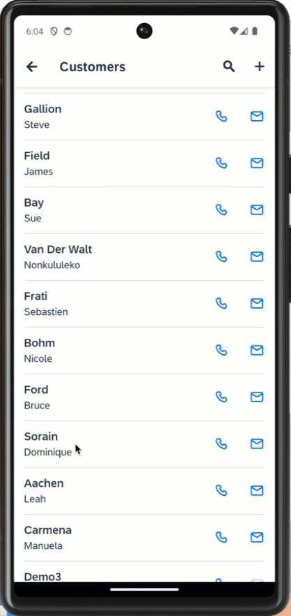

### Create a new order list page


This page will display customer orders list, you will add an **Object Table** control that is used to display information (like Sales order ID, order creation date, gross amount and life cycle status name) about an object.

>You can find more details about [available controls in section page](https://help.sap.com/doc/69c2ce3e50454264acf9cafe6c6e442c/Latest/en-US/docs-en/reference/schemadoc/Page/SectionedTable/SectionedTable.schema.html).

1. In SAP Business Application Studio project, right-click the **Pages** | **MDK: New Page** | select **Section** | **Next**.

    <!-- border -->

    >You can find more details about [section pages](https://help.sap.com/doc/f53c64b93e5140918d676b927a3cd65b/Cloud/en-US/docs-en/guides/features/fiori-ui/mdk/section-page.html).

2. In the **Base Information** step, enter the page **Name** `Customers_Orders` and click **Finish** to complete the page creation process. 

    <!-- border -->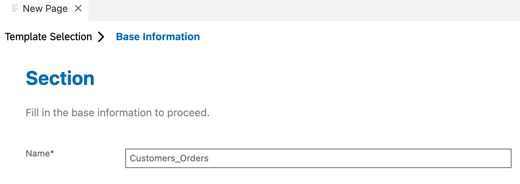

3. In the **Properties** pane, set the caption to **Customer Orders**.

    <!-- border -->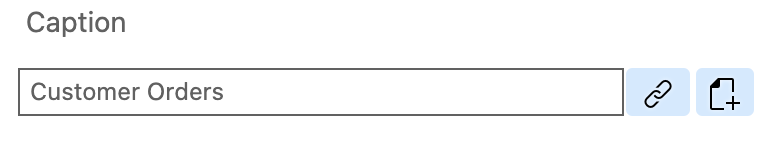

4. Next, add an **Object Table** control to display information like sales order ID, order creation date, gross amount and life cycle status name.

    In the Layout Editor, expand the **Controls** | **Data Bound Container** group, drag and drop the **Object Table** control onto the page area.

    <!-- border -->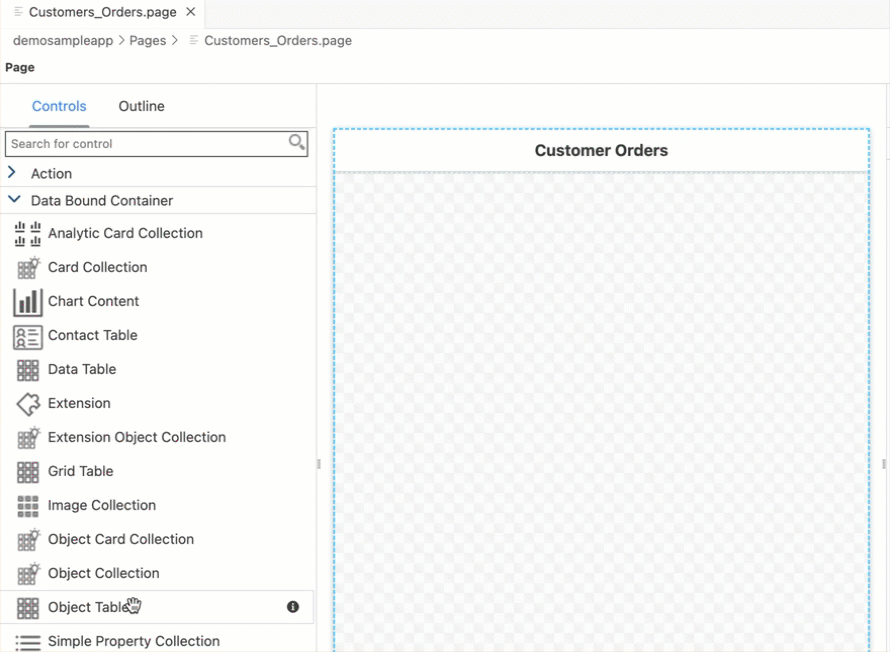


5. In the **Properties** pane, provide the below information:

    | Property | Value |
    |----|----|
    | `Service`| Select `SampleServiceV2.service` from the dropdown |
    | `EntitySet` | Select `SalesOrderHeaders` from the dropdown |
    | `QueryOptions`| `$filter=CustomerId eq '{CustomerId}'&$orderby=CreatedAt desc` |

    <!-- border -->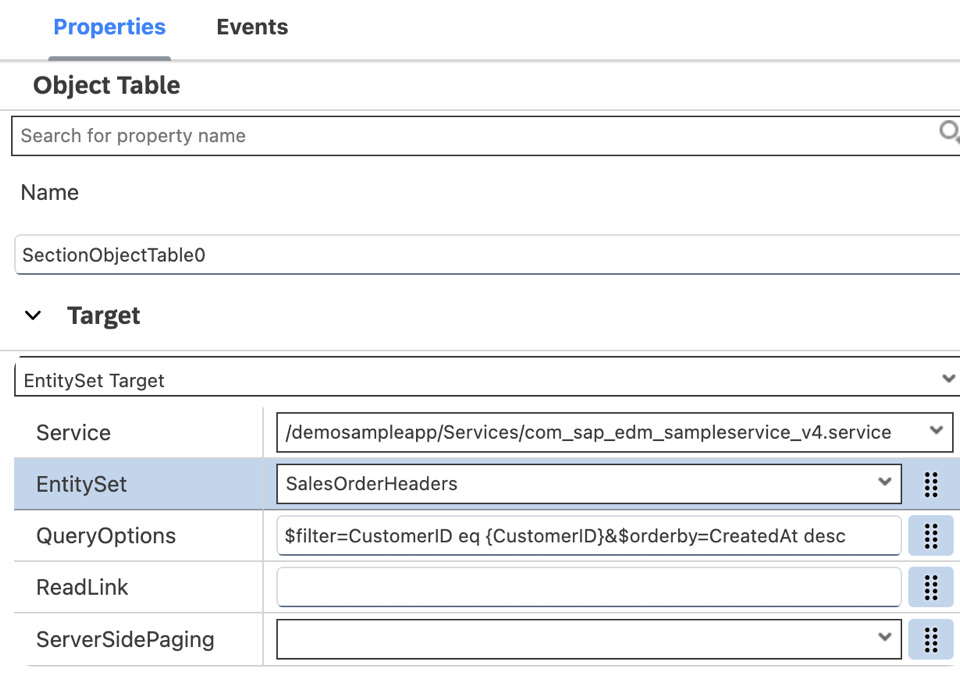

    >For a given customer id, query expression will filter top 5 order entries returned in descending when sorted by the order creation date property.

    ><!-- border -->

6. Now, start binding Object Table properties with `SalesOrderHeaders` entity set properties.

    Provide the below information:

    | Property | Value |
    |----|----|
    | `Description`| `$(D,{CreatedAt},'','',{format:'medium'})` |
    | `Footnote` | Remove the default value and leave it blank |
    | `PreserveIconStackSpacing`| `false` |
    | `ProgressIndicator` | Remove the default value and leave it blank |
    | `Status`| `$(C,{GrossAmount},{CurrencyCode},'',{maximumFractionDigits:2,useGrouping:true})` |
    | `Subhead` | bind to `{CustomerId}` |
    | `Substatus`| bind to `{LifeCycleStatusName}` |
    | `Tags` | Click the `item0` and then click the trash icon to delete the default item |
    | `Title`| bind to `{SalesOrderId}` |

    <!-- border -->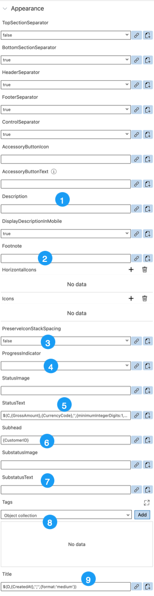

    >`$(D,{CreatedAt},'','',{format:'medium'})` is an expression of how to format a date, end result would be like June 20, 2020. By default it will be formatted to the device's locale setting. More details on Date Formatter is available in [documentation](https://help.sap.com/doc/f53c64b93e5140918d676b927a3cd65b/Cloud/en-US/docs-en/guides/getting-started/mdk/development/property-binding/i18n-formatter.html#date-formatter).

    ><!-- border -->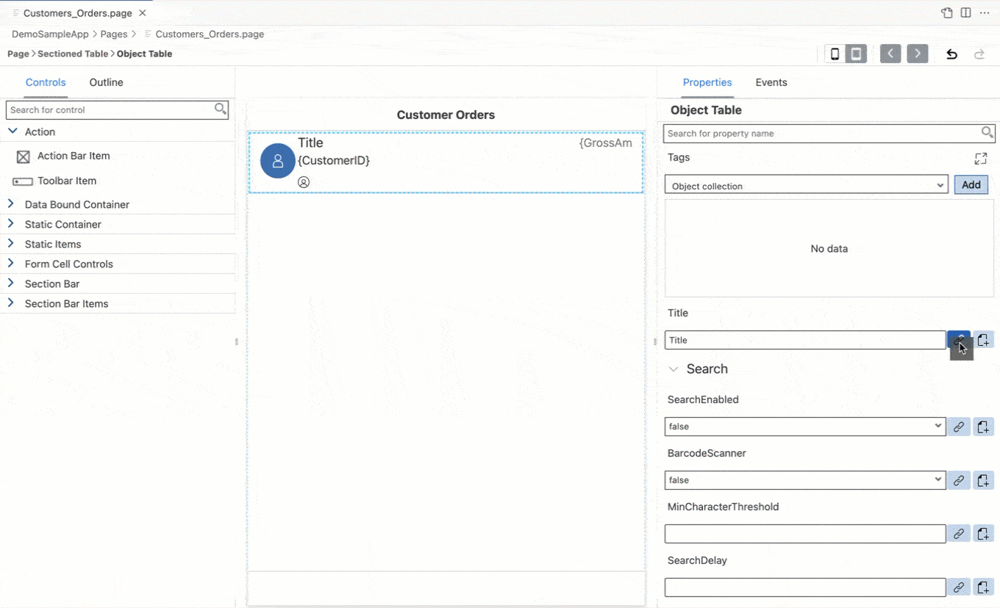

    >`$(C,{GrossAmount},{CurrencyCode},'',{maximumFractionDigits:2,useGrouping:true})` is an expression of how to format currency value, end result would be like €200.44. By default it will be formatted to the device's locale setting.  More details on Currency Formatter is available in [documentation](https://help.sap.com/doc/f53c64b93e5140918d676b927a3cd65b/Cloud/en-US/docs-en/guides/getting-started/mdk/development/property-binding/i18n-formatter.html#currency-formatter).

    ><!-- border -->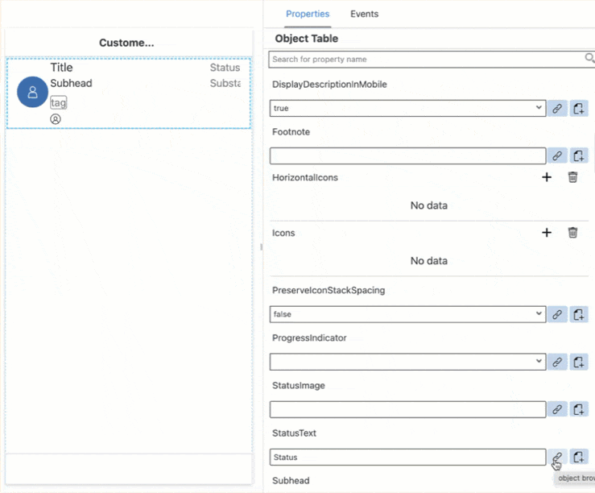

7. In the **Search** section of the **Properties** pane, change both the **Search Enabled** property and **Barcode Scanner** property to **`true`**.

    <!-- border -->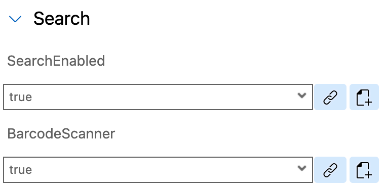

8. In the **Behavior** section of the **Properties** pane, select `DisclosureIndicator` to **`AccessoryType`** property.

    <!-- border -->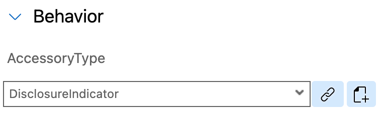

9. In the **Avatar Grid** section of the **Properties** pane, remove the default Avatar by selecting the `item0` and then clicking the trash icon to delete the default item.

    <!-- border -->    

10. In the **Avatar Stack** section of the **Properties** pane, remove the default Avatar by selecting the `item0` and then clicking the trash icon to delete the default item.

    <!-- border -->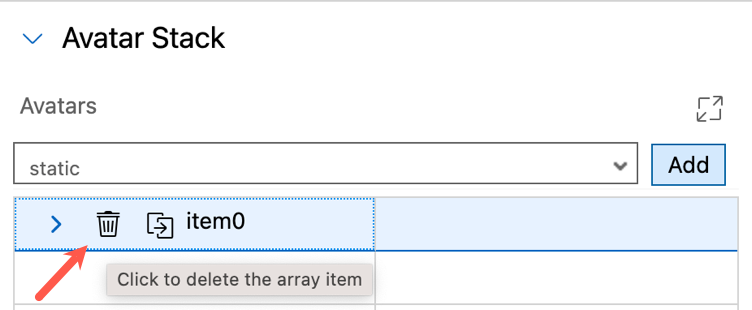  

12. In the `EmptySection` of the **Properties** pane, provide **`No Orders Found`** for the **Caption** property.

    <!-- border -->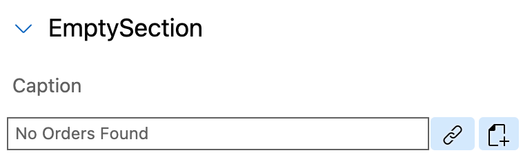


### Create a new order details page


This page will show related details for an order. In this page, you will add an **Object Header** control that is used to display information (like first name, last name, date of birth, email address & phone number) about the header of an object and **Static Key Value** control to display key value pair items like address, city, postal code & country.

1. In SAP Business Application Studio project, right-click the **Pages** | **MDK: New Page** | select **Section** | **Next**.

    <!-- border -->

2. Enter the Page Name as `SalesOrders_Details` and click **Finish** to complete the page creation process.

    <!-- border -->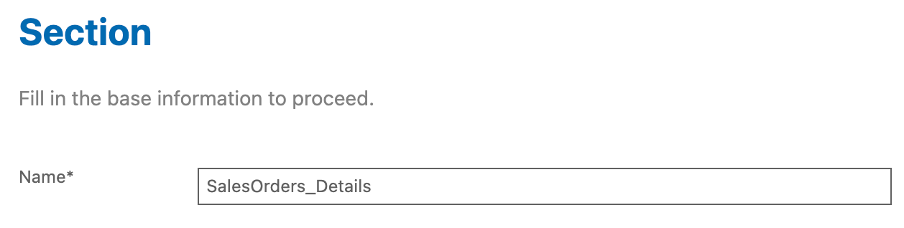

3. In the **Properties** pane set the Caption to **Order Details**.

    <!-- border -->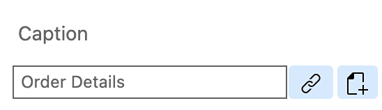

4. Next, you will add a **Static Key Value** container and its item **Key Value Item** to display information like sales order id, life cycle status & date of order creation name.

    >**Static Key Value** is a container that can display one or more key value pair items on a section page. In this container, you can include a Key Value Item, a simple key value cell that displays a label and a text pair. You can find more details [here](https://help.sap.com/doc/69c2ce3e50454264acf9cafe6c6e442c/Latest/en-US/docs-en/reference/schemadoc/Page/SectionedTable/Container/KeyValue.schema.html) about this container.

    In the Layout Editor, expand the **Controls** | **Static Container** section, drag and drop the **Static Key Value** control onto the page area.

    <!-- border -->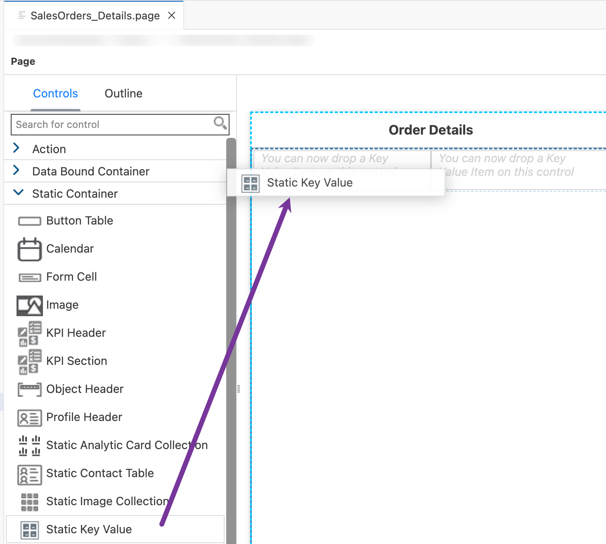

5. Now, add key value item to this container. In the Layout Editor, expand the **Controls** | **Static Items** section, drag and drop the **Key Value Item** control onto the page area.

    <!-- border -->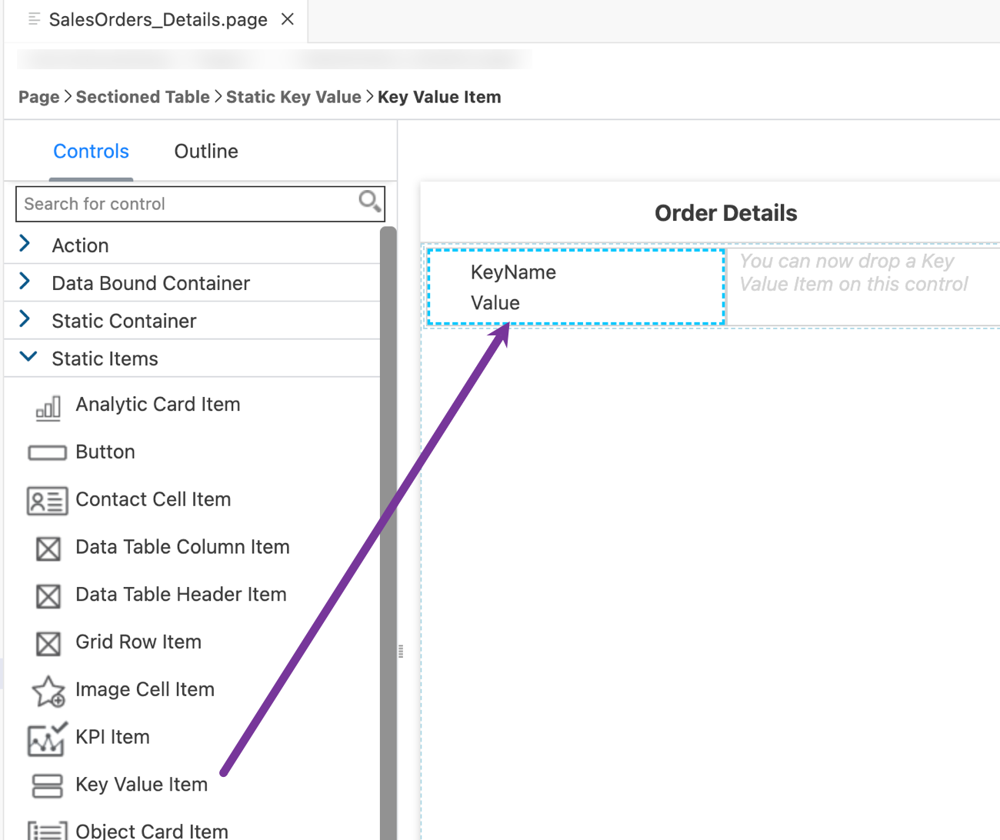

    Provide the below information:

    | Property | Value |
    |----|----|
    | `KeyName`| `Order Number` |
    | `Value` | bind to `{SalesOrderId}` |

    <!-- border -->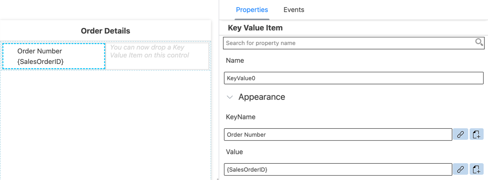

    >Make sure to select values for the mentioned properties only from `SalesOrderHeader` entity. You may find similar values from other entities.

6. Repeat the above step by adding 5 more **Key Value Item** on the page.

    <!-- border -->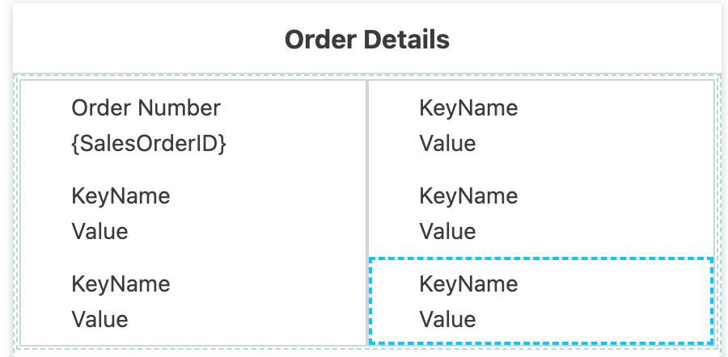

    Provide the below information:

    | Property | Value |
    |----|----|
    | `KeyName`| `Status` |
    | `Value` | bind to `{LifeCycleStatusName}` |

    | Property | Value |
    |----|----|
    | `KeyName`| `Created At` |
    | `Value` | `$(D,{CreatedAt},'','',{format:'medium'})` |

    | Property | Value |
    |----|----|
    | `KeyName`| `Net Amount` |
    | `Value` | `$(C,{NetAmount},{CurrencyCode},'',{maximumFractionDigits:2,useGrouping:true})` |

    | Property | Value |
    |----|----|
    | `KeyName`| `Tax Amount` |
    | `Value` | `$(C,{TaxAmount},{CurrencyCode},'',{maximumFractionDigits:2,useGrouping:true})` |

    | Property | Value |
    |----|----|
    | `KeyName`| `Total Amount` |
    | `Value` | `$(C,{GrossAmount},{CurrencyCode},'',{maximumFractionDigits:2,useGrouping:true})` |

    You should have final binding for all key value items as below:

    <!-- border -->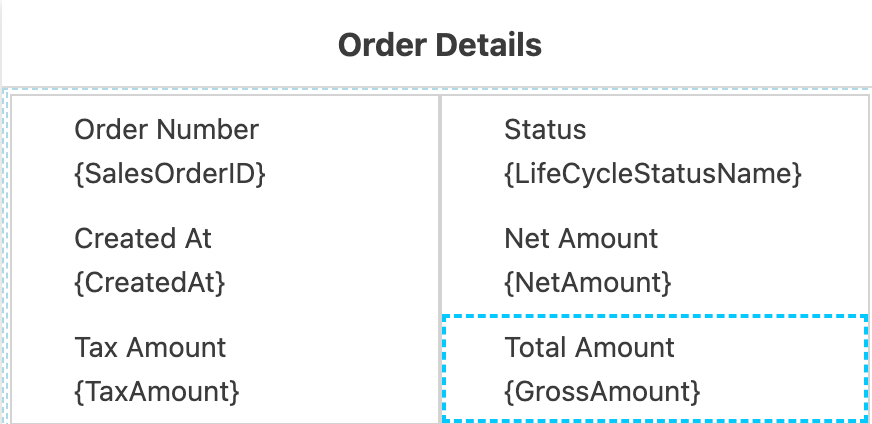


### Navigate from Customer Order Page to Order Details Page


When user taps an Order on the Customer Orders page, it should navigate to related details page.

1. In the `Customers_Orders.page`, select the Object Table control, navigate to the **Events** tab. Click the 3 dots icon for the `OnPress` property and select the `Create a rule/action`.

    <!-- border -->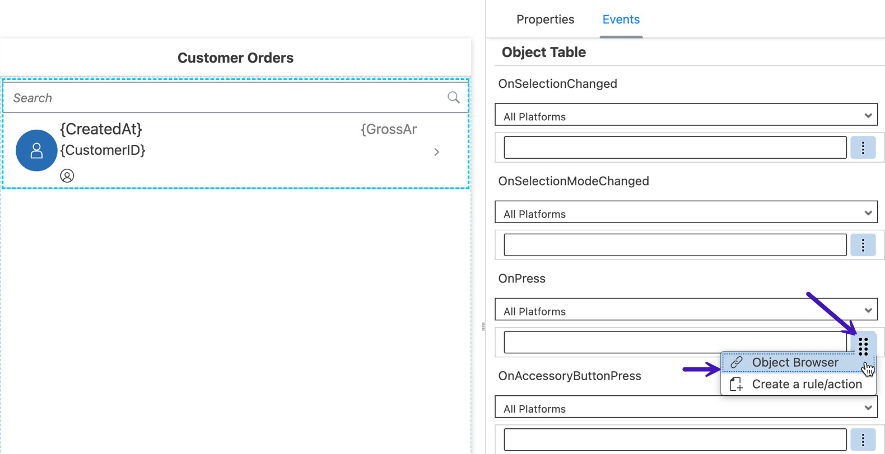

2. Keep the default selection for the *Object Type* as Action and *Folders* path.

    <!-- border -->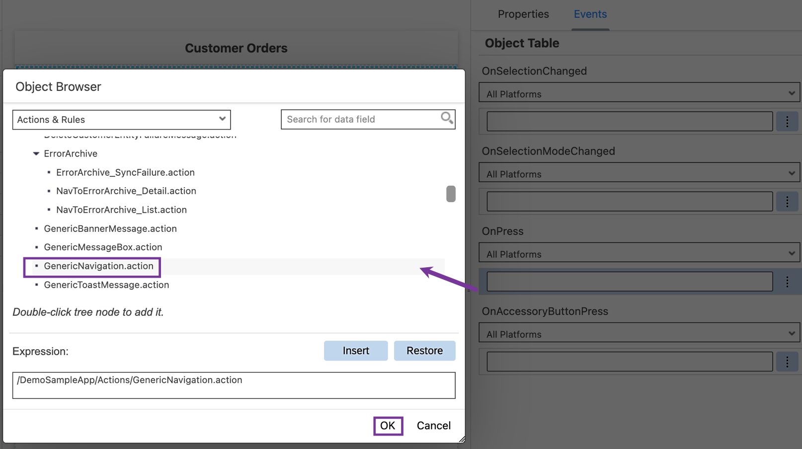   

3. In the **Template Selection** step, choose **UI** in **Category** | click **Navigation** | **Next**.

4. In the **Base Information** step, provide the below information:

    | Field | Value |
    |----|----|
    | `Name`| `NavToSalesOrders_Details` |
    | `PageToOpen` | Select `SalesOrders_Details.page` from the dropdown |

    <!-- border -->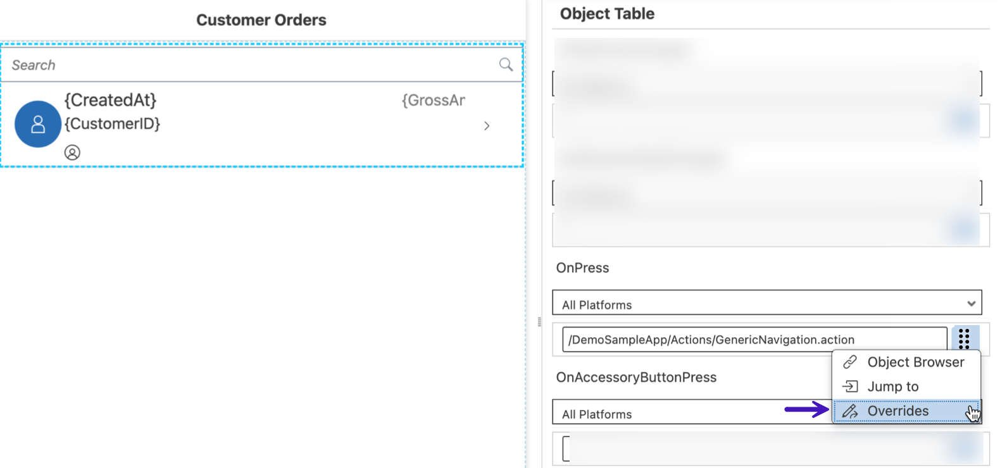

5. Click **Finish** to complete the action creation process.

### Display top 5 orders in customer detail page


1. You will add an **Object Table** compound to display top 5 orders information in the `Customers_Detail.page`.

    In the Layout Editor, expand the **Controls** | **Data Bound Container** group, drag and drop the **Object Table** control onto the page area.

    <!-- border -->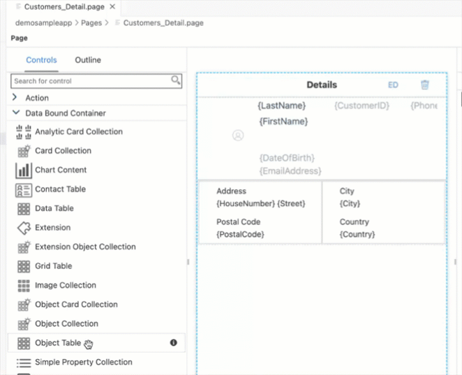

2. In the **Properties** pane, provide below information:
   
    | Field | Value |
    |----|----|
    | `Service`| select `SampleServiceV2.service` from the dropdown |
    | `EntitySet` | enter `{@odata.readLink}/SalesOrders` |
    | `QueryOptions`| `$top=5&$orderby=CreatedAt desc` |

    <!-- border -->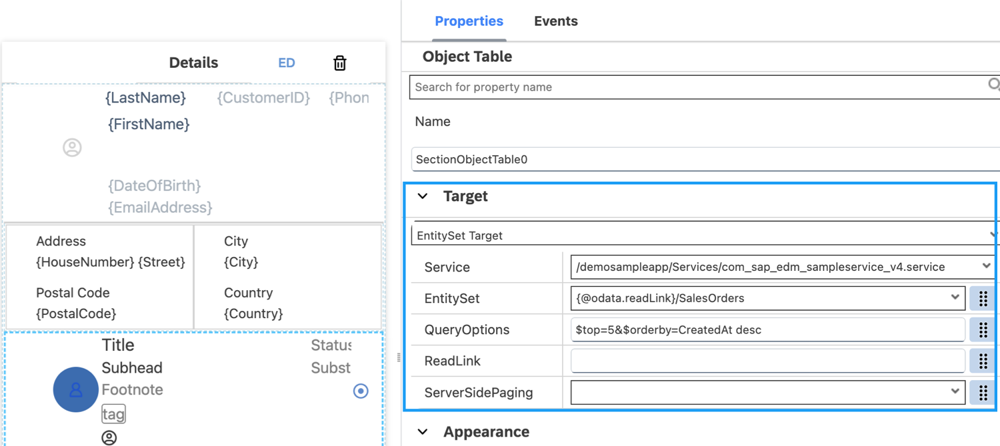

    >The **`odata.readLink`** annotation contains the read URL of the entity or collection.

    > **`SalesOrders`** is a navigation property in Customer entity to `SalesOrderHeader` entity. You can find this information in OData service metadata document.

    ><!-- border -->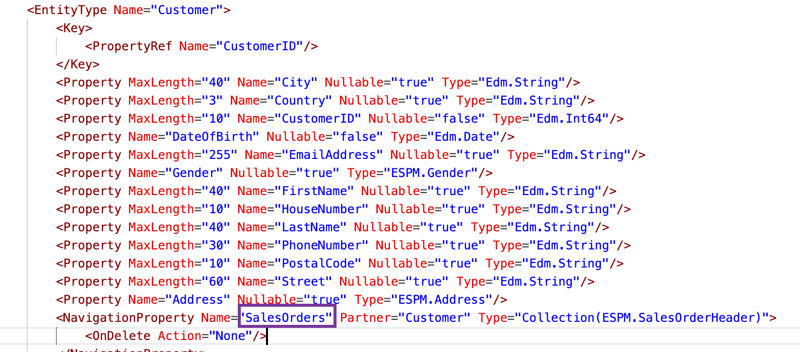

    >**`QueryOptions`** expression will filter order entries returned in descending when sorted by the order creation date property.

3. Now, start binding Object Table properties with `SalesOrderHeaders` entity set properties.

    In the **Appearance** section of the **Properties** pane, provide the below information:
    
    | Field | Value |
    |----|----|
    | `Description`| Remove the default value and leave it blank  |
    | `Footnote` | Remove the default value and leave it blank  |
    | `PreserveIconStackSpacing`| select `false` from the dropdown |
    | `ProgressIndicator` | Remove the default value and leave it blank  |
    | `Status`| `$(C,{GrossAmount},{CurrencyCode},'',{maximumFractionDigits:2,useGrouping:true})` |
    | `Subhead` | `$(D,{CreatedAt},'','',{format:'medium'})` |
    | `Substatus`| bind to `{CurrencyCode}` |
    | `Tags` | Click the `item0` and then click the trash icon to delete the default item |
    | `Title`| bind to `{SalesOrderId}` |

    <!-- border -->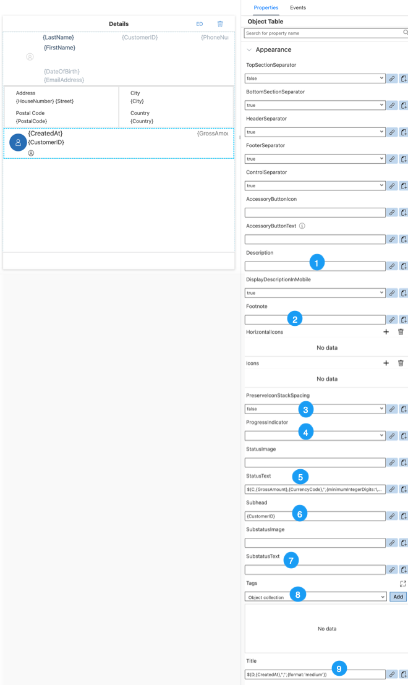

4. In the **Behavior** section of the **Properties** pane, select `DisclosureIndicator` to **`AccessoryType`** property.

    <!-- border -->

5. In the **Avatar Grid** section of the **Properties** pane, remove the default Avatar by selecting the `item0` and then clicking the trash icon to delete the default item.

    <!-- border -->    

6. In the **Avatar Stack** section of the **Properties** pane, remove the default Avatar by selecting the `item0` and clicking the trash icon to delete the default item.

    <!-- border -->  

7. In the `EmptySection` of the **Properties** pane, provide  **`No Customer Orders Found`** to **Caption** property.

    <!-- border -->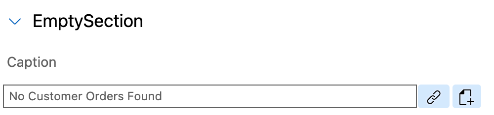

8. You may also want to open `SalesOrders_Detail.page` when clicking on any order in `Customers_Detail.page`. For this, you will set the  `OnPress` event of the **Object Table** and link it to `NavToSalesOrders_Details.action` so that when an end-user selects a order, the Order Details page will open. MDK automatically passes the selected order to the details page.

    In `Customers_Detail.page`, select the Object Collection, click the 3 dots icon under the **Events** tab for the `OnPress` event to open the **Object Browser**.

    Double-click the `NavToSalesOrders_Details.action` and click **OK** to set it as the `OnPress` action.

    <!-- border -->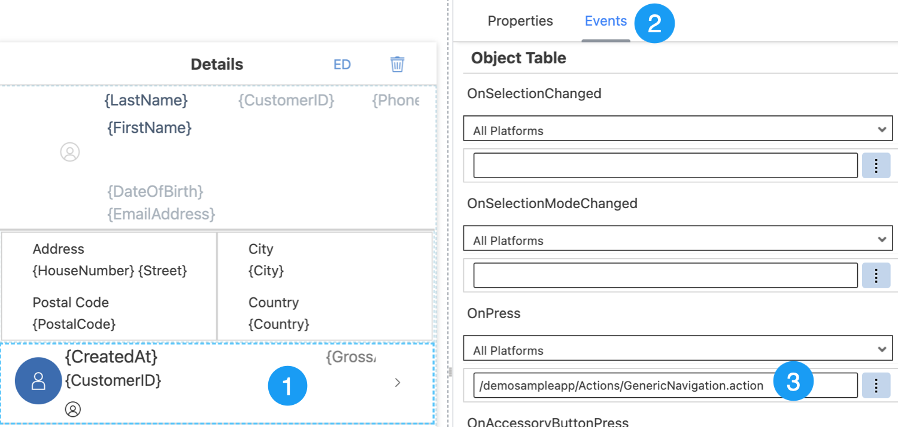


### Add Header control to orders grid


1. For orders grid area, you will add a header to display some text label in `Customers_Detail.page`.

    In the Layout Editor, expand the **Controls** | **Section Bar** section, drag and drop the **Header** control above the order grid area.

    <!-- border -->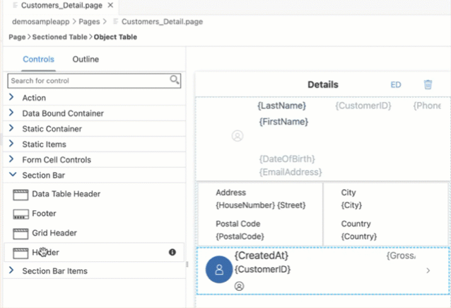

2. Provide the below information:

    | Property | Value |
    |----|----|
    | `Caption`| `Customer Orders` |

    <!-- border -->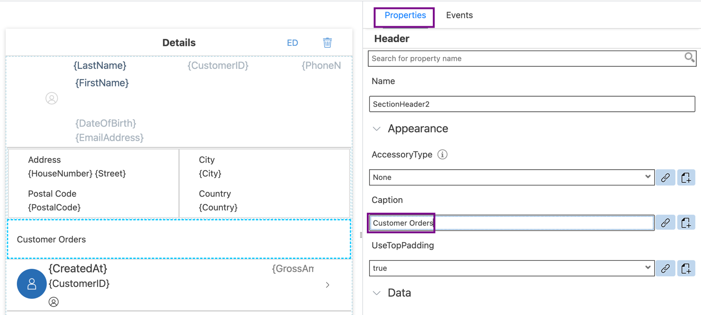

    >You can find more details about [Header control](https://help.sap.com/doc/69c2ce3e50454264acf9cafe6c6e442c/Latest/en-US/docs-en/reference/schemadoc/Page/SectionedTable/Common/Header.schema.html).


### Add Footer control to show total order count


1. For orders grid area, you will also add a footer to display total count of orders for a customer.

    In the Layout Editor, expand the **Controls** | **Section Bar** section, drag and drop the **Footer** control above the order grid area.

    <!-- border -->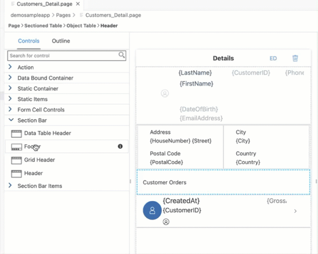

2. To show a total count of orders for a customer, you will write a JavaScript logic for this calculation. Click `Create a rule` option for `AttributeLabel` property of the Footer control.

    <!-- border -->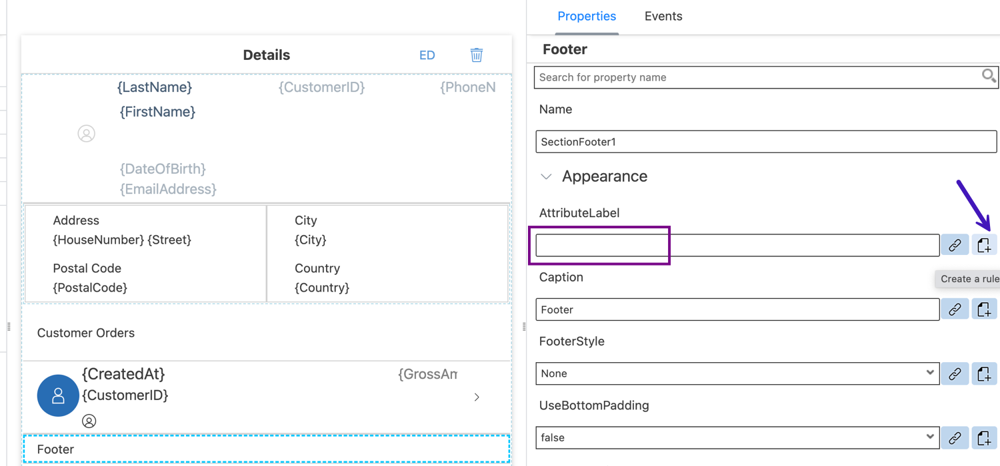

3. Keep the default selection for the *Object Type* as Rule and *Folders* path.

    <!-- border -->
   
4. Enter the Rule name as`Customers_OrderCount`, and then click **Finish** to complete the rule creation process.

    <!-- border -->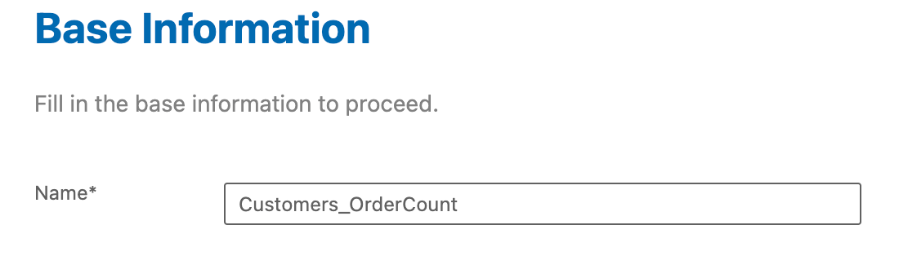

5. Copy and paste the following code.

    ```JavaScript
    export default function CustomerOrderCount(context) {
        //The following currentCustomer will retrieve the current customer record
        const currentCustomer = context.getPageProxy().binding.CustomerId;
        //The following expression will retrieve the total count of the orders for a given customer
        return context.count('/DemoSampleApp/Services/SampleServiceV2.service', 'SalesOrderHeaders', `$filter=CustomerId eq '${currentCustomer}'`).then((count) => {
            return count;
        });
    }    
    ```

6. Switch back to the `Customers_Detail.page` and provide the below information for other properties of the Footer control:

    | Property | Value |
    |----|----|
    | `Caption`| `See All` |
    | `FooterStyle`| Select `attribute` from the dropdown |
    | `AccessoryType`| Select `DisclosureIndicator` from the dropdown |

    <!-- border -->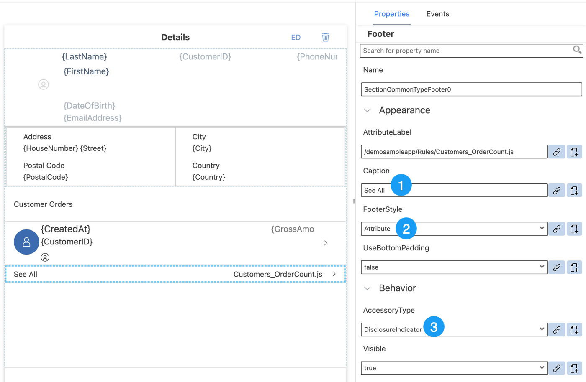

    >You can find more details about [Footer control](https://help.sap.com/doc/69c2ce3e50454264acf9cafe6c6e442c/Latest/en-US/docs-en/reference/schemadoc/Page/SectionedTable/Common/Footer.schema.html).

8.  You may also want to open **Customer Orders** page when clicking **See All** to see a complete list of orders belong to a particular customer. 
    
    Navigate to the **Events** tab for the Footer control. Click the 3 dots icon for the `OnPress` property and select the `Create a rule/action`.

    <!-- border -->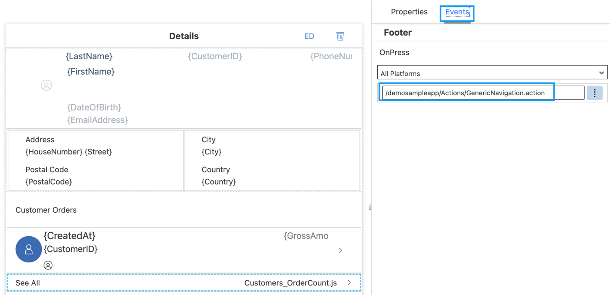

9. Keep the default selection for the *Object Type* as Action and *Folders* path.

    <!-- border -->  

10. In the **Template Selection** step, choose **UI** in **Category** | click **Navigation** | **Next**.

11. In the **Base Information** step, provide the below information:

    | Field | Value |
    |----|----|
    | `Name`| `NavToCustomers_Orders` |
    | `PageToOpen` | Select `Customers_Orders.page` from the dropdown |    
    
    <!-- border -->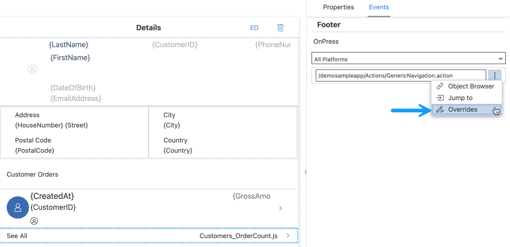

12. Click **Finish** to complete the action creation process.

### Deploy the application

Deploy the updated application to your MDK client.

1. Right-click `Application.app` and select **MDK: Deploy**.

    <!-- border -->

2. Select deploy target as **Mobile & Cloud**.

    <!-- border -->

    You should see success message for both deployments.

    <!-- border -->

    >Alternatively, you can select *MDK: Redeploy* in the command palette (View menu>Find Command OR press Command+Shift+p on Mac OR press Ctrl+Shift+P on Windows machine), it will perform the last deployment.

    ><!-- border -->


### Run the app


[OPTION BEGIN [Android]]

1. Tap **Update** on the Main page, you will see a _New Version Available_ pop-up, tap **Now**.

    

    Click a customer record, you will see the **Customer Orders** area in customer detail page and also total count of orders.

    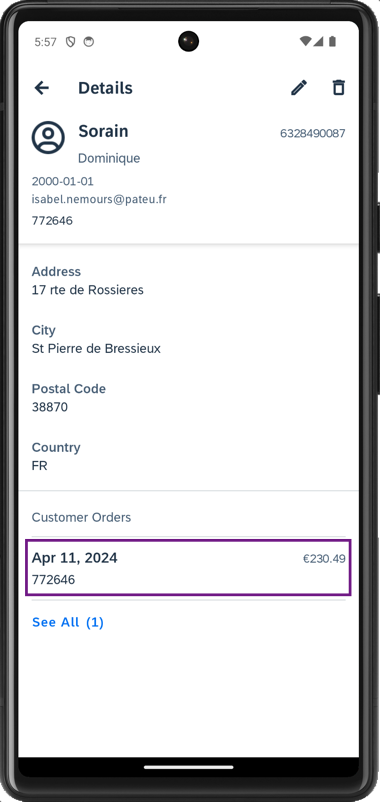

    >If you see _No Customer Orders Found_ message, try with other customer record.

2. Tapping on any order navigates to its details page.

    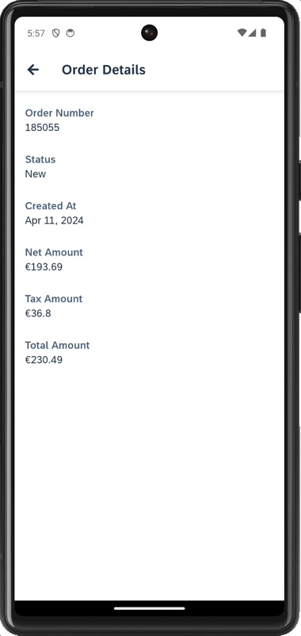

3. Navigate back to **Details** page, tap **See All**, which navigates to the **Customer Orders** page.  

    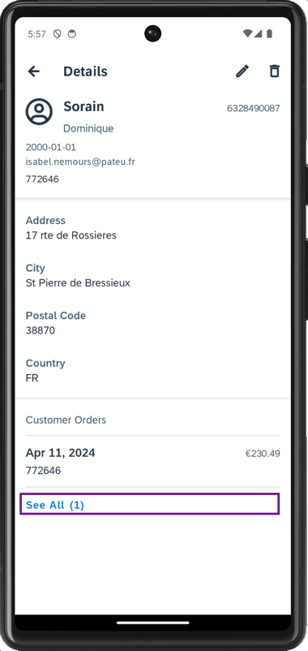

    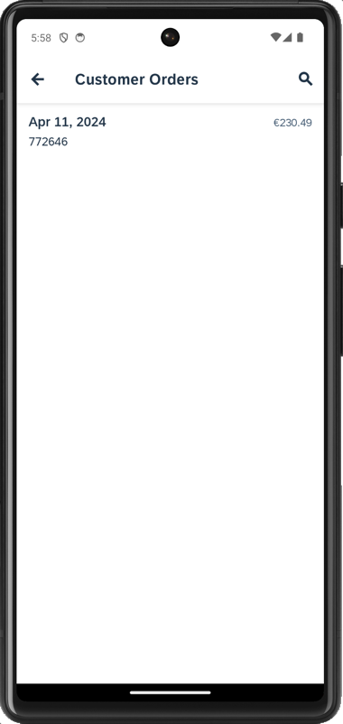

[OPTION END]

[OPTION BEGIN [iOS]]

1. Tap **Update** on the Main page, you will see a _New Version Available_ pop-up, tap **Now**.

    

2. Tap **Customers** | click a customer record. You will see the **Customer Orders** area in customer detail page and also total count of orders.

    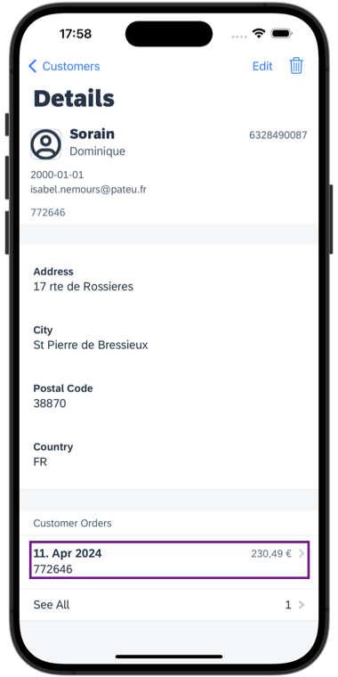

    >If you see _No Customer Orders Found_ message, try with other customer record.

3. Tapping on any order navigates to its details page.

    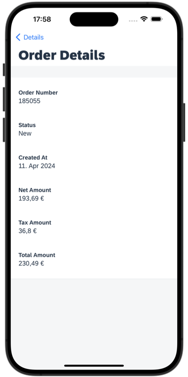

4. Navigate back to **Details** page, tap **See All**, which navigates to the **Customer Orders** page.  

    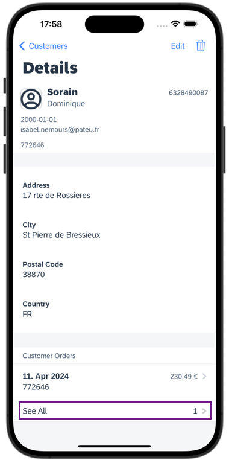

    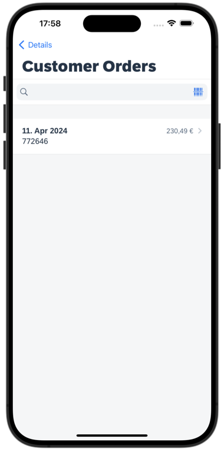

[OPTION END]

[OPTION BEGIN [Web]]

1. Either click the highlighted button or refresh the web page to load the changes.

    <!-- border -->

    >If you see the error `404 Not Found: Requested route ('xxxxx-dev-nsdemosampleapp-approuter.cfapps.xxxx.hana.ondemand.com') does not exist.` while accessing the web application, make sure that in your space cockpit, highlight applications are in started state.

    ><!-- border -->

2. Click **Customers** | click a customer record. You will see the **Customer Orders** area in customer detail page and also total count of orders.

    <!-- border -->

    >If you see _No Customer Orders Found_ message, try with other customer record.

3. Clicking on any order navigates to its details page.

    <!-- border -->

4. Navigate back to **Customer Detail** page, tap **See All**, which navigates to the **Customer Orders** page.

    <!-- border -->

    <!-- border -->

[OPTION END]


---
