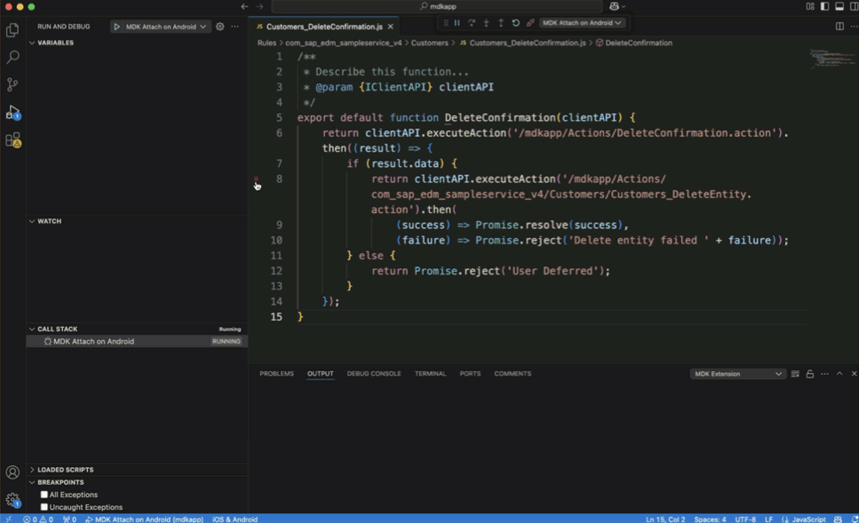
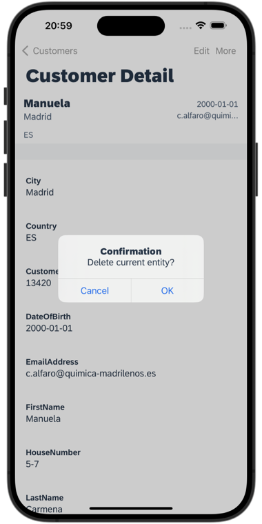
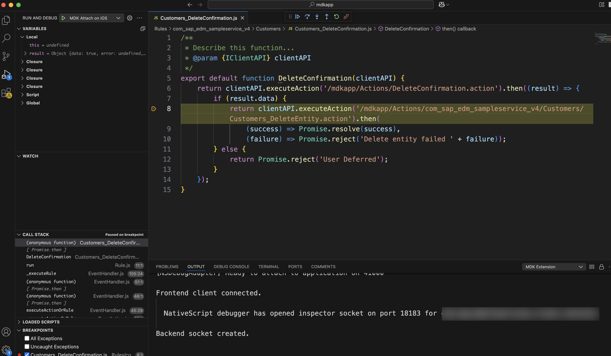

# Debug Your Mobile Development Kit Application 
<!-- description --> Learn how to effectively troubleshoot and resolve issues in your Mobile Development Kit (MDK) application through comprehensive debugging techniques.

## Prerequisites
- **Tutorial**: [Set Up Initial Configuration for an MDK App](https://developers.sap.com/tutorials/cp-mobile-dev-kit-ms-setup.html)
- **Download and Install Visual Studio Code** from [here](https://code.visualstudio.com/download) 
- **Download the latest version of Mobile Development Kit SDK** either from the SAP community [trial download](https://developers.sap.com/trials-downloads.html?search=Mobile+Development+Kit) or [SAP Software Center](https://me.sap.com/softwarecenter) if you are a SAP Mobile Services customer

## You will learn
  - How to install MDK Extension in Visual Studio Code
  - How to generate a debug configuration file
  - How to set breakpoints in a rule
  - How to use the debug console

## Intro
Use the debugging feature provided by the Mobile Development Kit extension for Visual Studio Code to debug your MDK app after bundling it. You can set breakpoints, inspect scope variables, watch expressions, or execute JavaScript code in the rule files.

---

### Create a new MDK project in SAP Business Application Studio

This step includes creating the mobile development kit project in the editor. Follow step 1 from this [tutorial](https://developers.sap.com/tutorials/cp-mobile-dev-kit-quick-start.html) to create your MDK project. 

### Deploy the project

You will now deploy your MDK project to SAP Mobile Services, enabling it for debugging.

1. Right-click `Application.app` and select **MDK: Deploy**.

    <!-- border -->

2. Select deploy target as **Mobile Services**.

    <!-- border -->

3. Choose **Yes** to enable source for debugging the deployed bundle.

    <!-- border -->

    You should see **Deploy to Mobile Services successfully!** message.

    <!-- border -->

### Download your MDK metadata project from SAP Business Application Studio

You will download your MDK project to your local machine. This will be necessary for setting a breakpoint in a rule file in step 8. An alternative option is to use a GitHub repository. See [Git Source Control guide](https://help.sap.com/docs/bas/sap-business-application-studio/git-source-control) for more details.

1. In SAP Business Application Studio, right-click on the `MDKApp` project and select **Download**.

    <!-- border -->

2. A file named `MDKApp.tar` will be downloaded to your machine. Extract the metadata files from the downloaded archive. 

### Create and run MDK client

1. Follow the [Build Your Mobile Development Kit Client Using MDK SDK](https://developers.sap.com/tutorials/cp-mobile-dev-kit-build-client.html) tutorial to create your branded MDK client and run it on a simulator or a device. 

2. After successfully onboarding your mobile client, click **Now** to accept the app update.

3. Leave the client running. You will connect the debugger to this client in step 8.

### Install MDK Extension in Visual Studio Code

In the Visual Studio Code, click the **Extensions** pane and install the **mobile Development Kit extension for Visual Studio Code** extension. Alternatively, you can download and install the MDK extension for VS Code from the [SAP Software Center](https://me.sap.com/softwarecenter/template/products/%20_APP=00200682500000001943&_EVENT=DISPHIER&HEADER=Y&FUNCTIONBAR=N&EVENT=TREE&NE=NAVIGATE&ENR=73554900100900003111&V=MAINT&TA=ACTUAL&PAGE=SEARCH/MDK%20VSCODE%20EXTENSION%201.0) (applicable to SAP Mobile Services customer).

<!-- border -->

### Open the MDK metadata project in VS Code

Open the extracted `MDKApp` folder in VS Code. 

<!-- border -->

### Create and Configure your launch.json

You will add your debug configurations in `launch.json` file.

1. To generate the default launch configuration file, select **Run and Debug** in the icon panel.

    <!-- border -->

2. Click `create a launch.json file` option.

    <!-- border -->

3. Select `MDK` as the debugger type from the list.

    <!-- border -->

4. A `launch.json` file will be generated.

    <!-- border -->

5. In the `launch.json` file, set the `appRoot` attribute for appropriate Mobile Development Kit launch configurations. This should be the path to your `create-client` command output. 

    If you have launched your MDK branded client from terminal or command line via `ns run ios` or `ns run android` command, you do not need to set the `appRoot` attribute for MDK **Launch** configurations. You can only set the `appRoot` attribute for MDK **Attach** configurations.

    Put a comma after `watch` attribute and add `appRoot` attribute. Provide the path to your MDK client project folder. 

    <!-- border -->

### Attach the debugger to your MDK Client

>Make sure you are choosing the right device platform tab above. 

>You can debug Android clients from either Window or Mac. iOS clients can only be debugged using a Mac.

[OPTION BEGIN [Android]]

1. Select the **MDK Attach on Android** configuration from the drop-down, and click the *green play icon* or select **Run** Menu > **Start Debugging**.

    <!-- border -->

    >In this tutorial, MDK client was launched via terminal or command line window back in step 4. So, the **MDK Attach** configuration option is selected in the dropdown. 

2. Once the debugger is attached to your MDK client, you will see an orange bar appearing in the VS Code.

    <!-- border -->

[OPTION END]

[OPTION BEGIN [iOS]]

1. Select the **MDK Attach on iOS** configuration from the drop-down, and click the *green play icon* or select **Run** Menu > **Start Debugging**.

    <!-- border -->

    >In this tutorial, MDK client was launched via terminal window back in step 4. So, the **MDK Attach** configuration option is selected in the dropdown. 

2. click allow accepting incoming network connections.
   
    <!-- border -->

3. Once the debugger is attached to your MDK client, you will see an orange bar appearing in the VS Code.

    <!-- border -->

[OPTION END]

### Set Breakpoints in a rule

As the debugger is attached, you can now set breakpoints, inspect scope variables, watch expressions, or execute JavaScript code in the rule files.

>Make sure you are choosing the right device platform tab above.

[OPTION BEGIN [Android]]

1. Switch to the **Explorer** view to access MDK project. 

    <!-- border -->

2.  To set a breakpoint, navigate to `Rules` | `SampleServiceV4` | `Customers` |  `Customers_DeleteConfirmation.js` and click on line 8 where you want to set your breakpoint. Click the margin that you can find on the left of the line number. Alternatively, you can toggle the breakpoint from **Run** menu > **Toggle Breakpoint**.

    

3. In your MDK client, navigate to **Customers** | click on any customer record | **More** | **Delete** to trigger the rule.

    

4. Click **OK** to confirm. 

    

5. Execution stops at the breakpoint. 

    

5. Use debugging capabilities in VS code to step over or into code, inspect variables, set watch points, and more. See the Visual Studio Code documentation on [Debug actions](https://code.visualstudio.com/Docs/editor/debugging#_debug-actions), [breakpoints](https://code.visualstudio.com/Docs/editor/debugging#_breakpoints), [Data inspection](https://code.visualstudio.com/Docs/editor/debugging#_data-inspection) and [Advanced breakpoint topics](https://code.visualstudio.com/Docs/editor/debugging#_advanced-breakpoint-topics). 

[OPTION END]

[OPTION BEGIN [iOS]]

1. Switch to the **Explorer** view to access MDK project. 

    <!-- border -->

2. To set a breakpoint, navigate to `Rules` | `SampleServiceV4` | `Customers` |  `Customers_DeleteConfirmation.js` and click on line 8 where you want to set your breakpoint. Click the margin that you can find on the left of the line number. Alternatively, you can toggle the breakpoint from **Run** menu > **Toggle Breakpoint**.

    

3. In your MDK client, navigate to **Customers** | click on any customer record | **More** | **Delete** to trigger the rule.

    

4. Click **OK** to confirm. 

    

5. Execution stops at the breakpoint. 

    

6. Use debugging capabilities in VS code to step over or into code, inspect variables, set watch points, and more. See the Visual Studio Code documentation on [Debug actions](https://code.visualstudio.com/Docs/editor/debugging#_debug-actions), [breakpoints](https://code.visualstudio.com/Docs/editor/debugging#_breakpoints), [Data inspection](https://code.visualstudio.com/Docs/editor/debugging#_data-inspection) and [Advanced breakpoint topics](https://code.visualstudio.com/Docs/editor/debugging#_advanced-breakpoint-topics). 

[OPTION END]

### Use Debug Console

1. Let's check if there is already `result.data` available. Switch to the **DEBUG CONSOLE** tab, enter `result.data` and press enter.

    <!-- border -->

2. As `result.data` is true, the `Customers_DeleteEntity.action` will be executed when pressing the play icon on the **Debug Toolbar**.

    <!-- border -->

3. To disconnect your debugger, click the red stop icon in the floating bar. Alternatively, you can do it via **Run** menu> **Stop Debugging**.

You have learned how to debug an Mobile Development Kit Client application. Find more information about debugging in MDK in [help documentation](https://help.sap.com/doc/f53c64b93e5140918d676b927a3cd65b/Cloud/en-US/docs-en/guides/getting-started/mdk/vscode/debugging-mdk-app-with-vscode-debugger.html).

---