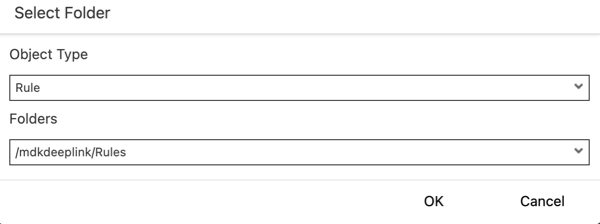
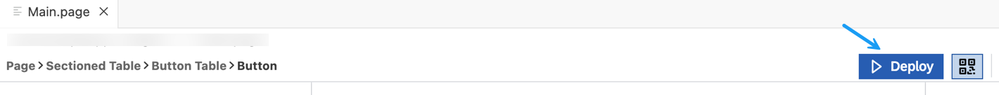
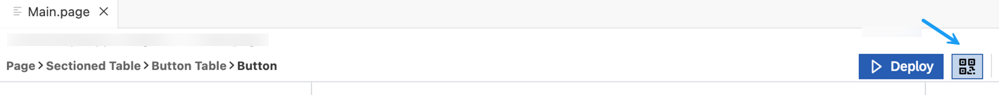
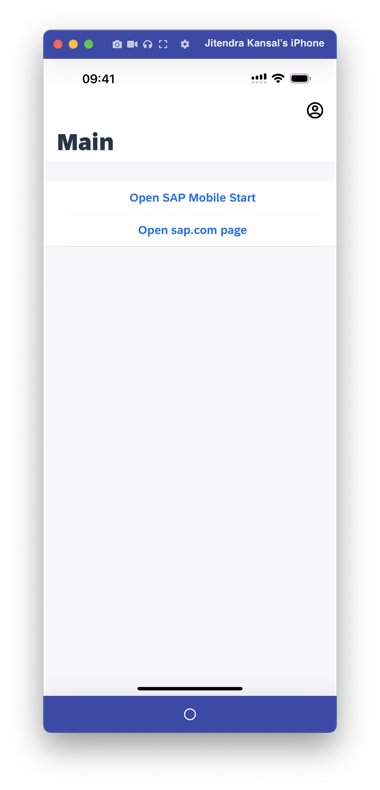
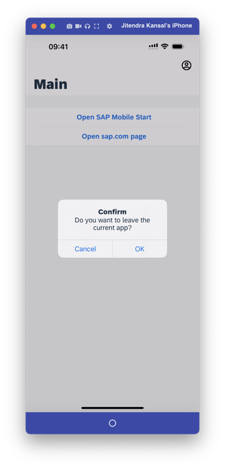

# Implement Deep Linking to Another App from an MDK App
<!-- description --> Open a web page or navigate to an installed app from an MDK app.

## Prerequisites
- **Tutorial group:** [Set Up for the Mobile Development Kit (MDK)](group.mobile-dev-kit-setup)
- **Install SAP Mobile Services Client** on your [iOS](https://apps.apple.com/us/app/sap-mobile-services-client/id1413653544) or [Android](https://play.google.com/store/apps/details?id=com.sap.mobileservices.client) device.
<table><tr><td align="center"><!-- border --><br>Android</td><td align="center">!<br>iOS</td></tr></table>
(If you are connecting to `AliCloud` accounts then you will need to brand your [custom MDK client](cp-mobile-dev-kit-build-client) by allowing custom domains.)
- **Install SAP Mobile Cards Application:**
   <table><tr><td align="center"><!-- border --><br>Android</td><td align="center">!<br>iOS</td></tr></table>

## You will learn
  - How to open SAP standard app like Mobile Cards from MDK public store client
  - How to open a web page

## Intro
You may clone an existing project from [GitHub repository](https://github.com/SAP-samples/cloud-mdk-tutorial-samples/tree/master/4-Level-Up-with-the-Mobile-Development-Kit/4-Implement-Deep-Linking-to-Another-App-from-an-MDK-App) and start directly with step 4 in this tutorial.

---

Deep links are used to send users directly to an app instead of a website or a store saving users the time and energy locating a particular page themselves – significantly improving the user experience.

If an app is already installed, you can specify a custom URL scheme (iOS Universal Links) or an intent URL (on Android devices) that opens that app. Using deep link, you can also navigate to specific events or pages, which could tie into campaigns that you may want to run.


>**This tutorial has been executed using public store MDK client which has out of the box functionality to open the SAP standard app like SAP Mobile Cards.
If you are building a custom version of Mobile development kit client, there you can implement deep links by specifying related custom URL scheme.**

### Create a new MDK project in SAP Business Application Studio


1. Launch the [Dev space](cp-mobile-bas-setup) in SAP Business Application Studio.

2. Click **Start from template** on the `Get Started` page.

    <!-- border -->

    >If you do not see the `Get Started` page, you can access it by typing `>get started` in the center search bar.

    <!-- border -->

3. Select **MDK Project** and click **Start**.

    <!-- border -->  

    >If you do not see the **MDK Project** option check if your Dev Space has finished loading or reload the page in your browser and try again.

    >This screen will only show up when your CF login session has expired. Enter your login credentials, click Sign in. After successful signed in to Cloud Foundry, select your Cloud Foundry Organization and Space where you have set up the initial configuration for your MDK app and click Apply.

    ><!-- border -->

4. In *Basic Information* step, select or provide the below information and click **Finish**:

    | Field | Value |
    |----|----|
    | `MDK Template Type`| Select `Empty` from the dropdown |
    | `Your Project Name` | Provide a name of your choice. `MDKDeepLink` is used for this tutorial |
    | `Your Application Name` | <default name is same as project name, you can provide any name of your choice> |
    | `Target MDK Client Version` | Leave the default selection as `MDK 6.0+ (For use with MDK 6.0 or later clients)` |    
    | `Choose a target folder` | By default, the target folder uses project root path. However, you can choose a different folder path |

    <!-- border -->

    >The _MDK Empty Project_ template creates a Logout action, Close page action, rule and an empty page (`Main.page`). After using this template, you can focus on creating your pages, other actions, and rules needed for your application. More details on _MDK template_ is available in [help documentation](https://help.sap.com/doc/f53c64b93e5140918d676b927a3cd65b/Cloud/en-US/docs-en/guides/getting-started/mdk/webide.html#creating-a-new-project).

5. After clicking **Finish**, the wizard will generate your MDK Application based on your selections. You should now see the `MDKDeepLink` project in the project explorer.


### Add buttons on main page to open other apps or web pages


1. On the `Main.page`, drag and drop the **Button Table** Static Container control onto the Page.

    <!-- border -->

    >The controls available in Container section includes controls that act as containers for other controls, such as container items. A container is constant for all pages. The size of a container depends on the controls and contents included inside.  
    You can find more details about [Containers](https://help.sap.com/doc/69c2ce3e50454264acf9cafe6c6e442c/Latest/en-US/docs-en/reference/schemadoc/Page/SectionedTable/Container/ButtonTable.schema.html).

2. Now, you will add items to this Container control.

    Drag and drop the **Button** Static Item control onto the page.

    <!-- border -->

3. Repeat the above step, and drag and drop one more such **Button** Static Item control.

    <!-- border -->

4. Select the first control, remove the default value for the Image property and update its title to **Open SAP Mobile Cards**.

    <!-- border -->

5. Repeat the same for the second button and update its title to **Open sap.com page**:

    <!-- border -->


### Set onPress handler to the buttons


1. In this step, you will bind a rule to the `OnPress` event of each button.

    In `Main.page`, select **Open SAP Mobile Cards** button. In the Properties pane, click the **Events** tab, click the 3 dots icon for the `OnPress Handler` property and select `Create a rule/action` to create a new rule.

    <!-- border -->

2. Choose the **Rule** in *Object Type*, keep the default path for the *Folders* and click **OK**.

    <!-- border -->

3. Enter the Rule **Name** as `OpenSAPMobileCards`, click **Finish**.

    <!-- border -->

    Replace the generated snippet with below code.

    ```JavaScript
    export default function OpenSAPMobileCards(context) {
        // Get the Nativescript Utils Module
        const utilsModule = context.nativescript.utilsModule;
        return context.executeAction('/MDKDeepLink/Actions/Confirmation.action').then((result) => {
            if (result.data) {
                //This will open SAP Mobile Cards app
                return utilsModule.openUrl("com.sap.content2go://");
            } else {
                return Promise.reject('User Deferred');
            }
        });
    }
    ```
    <!-- border -->
    >You will see an error complaining about cannot find file reference. This is due to the action file has not created yet. You will create it in next step.

    >`openUrl` is a `NativeScript` API to open an URL on device. You can find more details about [this API](https://v6.docs.nativescript.org/core-concepts/utils#openurl-function).

4. In the generated `OpenSAPMobileCards.js` rule, click on the red line. You will notice a yellow bulb icon suggesting some fixes, click on it and then select `MDK: Create action for this reference`, and click `Message Action`.

    <!-- border -->

5. Provide the below information:

    | Property | Value |
    |----|----|
    | `Message` | `Do you want to leave the current app?` |
    | `Title` | `Confirm` |
    | `OKCaption` | `OK` |
    | `OnOK` | `--None--` |
    | `CancelCaption` | `Cancel` |
    | `OnCancel` | `--None--` |    

    <!-- border -->    

6. Repeat the same for the **Open sap.com page** button, create a new rule `OpenSAPcom` binding it's `OnPress Handler` event. Replace the generated snippet with below code.

    ```JavaScript
        export default function OpenSAPcom(context) {
            // Get the Nativescript Utils Module
            const utilsModule = context.nativescript.utilsModule;
            return context.executeAction('/MDKDeepLink/Actions/Confirmation.action').then((result) => {
                if (result.data) {
                    //This will open SAP.com website
                    return utilsModule.openUrl("https://www.sap.com");
                } else {
                    return Promise.reject('User Deferred');
                }
            });
        }
    ```

7. Save your changes to the `OpenSAPcom.js` file.


### Deploy the application


So far, you have learned how to build an MDK application in the SAP Business Application Studio editor. Now, you will deploy the application definitions to Mobile Services to use in the Mobile client.

1. Right-click `Application.app` and select **MDK: Deploy**.

    <!-- border -->

2. Select deploy target as **Mobile Services**.

    <!-- border -->

3. Select **Mobile Services Landscape**.

    <!-- border -->    

4. Select application from **Mobile Services**.

    <!-- border -->   

5. If you want to enable source for debugging the deployed bundle, then choose **Yes**.

    <!-- border -->    

    You should see **Deploy to Mobile Services successfully!** message.

    <!-- border -->


### Display the QR code for onboarding the Mobile app


SAP Business Application Studio has a feature to display the QR code for onboarding in the Mobile client.

Click the **Application.app** to open it in MDK Application Editor and then click the **Application QR Code** icon.

<!-- border -->

The On-boarding QR code is now displayed.

<!-- border -->


>Leave the Onboarding dialog box open for the next step.


### Run the app


>Make sure you are choosing the right device platform tab above. Once you have scanned and on-boarded using the onboarding URL, it will be remembered. When you Log out and onboard again, you will be asked either to continue to use current application or to scan new QR code.

[OPTION BEGIN [Android]]

1. Follow [these steps](https://github.com/SAP-samples/cloud-mdk-tutorial-samples/blob/main/Onboarding-Android-client/Onboarding-Android-client.md) to on-board the MDK client.

    After you accept app update, you will see the **Main** page with the buttons you added in previous step 3.

    

2. Tap **Open SAP Mobile Cards** and then tap **OK**.

    

    If you have already installed SAP Mobile Cards app, then MDK app will open it.

    

3. Tapping on **Open SAP.com page** will open SAP website.

    

[OPTION END]

[OPTION BEGIN [iOS]]

1. Follow [these steps](https://github.com/SAP-samples/cloud-mdk-tutorial-samples/blob/main/Onboarding-iOS-client/Onboarding-iOS-client.md) to on-board the MDK client.

    After you accept app update, you will see the **Main** page with the buttons you added in previous step 3.

    

2. Tap **Open SAP Mobile Cards** and then tap **OK**.

    

    

    If you already installed SAP Mobile Cards app, then MDK app will open it.

    <!-- border -->

3. Tapping on **Open sap.com page** will open SAP website.

    <!-- border -->

    >To run this app in your branded client, you need to add Mobile Cards app URL schemes (`com.sap.content2go`)  in the info.plist.   

[OPTION END]


---
