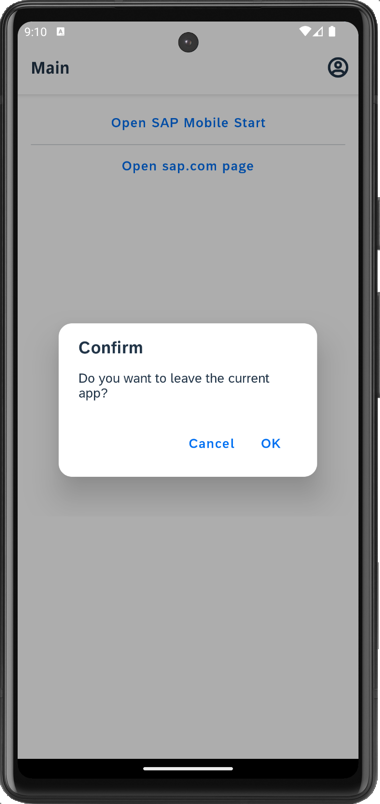
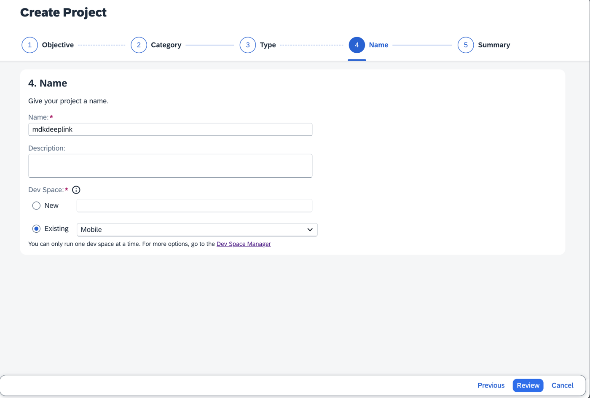
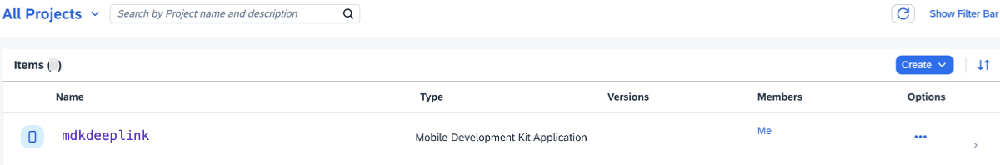
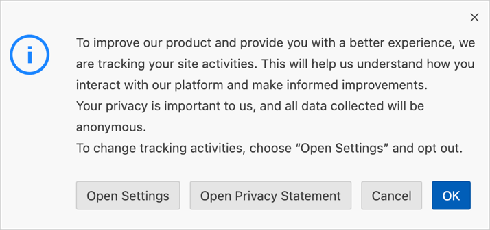
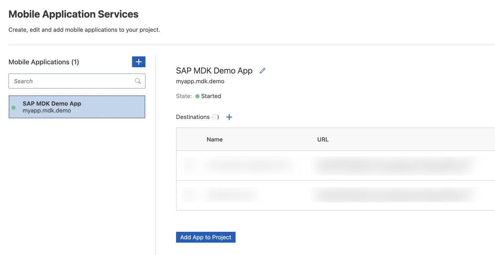
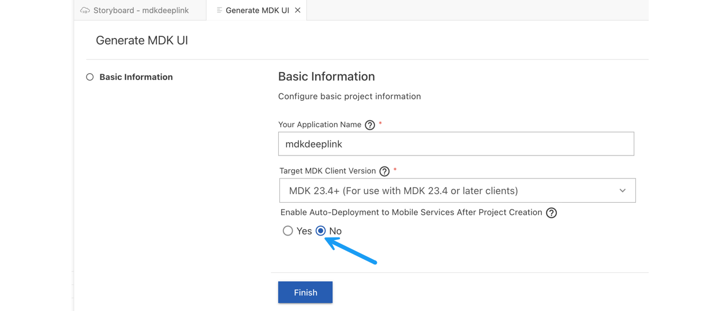
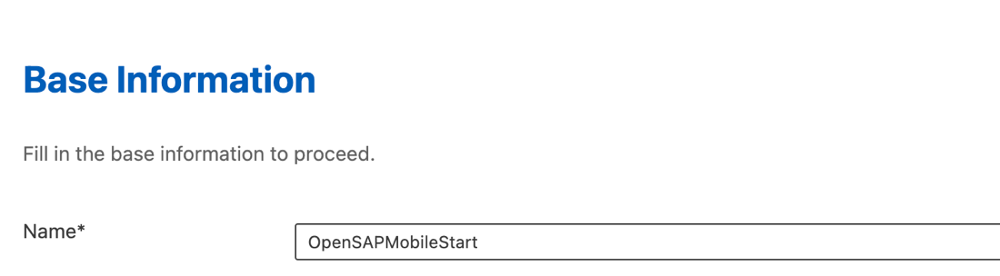
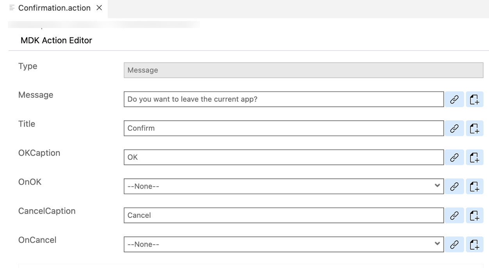
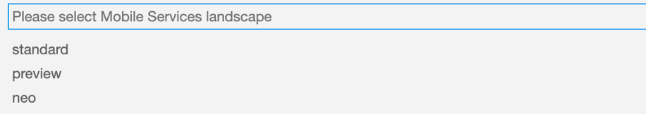
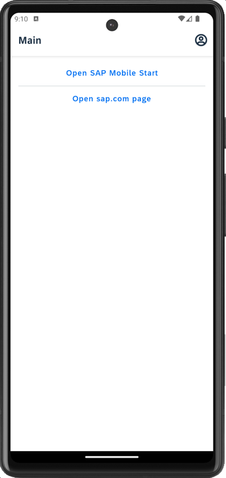

# Implement Deep Linking to Another App from an MDK App
<!-- description --> Use the Mobile Development Kit client to call a deep link into another application. With this feature, you can launch the target app and perform actions specific to the called application or open a web page in the device browser.


## Prerequisites
- **Tutorial group:** [Set Up for the Mobile Development Kit (MDK)](https://developers.sap.com/group.mobile-dev-kit-setup.html)
- **Install SAP Mobile Services Client** on your [Android](https://play.google.com/store/apps/details?id=com.sap.mobileservices.client) device or [iOS](https://apps.apple.com/us/app/sap-mobile-services-client/id1413653544)
<table><tr><td align="center"><!-- border --><br>Android</td><td align="center"><br>iOS</td></tr></table>
(If you are connecting to `AliCloud` accounts, you will need to brand your [custom MDK client](https://developers.sap.com/tutorials/cp-mobile-dev-kit-build-client.html) by allowing custom domains.)
- **Install SAP Mobile Start Application**
   <table><tr><td align="center"><!-- border --><br>Android</td><td align="center"><br>iOS</td></tr></table>

## You will learn
  - How to open SAP standard app like Mobile Start from the MDK public store client
  - How to open a web page

## Intro
You may clone an existing metadata project from the [MDK Tutorial GitHub repository](https://github.com/SAP-samples/cloud-mdk-tutorial-samples/tree/main/4-Level-Up-with-the-Mobile-Development-Kit/3-Implement-Deep-Linking-to-Another-App-from-an-MDK-App) and start directly with step 4 in this tutorial.

---

Deep links are used to send users directly to an app instead of a website or a store saving users the time and energy locating a particular page themselves – significantly improving the user experience.

If an app is already installed, you can specify a custom URL scheme or an intent URL that opens that app. Using deep link, you can also navigate to specific events or pages, which could tie into campaigns that you may want to run.



>**This tutorial has been executed using public store MDK client which has out of the box functionality to open the SAP standard apps like SAP Mobile Start.
If you are building a custom version of Mobile development kit client, there you can implement deep links by specifying related custom URL schemes.**

### Create a New Project Using SAP Build Code

This step includes creating a mobile project in SAP Build Lobby. 

1. In the SAP Build Lobby, click **Create** to start the creation process.

    <!-- border -->

2. Click the **Build an Application** tile.    

    <!-- border -->

3. Click the **SAP Build Code** tile to develop your project in SAP Business Application Studio, the SAP Build Code development environment, leveraging the capabilities of the services included in SAP Build Code.

    <!-- border -->

4. Click the **Mobile Application** tile. 

    <!-- border -->

5. Enter the project name `MDKDeepLink` (used for this tutorial) , add a description (optional), and click **Create**. 

    <!-- border -->
    
    >SAP Build Code recommends the dev space it deems most suitable, and it will automatically create a new one for you if you don't already have one. If you have other dev spaces of the Mobile Application type, you can select between them. If you want to create a different dev space, go to the Dev Space Manager. See [Working in the Dev Space Manager](https://help.sap.com/docs/build_code/d0d8f5bfc3d640478854e6f4e7c7584a/ad40d52d0bea4d79baaf9626509caf33.html).

6. Your project is being created in the Project table of the lobby. The creation of the project may take a few moments.

    <!-- border -->

7. After you see a message stating that the project has been created successfully, click the project to open it. The project opens in SAP Business Application Studio, the SAP Build Code development environment.

    <!-- border -->  

    >When you open the SAP Business Application Studio for the first time, a consent window may appear asking for permission to track your usage. Please review and provide your consent accordingly before proceeding.
    > 

### Configure the Project Using Storyboard

The Storyboard provides a graphical view of the application's runtime resources, external resources, UI of the application, and the connections between them. This allows for a quick understanding of the application's structure and components.

- **Runtime Resources**: In the Runtime Resources section, you can see the mobile services application and mobile destination used in the project, with a dotted-line connected to the External Resources.
- **External Resources**: In the External Resources section, you can see the external services used in the project, with a dotted-line connection to the Runtime Resource or the UI app.
- **UI Application**: In the UI Applications section, you can see the mobile applications.

1. Click on **+** button in the **Runtime Resources** column to add a mobile services app to your project. 

    <!-- border --> 

    >This screen will only show up when your CF login session has expired. Use either `Credentials` OR  `SSO Passcode` option for authentication. After successful signed in to Cloud Foundry, select your Cloud Foundry Organization and Space where you have set up the initial configuration for your MDK app and click Apply.

    > 

2. Choose `myapp.mdk.demo` from the applications list in the **Mobile Application Services** editor and click **Add App to Project**. You do not require to add a destination for this tutorial.

    <!-- border -->  

    >You can access the mobile services admin UI by clicking on the Mobile Services option on the right hand side.

    In the storyboard window, the app will be added under the Runtime Resources column.

    <!-- border -->      

4. Click the **+** button in the UI application column header to add mobile UI for your project.

    <!-- border -->     

5. In the **Basic Information** step, leave the default values as they are, and click **Finish**.

    <!-- border -->  

7. After clicking **Finish**, the storyboard is updated displaying the UI component. The MDK project is generated in the project explorer based on your selections.
 
    <!-- border --> 

### Add buttons on main page to open other apps or web pages

1. On the `Main.page`, drag and drop the **Button Table** Static Container control onto the Page.

    <!-- border -->

    >The controls available in Container section includes controls that act as containers for other controls, such as container items. A container is constant for all pages. The size of a container depends on the controls and contents included inside.  
    You can find more details about [Containers](https://help.sap.com/doc/69c2ce3e50454264acf9cafe6c6e442c/Latest/en-US/docs-en/reference/schemadoc/Page/SectionedTable/Container/ButtonTable.schema.html).


2. Now, you will add items to this Container control.

    Drag and drop the **Button** Static Item control onto the page.

    <!-- border -->

3. Repeat the above step, and drag and drop one more such **Button** Static Item control.

    <!-- border -->

4. Select the first control, remove the default value for the Image property and update its title to **Open SAP Mobile Start**.

    <!-- border -->

5. Repeat the same for the second button and update its title to **Open sap.com page**:

    <!-- border -->

### Set onPress handler to the buttons

1. In this step, you will bind a rule to the `OnPress` event of each button.

    In `Main.page`, select **Open SAP Mobile Start** button. In the Properties pane, click the **Events** tab, click the 3 dots icon for the `OnPress Handler` property and select `Create a rule/action` to create a new rule.

    <!-- border -->

2. Choose the **Rule** in *Object Type*, keep the default path for the *Folders* and click **OK**.

    <!-- border -->


3. In the **Base Information** step, enter the Rule **Name** as `OpenSAPMobileStart`, click **Finish**.

    <!-- border -->

    Replace the generated snippet with below code.

    ```JavaScript
    /**
    * Describe this function...
    * @param {IClientAPI} context
    */
    export default function OpenSAPMobileStart(context) {
        // Get the Nativescript Utils Module
        const utilsModule = context.nativescript.utilsModule;
        // Get the Nativescript Platform Module
        const platformModule = context.nativescript.platformModule;
        return context.executeAction('/mdkdeeplink/Actions/Confirmation.action').then((result) => {
            if (result.data) {
                //This will open SAP Mobile Start app
                if (platformModule.isIOS) {
                    return utilsModule.openUrl("com.sap.mobile.start://");
                } else if (platformModule.isAndroid) {
                    return utilsModule.openUrl("com.sap.mobile.apps.sapstart://");
                }
            } else {
                return Promise.reject('User Deferred');
            }
        });
    }
    ```

    >You will see an error complaining about cannot find file reference. This is due to the action file has not created yet. You will create it in next step.
    
    >`openUrl` is a `NativeScript` API to open an URL on device. You can find more details about [this API](https://v7.docs.nativescript.org/core-concepts/utils#openurl-function).

5. In the generated `OpenSAPMobileStart.js` rule, click on the red line. You will notice a yellow bulb icon suggesting some fixes, click on it and then select `MDK: Create action for this reference`, and click `Message Action`.

    <!-- border -->

6. Provide the below information:

    | Property | Value |
    |----|----|
    | `Message` | `Do you want to leave the current app?` |
    | `Title` | `Confirm` |
    | `OKCaption` | `OK` |
    | `OnOK` | `--None--` |
    | `CancelCaption` | `Cancel` |
    | `OnCancel` | `--None--` |    

    <!-- border -->    

7. Repeat the same for the **Open sap.com page** button, create a new rule `OpenSAPcom` binding it's `OnPress Handler` event. Replace the generated snippet with below code.

    ```JavaScript
    /**
     * Describe this function...
    * @param {IClientAPI} context
    */
    export default function OpenSAPcom(context) {
        // Get the Nativescript Utils Module
        const utilsModule = context.nativescript.utilsModule;
        return context.executeAction('/mdkdeeplink/Actions/Confirmation.action').then((result) => {
            if (result.data) {
                //This will open SAP.com website
                return utilsModule.openUrl("https://www.sap.com");
            } else {
                return Promise.reject('User Deferred');
            }
        });
    }
    ```

### Deploy the application

So far, you have learned how to build an MDK application in the SAP Business Application Studio editor. Now, you will deploy the application definitions to Mobile Services to use in the Mobile client.

1. Right-click `Application.app` and select **MDK: Deploy**.

    <!-- border -->

2. Select deploy target as **Mobile Services**.

    <!-- border -->

3. Select **Mobile Services Landscape**.

    <!-- border -->    

5. If you want to enable source for debugging the deployed bundle, then choose **Yes**.

    <!-- border -->    

    You should see **Deploy to Mobile Services successfully!** message.

    <!-- border -->


### Display the QR code for onboarding the Mobile app


SAP Business Application Studio has a feature to display the QR code for onboarding in the Mobile client. Click on `Application.app` to open it in MDK Application Editor, and then click the **Application QR Code** icon.

<!-- border -->

The On-boarding QR code is now displayed.

<!-- border -->


>Leave the Onboarding dialog box open for the next step.


### Run the app


>Ensure that you choose the correct device platform tab above. Once you have scanned and onboarded using the onboarding URL, it will be remembered. If you log out and onboard again, you will be prompted to either continue using the current application or scan a new QR code.

[OPTION BEGIN [Android]]

1. Follow [these steps](https://github.com/SAP-samples/cloud-mdk-tutorial-samples/blob/main/Onboarding-Android-client/Onboarding-Android-client.md) to successfully on-board the MDK client on your Android device.

    After you accept app update, you will see the **Main** page with the buttons you added in previous step 3.

    

2. Tap **Open SAP Mobile Start** and then tap **OK**.

    

    If you have already installed SAP Mobile Start app, then MDK app will open it.

    

3. Tapping on **Open SAP.com page** will open SAP website.

    

[OPTION END]

[OPTION BEGIN [iOS]]

1. Follow [these steps](https://github.com/SAP-samples/cloud-mdk-tutorial-samples/blob/main/Onboarding-iOS-client/Onboarding-iOS-client.md) to successfully on-board the MDK client on your iOS device.

    After you accept app update, you will see the **Main** page with the buttons you added in previous step 3.

    

2. Tap **Open SAP Mobile Start** and then tap **OK**.

    
    

    If you already installed SAP Mobile Start app, then MDK app will open it.

    <!-- border -->

3. Tapping on **Open sap.com page** will open SAP website.

    <!-- border -->

    >To run this app in your branded client, you need to add SAP Mobile Start app URL schemes (`com.sap.mobile.start`)  in the info.plist.   

[OPTION END]

---
