# Implement Deep Linking into an MDK Application
<!-- description --> Set up the Mobile Development Kit client to accept deep links through URL schemes and HTTP URLs (iOS Universal Links and Android App Links). With this feature, your MDK app can be launched to perform actions like navigating to a page, filter a list based on a parameter, or approving a request from external sources (web page, email, or another app).

## Prerequisites
- **Tutorial**: [Set Up for the Mobile Development Kit (MDK)](https://developers.sap.com/group.mobile-dev-kit-setup.html)
- **Download the latest version of Mobile Development Kit SDK** either from the SAP community [trial download](https://developers.sap.com/trials-downloads.html?search=Mobile+Development+Kit) or [SAP Software Center](https://me.sap.com/softwarecenter) if you are a SAP Mobile Services customer. This is required you to build a branded client.


## You will learn
  - How to handle deep link into MDK application
  - How to use application `OnLinkDataReceived` event
  - How to configure application links on SAP Mobile Services


## Intro
You may clone an existing metadata project from the [MDK Tutorial GitHub repository](https://github.com/SAP-samples/cloud-mdk-tutorial-samples/tree/main/5-Brand-Your-Customized-App-with-Mobile-Development-Kit-SDK/2-Implement-Deep-Linking-into-an-MDK-Application) and start directly with step 3 in this tutorial.

---

MDK supports deep linking into MDK applications using MDK client URL scheme and HTTP URLs via iOS Universal Links and Android App Links. [iOS universal links](https://developer.apple.com/library/archive/documentation/General/Conceptual/AppSearch/UniversalLinks.html) and [Android App Links](https://developer.android.com/training/app-links#android-app-links) are the HTTP URLs that bring the user directly to specific content in your MDK application.


### Create a New Project Using SAP Build Code

This step includes creating a mobile project in SAP Build Lobby. 

1. In the SAP Build Lobby, click **Create** > **Create** to start the creation process.

    <!-- border -->

2. Click the **Build an Application** tile.    

    <!-- border -->

3. Click the **SAP Build Code** tile to develop your project in SAP Business Application Studio, the SAP Build Code development environment, leveraging the capabilities of the services included in SAP Build Code.

    <!-- border -->

4. Click the **Mobile Application** tile. 

    <!-- border -->


5. Enter the project name `deeplinkintomdkapp` (used for this tutorial) , add a description (optional), and click **Create**. 

    <!-- border -->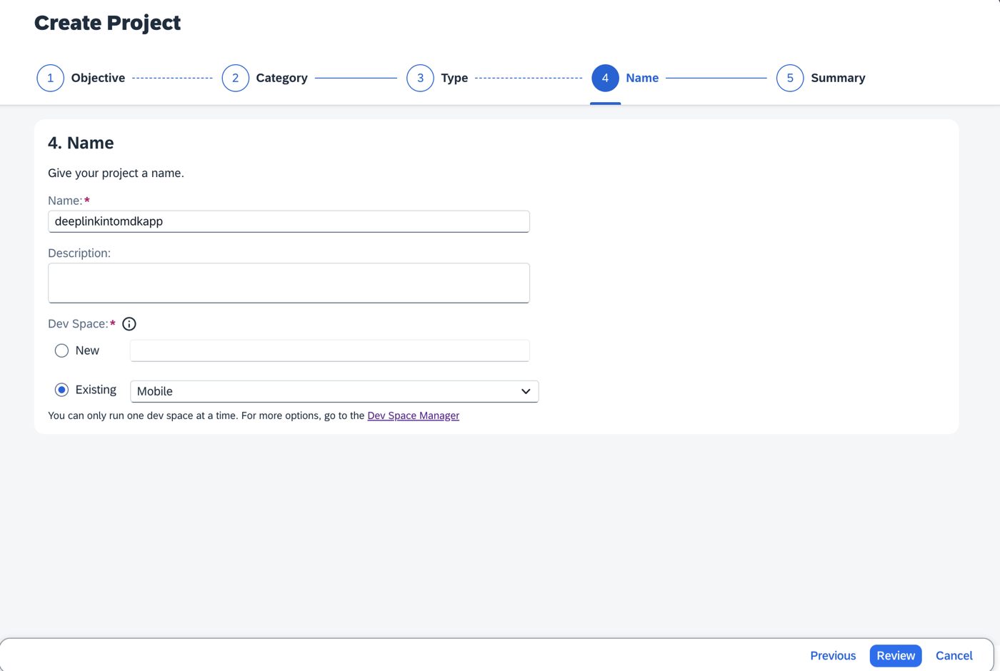
    
    >SAP Build Code recommends the dev space it deems most suitable, and it will automatically create a new one for you if you don't already have one. If you have other dev spaces of the Mobile Application type, you can select between them. If you want to create a different dev space, go to the Dev Space Manager. See [Working in the Dev Space Manager](https://help.sap.com/docs/build_code/d0d8f5bfc3d640478854e6f4e7c7584a/ad40d52d0bea4d79baaf9626509caf33.html).

6. Your project is being created in the Project table of the lobby. The creation of the project may take a few moments. After the project has been created successfully, click the project to open it. 

    <!-- border -->
    
7. The project opens in SAP Business Application Studio, the SAP Build Code development environment.

    <!-- border -->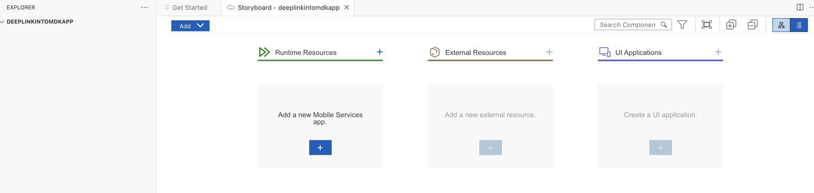  

    >When you open the SAP Business Application Studio for the first time, a consent window may appear asking for permission to track your usage. Please review and provide your consent accordingly before proceeding.
    > 

### Configure the Project Using Storyboard

The Storyboard provides a graphical view of the application's runtime resources, external resources, UI of the application, and the connections between them. This allows for a quick understanding of the application's structure and components.

- **Runtime Resources**: In the Runtime Resources section, you can see the mobile services application and mobile destination used in the project, with a dotted-line connected to the External Resources.
- **External Resources**: In the External Resources section, you can see the external services used in the project, with a dotted-line connection to the Runtime Resource or the UI app.
- **UI Application**: In the UI Applications section, you can see the mobile applications.

1. Click on **+** button in the **Runtime Resources** column to add a mobile services app to your project. 

    <!-- border --> 

    >This screen will only show up when your CF login session has expired. Use either `Credentials` OR  `SSO Passcode` option for authentication. After successful signed in to Cloud Foundry, select your Cloud Foundry Organization and Space where you have set up the initial configuration for your MDK app and click Apply.

    > 

2. Choose `myapp.mdk.demo` from the applications list in the **Mobile Application Services** editor.

    <!-- border -->  

3. Select `com.sap.edm.sampleservice.v4` from the destinations list and click **Add App to Project**.

    <!-- border -->  

    >You can access the mobile services admin UI by clicking on the Mobile Services option on the right hand side.

    In the storyboard window, the app and mobile destination will be added under the Runtime Resources column. The mobile destination will also be added under the External Resources with a dotted-line connection to the Runtime Resource. The External Resource will be used to create the UI application.

    <!-- border -->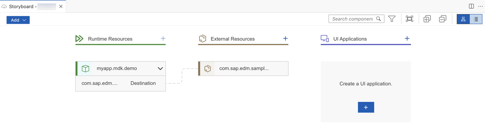      

4. Click the **+** button in the UI application column header to add mobile UI for your project.

    <!-- border -->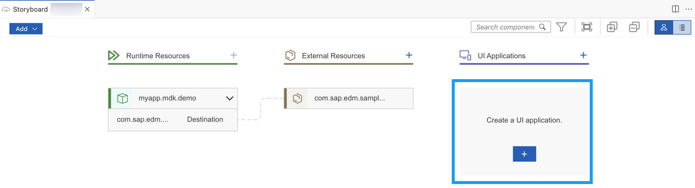     

5. In the **Basic Information** step, leave the default values as they are, and click **Next**.

    <!-- border -->  

    >The `Base` template creates the offline or online actions, rules, messages and an empty page (`Main.page`). After using this template, you can focus on creating your pages, other actions, and rules needed for your application. More details on _MDK template_ is available in [help documentation](https://help.sap.com/doc/f53c64b93e5140918d676b927a3cd65b/Cloud/en-US/docs-en/guides/getting-started/mdk/bas.html#creating-a-new-project-cloud-foundry).

6. In the **Data Collections** step, provide the below information and click **Finish**. Data Collections step retrieves the entity sets information for the selected destination.

    | Field | Value |
    |----|----|
    | `Enter a path to service (e.g. /sap/opu/odata/sap/SERVICE_NAME)` | Leave it as it is  |
    | `Select the Service Type` | Leave the default value as `OData` |
    | `Enable Offline` | It's enabled by default |
    | `Select all data collections` | Leave it as it is |
    | `What types of data will your application contain?` | Select `Customers` and `Products` |
    
    <!-- border -->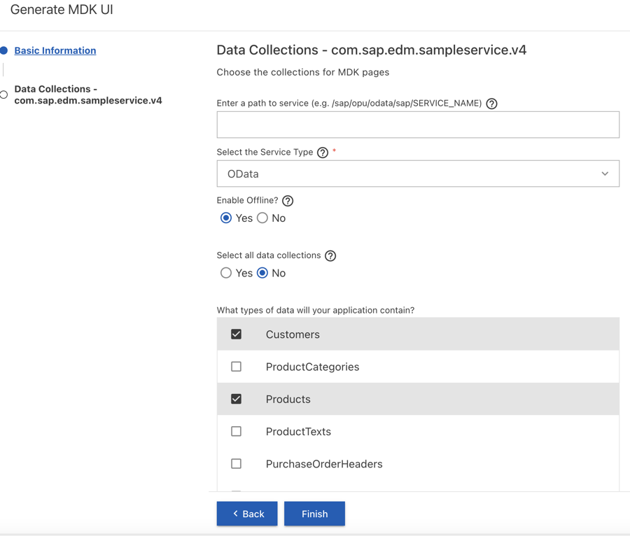 

    Regardless of whether you are creating an online or offline application, this step is needed for app to connect to an OData service. When building an MDK Mobile application, it assumes the OData service created and the destination that points to this service is set up in Mobile Services. For MDK Web application, destination is set up in SAP BTP admin UI.

    >Since you have Enable Offline set to *Yes*, the generated application will be offline enabled in the MDK Mobile client and will run as online in Web environment.

    >Data Collections step retrieves the entity sets information for the selected destination.

7. After clicking **Finish**, the storyboard is updated displaying the UI component. The MDK project is generated in the project explorer based on your selections.
 
    <!-- border -->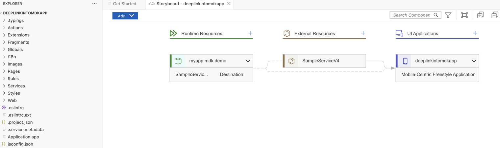 

### Add logic to handle deep linking

MDK provides an `OnLinkDataReceived` event in the `Application.app` that is called when the MDK app is launched from an external link. The data can be accessed via  [`context.getAppEventData()`](https://help.sap.com/doc/69c2ce3e50454264acf9cafe6c6e442c/Latest/en-US/docs-en/reference/apidoc/interfaces/icontrolcontainerproxy.html#getappeventdata).

1. Click the **Application.app** to open it in MDK Application Editor and then and select the `Create a rule/action` for the `OnLinkDataReceived` event.

    <!-- border -->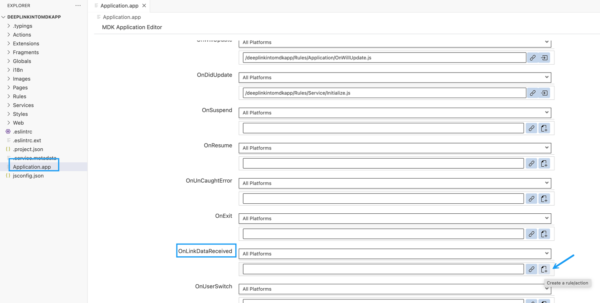

2. Select the *Object Type* as Rule and keep the default *Folders* path.

    <!-- border -->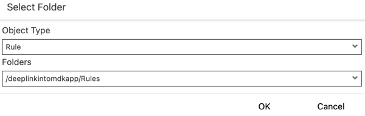

3. In the **Basic Information** step, enter the Rule name as `LinkDataReceived` and click **Finish** to complete the rule creation process.

    <!-- border -->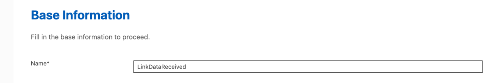  

4. Replace the generated code with below snippet.

    ```JavaScript
    /**
    * Describe this function...
    * @param {IClientAPI} context
    */

    export default function LinkDataReceived(context) {
        context.getLogger().log(`Link Data Received Triggered`,'Info');
        let linkData = context.getAppEventData();
        let data;

        try {
            data = JSON.parse(linkData);
        } catch (error) {
            return null;
        }

        let splitURL = data.URL.split('/');
        let action = splitURL[3];
        let entity = splitURL.length > 4 ? splitURL[4] : '';

        switch (action) {
            case 'search':
                if (entity === 'product') {
                    return openProductListWithFilter(context, data.Parameters);
                }
                break;
            case 'product':
                if (data.Parameters && data.Parameters.id) {
                    return openProductByID(context, data.Parameters.id);
                }
                break;
            default:
                context.getLogger().log(`Unrecognized Link Path ${data.URL}`,'Error');
                break;
        }
    }

    function openProductByID(context, id) {
        context.getLogger().log(`ID: ${id}`,'Debug');
        return context.read('/deeplinkintomdkapp/Services/com_sap_edm_sampleservice_v4.service', `Products(${id})`, [], null).then(function (result) {
            if (result.length) {
                context.getPageProxy().setActionBinding(result.getItem(0));
                return context.getPageProxy().executeAction('/deeplinkintomdkapp/Actions/com_sap_edm_sampleservice_v4/Products/NavToProducts_Detail.action');
            }
        });
    }

    function openProductListWithFilter(context, parametersObj) {
        let pageData = context.getPageProxy().getPageDefinition('/deeplinkintomdkapp/Pages/com_sap_edm_sampleservice_v4_Products/Products_List.page');
        var filterQO = '$filter=';
        for (var key in parametersObj) {
            var value = parametersObj[key];
            filterQO += `${key} eq '${value}' and `;
        }
        if (filterQO.slice(-5) === ' and ') {
            filterQO = filterQO.slice(0, filterQO.length - 5);
        }
        context.getLogger().log(`${filterQO}`,'Debug');
        pageData.Controls[0].Sections[0].Target.QueryOptions = filterQO;
        return context.getPageProxy().executeAction({
            "Name": '/deeplinkintomdkapp/Actions/com_sap_edm_sampleservice_v4/Products/NavToProducts_List.action',
            "Properties": {
                "PageMetadata": pageData
            }
        });
    }
    ```

### Deploy the Project

Now that the MDK application is configured to act when a request from external source is received, you will Deploy the Project definitions to Mobile Services to use in the Mobile client.

1. Right-click `Application.app` and select **MDK: Deploy**.

    <!-- border -->

2. Select deploy target as **Mobile Services**.

    <!-- border -->

    If you want to enable source for debugging the deployed bundle, then choose **Yes**.

    <!-- border -->

    You should see **Deploy to Mobile Services successfully!** message.

    <!-- border -->


### Configure Application Links in SAP Mobile Services


[OPTION BEGIN [Android]]

1. Open SAP Mobile Services UI, click **Mobile Applications** **&rarr;** **Native/MDK** **&rarr;** click `myapp.mdk.demo` app.

    <!-- border -->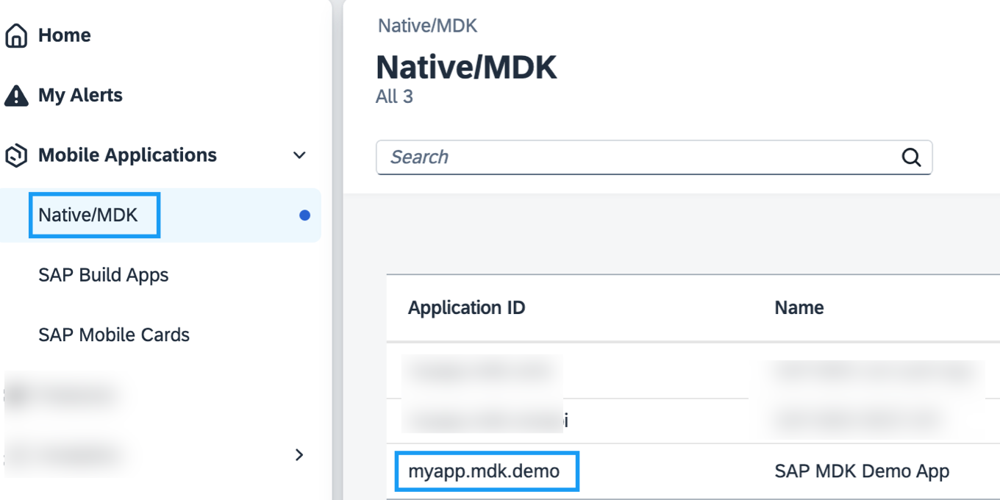

2. Click the **APIs** tab. Copy the **Server** URL and paste it in any text editor on your machine. You will need this information later.

    <!-- border -->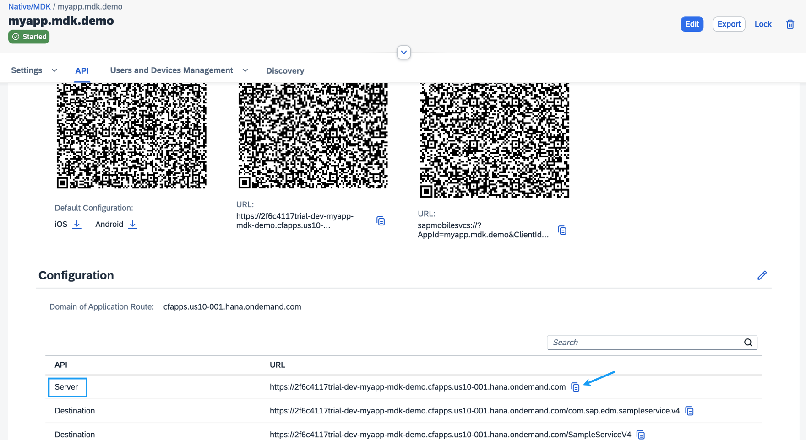

3. Switch to Android Studio and create a new project using the Empty Activity template.

4. Once the project is opened in the Android Studio, select **Tools** **&rarr;** **App Links Assistant** in the menu bar.

    <!-- border -->

    >If you do not see **App Links Assistant** steps, you may need to click the `Create Applink` button.

8. Click **Open Digital Asset Links File Generator** in the App Links Assistant window.

    <!-- border -->

9. Provide the below information and click **Generate Digital Asset Links file**.

    | Property | Value |
    |----|----|
    | `Site Domain`| `<Server URL>` from the step 4.2 |
    | `Application ID` | Provide a unique name. Make sure to use the same value for `BundleID` in `MDKProject.json` when you create your `.mdkproject` in step 5.1  |

    <!-- border -->

    >For productive apps, you must select the keystore with the certificate that will be used to sign the `.apk` file.
    
10. Copy the text under the **Preview** section.

    <!-- border -->

11. Switch to the SAP Mobile Services UI, navigate to the **Application Links** tab and click on the pencil next to the **Android Universal Links** section.

    <!-- border -->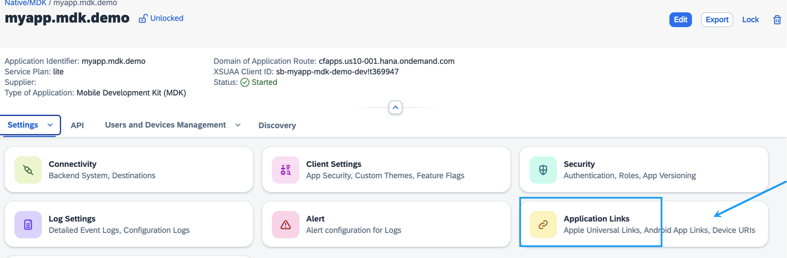

13. Provide the below information and click **OK**.

    | Property | Value |
    |----|----|
    | `Enabled`| Checked |
    | `Association File Content` | Paste the text copied from the preview section  |

    <!-- border -->

    >If you see a confirmation window, click **OK**.

[OPTION END]

[OPTION BEGIN [iOS]]

1. Open SAP Mobile Services Cockpit, click **Mobile Applications** **&rarr;** **Native/MDK** **&rarr;** click `myapp.mdk.demo` app.

    <!-- border -->

2. Click **Application Links** tab and click on the pencil next to the **Apple Universal Links** section.

    <!-- border -->

3. Provide the below information:

    | Property | Value |
    |----|----|
    | `Enabled`| Checked |
    | `Team ID` | `<your_team_id>` You can find this information on the [Apple Developer website](https://developer.apple.com/help/account/manage-your-team/locate-your-team-id). |
    | `Bundle ID` | Provide a unique name. Make sure to use the same value for `BundleID` in `MDKProject.json` when you create your `.mdkproject` in step 5.1 |

    <!-- border -->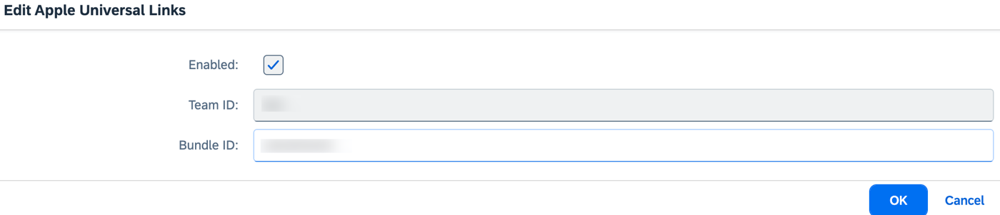

[OPTION END]


### Create Your Branded MDK Client

1.  Follow steps 1 to 3 from [this tutorial](https://developers.sap.com/tutorials/cp-mobile-dev-kit-build-client.html) and make sure to use the same bundle ID in `MDKProject.json` as you provided for Apple Universal Links settings in Mobile Services and also for Application ID in Android Studio while generating Digital Asset Links file.

2. Add highlighted files under `DemoSampleApp.mdkproject`.

            DemoSampleApp.mdkproject
            ├── App_Resources_Merge
               ├── Android
               │   └── src
               │       └── main
               │           └── AndroidManifest.xml
               └── iOS
                   ├── app.entitlements
                   └── build.xcconfig


      <!-- border -->

    >Files specified in the `.mdkproject/App_Resources_Merge` folder override a part of the files in `<generated-project>/app/App_Resources`. You can find more details about it in [help documentation](https://help.sap.com/doc/f53c64b93e5140918d676b927a3cd65b/Cloud/en-US/docs-en/guides/getting-started/mdk/custom-client/app-resources-merge.html).

3. Provide below information in the `AndroidManifest.xml` file. Make sure to provide Server URL from the step 4.2 and save the changes.

    ```XML
    <?xml version="1.0" encoding="utf-8"?>
    <manifest xmlns:android="http://schemas.android.com/apk/res/android"
        xmlns:tools="http://schemas.android.com/tools">
        <application>
            <activity android:name="sap.mdkclient.MDKAndroidActivity">
                <intent-filter android:autoVerify="true">
                    <action android:name="android.intent.action.VIEW" />
                    <category android:name="android.intent.category.DEFAULT" />
                    <category android:name="android.intent.category.BROWSABLE" />
                    <data android:scheme="https" />
                    <data android:host="<enter Server URL without https:// from step 4.2>" />
                    <data android:pathPrefix="/mobileservices/deeplinks" />
                </intent-filter>
            </activity>
        </application>
    </manifest>
    ```

    >The intent files will map URLs from your website to activities to your MDK Client so the `OnLinkDataReceived` event can be triggered. See [here](https://developer.android.com/studio/write/app-link-indexing) for more information. 

4. Provide below information in the `app.entitlements` file. Make sure to provide Server URL from the step 4.2 and save the changes.

    ```XML
    <?xml version="1.0" encoding="UTF-8"?>
    <!DOCTYPE plist PUBLIC "-//Apple//DTD PLIST 1.0//EN" "http://www.apple.com/DTDs/PropertyList-1.0.dtd">
    <plist version="1.0">
    <dict>
        <key>aps-environment</key>
        <string>development</string>
        <key>com.apple.developer.associated-domains</key>
        <array>
            <string>applinks:<enter Server URL without https:// from the step 4.2></string>
        </array>
        <key>com.apple.security.app-sandbox</key>
        <true/>
        <key>com.apple.security.network.client</key>
        <true/>
    </dict>
    </plist>
    ```

5. Provide below information in the `build.xcconfig` file. Make sure to provide same Apple Team ID that you entered in Mobile Services Apple Universal Links configuration.

    ```XML
    // Specify the Team since Universal links are specific to the Team / Bundle ID configured in Mobile Services
    DEVELOPMENT_TEAM = <Your Team ID>
    ```

6. Create your MDK client either using MDK SDK by following the step 4 from [Build Your Mobile Development Kit Client Using MDK SDK](https://developers.sap.com/tutorials/cp-mobile-dev-kit-build-client.html) tutorial OR using SAP Cloud Build Service by following [Build Your Mobile Development Kit Client Using Cloud Build Service](https://developers.sap.com/tutorials/cp-mobile-dev-kit-cbs-client.html) tutorial.

### Run the MDK Client

>Make sure you are choosing the right device platform tab above.

[OPTION BEGIN [Android]]
1. In this step, you will run your branded MDK client on an Android emulator. Before trying to launch the client on Android emulator, make sure that you have already configured a virtual device (Android Studio>Virtual Device Manager). Otherwise, you may get an error like No emulator image available for device identifier. In terminal or command line window, navigate to the app name folder **`DemoSampleApp`** (in `MDClient_SDK` path) and use `tns run android --emulator` command to run the MDK client on the Android emulator.

    <!-- border -->

    >To run the MDK client on Android device, first attach your device to your machine. Then run `tns device android` command to print a list of attached devices. Copy the **Device Identifier** value for your device.
    <!-- border -->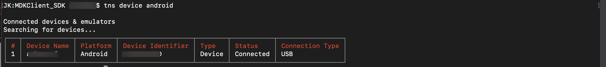
    Make sure **Developer option** and **USB debugging** option is enabled in android device. Then run `tns run android --device <device identifier>` command to launch the MDK client on your Android device.
    <!-- border -->

    Once, above command gets successfully executed, you will see new MDK client up and running in Android simulator.

2. Tap **Agree** on `End User License Agreement`.

    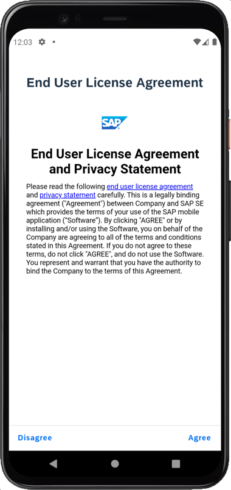

3. In Welcome screen, tap **Start** to connect MDK client to SAP Business Technology Platform (BTP).

    

4. Enter your BTP E-Mail, ID or Login Name to continue. 

    

5. Enter your password to login to SAP Business Technology Platform (BTP). If you see an Universal ID screen, enter your Universal ID password.

    

6. Choose a passcode with at least 8 characters for unlocking the app and tap **Next**.

    

7. Confirm the passcode and tap **Done**.

    

8. You have the option to enable Biometric Authentication for faster access to app data. Provide your biometric information. 

    

9. Tap **Next**. If you want your MDK client to send you notifications, tap **Allow**, otherwise, tap **Don't allow**. 

    
    
    
19. Tap **Now** to update the client with new MDK metadata. 

        

10. After you accept app update, you will see `Customers` and `Products` buttons on the Main page. You can navigate to list-detail page. 

    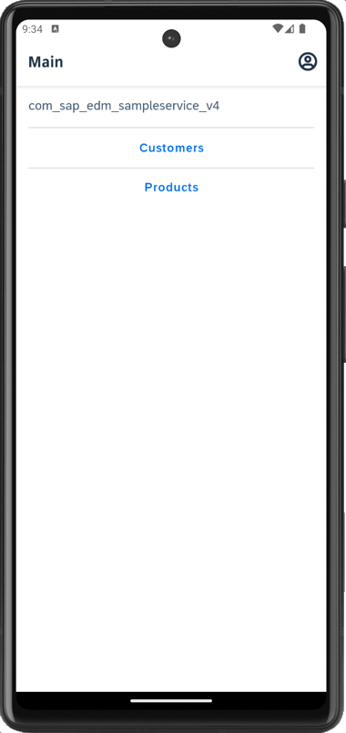   

[OPTION END]

[OPTION BEGIN [iOS]]

1. In this step, you will run your branded MDK client on an iOS simulator. In terminal window, navigate to the app name folder **`DemoSampleApp`** (in `MDClient_SDK` path) and use `tns run ios --emulator` command to run the MDK client on the iOS simulator.

    <!-- border -->

    >To run the MDK client on iOS device, first attach the device to your Mac. Then run `tns device ios` command to print a list of attached devices. Copy the **Device Identifier** value for your device.
    <!-- border -->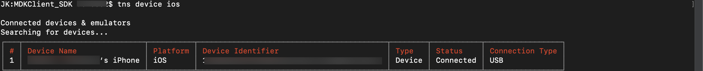
    Then run `tns run ios --device <device identifier>` command to launch the MDK client on your iOS device.
    <!-- border -->

    >You can also Run the Project in Xcode. Open the project in Xcode with the command `open platforms/ios/<app name>.xcworkspace`, or open the workspace using the `File -> Open...` dialog in Xcode. Configure the application's code signing settings, then Run the project for the target device.

    Once, above command gets successfully executed, you will see new MDK client up and running in iOS simulator.

2. Tap **Agree** on `End User License Agreement`.

    

3. Tap **Start** to connect MDK client to SAP Business Technology Platform (BTP).

    

4. Enter your BTP E-Mail, ID or Login Name to continue. 

    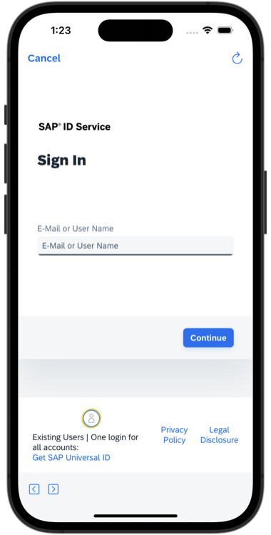

5. Enter your password to login to SAP Business Technology Platform (BTP). If you see an Universal ID screen, enter your Universal ID password.

    

6. Choose a passcode with at least 8 characters for unlocking the app and tap **Next**.

    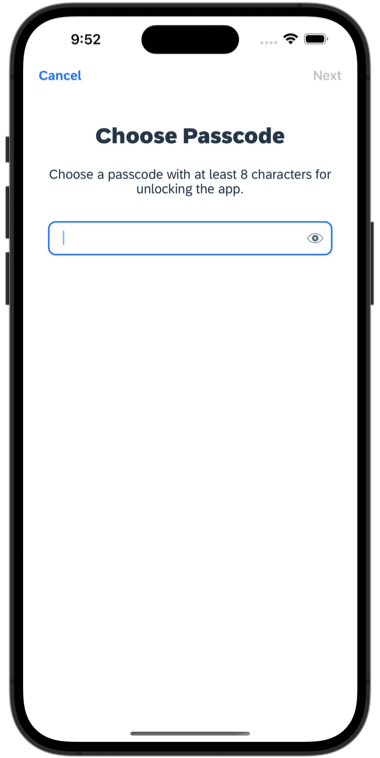

7. Confirm the passcode and tap **Done**.

    

    >Optionally, you can enable biometric authentication to get faster access to the app data.
    >

8. Tap **Now** to update the client with new MDK metadata. 

        

9. After you accept app update, you will see `Customers` and `Products` buttons on the Main page. You can navigate to list-detail page. 

    


[OPTION END]

### Test the Deep Links

>Make sure you are choosing the right device platform tab above.

In a real-world use case, you would click on a link from external sources such as webpage, email, or another app. This action will launch your MDK client and enable tasks such as navigating to a page, filtering a list based on a parameter, or approving a request. 

For this tutorial, to test the deep links, you will download an `index.html` on your local machine and place it in your device's file system. 

[OPTION BEGIN [Android]]

1. Download a zip file from [here](https://github.com/SAP-samples/cloud-mdk-tutorial-samples/raw/main/5-Brand-Your-Customized-App-with-Mobile-Development-Kit-SDK/2-Implement-Deep-Linking-into-an-MDK-Application/index.html.zip) on your local machine and unzip it on your machine.

2. Open the `index.html` in a text editor and update the values for `<Server URL>` and `<Enter a Product ID>`.

    <!-- border -->

    >**Server URL**: Open SAP Mobile Services UI, click **Mobile Applications** **&rarr;** **Native/MDK** **&rarr;** click `myapp.mdk.demo` app. Click the **APIs** tab. Copy the **Server** URL.

    >**Product ID**: In SAP Mobile Services UI, click the **APIs** tab **&rarr;** **Mobile Connectivity** **&rarr;** click on **Launch In Browser** icon for `com.sap.edm.sampleservice.v4` destination.
    ><!-- border -->
    >A new tab opens in the browser. Remove `?auth=uaa` and add `/Products` to view product list. Copy any `ProductId` and paste it in the `index.html`.
    ><!-- border -->

3. Save the changes. The `index.html` should look like below.

    <!-- border -->

4. Drag & Drop the `index.html` to **Files** app on your Android emulator. 

    

    >If you are running your client on your device, use Android File Transfer or any equivalent way to add the file in the device's file system.

5. Click on the file and open it in Chrome browser. Clicking on the

    * **Open Product Details via Application Link**: navigates to product details page via Android App Links
    * **Search for Product Mice via Application Link**: navigates to product list page, the list with Mice Category via Android App Links
    * **Open Product Details via URL Scheme**: navigates to product details page via your branded client's URL scheme
    * **Search for Product Mice via URL Scheme**: navigates to product list page, the list with Mice Category via your branded client's URL scheme

    

[OPTION END]

[OPTION BEGIN [iOS]]

1. Download a zip file from [here](https://github.com/SAP-samples/cloud-mdk-tutorial-samples/raw/main/5-Brand-Your-Customized-App-with-Mobile-Development-Kit-SDK/2-Implement-Deep-Linking-into-an-MDK-Application/index.html.zip) on your local machine and unzip it on your machine.

2. Open the `index.html` in a text editor and update values for `<Server URL>` and `<Enter a Product ID>`.

    <!-- border -->

    >**Server URL**: Open SAP Mobile Services UI, click **Mobile Applications** **&rarr;** **Native/MDK** **&rarr;** click `myapp.mdk.demo` app. Click the **APIs** tab. Copy the **Server** URL.
    >**Product ID**: In SAP Mobile Services UI, click the **APIs** tab **&rarr;** **Mobile Connectivity** **&rarr;** click on **Launch In Browser** icon for `com.sap.edm.sampleservice.v4` destination.
    ><!-- border -->
    >A new tab opens in the browser. Remove `?auth=uaa` and add `/Products` to view product list. Copy any `ProductId` and paste it in the `index.html`.
    ><!-- border -->

3. Save the changes. The `index.html` should look like below.

    <!-- border -->

4. Drag & Drop the `index.html` to **Files** app on your iOS emulator and save it.

    
        

    >If you are running your client on your device, either place the file via [Finder App &rarr; Files or use other ways to share](https://support.apple.com/en-us/HT210598).

5. File opens in a viewer, clicking on the

    * **Open Product Details via Application Link**: navigates to product details page via iOS Universal Links
    * **Search for Product Mice via Application Link**: navigates to product list page, the list with Mice Category via iOS Universal Links
    * **Open Product Details via URL Scheme**: navigates to product details page via your branded client's URL scheme
    * **Search for Product Mice via URL Scheme**: navigates to product list page, the list with Mice Category via your branded client's URL scheme

    

[OPTION END]

---
