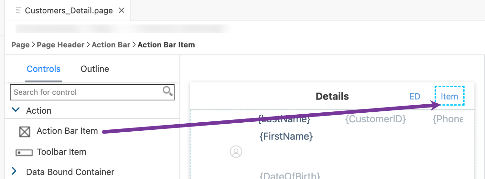
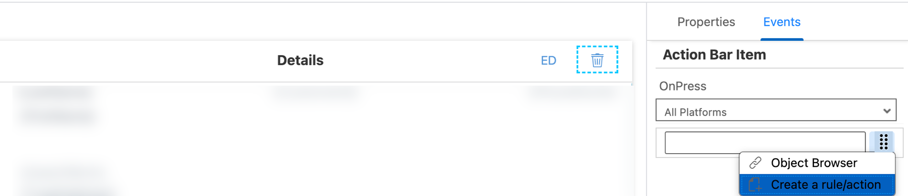
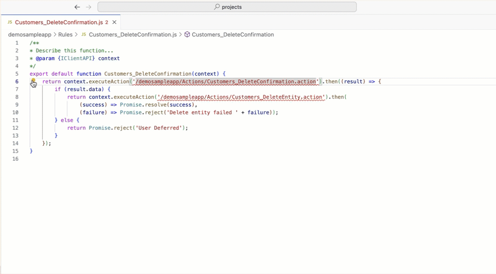
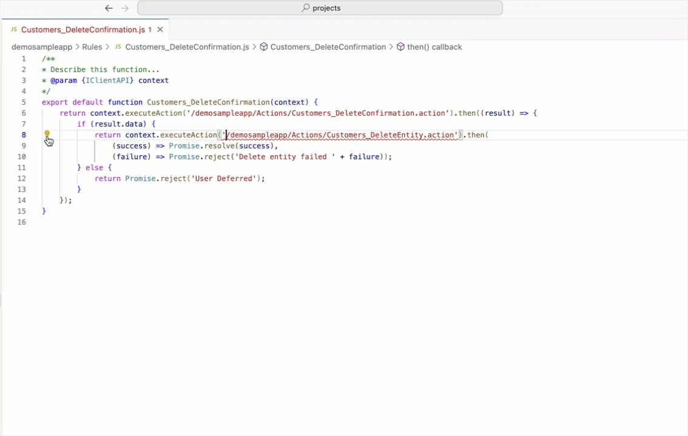
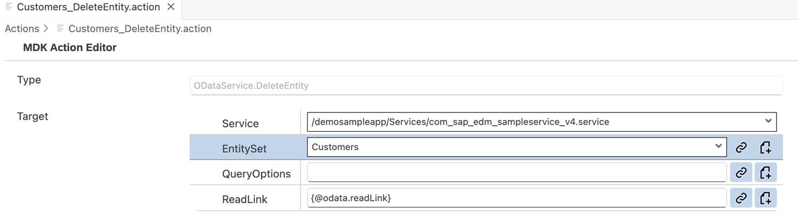
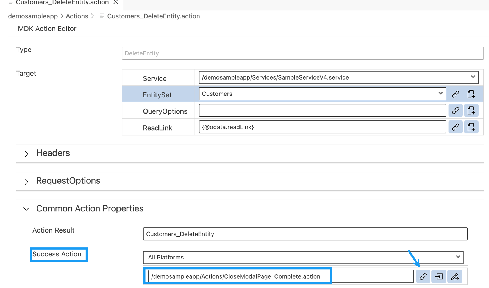
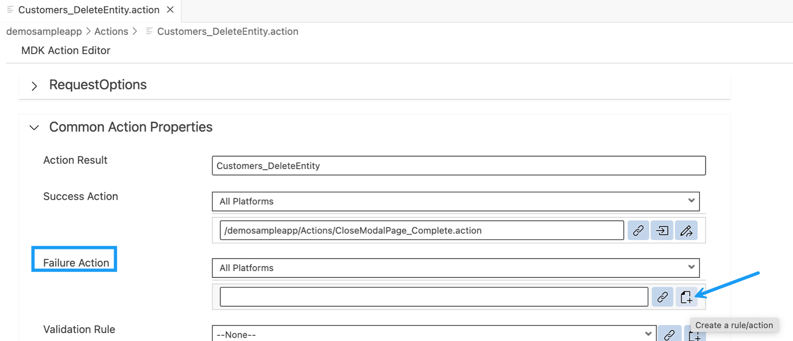
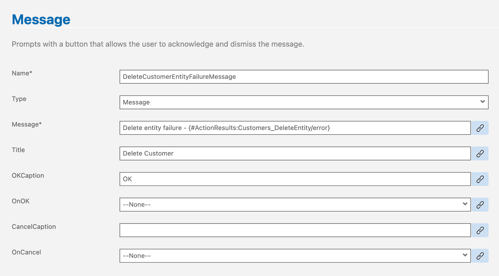
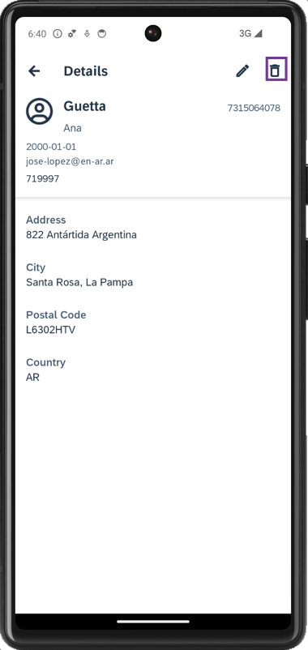
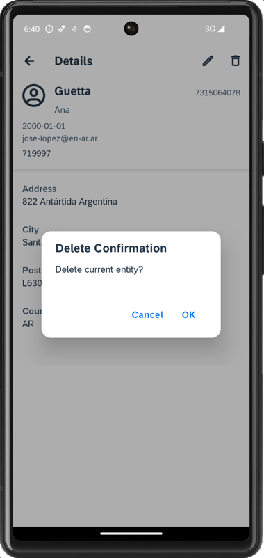

# Delete a Customer Record in an MDK App
<!-- description --> Allow the user to delete a customer record in an MDK app.

## You will learn
  - How to delete a customer record
  - How to store changes locally on Mobile app and sync these changes with backend
  - How to delete a record in web application

## Intro
You may clone an existing project from [GitHub repository](https://github.com/SAP-samples/cloud-mdk-tutorial-samples/tree/master/3-Enhance-Your-First-MDK-App-with-Additional-Functionalities/1-cp-mobile-dev-kit-create-customer) to start with this tutorial.

---


### Add a trash button to customer details page


You will add an action bar item to the Customer _Detail_ page called **Trash** and link it to an event.

1. In `Customers_Detail.page`, drag and drop an **Action Bar Item** to the upper right of the action bar.

    <!-- border -->

    >**Action Bar Item** is a button that users can use to fire actions when pressed. You can add an Action Bar Item only to the Action Bar (at the top of the page).

2. Click the **link icon** to open the object browser for the **System Item** property.

    Double click the **Trash** type and click **OK**.

    <!-- border -->

3. Navigate to the **Events** tab. Click the 3 dots icon for the `OnPress` property and select the `Create a rule/action`.

    <!-- border -->

4. Select the *Object Type* as Rule and keep the default *Folders* path.

    <!-- border -->     
 
     >You could link `OnPress` property directly to OData delete action directly instead to this JavaScript file. Idea of linking to  JavaScript file is to let you understand another way to achieve similar functionality.

5. Enter the Rule name `Customers_DeleteConfirmation`, click **Next** and then **Finish** on the confirmation step.

    Copy and paste the following code.

    ```JavaScript
    export default function DeleteConfirmation(context) {
        return context.executeAction('/DemoSampleApp/Actions/DeleteConfirmation.action').then((result) => {
            if (result.data) {
                return context.executeAction('/DemoSampleApp/Actions/Customers_DeleteEntity.action').then(
                    (success) => Promise.resolve(success),
                    (failure) => Promise.reject('Delete entity failed ' + failure));
            } else {
                return Promise.reject('User Deferred');
            }
        });
    }
    ```

    In above code there are references to `DeleteConfirmation.action` and `Customers_DeleteEntity.action` , which don't exist in your metadata project yet. You will create these actions in next steps.
    ><!-- border -->

6. Save the changes.

7. In the above rule, double-click on the red line highlighting missing reference for `DeleteConfirmation.action`. You will notice a bulb icon suggesting some fixes, click on it, select `MDK: Create action for this reference`, and click `Message Action`.

    <!-- border -->

8. Provide the below information in the `DeleteConfirmation.action`:

    | Field | Value |
    |----|----|
    | `Message` | `Delete current entity?` |
    | `Title` | `Delete Confirmation` |
    | `OKCaption` | `OK` |
    | `OnOK` | `--None--` |
    | `CancelCaption` | `Cancel` |
    | `OnCancel` | `--None--` |

    <!-- border -->
    
    When user taps or clicks the Trash icon on the Customer Detail page, a message will be displayed to confirm if user wants to delete current record. On it's confirmation, `Customers_DeleteEntity.action` is executed.

9. Similarly, fix the path reference for the missing `Customers_DeleteEntity.action`. Switch back to the `Customers_DeleteConfirmation.js` or open it again if it was closed. Double-click on the red line highlighting missing reference for `Customers_DeleteEntity.action`. You will notice a bulb icon suggesting some fixes, click on it, select `MDK: Create action for this reference`, and click `ODataService DeleteEntity Action`.

    <!-- border -->

10. Provide the below information in the `Customers_DeleteEntity.action`:

    | Property | Value |
    |----|----|
    | `Service`| Select `SampleServiceV2.service` from the dropdown |
    | `EntitySet` | Select `Customers` from the dropdown |
    | `ReadLink`| click link icon and double click `readLink` |

    <!-- border -->

    This action will store deleted record locally for an offline application or delete directly back to the backed for online applications.

    >The `readLink` is a direct reference to an individual entity set entry.

    >You can find more details about [Delete Entity Action](https://help.sap.com/doc/69c2ce3e50454264acf9cafe6c6e442c/Latest/en-US/docs-en/reference/schemadoc/Action/ODataService/DeleteEntity.schema.html).


### Define Success and Failure actions


When the above OData action is executed, you may want to display messages on its success and failure behavior. For example, on its success, you may want to display a success message and allow any execution to continue. On its failure, you may want to display an error.

1. In the `Customers_DeleteEntity.action`, scroll down and expand the *Common Action Properties* section. Click the link icon to open the object browser for the *Success Action* and bind it to `CloseModalPage_Complete.action`.

    <!-- border -->

2. Create a message action for displaying a message in case deleting of a customer fails. In the `Customers_DeleteEntity.action`, provide value as **delete** for the *Action Result* and click the `Create a rule/action` icon for the *Failure Action*.
    
    <!-- border -->
   
3. Keep the default selection for the *Object Type* as Action and *Folders* path.

    <!-- border -->   

4. Choose **MDK Message Actions** in **Category** | click **Message Action** | **Next**.

    <!-- border -->

    Provide the below information:

    | Property | Value |
    |----|----|
    | `Action Name`| `DeleteCustomerEntityFailureMessage` |
    | `Type` | Select `Message` from the dropdown |
    | `Message` | `Delete entity failure - {#ActionResults:delete/error}` |
    | `Title` | `Delete Customer` |
    | `OKCaption` | `OK` |
    | `OnOK` | `--None--` |
    | `CancelCaption` | leave it blank |
    | `OnCancel` | `--None--` |

    <!-- border -->

    >delete is the Action Result value of the `Customers_DeleteEntity.action`. This reference is used to pass the results to subsequent actions in the chain. These actions can reference the action result as needed. In this case if there is a failure, you access the error property of the action result to display the OData failure message.

    >This is the standard Binding Target Path (also called Dynamic Target Path) syntax used when you need to include a binding with other bindings or within a string as used in the message here.

    >You could exclude above expression and can just display a generic message.

5. Click **Next** and then **Finish** on the Confirmation step.

When `Customers_DeleteEntity.action` gets executed successfully then `CloseModalPage_Complete.action` will be triggered or if `Customers_DeleteEntity.action` fails then `DeleteCustomerEntityFailureMessage.action` will be triggered.   


### Deploy the application


Deploy the updated application to your MDK client.

1. Right-click `Application.app` and select **MDK: Deploy**.

    <!-- border -->

2. Select deploy target as **Mobile & Cloud**.

    <!-- border -->

    You should see success message for both deployments.

    <!-- border -->

    >Alternatively, you can select *MDK: Redeploy* in the command palette (View menu>Find Command OR press Command+Shift+p on Mac OR press Ctrl+Shift+P on Windows machine), it will perform the last deployment.

    ><!-- border -->


### Run the app


>Make sure you are choosing the right device platform tab above.

[OPTION BEGIN [Android]]

1. Tap **Update** on the Main page, you will see a _New Version Available_ pop-up, tap **Now**.

    

2. Tap **Customers** | tap any record | tap trash icon.

    

3. A confirmation dialog appears for user action, tap **OK**.

    

    Since this is an Offline application, record has been removed from local store and deletion request has been added to request queue. This has to be sent or uploaded to the backend explicitly.  

    >MDK base template has added a **Sync** button on main page of the app to upload local changes from device to the backend and to download the latest changes from backend to the device. Actions | Service | `UploadOffline.action` & `DownloadOffline.action`.

4. On Main page, tap **Sync**, a successful message will be shown.

    

[OPTION END]

[OPTION BEGIN [iOS]]

1. Tap **Update** on the Main page, you will see a _New Version Available_ pop-up, tap **Now**.

    

2. Tap **Customers** | tap any record | tap trash icon.

    

3. A confirmation dialog appears for user action, tap **OK**.

    

    Since this is an Offline application, record has been removed from local store and deletion request has been added to request queue. This has to be sent or uploaded to the backend explicitly.  

    >MDK base template has added a **Sync** button on main page of the app to upload local changes from device to the backend and to download the latest changes from backend to the device. Actions | Service | `UploadOffline.action` & `DownloadOffline.action`.

4. On Main page, tap **Sync**, a successful message will be shown. As Sync is pressed, `UploadOffline.action` gets triggered to upload local changes from device to the backend and on success of this call, `DownloadOffline.action` is being called.

    

[OPTION END]

[OPTION BEGIN [Web]]

1. Either click the highlighted button or refresh the web page to load the changes.

    <!-- border -->

    >If you see the error `404 Not Found: Requested route ('xxxxx-dev-nsdemosampleapp-approuter.cfapps.xxxx.hana.ondemand.com') does not exist.` while accessing the web application, make sure that in your space cockpit, highlight applications are in started state.

    ><!-- border -->

2. Click **Customers** | click any record | click **Trash**.

    <!-- border -->

3. A confirmation dialog appears for user action, click **OK**.

    <!-- border -->

[OPTION END]

You can cross verify if this record has been deleted in the backend.

>Backend URL can be found in [Mobile Services Cockpit](cp-mobile-dev-kit-ms-setup).

>**Mobile Applications** | **Native/MDK** | click the MDK App **com.sap.mdk.demo** | **Mobile Connectivity** | click **Launch in Browser** icon

><!-- border -->

>It will open the URL in a new tab, remove `?auth=uaa` and add `/Customers` at the end of the URL.


---
