# Create a Customer Detail Page in an MDK App
<!-- description --> Create a new page for displaying customer details in an MDK app.

## You will learn
  - How to create a new page and add some controls to display customer information
  - How to navigate from one page to another page

---

## Intro
To enhance your MDK app with customer details information, you need to carry out the following tasks:

*  Create a new customer details page
*  Add some controls to the page to display information like id, name, email, phone, address
*  Create a new navigation action to the customer details page
*  Navigate from customer list page to details page
*  Deploy the project to SAP Mobile Services
*  Update the app with new changes

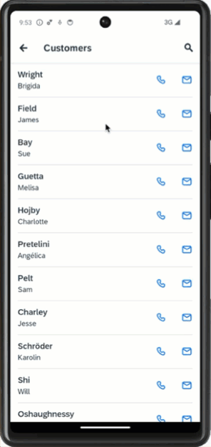

### Create the customer detail page

This page will show related details for a customer. In this page, you will add an **Object Header** control that is used to display information (like first name, last name, date of birth, email address & phone number) about the header of an object and **Static Key Value** control to display key value pair items like address, city, postal code & country.

1. In your MDK project, Right-click the **Pages** folder | **MDK: New Page** | **Section** | **Next**.

    <!-- border -->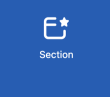

2. In the **Base Information** step, enter the Page Name `Customers_Detail` and click **Finish** to complete the page creation process.

    <!-- border -->

3. In the **Properties** pane, provide the below information under `DesignTimeTarget`.

    | Property | Value |
    |----|----|
    | `Service` | Select `com_sap_edm_sampleservice_v4.service` from the dropdown |
    | `EntitySet` | select `Customers` from the dropdown |

    <!-- border -->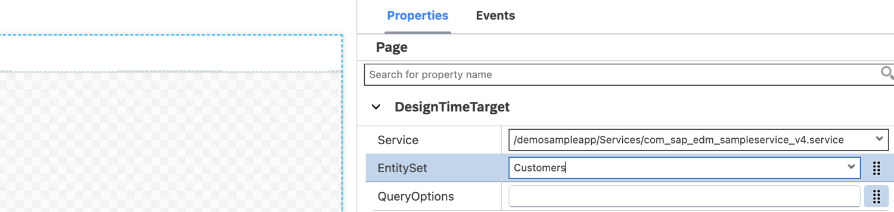

    >`DesignTimeTarget` is a page level property similar to Target but it is only used for design time. This helps in validating the binding context of current page. For more details, see [documentation](https://help.sap.com/doc/f53c64b93e5140918d676b927a3cd65b/Cloud/en-US/docs-en/guides/getting-started/mdk/development/create-pages.html#page-editor).

4. In the page editor, click on the white area to select it's Action Bar, and set the **Caption** to **Details**.

    <!-- border -->

5. Next, you will add an **Object Header** container to display information like first name, last name, date of birth, email address & phone number.

    In the Layout Editor, expand the **Controls** | **Static Container** group, drag and drop the **Object Header** control onto the page area.

    <!-- border -->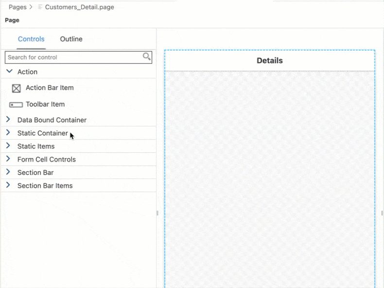

6. Now, you will replace the default values of the control's properties with the values from customer entity.

    In the Properties pane, click the **link icon** to open the Object Browser for the `BodyText` property.

    Double click the `DateOfBirth` property of the Customer entity to set it as the binding expression and click **OK**.

    <!-- border -->

7. Repeat the above steps binding below Properties:

    | Property | Value |
    |----|----|
    | `Description` | `{CustomerID}` |
    | `DetailImage` | Click link icon to open the browser and bind it to `customer` SAP icon |
    | `FootNote`| `{EmailAddress}` |
    | `HeadlineText`| `{LastName}` |
    | `StatusText` | `{PhoneNumber}` |
    | `Subhead` | `{FirstName}` |
    | `SubstatusText` | Remove the default property |

    >`DetailImage` property is referencing to the [SAP font icon](https://openui5.hana.ondemand.com/test-resources/sap/m/demokit/iconExplorer/webapp/index.html#/overview/SAP-icons).

    Page should look like below.

    <!-- border -->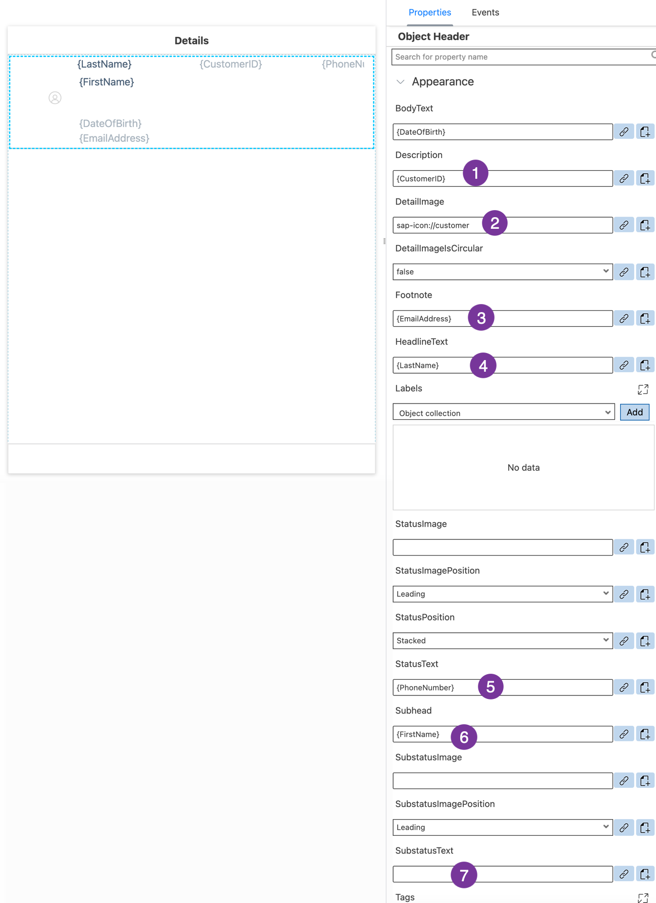

8. In the main area of the page, let's display some other details like; address, city, postal code, county.

    Drag and drop a **Static Key Value** container onto the page under the **Object Header**.

    <!-- border -->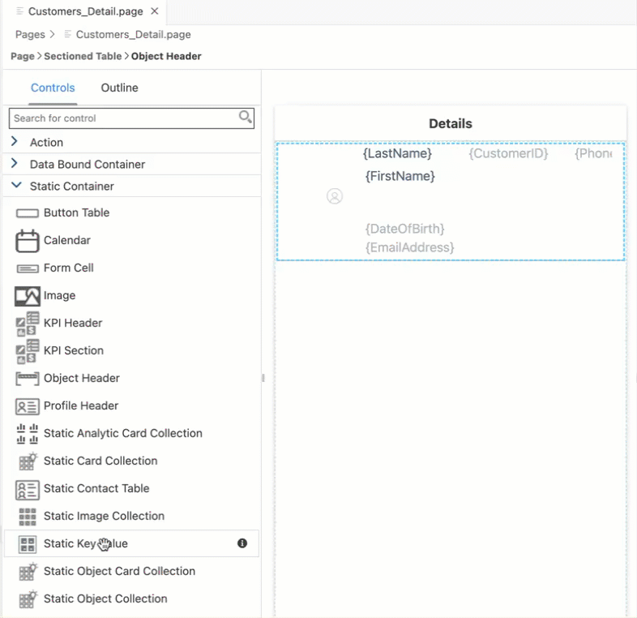

9. Expand the **Static Items** section of the Controls palette and drag and drop a **Key Value Item** onto the **Static Key Value** container on the page.

    <!-- border -->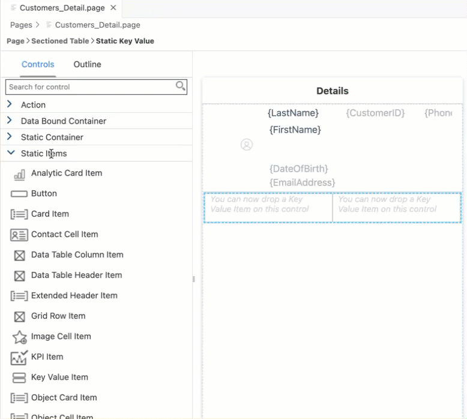

10. Repeat the process and drag three more Key Value Items onto the **Static Key Value** section so you have a total of four when you are done.

    <!-- border -->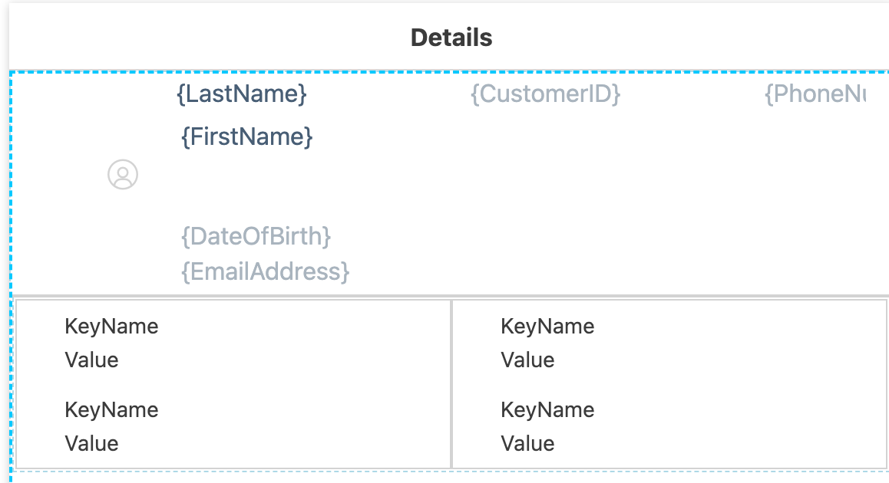

11. Select the **upper left** Key Value Item and set the `KeyName` to **Address**.

      <!-- border -->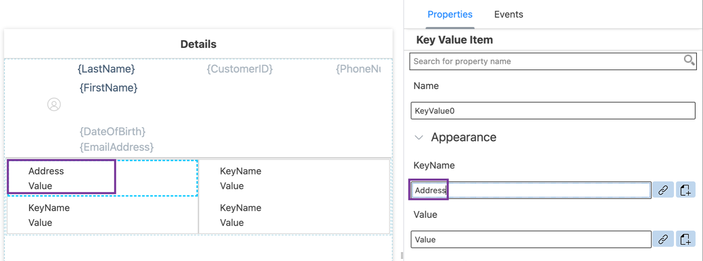

12. For this tutorial, you will set the value as a combined binding of house number and street. You can find more details about [Target Path](https://help.sap.com/doc/f53c64b93e5140918d676b927a3cd65b/Cloud/en-US/docs-en/guides/getting-started/mdk/development/property-binding/target-path.html).

    You will start with first part of the binding for **Address** property.

    Click the **link icon** next to the **Value** field to display the Object Browser and double click `HouseNumber` to set it as the first part of the binding. **Don't click OK as you will set second part of the binding too.**

    <!-- border -->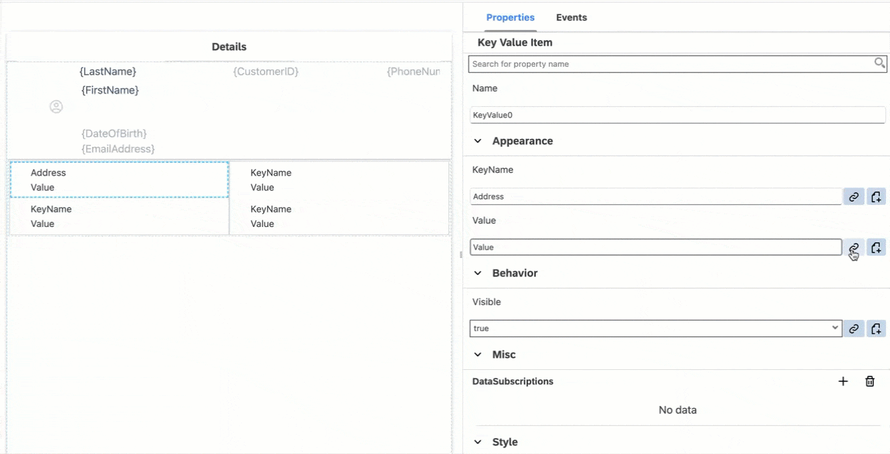

    Now, set second part of the binding.

    The cursor will be at the end of binding in the Expression field. Add a space and then select **Street** property and click **Insert**.

    Click **OK** to set the binding.

    <!-- border -->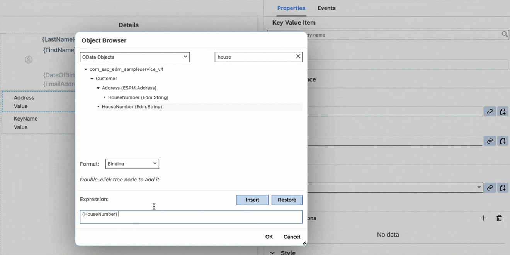

    >Be careful not to double click **Street** as that will replace the existing expression with just the Street property.

    >**Street** should be selected from **Customer** entity.

13. Repeat the process and set the **upper right** Key Value Item `KeyName` to **City** and bind the value to the `City` entity property.

14. Repeat the process and set the **lower left** Key Value Item `KeyName` to **Postal Code** and bind the value to the `PostalCode` entity property.

15. Repeat the process and set the **lower right** Key Value Item `KeyName` to **Country** and bind the value to the `Country` entity property.

    >Be careful not to select _City_, _Postal Code_ & _City_ from Customer.Address (ESPM.Address) collection.

    The page design should look like as below screenshot.

    <!-- border -->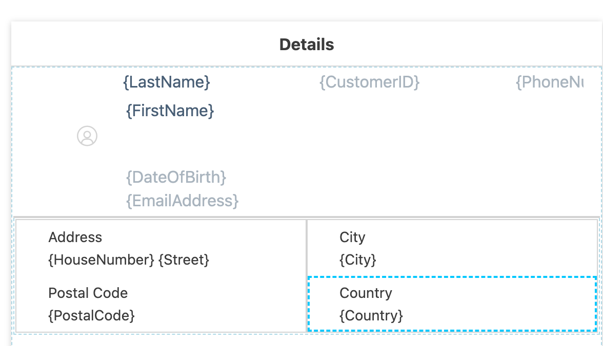

### Navigate from Customer List to its Details page

Now, you will create a Navigation action that opens the `Customers_Detail.page` when called.

1. Navigate to `Pages` | `Customers_List.page`, select the Contact Table control, navigate to the **Events** tab. Click the dotted icon for the `OnPress` property and select the `Create a rule/action`.

    <!-- border -->

2. Keep the default selection for the *Object Type* as Action and *Folders* path.

    <!-- border -->    

3. Choose **UI** in **Category** | click **Navigation** | **Next**.

    <!-- border -->

4. In the **Base Information** step, provide the below information and click **Finish** to complete the action creation process.

    | Field | Value |
    |----|----|
    | `Name`| `NavToCustomers_Detail` |
    | `PageToOpen` | Select `Customers_Detail.page` from the dropdown |

    <!-- border -->

    >when an end-user selects a customer, the Customer Detail page will open. MDK automatically passes the selected customer to the detail page.

### Deploy the Project

You will now deploy the updated project to your MDK client.

Click the **Deploy** option in the editor's header area, and then choose the deployment target as **Mobile Services** .

<!-- border -->

### Run the Project

>Make sure you are choosing the right device platform tab above.

[OPTION BEGIN [Android]]

1. Tap **Check for Updates** in the user menu on the Main page, you will see a _New Version Available_ pop-up, tap **Now**.

    

2. Tap **Customers**, you will navigate to Customers List page.

    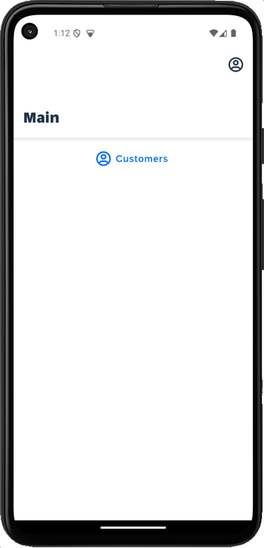
    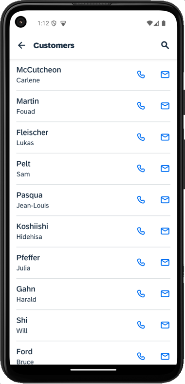

3. Tap any record from the list, you will navigate to it's detail page.

    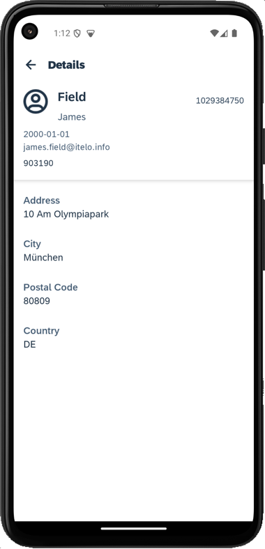

[OPTION END]

[OPTION BEGIN [iOS]]

1. Tap **Check for Updates** in the user menu on the Main page, you will see a _New Version Available_ pop-up, tap **Now**.

    

2. Tap **Customers**, you will navigate to Customers List page.

    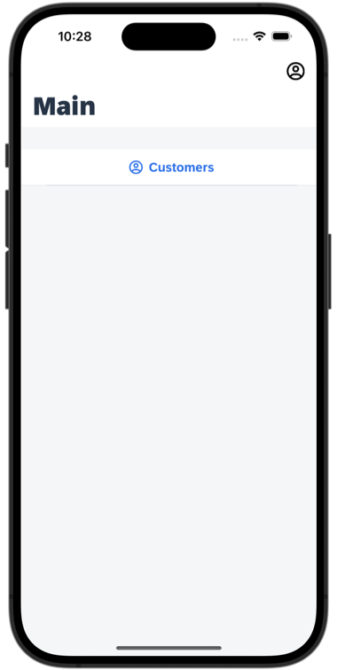
    

3. Tap any record from the list, you will navigate to it's detail page.

    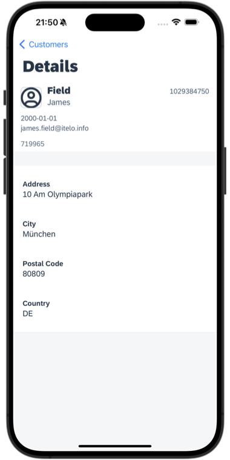

[OPTION END]

>_Are you wondering how exactly MDK knew that clicking on a record in  list page would display respective record in detail page?_

>MDK automatically passes a default binding object to the next page. When navigating from a list page, the selected item is passed as the binding object. You can look at [documentation](https://help.sap.com/doc/f53c64b93e5140918d676b927a3cd65b/Cloud/en-US/docs-en/guides/getting-started/mdk/development/action-binding-and-result.html#auto-set-action-binding) for more details.

---
