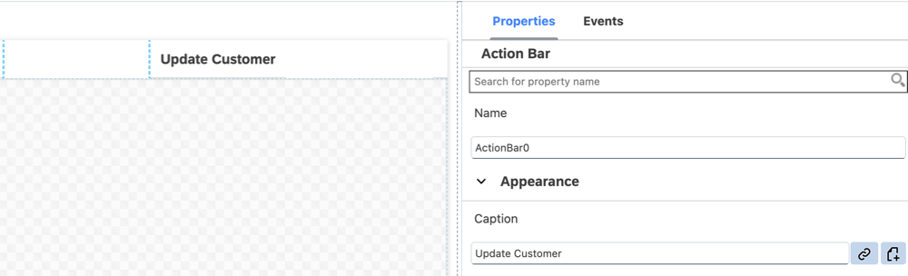
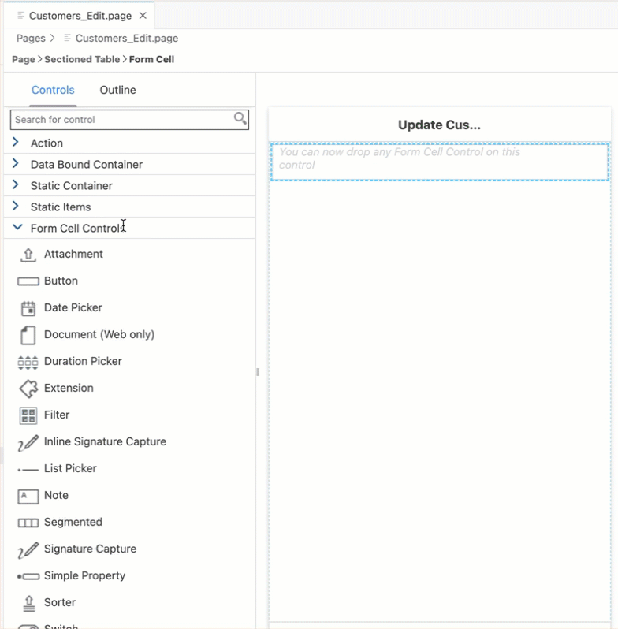
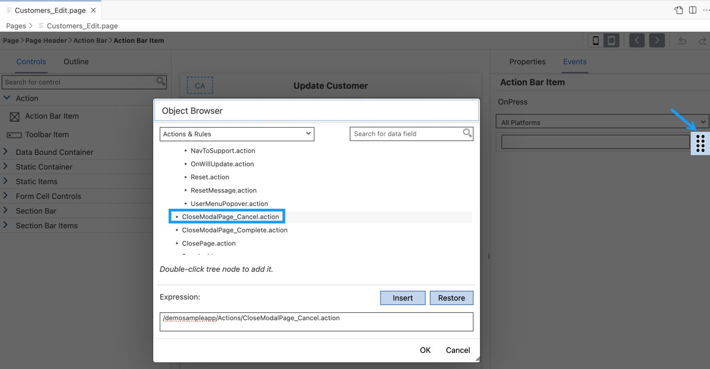
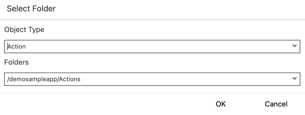
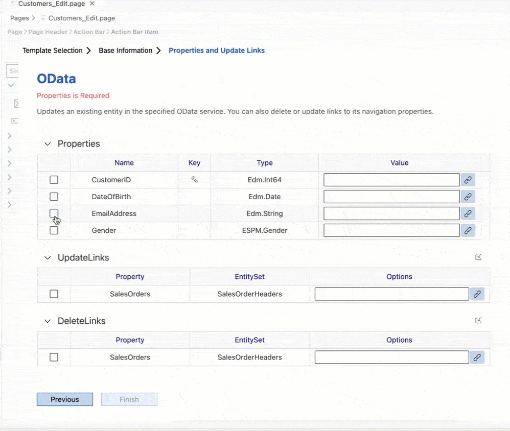
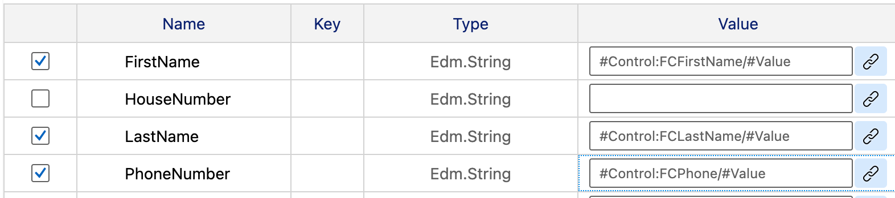
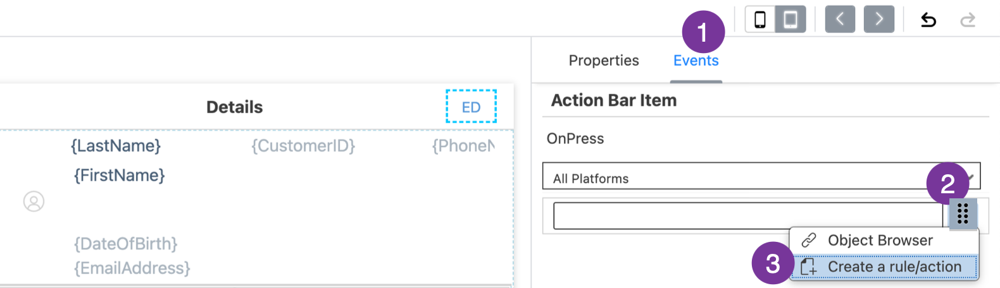
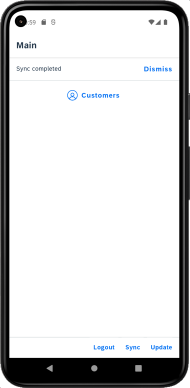

## Details
### You will learn
  - How to create a new page for modifying customer details such as name, email and phone number
  - How to store changes locally on Mobile app and sync these changes with backend
  - How to update a record in web application

---

[ACCORDION-BEGIN [Step 1: ](Create a new page for modifying customer data)]

Regardless of whether your application is online or offline, you can allow users to modify data in the application.

For online applications, the changes are saved to the backend immediately.

For offline applications, the changes are stored locally until they are synced using an Upload action.

In this step, you will create the _Edit Customer Detail_ page as a **Form Cell Page**. This type of page allows for form input style changes. The page will provide only a subset of items available on the Customer Detail page. You will add the fields that will be editable by the end-user.

1. Right-click the **Pages** folder | **MDK: New Page** | **Form Cell Page** | **Next**.

    !

    >A Form Cell Page is suitable for pages that generate new objects or modify existing objects. It includes a form cell container by default. You can add multiple containers or action controls to this page. Under each container section, you can add various controls.

    >You can find more details about [Form Cell page](https://help.sap.com/doc/f53c64b93e5140918d676b927a3cd65b/Cloud/en-US/docs-en/guides/features/fiori-ui/mdk/formcell-page.html).

2. Enter the Page Name `Customers_Edit` and click **Next** and the **Finish** on the Confirmation step.

    !

3. In the **Properties** pane set the Caption to **Update Customer**.

    !

4. Now, you will add the fields (like first name, last name, phone & email address) that will be editable by the end-user.

    In the Layout Editor, expand the **Controls** group.

    Drag and drop a **Simple Property** onto the Page area.

    !

5. Drag and drop three additional Simple Property controls onto the page so you have four total controls.

    !

6. Select the first **Simple Property control** and provide the below information:

    | Property | Value |
    |----|----|
    | `Name`| `FCFirstName` |
    | `Caption` | `First Name` |
    | `Value`| click the link icon and bind it to `FirstName` property of the Customer entity |

    !

7. Select the second Simple Property control and provide the below information:

    | Property | Value |
    |----|----|
    | `Name`| `FCLastName` |
    | `Caption` | `Last Name` |
    | `Value`| click the link icon and bind it to `LastName` property of the Customer entity |

    !

8. Select the third Simple Property control and provide the below information:

    | Property | Value |
    |----|----|
    | `Name`| `FCPhone` |
    | `Caption` | `Phone` |
    | `KeyboardType` | `Phone` |
    | `Value`| click the link icon and bind it to `PhoneNumber` property of the Customer entity |

    !

    >To streamline data entry, the keyboard displayed when editing a `SimplePropertyFormCell` should be appropriate for the type of content in the field. If your app asks for number, for example, it should display the phone keyboard.

9. Select the last Simple Property control and provide the below information:

    | Property | Value |
    |----|----|
    | `Name`| `FCEmail` |
    | `Caption` | `Email` |
    | `KeyboardType` | `Email` |
    | `Value`| click the link icon and bind it to `EmailAddress` property of the Customer entity |

    !

    >To streamline data entry, the keyboard displayed when editing a `SimplePropertyFormCell` should be appropriate for the type of content in the field. If your app asks for an email address, for example, it should display the email address keyboard.

[VALIDATE_2]
[ACCORDION-END]

[ACCORDION-BEGIN [Step 2: ](Add a cancel button on the Edit Customer page)]

While updating the customer details, you may want to close the current page and cancels or interrupts any execution in process.

1. In `Customers_Edit.page`, drag and drop an **Action Bar Item** control to the upper left corner of the action bar.

    >Action Bar Item is a button that users can use to fire actions when pressed. You can add an Action Bar Item only to the Action Bar (at the top of the page).

    !

2. In the Properties pane, click the **link icon** to open the object browser for the **System Item** property.

    Double-click the **Cancel** type and click **OK**.

    !

    >System Item are predefined system-supplied icon or text. Overwrites _Text_ and _Icon_ if specified.

3. Navigate to the **Events** tab. Click the 3 dots icon for the `OnPress` property and select the `Create a rule/action`.

    !

4. Keep the default selection for the *Object Type* as Action and *Folders* path.

    !   

5. Choose **MDK UI Actions** in **Category** | click **Close Page Action** | **Next**.

    !

6. Provide the below information:

    | Property | Value |
    |----|----|
    | `Action Name`| `CloseModalPage_Cancel` |
    | `DismissModal` | Select `Canceled` from the dropdown |
    | `CancelPendingActions`| Select `true` from the dropdown |

    !

    >You can close pages with the option to terminate ongoing events or wait until they are complete. Visit [documentation](https://help.sap.com/doc/69c2ce3e50454264acf9cafe6c6e442c/Latest/en-US/docs-en/reference/schemadoc/Action/ClosePage.schema.html) for more details about Close Page Action.

7. Click **Next** and then **Finish** on the confirmation step.

[DONE]
[ACCORDION-END]

[ACCORDION-BEGIN [Step 3: ](Store the updated data locally)]

The next step is to store the updated record locally for an offline application or send the updated record directly back to the backed for online applications.

* You will now add an Action Bar item on the `Customers_Edit.page` that will call an OData Update Entity action to save the record
* You may want to close the page when the update action is successful
* You may want to show a failure message if the update action fails to save the changes

First, add an action bar item on the `Customers_Edit.page`

1.  In `Customers_Edit.page`, **drag and drop** an **Action Bar Item** to the upper right corner of the action bar.

    !

2. Click the **link** icon to open the object browser for the **System Item** property. Double-click the **Save** type and click **OK**.

    !

3. Navigate to the **Events** tab. Click the 3 dots icon for the `OnPress` property and select the `Create a rule/action`.

    !

4. Keep the default selection for the *Object Type* as Action and *Folders* path.

    !   

5. Choose **MDK Data Actions** in **Category** | click **OData Action** | **Next**.

    !

6. In the **Operation and Service Selection** step, provide the below information:

    | Property | Value |
    |----|----|
    | `Action Name`| `Customers_UpdateEntity` |
    | `Type` | Select `UpdateEntity` from the dropdown |
    | `Service`| Select `SampleServiceV2.service` from the dropdown |
    | `EntitySet`| Select `Customers` from the dropdown |
    | `ReadLink`| click link icon and Double-click `readLink` |

    !

    >This action will map the changes to the correct entities in the OData service and save the changes.

    >The `readLink` is a direct reference to an individual entity set entry.

7. Click **Next**.

8.  In **Property and Update Links** step, uncheck **City**.

9.  Since in `Customers_Detail.page`, you defined four properties (First Name, Last Name, Phone & Email) to be edited, now, in this step, you will bind them to respective UI Controls.

    Check the `EmailAddress` property and click the **link icon** to open the object browser.

    Change the drop down in the object browser to `Controls & ClientData`, click the **Current Page** radio button.

    In the search box start typing the control name `FCEmail`. The list will filter down to show the matching values. Double-click the **Value (Value)** entry under the `FCEmail` field and click **OK** to set binding.

    !

10.  Repeat the above step for remaining properties: `FirstName`, `LastName` and `PhoneNumber`.

    !

    Click **Next** and **Finish** on the confirmation screen. The action editor will open with the `Customers_UpdateEntity.action` loaded.

    >You can find more details about [Update Entity Action](https://help.sap.com/doc/69c2ce3e50454264acf9cafe6c6e442c/Latest/en-US/docs-en/reference/schemadoc/Action/ODataService/UpdateEntity.schema.html).

11. When the above OData action is executed, you may want to display messages on its success and failure behavior. For example, on its success, you may want to close the page and allow any execution to continue. On its failure, you may want to display an error.

    In the `Customers_UpdateEntity.action`, scroll down and expand the *Common Action Properties* section. Click the `Create a rule/action` icon for the *Success Action*.

    !

12. Keep the default selection for the *Object Type* as Action and *Folders* path.

    !   

13. Choose **MDK UI Actions** in **Category** | click **Close Page Action** | **Next**.

    !

14. Provide the below information:

    | Property | Value |
    |----|----|
    | `Action Name` | `CloseModalPage_Complete` |
    | `DismissModal` | Select `Completed` from the dropdown |
    | `CancelPendingActions` | Select `false` from the dropdown |

    !

    Click **Next** and then **Finish** on the confirmation step.

15. Similar, create a message action displaying error in case of the update failure. In the `Customers_UpdateEntity.action`, provide value as **update** for the *Action Result* and click the `Create a rule/action` icon for the *Failure Action*.

    !

16. Keep the default selection for the *Object Type* as Action and *Folders* path.

    !   

17. Choose **MDK Message Actions** in **Category** | click **Message Action** | **Next**.

    !

18. Provide the below information:

    | Property | Value |
    |----|----|
    | `Action Name`| `UpdateCustomerEntityFailureMessage` |
    | `Type` | Select `Message` from the dropdown |
    | `Message` | `Failed to Save Customer Updates - {#ActionResults:update/error}` |
    | `Title` | `Update Customer` |
    | `OKCaption` | `OK` |
    | `OnOK` | `--None--` |
    | `CancelCaption` | leave it blank |
    | `OnCancel` | `--None--` |

    !

    >`update` is the Action Result value of the `Customers_UpdateEntity.action`. This reference is used to pass the results to subsequent actions in the chain. These actions can reference the action result as needed. In this case if there is a failure, you access the error property of the action result to display the OData failure message.

    >This is the standard Binding Target Path (also called Dynamic Target Path) syntax used when you need to include a binding with other bindings or within a string as used in the message here.

    >You could exclude above expression and can just display a generic message.
    
19. Click **Next** and then **Finish** on the confirmation step.

When `Customers_UpdateEntity.action` gets executed successfully then `CloseModalPage_Complete.action` will be triggered or if `Customers_UpdateEntity.action` fails then `UpdateCustomerEntityFailureMessage.action` will be triggered.

[VALIDATE_4]
[ACCORDION-END]

[ACCORDION-BEGIN [Step 4: ](Navigate to the Customer Edit page)]

You will navigate from the Customer Detail page to a new page modifying customer information. For this, you will add an action bar item on the Details page and will link it to a navigation action. When the action bar item is pressed by the end-user that will open the `Customers_Edit.page`.

1. In `Customers_Detail.page`, drag and drop an **Action Bar Item** to the upper right of the action bar.

    !

2. Click the **link icon** to open the object browser for the **System Item** property.

    Double-click the **Edit** type and click **OK**.

    !

3. Navigate to the **Events** tab. Click the 3 dots icon for the `OnPress` property and select the `Create a rule/action`.

   !

4. Keep the default selection for the *Object Type* as Action and *Folders* path.

    !    

5. Choose **MDK UI Actions** in **Category** | click **Navigation Action** | **Next**.

    !

6. Provide the below information:

    | Property | Value |
    |----|----|
    | `Action Name`| `NavToCustomers_Edit` |
    | `PageToOpen` | Select `Customers_Edit.page` from the dropdown |
    | `ModalPage`| Select `true` from the dropdown |

    !

7. Click **Next** and then **Finish** on the confirmation step.

[DONE]
[ACCORDION-END]

[ACCORDION-BEGIN [Step 5: ](Deploy the application)]

Deploy the updated application to your MDK client.

1. Right-click `Application.app` and select **MDK: Deploy**.

    !

2. Select deploy target as **Mobile & Cloud**.

    !

    You should see success message for both deployments.

    !

    >Alternatively, you can select *MDK: Redeploy* in the command palette (View menu>Find Command OR press Command+Shift+p on Mac OR press Ctrl+Shift+P on Windows machine), it will perform the last deployment.

    >!

[VALIDATE_3]
[ACCORDION-END]

[ACCORDION-BEGIN [Step 6: ](Run the app)]

>Make sure you are choosing the right device platform tab above.

[OPTION BEGIN [Android]]

1. Tap **Update** on the Main page, you will see a _New Version Available_ pop-up, tap **Now**.

    

2. Tap **Customers**, tap one of the available customer record, you will then navigate to Customer detail page. Tap `edit` icon. Update existing values for the given customer. You will notice the Phone keyboard appears when updating Phone value. Tap save icon and record gets updated locally.

    

4. You can cross verify if the record has been updated in the backend.

    >Backend endpoint can be found in [Mobile Services Cockpit](cp-mobile-dev-kit-ms-setup).

    >**Mobile Applications** | **Native/MDK** | click the MDK App **com.sap.mdk.demo** | **Mobile Connectivity** | click **Launch in Browser** icon

    >!

    >It will open the URL in a new tab, remove `?auth=uaa` and add `/Customers` at the end of the URL.

    But here result is pointing to old values.

    

    Since this is an Offline application, new entry is added to the request queue of the local store which needs to be sent or uploaded to the backend explicitly.  

    >MDK Base template has added a **Sync** button on main page of the app to upload local changes from device to the backend and to download the latest changes from backend to the device. Actions | Service | `UploadOffline.action` & `DownloadOffline.action`.

5. On Main page, tap **Sync**, a successful message will be shown.

    

Now, refresh the URL to check if record has been updated in the backend. As Sync is pressed, `UploadOffline.action` gets triggered to upload local changes from device to the backend and on success of this call, `DownloadOffline.action` is being called.

[OPTION END]

[OPTION BEGIN [iOS]]

1. Tap **Update** on the Main page, you will see a _New Version Available_ pop-up, tap **Now**.

    

2. 2. Tap **Customers**, tap one of the available customer record, you will then navigate to Customer detail page. Tap `edit` icon. Update existing values for the given customer. You will notice the Phone keyboard appears when updating Phone value. Tap save icon and record gets updated locally.

    

3. You can cross verify if the record has been updated in the backend.

    >Backend endpoint can be found in [Mobile Services Cockpit](cp-mobile-dev-kit-ms-setup).

    >**Mobile Applications** | **Native/MDK** | click the MDK App **com.sap.mdk.demo** | **Mobile Connectivity** | click **Launch in Browser** icon

    >!

    >It will open the URL in a new tab, remove `?auth=uaa` and add `/Customers` at the end of the URL.

    But here result is pointing to old values.

    

    Since this is an Offline application, new entry is added to the request queue of the local store which needs to be sent or uploaded to the backend explicitly.  

    >MDK Base template has added a **Sync** button on main page of the app to upload local changes from device to the backend and to download the latest changes from backend to the device. Actions | Service | `UploadOffline.action` & `DownloadOffline.action`.

4. On Main page, tap **Sync**, a successful message will be shown.

    

Now, refresh the URL to check if record has been updated in the backend. As Sync is pressed, `UploadOffline.action` gets triggered to upload local changes from device to the backend and on success of this call, `DownloadOffline.action` is being called.

[OPTION END]

[OPTION BEGIN [Web]]

1. Either click the highlighted button or refresh the web page to load the changes.

    !

    >If you see the error `404 Not Found: Requested route ('xxxxx-dev-nsdemosampleapp-approuter.cfapps.xxxx.hana.ondemand.com') does not exist.` while accessing the web application, make sure that in your space cockpit, highlight applications are in started state.

    >!

2. Click **Customers**, click one of the available customer record,  you will then navigate to Customer detail page.

    !

3. Click **Edit**.

    !

4. For example, updating First Name from `Isabelle` to `Carolina`. Click **Save**.

    !

    Record gets updated accordingly.

    !

5. You can cross verify if the record has been updated in the backend.

    >Backend endpoint can be found in [Mobile Services Cockpit](cp-mobile-dev-kit-ms-setup).

    >**Mobile Applications** | **Native/MDK** | click the MDK App **com.sap.mdk.demo** | **Mobile Connectivity** | click **Launch in Browser** icon

    >!

    >It will open the URL in a new tab, remove `?auth=uaa` and add `/Customers` at the end of the URL.

[OPTION END]

[DONE]
[ACCORDION-END]

---
