# Handle Error Archive in an MDK App
<!-- description --> Create an MDK app to display errors occurred while uploading local changes and implement some logic on how to handle such errors and then let users to fix it from the app by providing correct values.

## Prerequisites
- **Tutorial group:** [Set Up for the Mobile Development Kit (MDK)](group.mobile-dev-kit-setup)
- **Install SAP Mobile Services Client** on your [Android](https://play.google.com/store/apps/details?id=com.sap.mobileservices.client) device or [iOS](https://apps.apple.com/us/app/sap-mobile-services-client/id1413653544)
<table><tr><td align="center"><!-- border --><br>Android</td><td align="center"><br>iOS</td></tr></table>
(If you are connecting to `AliCloud` accounts, you will need to brand your [custom MDK client](cp-mobile-dev-kit-build-client) by allowing custom domains.)


## You will learn
- How to access Error Archive entity set to display local upload failure
- How to handle a logic failure errors
- How to fix these errors

## Intro
You may clone an existing metadata project from the [MDK Tutorial GitHub repository](https://github.com/SAP-samples/cloud-mdk-tutorial-samples/tree/main/4-Level-Up-with-the-Mobile-Development-Kit/1-Handle-Error-Archive-in-an-MDK-App) and start directly with step 6 in this tutorial.

---

You have built an MDK app with offline functionality. In offline store, you make a change to a local record and upload this change (from request queue) to backend but backend prevents this change to accept due to some business logic failure. This error is recorded in an Offline OData specific entity set named as `ErrorArchive`. This entity set has detailed information about the errors. It's now up to developers how they handle such errors and then let users to fix it from the app by providing the correct values. `ErrorArchive` is exposed to the application as an OData entity set and is accessible through the OData API in the same way that the application accesses any other entity sets from the offline store. You can find more details about the `ErrorArchive` Entity Properties in [this](https://help.sap.com/doc/f53c64b93e5140918d676b927a3cd65b/Cloud/en-US/docs-en/guides/features/offline/common/handling-errors-and-conflicts/errorarchive-entity-properties.html) documentation.

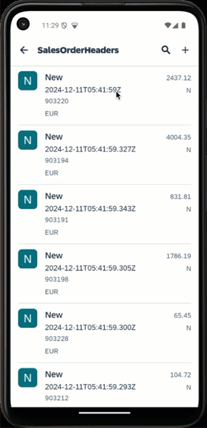

 In this tutorial, you need to carry out the following tasks in order to understand how to display and handle such errors:

- Create a new project in SAP Business Application Studio using MDK CRUD Project template
- Access Error pages displaying records rejected by backend
- Create a business logic to find the affected entity
- Navigate to the affected record to handle the error

> For this tutorial, you will use **Mobile Services sample backend** destination. You will modify a `PurchaseOrderHeaders` record by changing `CurrencyCode` field. Offline store saves this record in request queue database and when you sync it with backend, backend prevents updating this record due to business logic failure. This failure record will be listed in Error list page, from here, you can navigate to details page for more information. You will implement a logic to navigate from details page to the affected record.

### Create a new MDK project in SAP Business Application Studio

This step includes creating the mobile development kit project in the editor.

1. Launch the [Dev space](cp-mobile-bas-setup) in SAP Business Application Studio.


2. Click **New Project from Template** on the `Get Started` page.

    <!-- border -->

    >If you do not see the `Get Started` page, you can access it by typing `>get started` in the center search bar.

    <!-- border -->

3. Select **MDK Project** and click **Start**. If you do not see the **MDK Project** option check if your Dev Space has finished loading or reload the page in your browser and try again.

    <!-- border -->  

    >This screen will only show up when your CF login session has expired. Use either `Credentials` OR  `SSO Passcode` option for authentication. After successful signed in to Cloud Foundry, select your Cloud Foundry Organization and Space where you have set up the initial configuration for your MDK app and click Apply.

    ><!-- border -->

4. In *Basic Information* step, select or provide the below information and click **Next**:

    | Field | Value |
    |----|----|
    | `MDK Template Type`| Select `CRUD` from the dropdown |
    | `Your Project Name` | Provide a name of your choice. `MDK_ErrorArchive` is used for this tutorial |
    | `Your Application Name` | <default name is same as project name, you can provide any name of your choice> |
    | `Target MDK Client Version` | Leave the default selection as `MDK 23.4+ (For use with MDK 23.4 or later clients)` |
    | `Choose a target folder` | By default, the target folder uses project root path. However, you can choose a different folder path |

    <!-- border -->

    >The `CRUD` template creates the offline or online actions, rules, messages, List Detail Pages with editable options. More details on *MDK template* is available in [help documentation](https://help.sap.com/doc/f53c64b93e5140918d676b927a3cd65b/Cloud/en-US/docs-en/guides/getting-started/mdk/bas.html#creating-a-new-project-cloud-foundry).  

5. In *Service Configuration* step, provide or select the below information and click **Next**:

    | Field | Value |
    |----|----|
    | `Data Source` | Select `Mobile Services` from the dropdown |
    | `Mobile Services Landscape` | Select `standard` from the dropdown |
    | `Application Id` | Select `com.sap.mdk.demo` from the dropdown |
    | `Destination` | Select `SampleServiceV4` from the dropdown |
    | `Enter a path to the OData service` | Leave it as it is |
    | `Enable Offline` | It's enabled by default |

    <!-- border -->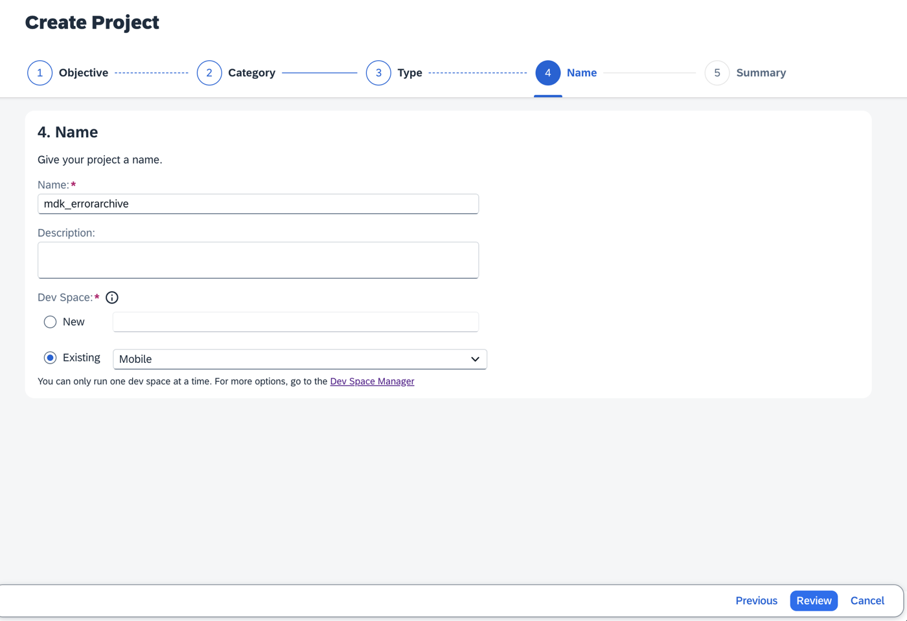

6. In *Data Collections* step, unselect `Customers` and select  `PurchaseOrderHeaders`, `PurchaseOrderItems` and `Suppliers`.

    <!-- border -->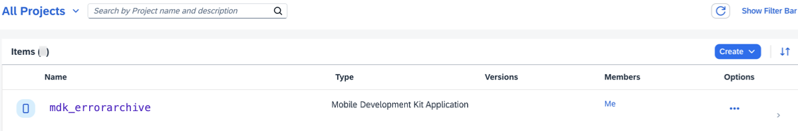

    >Data Collections step retrieves the entity sets information for the selected destination.

6. Click **Finish** to complete the project creation.

    After clicking **Finish**, the wizard will generate your MDK Application based on your selections. You should now see the `MDK_ErrorArchive` project in the project explorer.

    Generated project is offline enabled and includes three entity sets (`Suppliers`, `PurchaseOrderHeaders` and `PurchaseOrderItems`) on the `Main.page` and these entities are fully CRUD enabled. You can create a new record and also modify an existing one. You will also find the `ErrorArchive_List.page` which will display list of errors for the records rejected by the backend and `ErrorArchive_Detail.page` which will display details about an error.

    <!-- border -->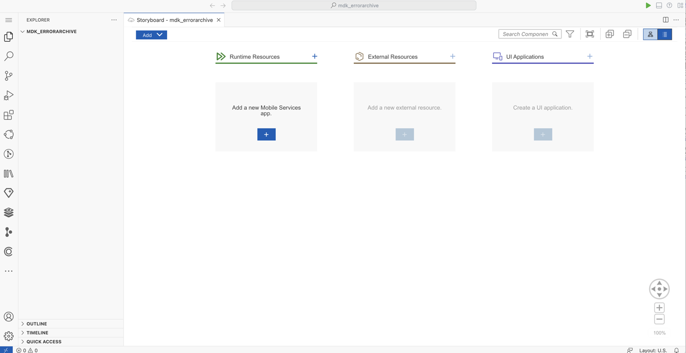

    >`SampleServiceV4` is the name of the service file generated in the project creation.  

### Deploy the application

1. Right-click `Application.app` and select **MDK: Deploy**.

    <!-- border -->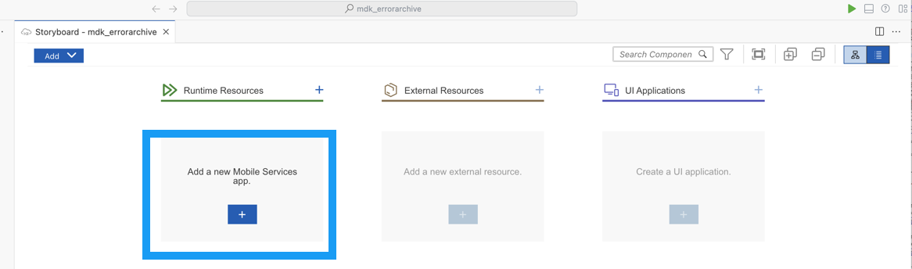

2. Select deploy target as **Mobile Services**.

    <!-- border -->

    If you want to enable source for debugging the deployed bundle, then choose **Yes**.

    <!-- border -->

    You should see **Deploy to Mobile Services successfully!** message.

    <!-- border -->


### Display the QR code for onboarding the Mobile app


SAP Business Application Studio has a feature to display the QR code for onboarding in the Mobile client. Click on `Application.app` to open it in MDK Application Editor, and then click the **Application QR Code** icon.

<!-- border -->

The On-boarding QR code is now displayed.

<!-- border -->

>Leave the Onboarding dialog box open for the next step.


### Run the app in MDK client


>Make sure you are choosing the right device platform tab above. Once you have scanned and on-boarded using the onboarding URL, it will be remembered. When you Log out and on-board again, you will be asked either to continue to use current application or to scan new QR code.

[OPTION BEGIN [Android]]

1. Follow [these steps](https://github.com/SAP-samples/cloud-mdk-tutorial-samples/blob/main/Onboarding-Android-client/Onboarding-Android-client.md) to successfully on-board the MDK client on your Android device.

    After you accept app update, you will see **Main** page with some entity sets being displayed and Offline store will be initialized.

    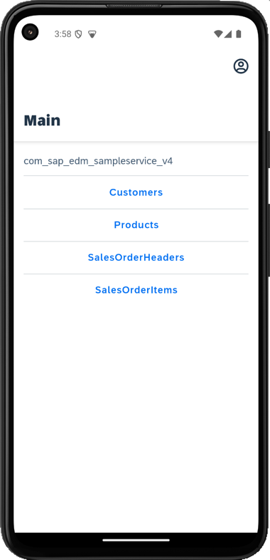

2. You will modify a `PurchaseOrderHeaders` record, save it locally, sync it to the backend and if backend doesn't accept this change due to some business logic failure, you will view them in Error Archive list.

    Navigate to `PurchaseOrderHeaders` list, tap either one of the records.

    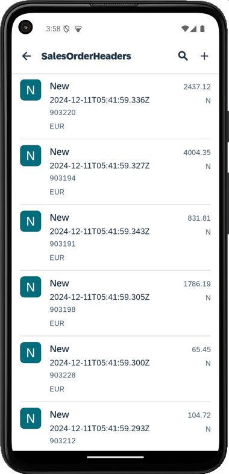

3. Tap edit icon. Make some changes to `CurrencyCode` value (update it to `EUROOO`) and tap the save icon.

    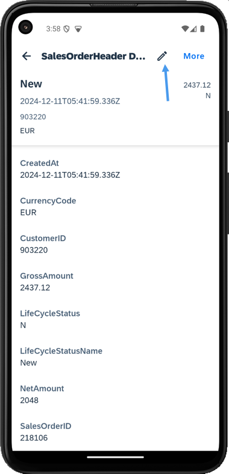
    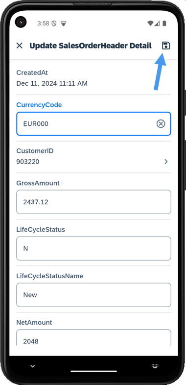

    You will see **Entity Updated** toast message. You can always see this updated record reflecting in `PurchaseOrderHeaders` list which means offline store has accepted this change.

4. Navigate to `Main.page`, tap on the **Sync Changes** option in the user menu to upload local changes from device to the backend and to download the latest changes from backend to the device.

    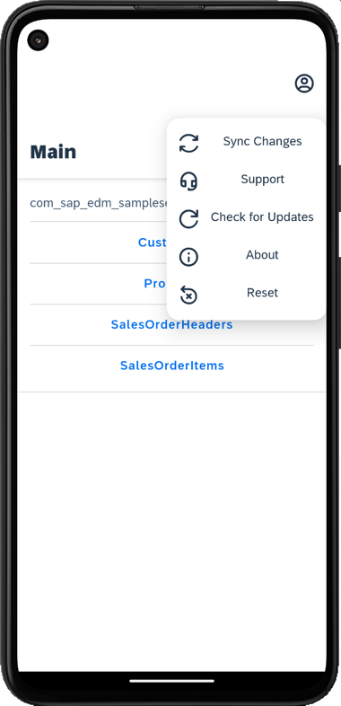

5. You will see *Upload failed* message, tap on **View Errors** to navigate to the Error Archive list.

    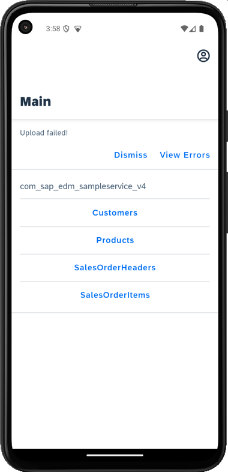
    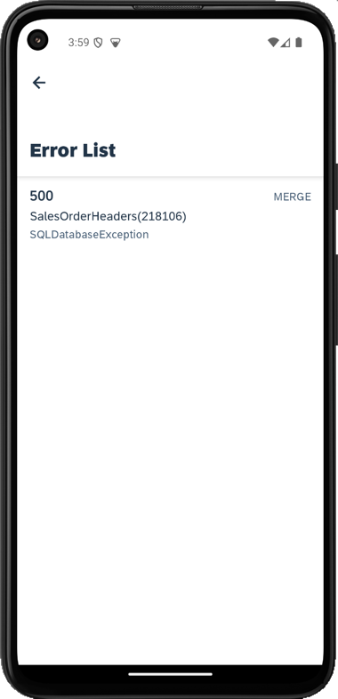

6. Tapping any record navigates to Error Details page with more information about error.

    

    Here in **Error**, you will see `SQLDatabaseException` and in **Request Body**, it shows the record that caused this failure.

    In next step, you will implement how to handle such errors and let users to modify record with correct values.

[OPTION END]

[OPTION BEGIN [iOS]]

1. Follow [these steps](https://github.com/SAP-samples/cloud-mdk-tutorial-samples/blob/main/Onboarding-iOS-client/Onboarding-iOS-client.md) to successfully on-board the MDK client on your iOS device.

    After you accept app update, you will see **Main** page with some entity sets being displayed and Offline store will be initialized.

    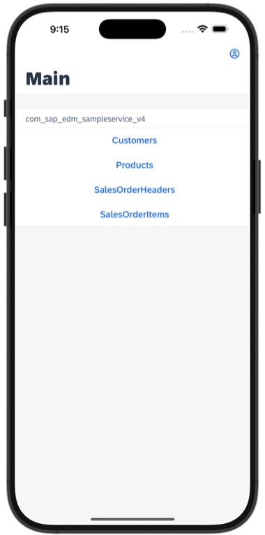

2. You will modify a `PurchaseOrderHeaders` record, save it locally, sync it to the backend and if backend doesn't accept this change due to some business logic failure, this record will appear in Error Archive list.

    Navigate to `PurchaseOrderHeaders` list, tap either one of the record.

    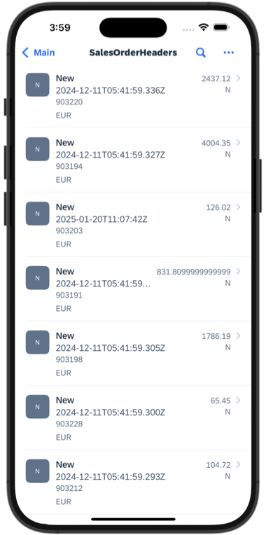

3. Tap **Edit**. Make some changes to `CurrencyCode` value (update it to `EUROOO`) and **Save** it.

    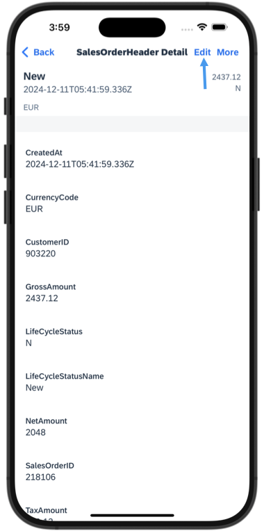
    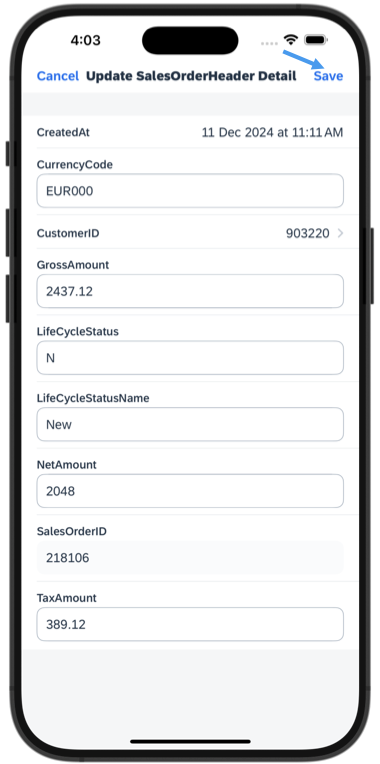

    You will see **Entity Updated** toast message. You can always see this updated record reflecting in `PurchaseOrderHeaders` list which means offline store has accepted this change.

4. Navigate to `Main.page`, click on the **Sync Changes** option in the user menu to upload local changes from device to the backend and to download the latest changes from backend to the device.

    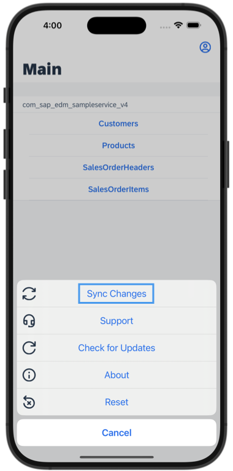

5. You will see *Upload failed* message, tap on **View Errors** to navigate to the Error Archive list.


    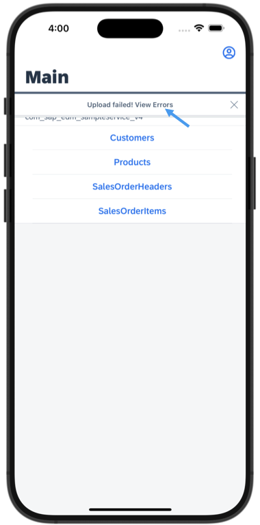
    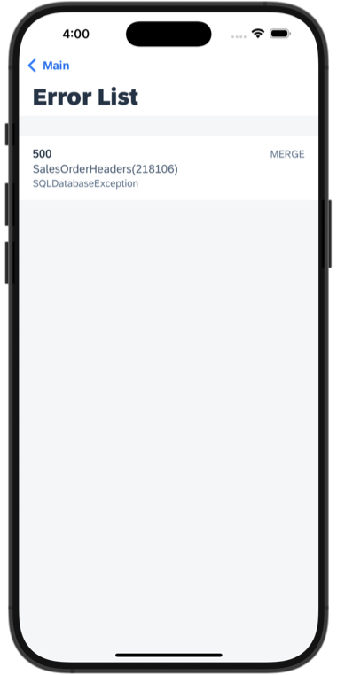    

6. Tapping any record navigates to Error Details page with more information about error.

    

    Here in **Error**, you will see `SQLDatabaseException` and in **Request Body**, it shows the record that caused this failure.

    In next step, you will implement how to handle such errors and let users to modify record with correct values.

[OPTION END]


### Handle the Affected Records And Modify with Correct Data


On the Error Details page, you will implement how to navigate to respective record to let users to modify the affected record with correct values and will also display the Affected Entity Object. Once the record is modified with the correct values, user can again sync it with backend.

1. Add an **Object Table** control in `ErrorArchive_Detail.page` to display some information like affected entity and id for the affected record.

    Open `Pages` | `ErrorArchive` |`ErrorArchive_Detail.page`, in the Layout Editor, expand the **Controls** | **Data Bound Container** group, drag and drop the **Object Table** control onto the page area.

    <!-- border -->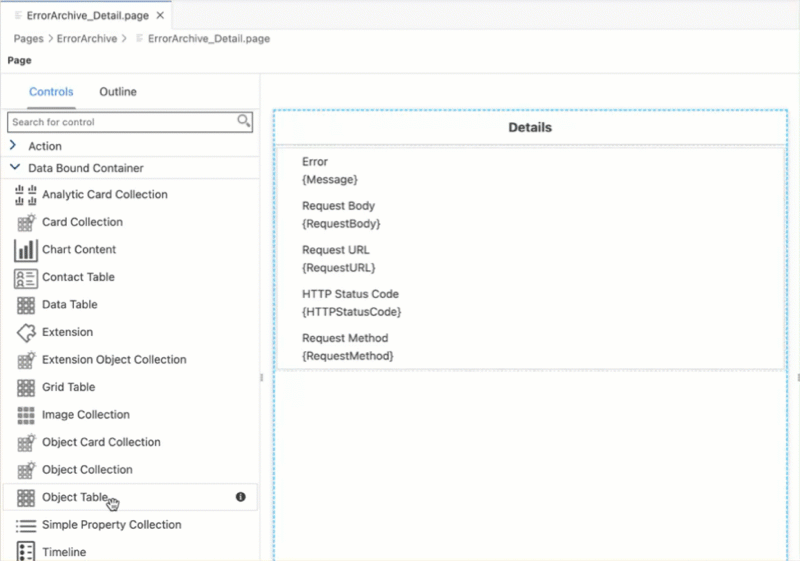

2. In the **Properties** | **Target** pane, choose **String Target** from the dropdown and provide `{AffectedEntity}` value.

    <!-- border -->

    >`AffectedEntity`: A navigation property that allows applications to navigate from an `ErrorArchive` entity to an entity in the offline store that is affected by the error.

3. In **Appearance** section, provide below properties:

    | Property | Value |
    |----|----|
    | `Description`| leave it empty |
    | `Footnote`| leave it empty |
    | `PreserveIconStackSpacing` | Select `false` from the dropdown|
    | `ProgessIndicator`| leave it empty |
    | `Status` | leave it empty  |
    | `Subhead` | `{@odata.id}` |
    | `Substatus` | leave it empty  |
    | `Tags` | Click the `item0` and click the trash icon to delete the default item |
    | `Title` | `Edit Affected Entity` |

    <!-- border -->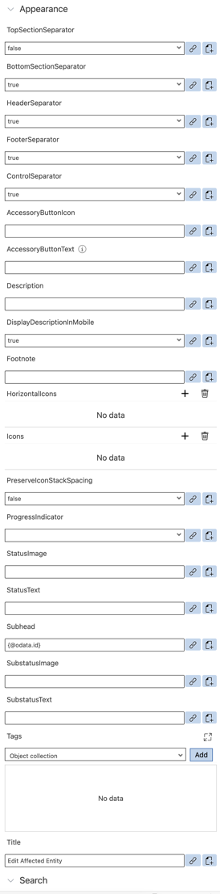

    >`@odata.id`: an annotation that contains the entity-id. More details can be found [here](http://docs.oasis-open.org/odata/odata-json-format/v4.0/cs01/odata-json-format-v4.0-cs01.html#_Toc365464691).

4. In **Behavior** section, update below properties:

    | Property | Value |
    |----|----|
    | `AccessoryType`| `DisclosureIndicator` |

    <!-- border -->

5. In the **Avatar Grid** section of the **Properties** pane, remove the default Avatar.  First, click on the `item0`, a trash icon appears. Click on the trash icon to delete the default item.

    <!-- border -->

6. In the **Avatar Stack** section of the **Property** pane, remove the default Avatar.  First, click on the `item0`, a trash icon appears. Click on the trash icon to delete the default item.

    <!-- border -->  

7. When tapping on this Object Table control, you want to bring the affected record so that you can fix business failure by modifying previous changes right there. For this, you will write a business logic to decide which action to call depends on which `@odata.type` is the `affectedEntity` and if there is no handler for an affected entity, app will display a toast message saying this affected entity doesn't have a handle yet.

    In the `ErrorArchive_Detail.page`, select the Object Table control, navigate to the **Events** tab. Click the 3 dots icon for the `OnPress` property and select the `Create a rule/action`.

    <!-- border -->  

8. Select **Rule** for the *Object Type* and select the `/MDK_ErrorArchive/Rules/ErrorArchive` folder path to create a new rule that will be generated in the chosen path.

    <!-- border -->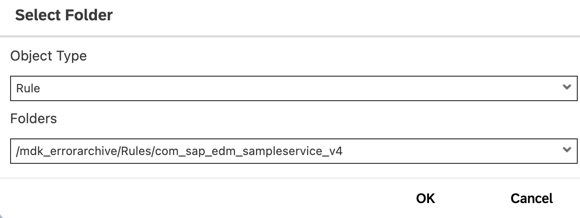

    >You may choose a path of your choice. Since the template generates an `ErrorArchive` folder under *Rules*, it is good to keep related files under the respective folder.

    Enter the MDK Rule **Name** `ErrorArchive_DecideWhichEditPage` and click **Finish**.

    <!-- border -->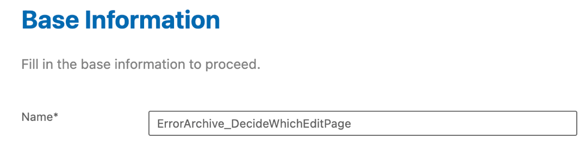

    Replace the generated snippet with below code.

    ```JavaScript
    /**
     * Describe this function...
    * @param {IClientAPI} context
    */
    export default function ErrorArchive_DecideWhichEditPage(context) {
        //Current binding's root is the errorArchiveEntity:
        let errorArchiveEntity = context.binding;
        //Get the affectedEntity object out of it
        let affectedEntity = errorArchiveEntity.AffectedEntity;
        console.log("Affected Entity Is:");
        console.log(affectedEntity);
        let targetAction = null;
        let id = affectedEntity["@odata.id"]; //e.g. PurchaseOrderHeaders(12345)
        let affectedEntityType = "Unknown Entity Set"; //By default it's unknown type
        if (id.indexOf("(") > 0) {
            //Extracting the entity set type from @odata.id e.g. PurchaseOrderHeaders
            var patt = /\/?(.+)\(/i;
            var result = id.match(patt);
            affectedEntityType = result[1];
        }
        console.log("Affected Entity Type Is:");
        console.log(affectedEntityType);
        //Here we decide which action to call depends on which affectedEntityType is the affectedEntity
        // You can add more complex decision logic if needed
        switch (affectedEntityType) {
            case "PurchaseOrderHeaders":
                targetAction = "/MDK_ErrorArchive/Actions/SampleServiceV4/PurchaseOrderHeaders/NavToPurchaseOrderHeaders_Edit.action";
                break;
            default:
                //Save the affected Entity's type in client data so that it can be displayed by the toast
                context.getPageProxy().getClientData().AffectedEntityType = affectedEntityType;
                // Show a toast for affectedEntityType that we do not handle yet
                return context.executeAction("/MDK_ErrorArchive/Actions/ErrorArchive/ErrorArchive_UnknownAffectedEntity.action");
        }
        if (targetAction) {
            let pageProxy = context.getPageProxy();
            //Set the affectedEntity object to root the binding context.
            pageProxy.setActionBinding(affectedEntity);
            //Note: doing 'return' here is important to chain the current context to the action.
            // Without the return the ActionBinding will not be passed to the action because it will consider
            // you are executing this action independent of the current context.
            return context.executeAction(targetAction);
        }
    }
    ```

    >In above code there is a reference to `ErrorArchive_UnknownAffectedEntity.action`, which doesn't exist in your metadata project yet. You will create this action in next step.

9. In the generated `ErrorArchive_DecideWhichEditPage.js` rule, click on the red line. You will notice a yellow bulb icon suggesting some fixes, click on it and then select `MDK: Create action for this reference`, and click `Toast Message Action`.

    <!-- border -->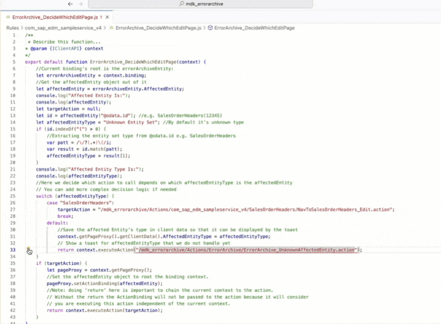

    Provide the below information:

    | Property | Value |
    |----|----|
    | `Message` | `Affected Entity {AffectedEntity/@odata.id} doesn't have handler yet.` |
    | `Duration` | 4 |
    | `Animated` | Select `true` from the dropdown |

    <!-- border -->

    >If there is no handler for an affected entity, app will display a toast message.

10. Next, add a **Header** section bar to display affected entity information.

    In the Layout Editor, expand the **Controls** | **Section Bar** section, drag and drop the **Header** control onto the **Object Table** control.

    <!-- border -->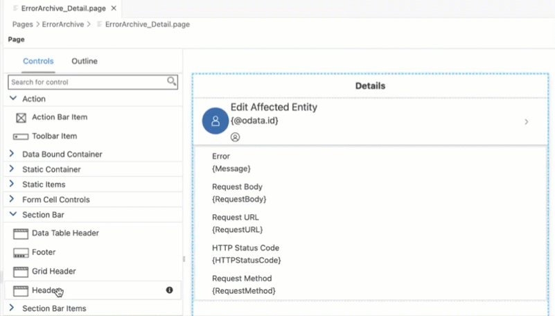

    Now, bind its **Caption** property to `Affected Entity: {#Page:-Current/AffectedEntity/@odata.type}` target path.

    <!-- border -->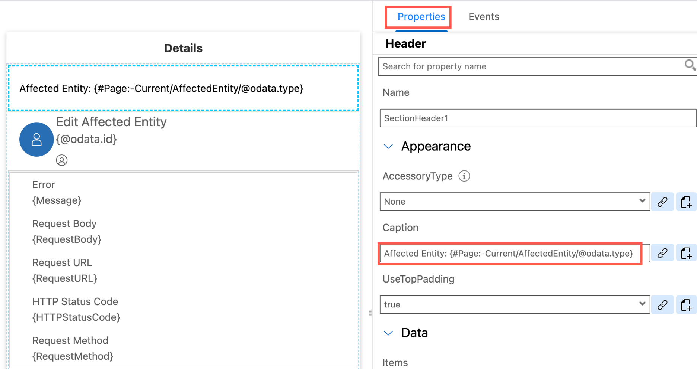

    >`@odata.type`: an annotation that specifies the type of a JSON object or name/value pair. Its value is a URI that identifies the type of the property or object. More details can be found [here](http://docs.oasis-open.org/odata/odata-json-format/v4.0/cs01/odata-json-format-v4.0-cs01.html#odataType).


### Redeploy the application


Right-click the `Application.app` file in the project explorer pane,  select **MDK: Deploy** and then select deploy target as **Mobile Services**.

>Alternatively, you can select *MDK: Redeploy* in the command palette (View menu>Find Command OR press Command+Shift+p on Mac OR press Ctrl+Shift+P on Windows machine), it will perform the last deployment.

><!-- border -->


### Update the app


[OPTION BEGIN [Android]]

1. Tap **Check for Updates** in the user menu on the Main page, you will see a _New Version Available_ pop-up, tap **Now**.

    

2. In order to access the Error List Detail pages, tap again on **Sync Changes** option in the user menu and once you see *Upload failed* message, tap on **View Errors** to navigate to the Error Archive list.

    There you will find affected entity which couldn't get accepted by backend due to some business logic failure.

    
    

    >You could add a button on the Main page navigating to the Error Archive List page directly.

3. Tapping any record navigates to Error Details page with more information about error. You have added a business logic to find out which is affected entity and how to navigate to respective record to let users to modify this record with correct values. Once done, user can again sync it with backend. Tap **Edit Affected Entity**.  

    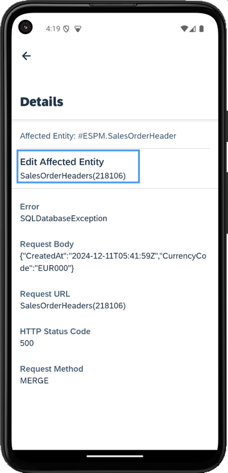

 4. Modify record with correct values.

    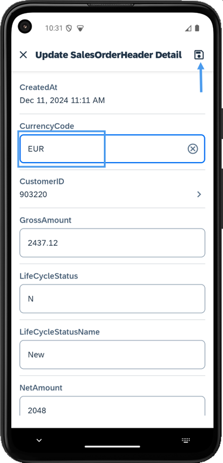   

5. Navigate to the Main page and tap on the **Sync Changes** option in the user menu. Record gets upload to the backend successfully.

      

[OPTION END]

[OPTION BEGIN [iOS]]

1. Tap **Check for Updates** in the user menu on the Main page, you will see a _New Version Available_ pop-up, tap **Now**.

    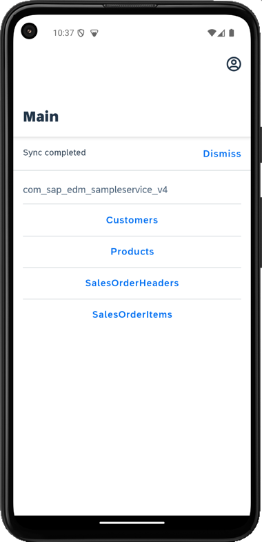

2. In order to access the Error List Detail pages, tap again on **Sync Changes** option in the user menu and once you see *Upload failed* message, tap on **View Errors** to navigate to the Error Archive list.

    There you will find affected entity which couldn't get accepted by backend due to some business logic failure.

    
    

    >You could add a button on the Main page navigating to the Error Archive List page directly.    

3. Tapping any record navigates to **Error Details** page with more information about error. You have added a business logic to find out which is affected entity and how to navigate to respective record to let users to modify this record with correct values. Once done, user can again sync it with backend. Tap **Edit Affected Entity**.

    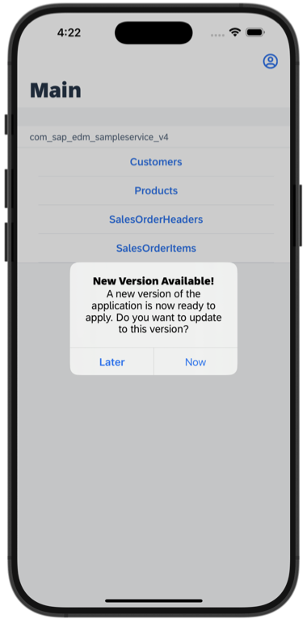

4. Modify record with correct values.

    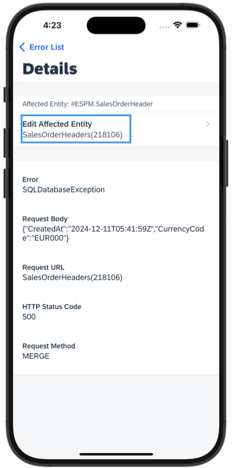   

5. Navigate to the Main page and tap on the **Sync Changes** option in the user menu. Record gets upload to the backend successfully.

    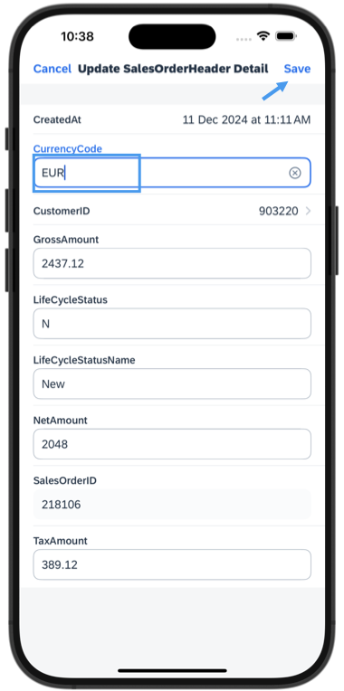  

[OPTION END]


---
