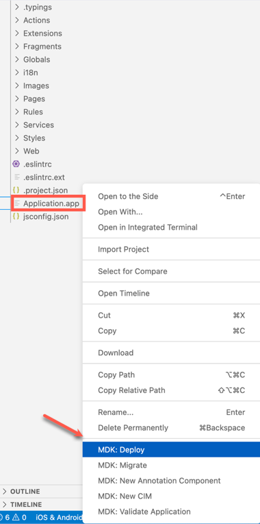
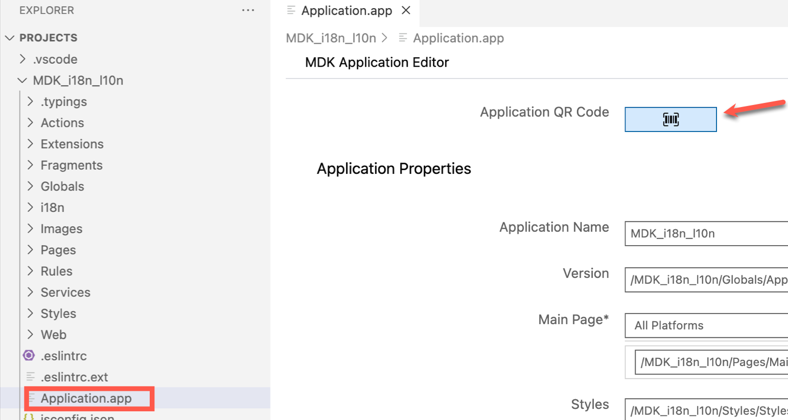
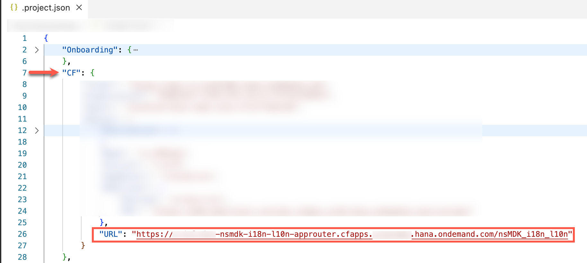
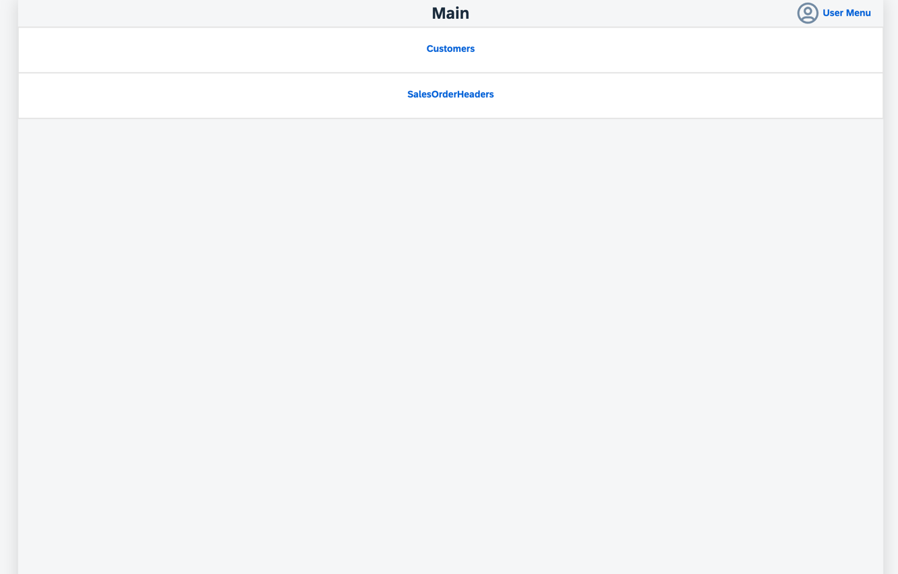
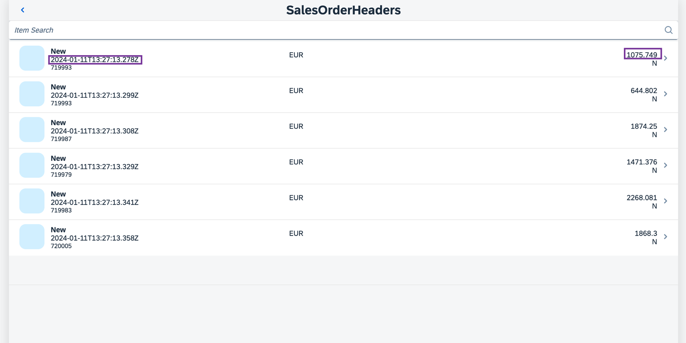
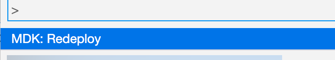
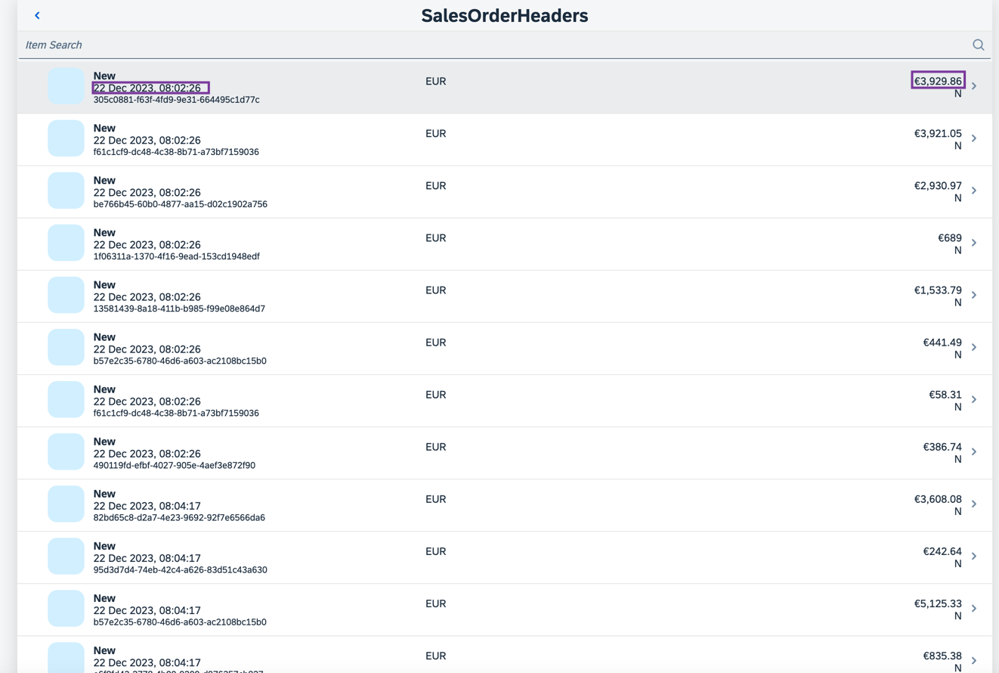
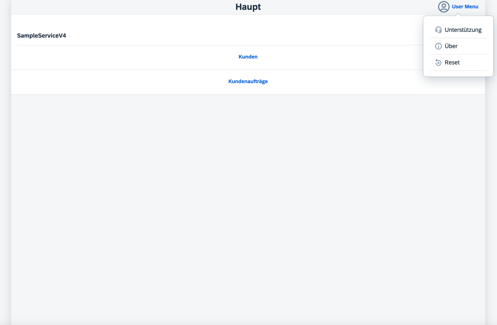
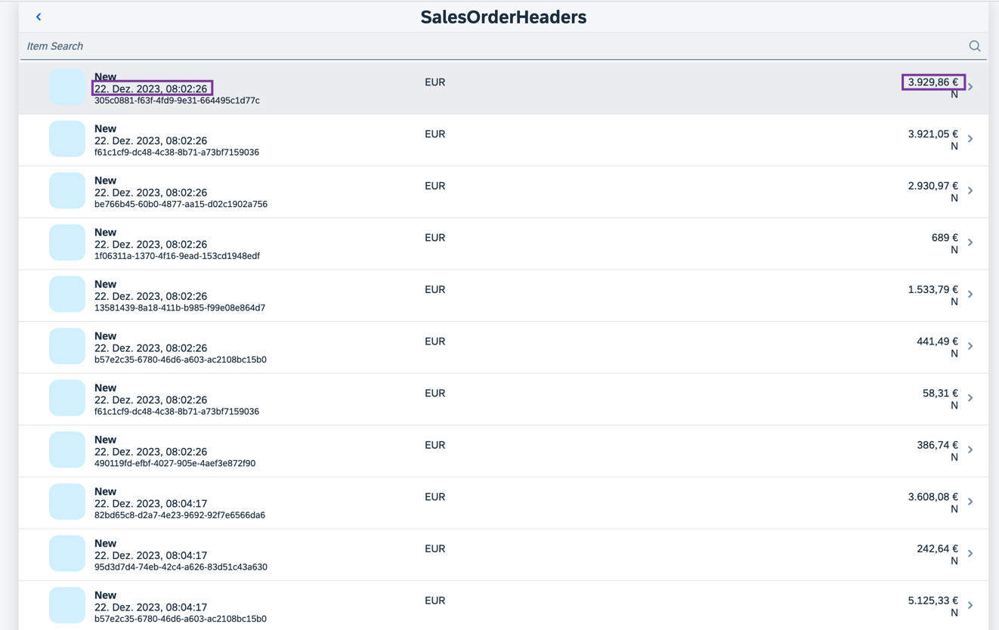

# Add Internationalization and Localization to an MDK App
<!-- description --> Localize the UI text strings and format the values according to device's or browser's or app's current locale.

## Prerequisites
- **Tutorial group:** [Set Up for the Mobile Development Kit (MDK)](group.mobile-dev-kit-setup)
- **Install SAP Mobile Services Client** on your [Android](https://play.google.com/store/apps/details?id=com.sap.mobileservices.client) device or [iOS](https://apps.apple.com/us/app/sap-mobile-services-client/id1413653544)
<table><tr><td align="center"><!-- border --><br>Android</td><td align="center"><br>iOS</td></tr></table>
(If you are connecting to `AliCloud` accounts then you will need to brand your [custom MDK client](cp-mobile-dev-kit-build-client) by allowing custom domains.)

## You will learn
  - How to define a property file to store the language and locale-specific strings
  - How to consume localized text strings in metadata definition
  - How to use Currency and Date Time formatters

## Intro
You may clone an existing project from [GitHub repository](https://github.com/SAP-samples/cloud-mdk-tutorial-samples/tree/main/4-Level-Up-with-the-Mobile-Development-Kit/7-Add-internationalization-and-localization-to-an-mdk-app) and start directly with step 10 in this tutorial.

---

### Understand the Internationalization and Localization


**Internationalization (i18n)** is the process of designing and developing your software or mobile application product so it can be adapted and localized to different cultures, regions, and languages.

**Localization (l10n)** is the adaptation of your software or mobile application product to meet the language, culture, and other requirements of each locale. It refers to localizing time and date differences, currency, accounting standards, culturally appropriate images, symbols, and hand gestures, spelling, and other locale-specific components.

As a developer, you can now provide translations and localization for your MDK application. This allows end-users to view the mobile application in their own language and regional settings. MDK already supports [various languages](https://help.sap.com/doc/f53c64b93e5140918d676b927a3cd65b/Cloud/en-US/docs-en/guides/features/fiori-ui/mdk/i18n/language-support.html) for end-user facing texts to be translated.


### Create a new MDK project in SAP Business Application Studio


This step includes creating the mobile development kit project in the editor.

1. Launch the [Dev space](cp-mobile-bas-setup) in SAP Business Application Studio.

2. Click **Start from template** on the `Get Started` page.

    <!-- border -->

    >If you do not see the `Get Started` page, you can access it by typing `>get started` in the center search bar.

    <!-- border -->

3. Select **MDK Project** and click **Start**.

    <!-- border -->
    
    >If you do not see the **MDK Project** option check if your Dev Space has finished loading or reload the page in your browser and try again.

    >This screen will only show up when your CF login session has expired. Enter your login credentials, click Sign in. After successful signed in to Cloud Foundry, select your Cloud Foundry Organization and Space where you have set up the initial configuration for your MDK app and click Apply.

    ><!-- border -->

4. In *Basic Information* step, provide the below information and click **Next**:

    | Field | Value |
    |----|----|
    | `MDK Template Type`| Select `List Detail` from the dropdown |
    | `Your Project Name` | Provide a name of your choice. `MDK_i18n_l10n` is used for this tutorial |
    | `Your Application Name` | <default name is same as project name, you can provide any name of your choice> |
    | `Target MDK Client Version` | Leave the default selection as `MDK 23.4+ (For use with MDK 23.4 or later clients)` |
    | `Choose a target folder` | By default, the target folder uses project root path. However, you can choose a different folder path |

    <!-- border -->        

5. In *Service configuration* step, provide the below information and click **Next**:


    | Field | Value |
    |----|----|
    | `Data Source` | Select `Mobile Services` from the dropdown |
    | `Mobile Services Landscape` | Select `standard` from the dropdown |
    | `Application Id` | Select `com.sap.mdk.demo` from the dropdown |
    | `Destination` | Select `SampleServiceV2` from the dropdown |
    | `Enter a path to the OData service` | Leave it as it is |
    | `Enable Offline` | It's enabled by default |

    <!-- border -->       

6. In *Data Collections* step, select `Customers` (if not selected by default) and `SalesOrderHeaders`. Click **Finish** to complete the project creation.

    <!-- border -->

9. After clicking **Finish**, the wizard will generate your MDK Application based on your selections. You should now see the `MDK_i18n_l10n` project in the project explorer.


### Deploy the application


So far, you have learned how to build an MDK application in the SAP Business Application Studio editor. Now, you will deploy the application definitions to Mobile Services and Cloud Foundry to use it in the Mobile client and Web application respectively.

1. Right-click `Application.app` and select **MDK: Deploy**.

    <!-- border -->

2. Select deploy target as **Mobile & Cloud**.

    MDK editor will deploy the metadata to Mobile Services (for Mobile application) followed by to Cloud Foundry (for Web application).

    <!-- border -->

    You should see successful messages for both deployments.

    <!-- border -->


### Display the QR code for onboarding the Mobile app

SAP Business Application Studio has a feature to display the QR code for onboarding in the Mobile client.

Click the **Application.app** to open it in MDK Application Editor and then click the **Application QR Code** icon.

<!-- border -->

The On-boarding QR code is now displayed.

<!-- border -->

### Run the app


[OPTION BEGIN [Android]]

>Make sure you are choosing the right device platform tab above. Once you have scanned and on-boarded using the onboarding URL, it will be remembered. When you Log out and onboard again, you will be asked either to continue to use current application or to scan new QR code.


1. Follow [these steps](https://github.com/SAP-samples/cloud-mdk-tutorial-samples/blob/main/Onboarding-Android-client/Onboarding-Android-client.md) to on-board the MDK client.

    After you accept app update, you will see the `Main` page (with `Logout`, `Sync` and `Update` options at bottom of the page) and `Customers` and `SalesOrderHeaders` entity sets to navigate to List-Detail page.

    

    In next steps, you will learn how to translate the UI texts on this screen (`Main`, `Customers`, `SalesOrderHeaders`, `Logout`, `Sync` and `Update`) to their respective localized strings in the German language.

2. Tap `SalesOrderHeaders` to navigate to Sales order List.

    

[OPTION END]

[OPTION BEGIN [iOS]]

>Make sure you are choosing the right device platform tab above. Once you have scanned and on-boarded using the onboarding URL, it will be remembered. When you Log out and onboard again, you will be asked either to continue to use current application or to scan new QR code.

1. Follow [these steps](https://github.com/SAP-samples/cloud-mdk-tutorial-samples/blob/main/Onboarding-iOS-client/Onboarding-iOS-client.md) to on-board the MDK client.

    After you accept app update, you will see the `Main` page (with `Logout`, `Sync`, and `Update` options at bottom of the page) and `Customers` and `SalesOrderHeaders` entity sets to navigate to List-Detail page.

    

    In next steps, you will learn how to translate the UI texts on this screen (`Main`, `Customers`, `SalesOrderHeaders`, `Logout`, `Sync`, and `Update`) to their respective localized strings in the German language.

2. Tap `SalesOrderHeaders` to navigate to Sales Order List.

    

[OPTION END]

[OPTION BEGIN [Web]]

1. Click the highlighted button to open the MDK Web application in a browser. Enter your SAP BTP credentials if asked.

    <!-- border -->

    >You can also open the MDK web application by accessing its URL from `.project.json` file.
    <!-- border -->

    You will see the `Main` page (with `Logout` option at bottom of the page) and `Customers` and `SalesOrderHeaders` entity sets to navigate to List-Detail page.

    <!-- border -->

    In next steps, you will learn how to translate the UI texts on this screen (`Main`, `Customers`, `SalesOrderHeaders`, and `Logout`) to their respective localized strings in the German language.

2. Click `SalesOrderHeaders` to navigate to Sales Order List.

    <!-- border -->

[OPTION END]

There are two control properties displaying Date and Gross Amount values generated by the template.

You will also learn how you can format these values to be displayed based on the device's current locale.


### Define the i18n Properties File


The `i18n.properties` file is where language & locale specific strings are stored.

The [file name structure](https://help.sap.com/doc/f53c64b93e5140918d676b927a3cd65b/Cloud/en-US/docs-en/guides/features/fiori-ui/mdk/i18n/i18n.html#properties-file) can consist of up to 4 parts:

 `<base_filename>_<language_code>_<script_code>_<region_specifier>.properties`

 for example: `myi18n_zh_Hant_HK.properties` = properties file for Chinese language with Traditional script specifier and Hong Kong region specifier.

For this tutorial, you will create the `i18n_de.properties` file for the German language.

1. Navigate to `MDK_i18n_l10n` | `i18n`, right click on the `i18n.properties` and open it with Text Editor. 

    ```JSON
    main_title=Main
    customers_title=Customers
    salesOrderHeaders_title=SalesOrderHeaders
    logout_button=Logout
    sync_button=Sync
    update_button=Update
    ```

    <!-- border -->

    >Each property file contains a list of localization strings that come in key value pair syntax.

    >`<Localization_Key>=<Localized_Value>`

2. Right-click the `i18n` folder and select **MDK: New i18n File**.

    <!-- border -->

3. Enter the file **Name** as `i18n_de`, click  **Finish**.

    <!-- border -->

4. Copy and paste the below information:

    ```JSON
    main_title=Haupt
    customers_title=Kunden
    salesOrderHeaders_title=Kundenaufträge
    logout_button=Ausloggen
    sync_button=Synchronisieren
    update_button=Aktualisieren
    ```

    <!-- border -->


### Add Localized String Formatter


MDK applications support various localization formatter functions:

>
L: Localizable String

>
N: Number

>
C: Currency

>
S: Scientific

>
P: Percentage

>
DT: Date Time

>
D: Date

>
T: Time


You will use the Localizable String function to add language support on the Main page of your application.

1. Click `Main.page` to open it in the MDK Page Editor.

2. In the **Properties** pane, click the **link** icon for the Page caption, select **i18n Objects** in the dropdown and double click on `main_title:"Main"` to bind Caption to the Localizable String.

    <!-- border -->

3. Similarly, update the **Title** for both `Customers` and `SalesOrderHeaders` Section buttons.  

    <!-- border -->

    <!-- border -->

4. Finally, update the **Caption** for both `Logout`, `Sync`, and `Update` Toolbar items.

You can find more information about Localized String formatter in [help documentation](https://help.sap.com/doc/f53c64b93e5140918d676b927a3cd65b/Cloud/en-US/docs-en/guides/getting-started/mdk/development/property-binding/i18n-formatter.html#localized-string-formatter).   


### Explore Currency Formatter

You will add `Currency` formatter in the `SalesOrderHeaders_List.page`.

`Syntax: $(C, <Value>, <Currency Code>, <Locale>, <Format Options>)`

1. Click `SalesOrderHeaders_List.page` to open it in the MDK Page Editor.

2. You'll update the Object Table control's **Status** property which is currently bound to the OData property `{GrossAmount}`. You will format the property value using the `Currency` formatter.

3. In the **Properties** pane pane, click **link** icon for the **Status** property.

4. Cut or remove the default expression in the object browser.

5. Select **i18n Objects** in the dropdown and then select **Currency** in the formatters dropdown.

6. Click **Insert** to generate the expression, **do not close the Object Browser window**.

    <!-- border -->

    The generated expression looks like below:

    ```JSON
    $(C,,,'',{minimumIntegerDigits:1,minimumFractionDigits:0,maximumFractionDigits:2,useGrouping:true})
    ```
7. You will now bind the Currency value placeholder with the `GrossAmount` property of the `SalesOrderHeaders` entity. Put the cursor before the second comma (from left side). Choose **OData Objects** option from the dropdown, select the `GrossAmount` property under the `SalesOrderHeader`.

8. Click **Insert** to generate the expression, **do not close the Object Browser window**. 

    <!-- border -->

    The new expression looks like below:

    ```JSON
    $(C,{GrossAmount},,'',{minimumIntegerDigits:1,minimumFractionDigits:0,maximumFractionDigits:2,useGrouping:true})
    ```

9. You will now bind the Currency Code placeholder. Since there is already an OData property `CurrencyCode` part of `SalesOrderHeaders` entity, it would be best to use the value coming directly from the backend instead providing a constant value. Put the cursor before the third comma (from left side). Select the `CurrencyCode` property under the `SalesOrderHeader` and click **Insert** to generate the expression.
    
    <!-- border -->

    The generated expression looks like below:

    ```JSON
    $(C,{GrossAmount},{CurrencyCode},'',{minimumIntegerDigits:1,minimumFractionDigits:0,maximumFractionDigits:2,useGrouping:true})
    ```

10. Click **OK**.

    >For more details on these formatters, check the [help documentation](https://help.sap.com/doc/f53c64b93e5140918d676b927a3cd65b/Cloud/en-US/docs-en/guides/getting-started/mdk/development/property-binding/i18n-formatter.html#formatter-indicator).

### Explore DateTime Formatter

1. You will now format the **Subhead** property's value `{CreatedAt}` using `DateTime` formatter.

    `Syntax: $(DT, <Value>, <Locale>, <Timezone>)`

2. Click **link** icon for the **Subhead** property.

3. Cut or remove the default expression in the object browser, select **i18n Objects** in the dropdown, select `DateTime` in the formatters dropdown.

4. Select **Medium** for **Display Format** and click **Insert** to generate the expression, **do not close the Object Browser window**.

    <!-- border -->

    The generated expression should look like below:

    ```JSON
    $(DT,,'','',{format:'medium'})
    ```

5. You will now bind the `DateTime` value placeholder with the `CreatedAt` property of the `SalesOrderHeaders` entity. Put the cursor before the second comma (from left side). Choose **OData Objects** option from the dropdown, select the `CreatedAt` property under the `SalesOrderHeader` and click **Insert** to generate the new expression.

    <!-- border -->

6. The new expression looks like below. Click **OK**.

    ```JSON
    $(DT,{CreatedAt},'','',{format:'medium'})
    ```

    >For Time formatter, you must still provide the full date-time value, the result will only include time portion.


### Redeploy the application


Right-click the `Application.app` file in the project explorer pane,  select **MDK: Deploy** and then select deploy target as **Mobile & Cloud**.

>Alternatively, you can select *MDK: Redeploy* in the command palette (View menu>Find Command OR press Command+Shift+p on Mac OR press Ctrl+Shift+P on Windows machine), it will perform the last deployment.

><!-- border -->


### Update the app


[OPTION BEGIN [Android]]

1. Tap **Update** on the Main page, you will see a _New Version Available_ pop-up, tap **Now**.

    

2. Navigate to `SalesOrderHeaders` list page. You will notice the formatted values as per device's or app's current locale and timezone.

    

3. Go to your device settings and change the device language to Deutsch. Relaunch the MDK client, you will now notice the localized strings on main page.

    

4. Tap **`Kundenaufträge`** to navigate to Sales order list page. You will notice the updated formatter values as per device's current locale and timezone.    

    

[OPTION END]

[OPTION BEGIN [iOS]]

1. Tap **Update** on the Main page, you will see a _New Version Available_ pop-up, tap **Now**.

    

2. Navigate to `SalesOrderHeaders` list page. You will notice the formatted values.

    

3. Change the device language to German. (Settings>General>Language & Region>iPhone Language). Relaunch the MDK client, you will now notice the localized strings on main page.

    

4. Tap **`Kundenaufträge`** to navigate to Sales order list page. You will notice the updated formatter values as per device's current locale and timezone.    

        

[OPTION END]

[OPTION BEGIN [Web]]

1. Either click the highlighted button or refresh the web page to load the changes.

    <!-- border -->

2. Navigate to `SalesOrderHeaders` list page. You will notice the formatted values.

    <!-- border -->

3. Navigate to your browser settings and set the language top preference to German. Refresh the web page, you will now notice the localized strings on main page.

    <!-- border -->

4. Click **`Kundenaufträge`** to navigate to Sales order list page. You will notice the updated formatter values as per device's current locale and timezone.    

    <!-- border -->    

[OPTION END]


---
