# Add Internationalization and Localization to an MDK App
<!-- description --> Localize the UI text strings and format the values according to device's or browser's or app's current locale.

## Prerequisites
- **Tutorial group:** [Set Up for the Mobile Development Kit (MDK)](https://developers.sap.com/group.mobile-dev-kit-setup.html)
- **Install SAP Mobile Services Client** on your [Android](https://play.google.com/store/apps/details?id=com.sap.mobileservices.client) device or [iOS](https://apps.apple.com/us/app/sap-mobile-services-client/id1413653544)
<table><tr><td align="center"><!-- border --><br>Android</td><td align="center"><br>iOS</td></tr></table>
(If you are connecting to `AliCloud` accounts, you will need to brand your [custom MDK client](https://developers.sap.com/tutorials/cp-mobile-dev-kit-build-client.html) by allowing custom domains.)

## You will learn
  - How to define a property file to store the language and locale-specific strings
  - How to consume localized text strings in metadata definition
  - How to use Currency and Date Time formatters

## Intro
You may clone an existing metadata project from the [MDK Tutorial GitHub repository](https://github.com/SAP-samples/cloud-mdk-tutorial-samples/tree/main/4-Level-Up-with-the-Mobile-Development-Kit/5-Add-internationalization-and-localization-to-an-mdk-app) and start directly with step 10 in this tutorial.

---

### Understand the Internationalization and Localization

**Internationalization (i18n)** is the process of designing and developing your software or mobile application product so it can be adapted and localized to different cultures, regions, and languages.

**Localization (l10n)** is the adaptation of your software or mobile application product to meet the language, culture, and other requirements of each locale. It refers to localizing time and date differences, currency, accounting standards, culturally appropriate images, symbols, and hand gestures, spelling, and other locale-specific components.

As a developer, you can now provide translations and localization for your MDK application. This allows end-users to view the mobile application in their own language and regional settings. MDK already supports [various languages](https://help.sap.com/doc/f53c64b93e5140918d676b927a3cd65b/Cloud/en-US/docs-en/guides/features/fiori-ui/mdk/i18n/language-support.html) for end-user facing texts to be translated.


### Create a New Project Using SAP Build

This step includes creating a mobile project in SAP Build Lobby. 

1. In the SAP Build Lobby, click **Create** > **Create** to start the creation process.

    <!-- border -->

2. Click the **Application** tile and choose **Next**.    

    <!-- border -->

3. Select the **Mobile** category and choose **Next**.

    <!-- border -->

4. Select the **Mobile Application** to develop your mobile project in SAP Business Application Studio and choose **Next**. 

    <!-- border -->

5. Enter the project name `mdk_i18n_l10n` (used for this tutorial) , add a description (optional), and click **Review**. 

    <!-- border -->
    
    >SAP Build recommends the dev space it deems most suitable, and it will automatically create a new one for you if you don't already have one. If you have other dev spaces of the Mobile Application type, you can select between them. If you want to create a different dev space, go to the Dev Space Manager. See [Working in the Dev Space Manager](https://help.sap.com/docs/build_code/d0d8f5bfc3d640478854e6f4e7c7584a/ad40d52d0bea4d79baaf9626509caf33.html).

6. Review the inputs under the Summary tab. If everything looks correct, click **Create** to proceed with creating your project.

    <!-- border -->

7. Your project is being created in the Project table of the lobby. The creation of the project may take a few moments. After the project has been created successfully, click the project to open it. 

    <!-- border -->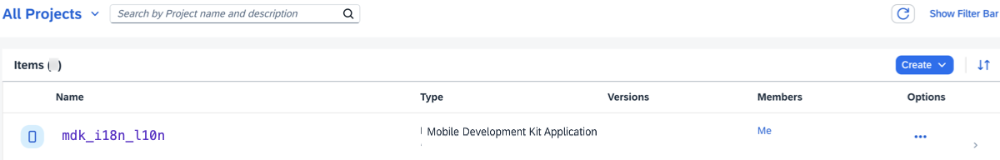
    
8. The project opens in SAP Business Application Studio.

    <!-- border -->  

    >When you open the SAP Business Application Studio for the first time, a consent window may appear asking for permission to track your usage. Please review and provide your consent accordingly before proceeding.
    > 

### Configure the Project Using Storyboard

The Storyboard provides a graphical view of the application's runtime resources, external resources, UI of the application, and the connections between them. This allows for a quick understanding of the application's structure and components.

- **Runtime Resources**: In the Runtime Resources section, you can see the mobile services application and mobile destination used in the project, with a dotted-line connected to the External Resources.
- **External Resources**: In the External Resources section, you can see the external services used in the project, with a dotted-line connection to the Runtime Resource or the UI app.
- **UI Application**: In the UI Applications section, you can see the mobile applications.

1. Click on **+** button in the **Runtime Resources** column to add a mobile services app to your project. 

    <!-- border --> 

    >This screen will only show up when your CF login session has expired. Use either `Credentials` OR  `SSO Passcode` option for authentication. After successful signed in to Cloud Foundry, select your Cloud Foundry Organization and Space where you have set up the initial configuration for your MDK app and click Apply.

    > 

2. Choose `myapp.mdk.demo` from the applications list in the **Mobile Application Services** editor.

    <!-- border -->  

3. Select `com.sap.edm.sampleservice.v4` from the destinations list and click **Add App to Project**.

    <!-- border -->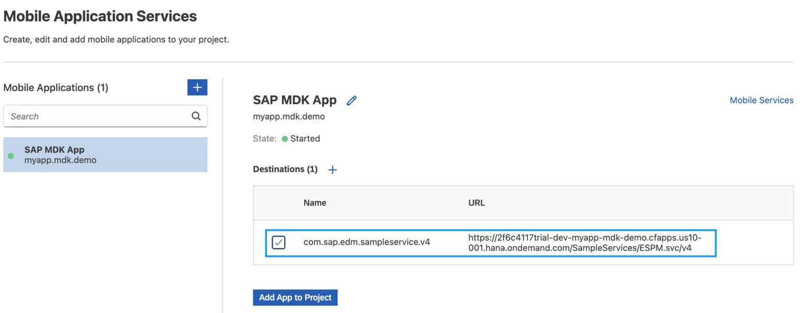  

    >You can access the mobile services admin UI by clicking on the Mobile Services option on the right hand side.

    In the storyboard window, the app and mobile destination will be added under the Runtime Resources column. The mobile destination will also be added under the External Resources with a dotted-line connection to the Runtime Resource. The External Resource will be used to create the UI application.

    <!-- border -->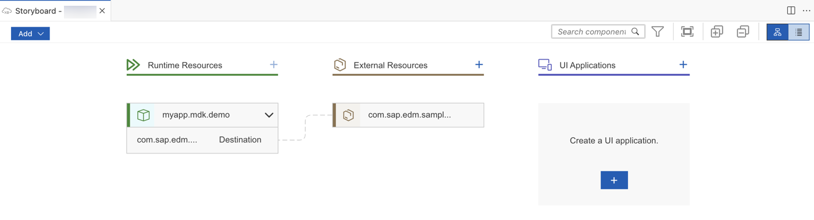      

4. Click the **+** button in the UI application column header to add mobile UI for your project.

    <!-- border -->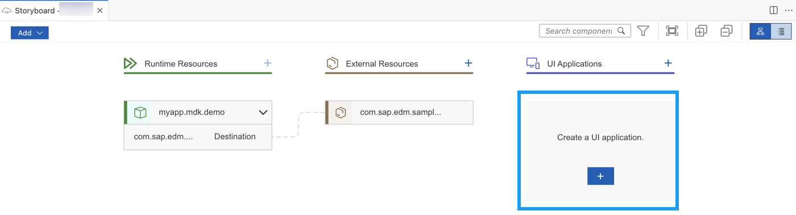     

5. In the **Basic Information** step, select the **MDK Template Type** as **List Detail**, leave the other options as they are. Since the option to **Enable Auto-Deployment to Mobile Services After Project Creation** is set to **Yes**, the MDK project will automatically be deployed to the Mobile Services after it is generated. Click **Next** to continue.

    <!-- border -->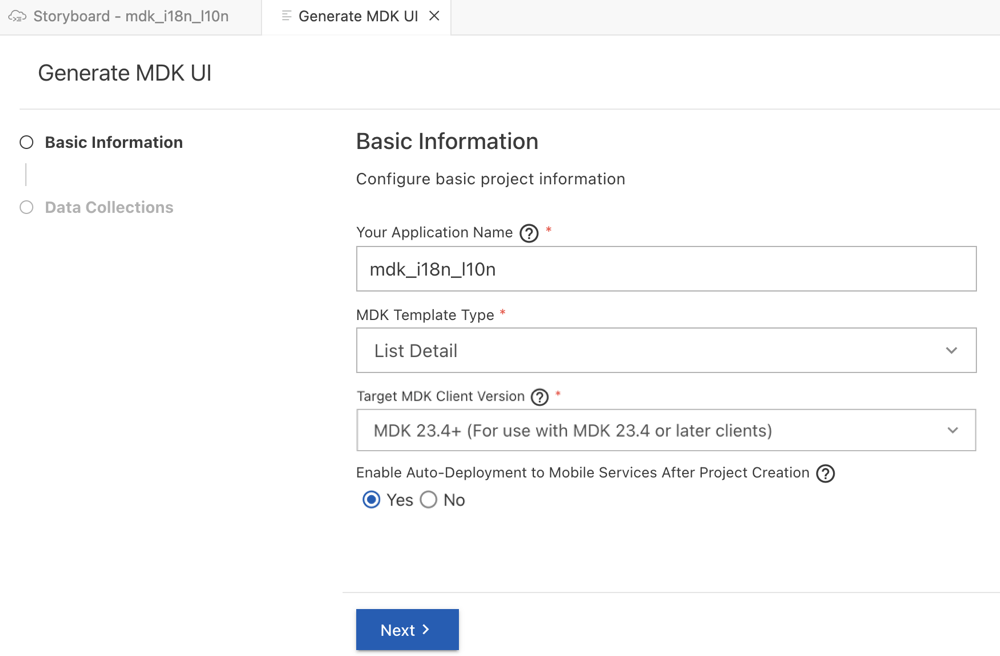  

    >The `List Detail` template generates the offline or online actions, rules, messages and pages to view records. More details on _MDK template_ is available in [help documentation](https://help.sap.com/doc/f53c64b93e5140918d676b927a3cd65b/Cloud/en-US/docs-en/guides/getting-started/mdk/bas.html#creating-a-new-project-cloud-foundry).

6. In the **Data Collections** step, provide the below information and click **Finish**. Data Collections step retrieves the entity sets information for the selected destination.

    | Field | Value |
    |----|----|
    | `Enter a path to service (e.g. /sap/opu/odata/sap/SERVICE_NAME)` | Leave it as it is  |
    | `Select the Service Type` | Leave the default value as `OData` |
    | `Enable Offline` | It's enabled by default |
    | `Select all data collections` | Leave it as it is |
    | `What types of data will your application contain?` | Select `Customers`  (if not selected by default) and select `SalesOrderHeaders` |

    <!-- border --> 

    Regardless of whether you are creating an online or offline application, this step is needed for app to connect to an OData service. When building an MDK Mobile application, it assumes the OData service created and the destination that points to this service is set up in Mobile Services.  

    >Since you have Enable Offline set to *Yes*, the generated application will be offline enabled in the MDK Mobile client.

    >Data Collections step retrieves the entity sets information for the selected destination.

7. After clicking **Finish**, the storyboard is updated displaying the UI component. The MDK project is generated in the project explorer and automatically deployed to the Mobile Services based on your selections. You will now see a QR code for onboarding the mobile app. Leave the Onboarding dialog box open for the next step.
 
    <!-- border --> 

    <!-- border --> 

### Run the Project

[OPTION BEGIN [Android]]

>Ensure that you choose the correct device platform tab above. Once you have scanned and onboarded using the onboarding URL, it will be remembered. If you log out and onboard again, you will be prompted to either continue using the current application or scan a new QR code.

1. Follow [these steps](https://github.com/SAP-samples/cloud-mdk-tutorial-samples/blob/main/Onboarding-Android-client/Onboarding-Android-client.md) to successfully on-board the MDK client on your Android device.

    After you accept app update, you will see the `Main` page and `Customers` and `SalesOrderHeaders` entity sets to navigate to List-Detail page.

    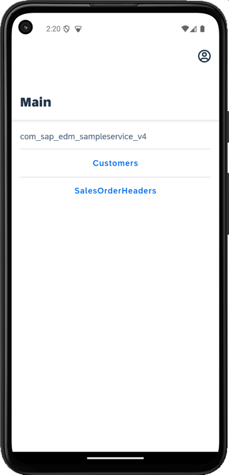

    >`com_sap_edm_sampleservice_v4` is the name of the service file generated in the project creation.

    In the next steps, you will learn how to translate the UI texts on this screen, including phrases such as `Main`, `Customers`, and `SalesOrderHeaders`, as well as items in the user menu like `Sync Changes` and `Check for Updates`, and `Reset` into their respective localized strings in the German language.

2. Tap `SalesOrderHeaders` to navigate to Sales order List. There are two control properties displaying Date and Gross Amount values generated by the template. You will also learn how you can format these values to be displayed based on the device's current locale.

    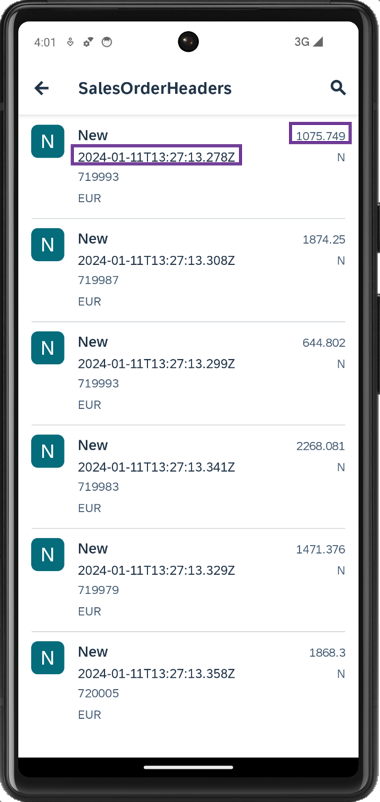

[OPTION END]

[OPTION BEGIN [iOS]]

>Ensure that you choose the correct device platform tab above. Once you have scanned and onboarded using the onboarding URL, it will be remembered. If you log out and onboard again, you will be prompted to either continue using the current application or scan a new QR code.

1. Follow [these steps](https://github.com/SAP-samples/cloud-mdk-tutorial-samples/blob/main/Onboarding-iOS-client/Onboarding-iOS-client.md) to successfully on-board the MDK client on your iOS device.

    After you accept app update, you will see the `Main` page and `Customers` and `SalesOrderHeaders` entity sets to navigate to List-Detail page.

    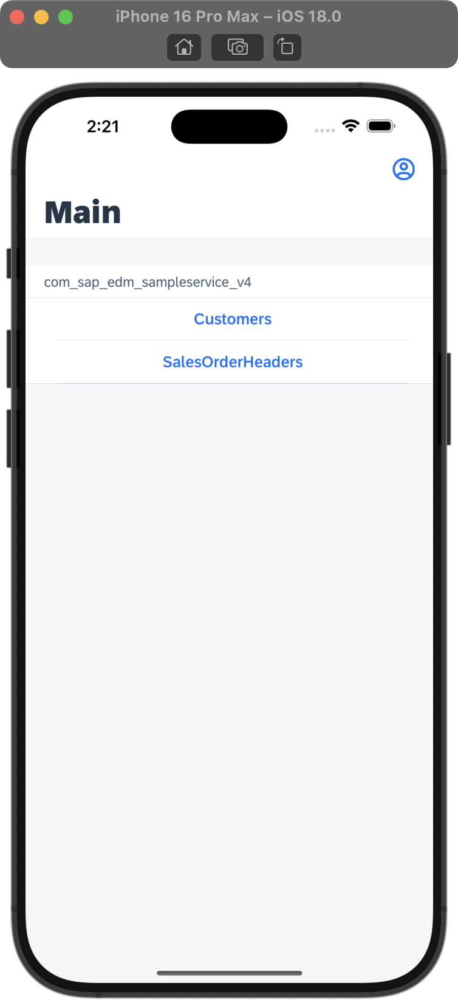

    >`com_sap_edm_sampleservice_v4` is the name of the service file generated in the project creation.

    In the next steps, you will learn how to translate the UI texts on this screen, including phrases such as `Main`, `Customers`, and `SalesOrderHeaders`, as well as items in the user menu like `Sync Changes` and `Check for Updates`, and `Reset` into their respective localized strings in the German language.

2. Tap `SalesOrderHeaders` to navigate to Sales Order List. There are two control properties displaying Date and Gross Amount values generated by the template. You will also learn how you can format these values to be displayed based on the device's current locale.

    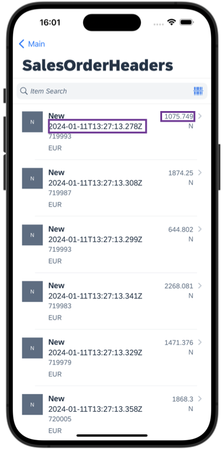

[OPTION END]

### Define the i18n Properties File

The `i18n.properties` file is where language & locale specific strings are stored.

The [file name structure](https://help.sap.com/doc/f53c64b93e5140918d676b927a3cd65b/Cloud/en-US/docs-en/guides/features/fiori-ui/mdk/i18n/i18n.html#properties-file) can consist of up to 4 parts:

 `<base_filename>_<language_code>_<script_code>_<region_specifier>.properties`

 for example: `myi18n_zh_Hant_HK.properties` = properties file for Chinese language with Traditional script specifier and Hong Kong region specifier.

For this tutorial, you will create the `i18n_de.properties` file for the German language.

1. Navigate to `MDK_i18n_l10n` | `i18n`, right click on the `i18n.properties` and open it with Text Editor. Replace the existing content with below.

    ```JSON
    Main_title=Main
    Customers=Customers
    Customer_Detail=Customer Detail
    SalesOrderHeaders=SalesOrderHeaders
    SalesOrderHeader_Detail=SalesOrderHeader Detail
    SalesOrderItem_Detail=SalesOrderItem Detail
    Support_popovermenuitem=Support
    About_popovermenuitem=About
    ```

    <!-- border -->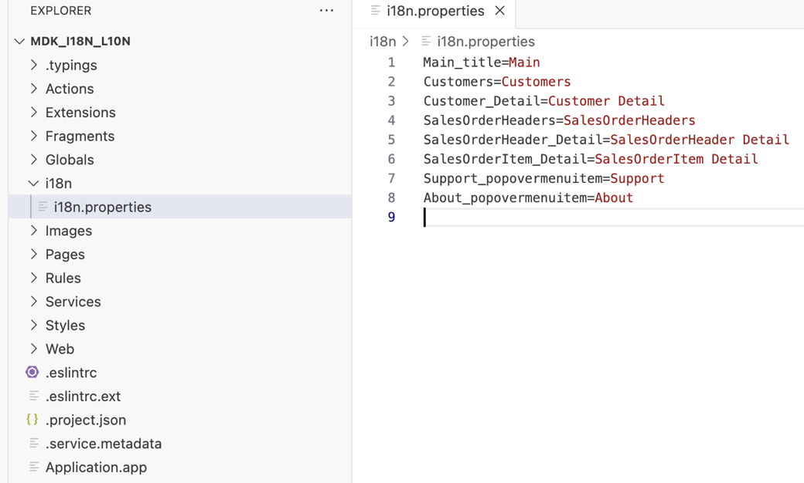

    >Each property file contains a list of localization strings that come in key value pair syntax.

    >`<Localization_Key>=<Localized_Value>`

2. Right-click the `i18n` folder and select **MDK: New i18n File**.

    <!-- border -->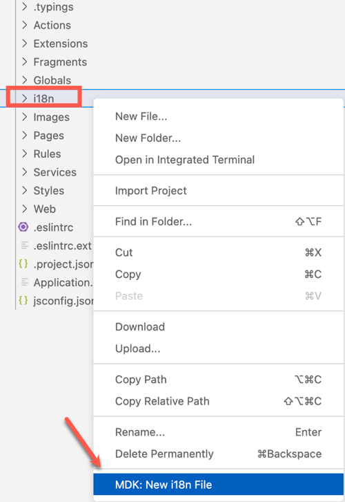

3. Enter the file **Name** as `i18n_de`, click **Finish**.

    <!-- border -->

4. The `i18n_de.properties` opens in the `i18n Editor`. Provide the following values for the existing keys under `i18n_de` column.

    | Key | Value |
    |----|----|
    | `Main_title` | `Haupt` |
    | `Customers` | `Kunden` |
    | `Customer_Detail` | `Kundendetail` |
    | `SalesOrderHeaders` | `Verkaufsauftragsübersicht` |
    | `SalesOrderHeader_Detail` | `Verkaufsauftragskopfdaten` |
    | `SalesOrderItem_Detail` | `Verkaufspositionsdetails` |
    | `Support_popovermenuitem` | `Unterstützung` |
    | `About_popovermenuitem` | `Über` |

    <!-- border -->


### Add Localized String Formatter


MDK applications support various localization formatter functions:

>
L: Localizable String

>
N: Number

>
C: Currency

>
S: Scientific

>
P: Percentage

>
DT: Date Time

>
D: Date

>
T: Time


You will use the Localizable String function to add language support on the Main page of your application.

1. Click `Main.page` to open it in the MDK Page Editor.

2. Once the page opens in the page editor, click on the white area to select it's Action Bar. In the **Properties** pane, click the **link** icon for the Page caption, select **i18n Objects** in the dropdown and double click on `main_title:"Main"` to bind Caption to the Localizable String.

    <!-- border -->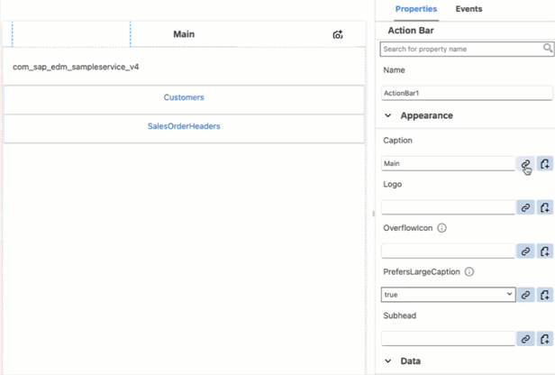

3. Similarly, update the **Title** for both `Customers` and `SalesOrderHeaders` Section buttons.  

    <!-- border -->

    <!-- border -->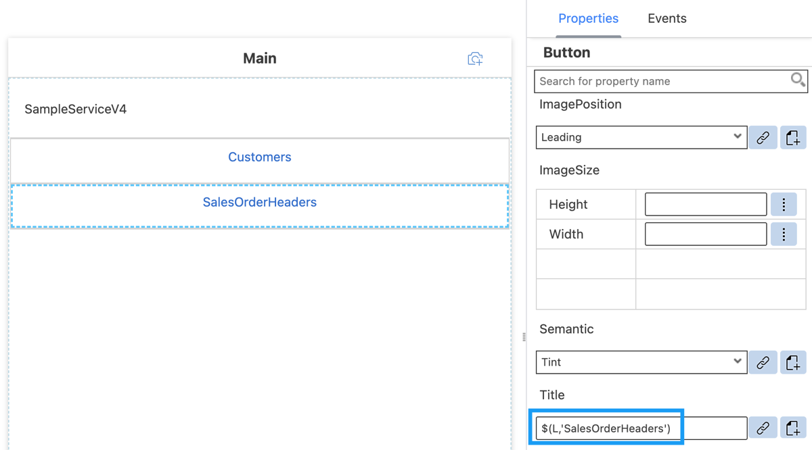

4. Navigate to **Actions** **&rarr;** **Application** **&rarr;** `UserMenuPopover.action` and update the **Title** for both `Support` and `About` Popover items to `$(L,'support_popovermenuitem')` and `$(L,'about_popovermenuitem')` respectively.

    <!-- border -->

You can find more information about Localized String formatter in [help documentation](https://help.sap.com/doc/f53c64b93e5140918d676b927a3cd65b/Cloud/en-US/docs-en/guides/getting-started/mdk/development/property-binding/i18n-formatter.html#localized-string-formatter).   


### Explore Currency Formatter

You will add `Currency` formatter in the `SalesOrderHeaders_List.page`.

`Syntax: $(C, <Value>, <Currency Code>, <Locale>, <Format Options>)`

1. Navigate to **Pages** **&rarr;** `com_sap_edm_sampleservice_v4_SalesOrderHeaders` **&rarr;** `SalesOrderHeaders_List.page`.

2. You'll update the Object Table control's `StatusText` property which is currently bound to the OData property `{GrossAmount}`. You will format the property value using the `Currency` formatter.

3. In the **Properties** pane, click the **link** icon for the `StatusText` property.

4. Cut or remove the default expression in the object browser.

5. Select **i18n Objects** in the dropdown and then select **Currency** in the formatters dropdown.

6. Click **Insert** to generate the expression, **do not close the Object Browser window**.

    <!-- border -->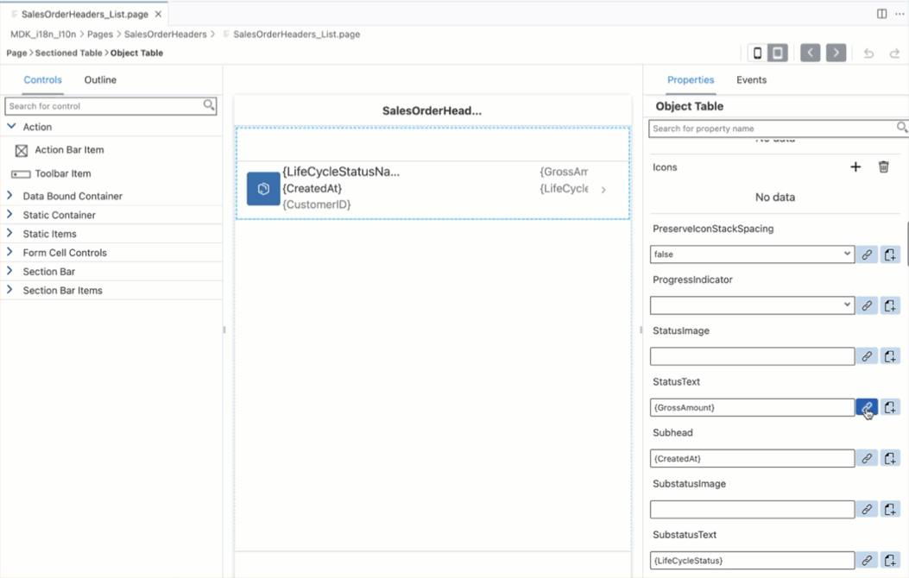

    The generated expression looks like below:

    ```JSON
    $(C,,,'',{minimumIntegerDigits:1,minimumFractionDigits:0,maximumFractionDigits:2,useGrouping:true})
    ```
7. You will now bind the Currency value placeholder with the `GrossAmount` property of the `SalesOrderHeaders` entity. Put the cursor before the second comma (from left side). 

8. Choose **OData Objects** option from the dropdown, select the `GrossAmount` property under the `SalesOrderHeader`. Click **Insert** to generate the expression, **do not close the Object Browser window**. 

    <!-- border -->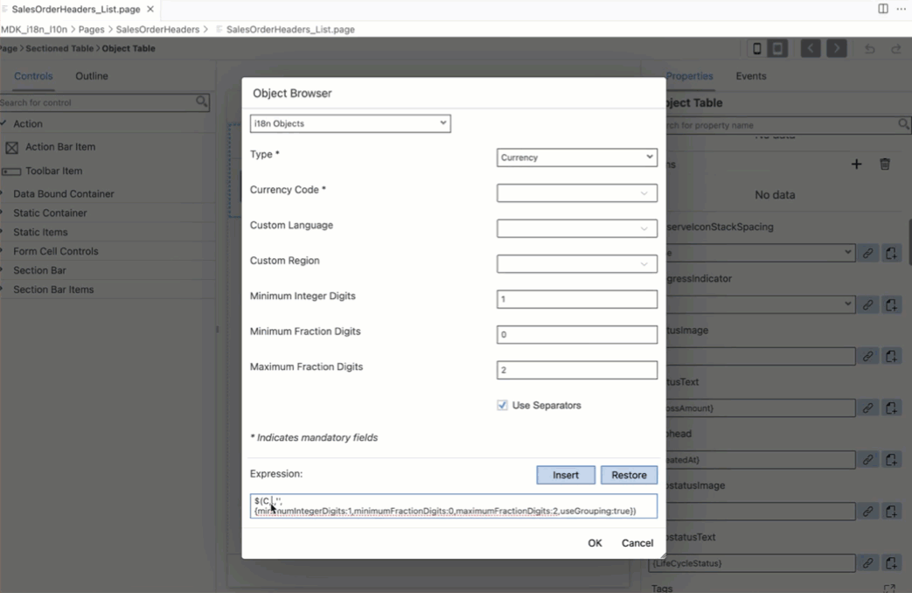

    The new expression looks like below:

    ```JSON
    $(C,{GrossAmount},,'',{minimumIntegerDigits:1,minimumFractionDigits:0,maximumFractionDigits:2,useGrouping:true})
    ```

9. You will now bind the Currency Code placeholder. Since there is already an OData property `CurrencyCode` part of `SalesOrderHeaders` entity, it would be best to use the value coming directly from the backend instead providing a constant value. Put the cursor before the third comma (from left side). Select the `CurrencyCode` property under the `SalesOrderHeader` and click **Insert** to generate the expression.
    
    <!-- border -->

    The generated expression looks like below:

    ```JSON
    $(C,{GrossAmount},{CurrencyCode},'',{minimumIntegerDigits:1,minimumFractionDigits:0,maximumFractionDigits:2,useGrouping:true})
    ```

10. Click **OK**.

    >For more details on these formatters, check the [help documentation](https://help.sap.com/doc/f53c64b93e5140918d676b927a3cd65b/Cloud/en-US/docs-en/guides/getting-started/mdk/development/property-binding/i18n-formatter.html#formatter-indicator).

### Explore DateTime Formatter

1. You will now format the **Subhead** property's value `{CreatedAt}` using `DateTime` formatter.

    `Syntax: $(DT, <Value>, <Locale>, <Timezone>)`

2. Click the **link** icon for the **Subhead** property.

3. Cut or remove the default expression in the object browser, select **i18n Objects** in the dropdown, select `DateTime` in the formatters dropdown.

4. Select **Medium** for **Display Format** and click **Insert** to generate the expression, **do not close the Object Browser window**.

    <!-- border -->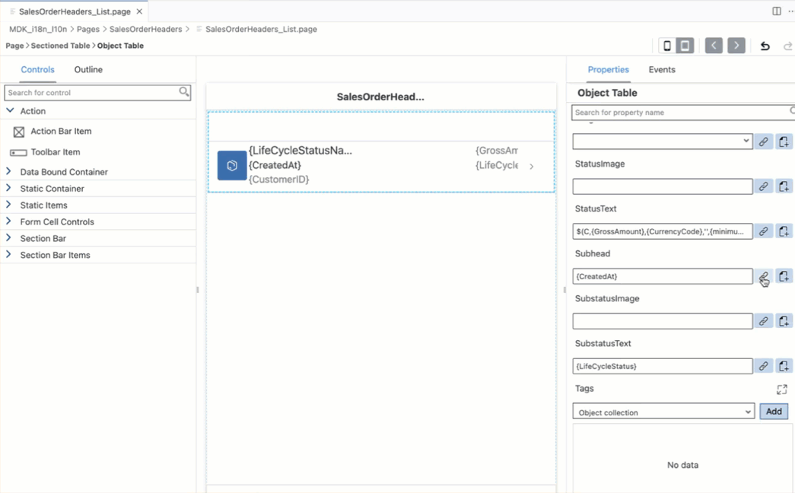

    The generated expression should look like below:

    ```JSON
    $(DT,,'','',{format:'medium'})
    ```

5. You will now bind the `DateTime` value placeholder with the `CreatedAt` property of the `SalesOrderHeaders` entity. Put the cursor before the second comma (from left side). Choose **OData Objects** option from the dropdown, select the `CreatedAt` property under the `SalesOrderHeader` and click **Insert** to generate the new expression.

    <!-- border -->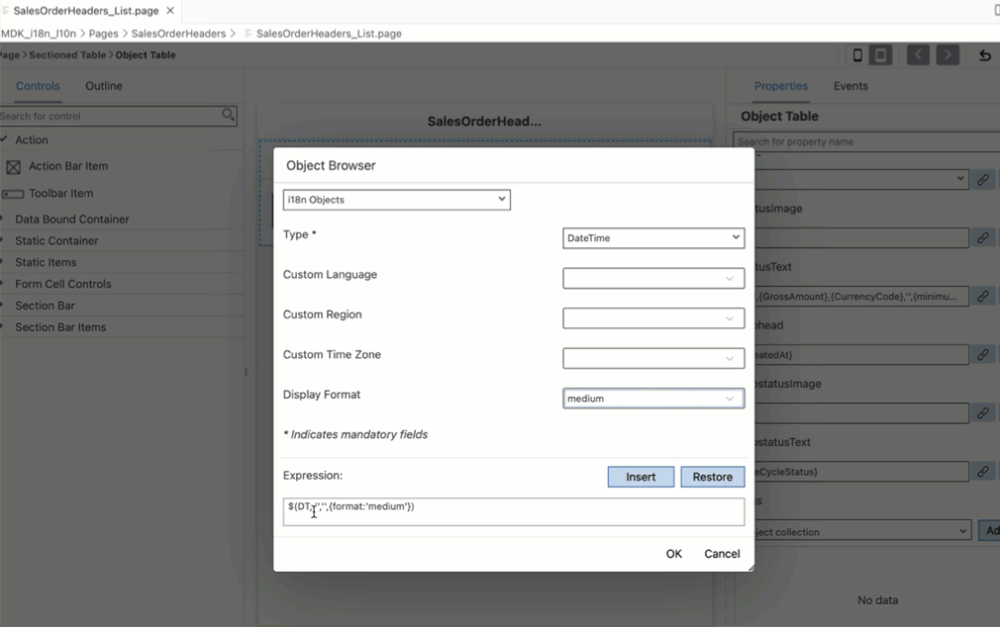

6. The new expression looks like below. Click **OK**.

    ```JSON
    $(DT,{CreatedAt},'','',{format:'medium'})
    ```

    >For Time formatter, you must still provide the full date-time value, the result will only include time portion.


### Redeploy the Project

You will now deploy the updated project to your MDK client.

Click the **Deploy** option in the editor's header area, and then choose the deployment target as **Mobile Services** 

<!-- border -->


### Update the app

[OPTION BEGIN [Android]]

1. Tap **Check for Updates** in the user menu on the Main page, you will see a _New Version Available_ pop-up, tap **Now**.

    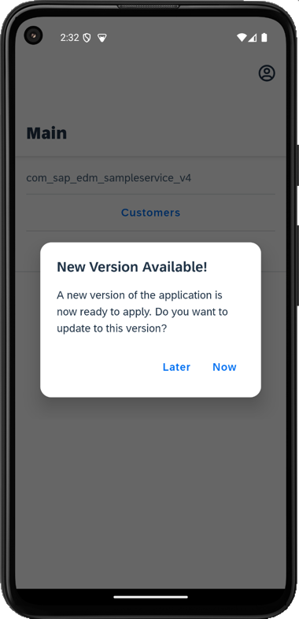

2. Navigate to `SalesOrderHeaders` list page. You will notice the formatted values as per device's or app's current locale and timezone.

    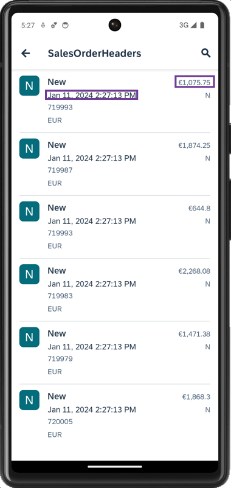

3. Go to your device settings and change the device language to Deutsch. Relaunch the MDK client, you will now notice the localized strings on main page.

    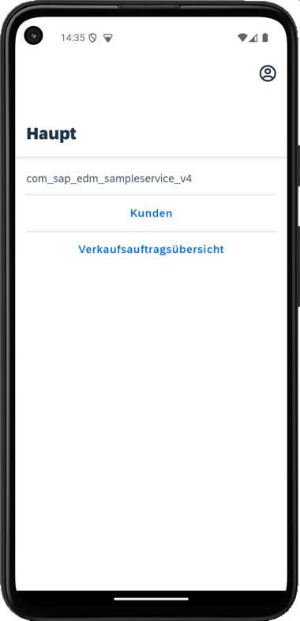
    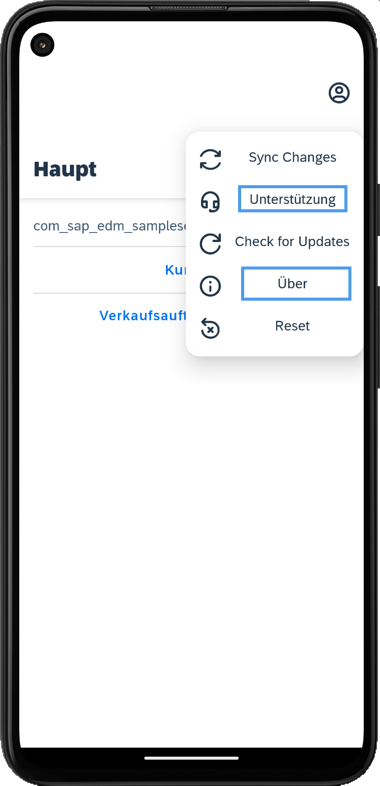    

4. Tap **`Kundenaufträge`** to navigate to Sales order list page. You will notice the updated formatter values as per device's current locale and timezone.    

    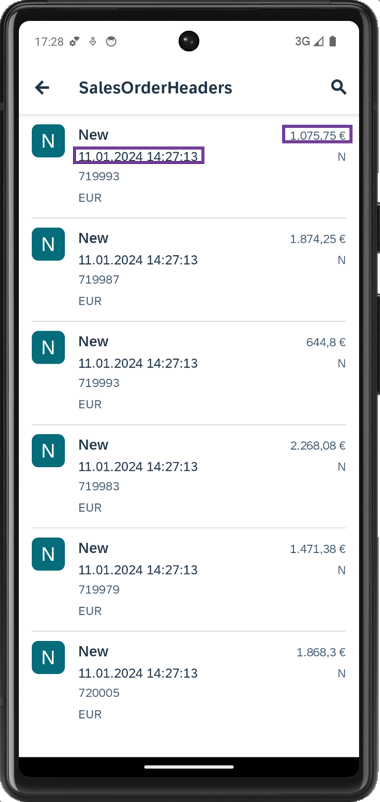

[OPTION END]

[OPTION BEGIN [iOS]]

1. Tap **Check for Updates** in the user menu on the Main page, you will see a _New Version Available_ pop-up, tap **Now**.

    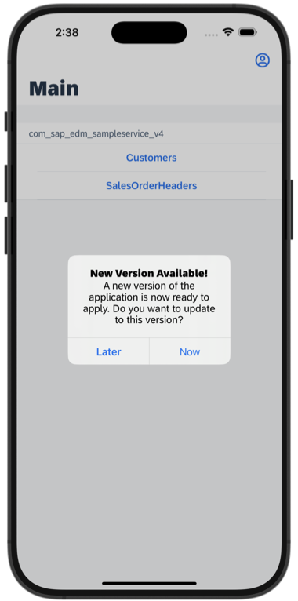

2. Navigate to `SalesOrderHeaders` list page. You will notice the formatted values.

    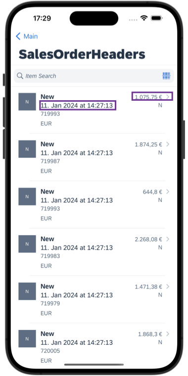

3. Change the device language to German. (Settings>General>Language & Region>Preferred Languages). Relaunch the MDK client, you will now notice the localized strings on main page.

    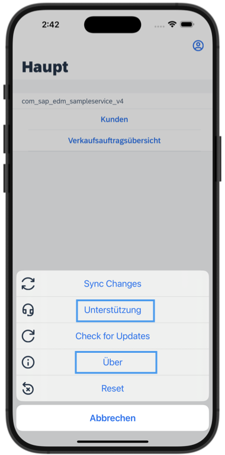

4. Tap **`Kundenaufträge`** to navigate to Sales order list page. You will notice the updated formatter values as per device's current locale and timezone.    

    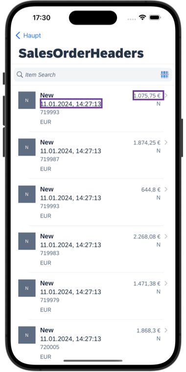    


[OPTION END]

---
