# Implement Create Entity and Linking Entities in an MDK App
<!-- description --> Create relationship between two OData entities.

## You will learn
  - How to create relationship between parent and child entities
  - How to create a child entity to an existing parent entity
  - How to create a parent entity first and then a child  entity
  - How to implement dynamic data subscription

## Intro
You may clone an existing project from [GitHub repository](https://github.com/SAP-samples/cloud-mdk-tutorial-samples/tree/main/3-Enhance-Your-First-MDK-App-with-Additional-Functionalities/4-cp-mobile-dev-kit-customer-order) to start with this tutorial.

---

For this tutorial, you will use [Mobile Services sample backend](cp-mobile-dev-kit-ms-setup) (step 3) which has parent-child relationship setup among entities. For example, A customer can have `n` (>=0) number of sales orders.

To create an entity and then link it to another entity, you need to carry out the following tasks:

*  Create a new page for creating an order
*  Add an action bar item to the new page for cancelling the current activity
*  Create a new `CreateRelatedEntity` OData action to  create a new sales order  
*  Create a new message action for displaying failure message if order creation fails
*  Create a navigation action to show order creation page from Customer detail page
*  Implement data subscription to update count value when a new sales order is created

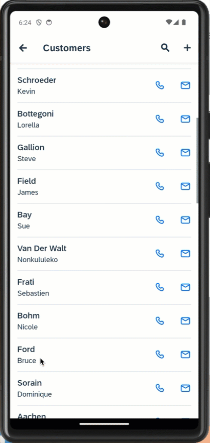

### Create new page for new Sales order record

In this step, you will create a Section page with a Form Cell Section to contain the Form Cell controls. You will then add the fields that will be editable by the end-user.

1. Right-click the **Pages** folder | **MDK: New Page** | **Section** | **Next**.

    <!-- border -->

2. In the **Base Information** step, enter the Page Name as `SalesOrderHeaders_Create` and click **Finish** to complete the page creation process.

    <!-- border -->

3. In the Properties pane, set the **Caption** to **Create Order**.

    <!-- border -->

4. Now, you will add the fields (like Currency Code, Net Amount, Tax Amount, Gross Amount, Life cycle status, Life cycle status name and order creation date) for creating a new sales order record by the end-user. In the Layout Editor, expand the **Static Container** group. Drag and drop **Form Cell Section** onto the Page area.

    <!-- border -->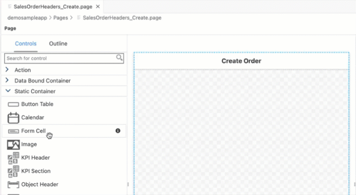

    >Form Cell Section is used to contain Form Cell controls in a section page.

5. You will now add Form Cell controls in the Form Cell Section. Expand the **Form Cell Controls** group, drag and drop a **Simple Property** onto the Page area.

    <!-- border -->

6. Drag and drop five additional **Simple Property** controls and one **Date Picker** control onto the page so you have seven total controls.

    <!-- border -->

7. Select the first **Simple Property control** and provide the below information:

    | Property | Value |
    |----|----|
    | `Name`| `FCCreateCurrencyCode` |
    | `Caption` | `Currency Code` |
    | `Value`| `EUR` |

    <!-- border -->

    >Under **Value** property, you can set some default values.

8. Select the second **Simple Property control** and provide the below information:

    | Property | Value |
    |----|----|
    | `Name`| `FCCreateNetAmount` |
    | `Caption` | `Net Amount` |
    | `Value`| `18.010` |

    <!-- border -->

9. Select the third **Simple Property control** and provide the below information:

    | Property | Value |
    |----|----|
    | `Name`| `FCCreateTaxAmount` |
    | `Caption` | `Tax Amount` |
    | `Value`| `108.010` |

    <!-- border -->

10. Select the forth **Simple Property control** and provide the below information:

    | Property | Value |
    |----|----|
    | `Name`| `FCCreateGrossAmount` |
    | `Caption` | `Gross Amount` |
    | `Value`| `126.02` |

    <!-- border -->

11. Select the fifth **Simple Property control** and provide the below information:

    | Property | Value |
    |----|----|
    | `Name`| `FCCreateLifeCycleStatus` |
    | `Caption` | `Lifecycle Status` |
    | `Value`| `N` |

    <!-- border -->

12. Select the sixth **Simple Property control** and provide the below information:

    | Property | Value |
    |----|----|
    | `Name`| `FCCreateLifeCycleStatusName` |
    | `Caption` | `Lifecycle Status Name` |
    | `Value`| `New` |

    <!-- border -->

12. Select the last control **Date Picker** and provide the below information:

    | Property | Value |
    |----|----|
    | `Name`| `FCCreatedate` |
    | `Caption` | `Creation Date` |
    | `Mode`| Select `Datetime` from the dropdown if not selected by default |

    <!-- border -->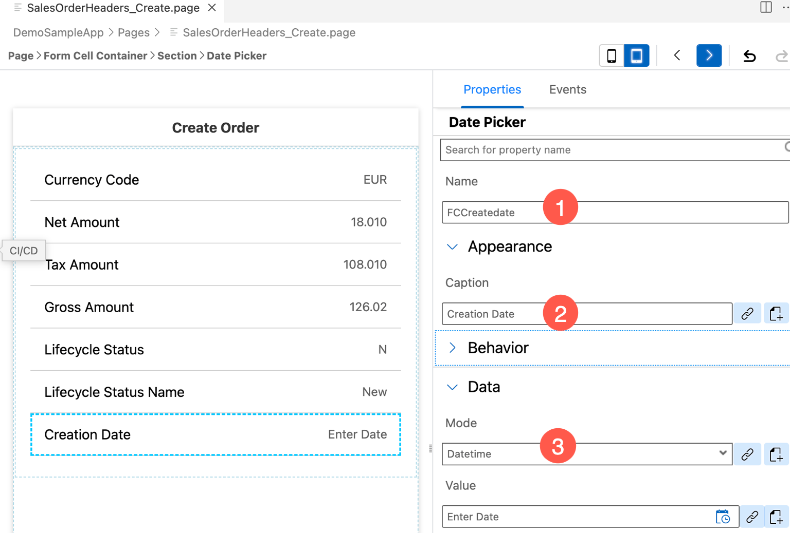

### Add cancel button on create Sales Order page

Now, you will add a button on the Create Order page and set its `onPress` to `CloseModalPage_Cancel.action`.

1. Drag and drop an **Action Bar Item** to the upper left corner of the action bar.

    >Action Bar Item is a button that users can use to fire actions when pressed. You can add an Action Bar Item only to the Action Bar (at the top of the page).

    <!-- border -->

2. In the **Properties** pane, click the **link icon** to open the object browser for the **System Item** property.

    Double click the **Cancel** type and click **OK**.

    <!-- border -->

    >System Item are predefined system-supplied icon or text. Overwrites _Text_ and _Icon_ if specified.

3. Now, you will set the `onPress` event to `CloseModalPage_Cancel.action`.

    In **Events** tab, click the 3 dots icon for the `OnPress` property to open the **Object Browser**.

    Double click the `CloseModalPage_Cancel.action` and click **OK** to set it as the `OnPress` Action.

    <!-- border -->

### Store the created data locally

The next step is to store newly created record locally for an offline application or send the new record directly back to the backed for online applications.

* You will add an Action Bar item on the `SalesOrderHeaders_Create.page` that will call an OData Create Entity action to save the record
* You may want to close the page when the OData Create Entity action is successful
* You may want to show a failure message if the OData Create Entity action fails to save the changes

1.  In `SalesOrderHeaders_Create.page`, **drag and drop** an **Action Bar Item** to the upper right corner of the action bar.

    <!-- border -->

2. Click the **link** icon to open the object browser for the **System Item** property. Double-click the **Save** type and click **OK**.

    <!-- border -->

3. Navigate to the **Events** tab. Click the 3 dots icon for the `OnPress` property and select the `Create a rule/action`.

    <!-- border -->

4. Keep the default selection for the *Object Type* as Action and *Folders* path.

    <!-- border -->      

5. In the **Template Selection** step, choose **Data** in **Category** | click **OData** | **Next**.

    <!-- border -->  

6. In the **Base Information** step, provide the below information:

    | Property | Value |
    |----|----|
    | `Name`| `SalesOrderHeaders_CreateEntity` |
    | `Type` | Select `CreateRelatedEntity` from the dropdown |
    | `Service`| Select `SampleServiceV2.service` from the dropdown |
    | `EntitySet` | Select `SalesOrderHeaders` from the dropdown |

    <!-- border -->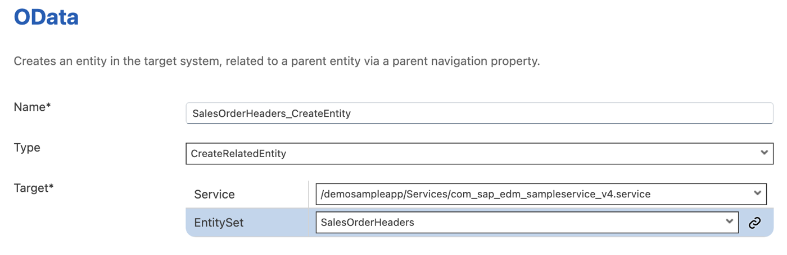

    >`CreateRelatedEntity` action creates the new entity against the navigation property of an existing entity with which the relationship is to be established. You can find more details about [Create Related Entity Action](https://help.sap.com/doc/69c2ce3e50454264acf9cafe6c6e442c/Latest/en-US/docs-en/reference/schemadoc/Action/ODataService/CreateRelatedEntity.schema.html).

7. Click **Next**.

8. In **Parent Link and Properties Selection** step, provide the below information:

    | Property | Value |
    |----|----|
    | `ParentLink`| `LinkItem Reference` |
    | `Target EntitySet` | Select `Customers` from the dropdown |
    | `ReadLink`| click link icon and double click `readLink` |
    | `Property` | Select `SalesOrders` from the dropdown |

    <!-- border -->

    >In [Mobile Services sample backend](cp-mobile-dev-kit-ms-setup), click **Metadata URL** and you will find `SalesOrders` navigation property for `Customers` entity.

9. Since in `SalesOrderHeaders_Create.page`, we have defined seven properties (Currency Code, Net Amount, Tax Amount, Gross Amount, Life Cycle Status, Life Cycle Status Name and Creation Date) to be added, now in **Properties** section, you will bind them to respective UI Controls.

    Check the `CreatedAt` property and click the **link icon** to open the object browser.

    Change the drop down in the object browser to `Controls & ClientData`, click the **Current Page** radio button.

    In the search box start typing the control name `FCCreatedate`. The list will filter down to show the matching values. Double click the **Value (Value)** entry under the `FCCreatedate` field and click **OK** to set binding.

    <!-- border -->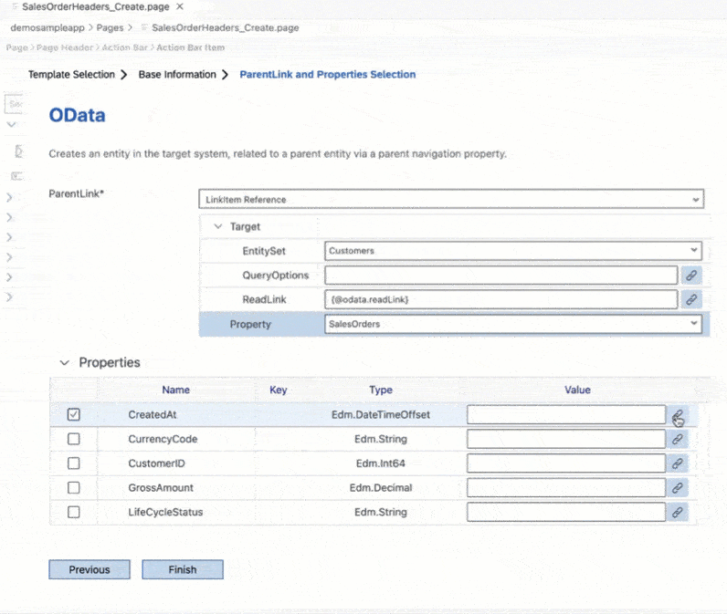

10. Repeat the above step for remaining properties: `CurrencyCode`, `GrossAmount`, `LifeCycleStatus`, `LifeCycleStatusName`, `NetAmount` and `TaxAmount`.

    <!-- border -->

11. Click **Finish** to complete the action creation process. The action editor will open with the `SalesOrderHeaders_CreateEntity.action` loaded.

12. When the above OData action is executed, you may want to display messages on its success and failure behavior. For example, on its success, you may want to close the page and allow any execution to continue. On its failure, you may want to display an error. In the `SalesOrderHeaders_CreateEntity.action`, scroll down and expand the *Common Action Properties* section. Click the link icon to open the object browser for the *Success Action* and bind it to `CloseModalPage_Complete.action`.

    <!-- border -->

13. Create a message action displaying error in case of the create failure. In the `SalesOrderHeaders_CreateEntity.action`, click the `Create a rule/action` icon for the *Failure Action*.

    <!-- border -->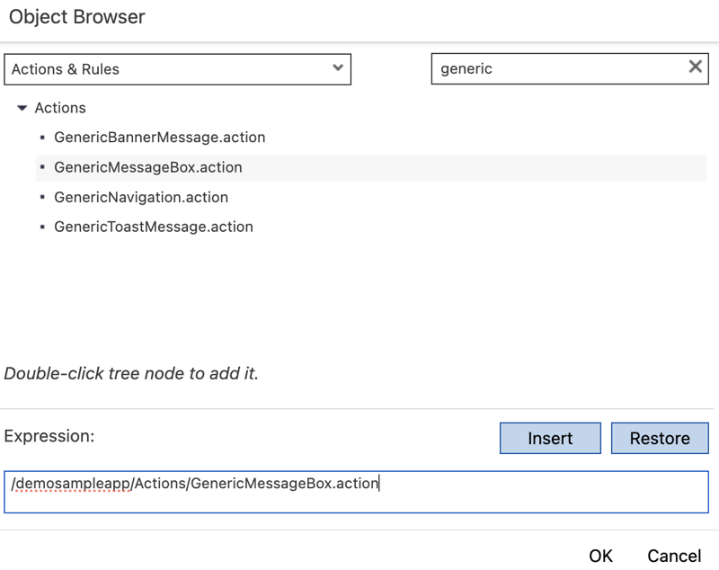

14.  Keep the default selection for the *Object Type* as Action and *Folders* path.

    <!-- border -->     

15. In the **Template Selection** step, choose **Message** in **Category** | click **Message** | **Next**.

    <!-- border -->

16. In the **Base Information** step, provide the below details:

    | Property | Value |
    |----|----|
    | `Name`| `CreateSalesOrderHeaderEntityFailureMessage` |
    | `Type` | Select `Message` from the dropdown |
    | `Message` | `Failed to Create Sales Order record - {#ActionResults:SalesOrderHeaders_CreateEntity/error}` |
    | `Title` | `Create Sales Order` |
    | `OKCaption` | `OK` |
    | `OnOK` | `--None--` |
    | `CancelCaption` | leave it blank |
    | `OnCancel` | `--None--`|

    <!-- border -->

    >`SalesOrderHeaders_CreateEntity` is the Action Result value of the `SalesOrderHeaders_CreateEntity.action`. This reference is used to pass the results to subsequent actions in the chain. These actions can reference the action result as needed. In this case if there is a failure, you access the error property of the action result to display the OData failure message.

17. Click **Finish** to complete the action creation process. 

    When `SalesOrderHeaders_CreateEntity.action` gets executed successfully then `CloseModalPage_Complete.action` will be triggered or if `Customers_CreateEntity.action` fails then `CreateSalesOrderHeaderEntityFailureMessage.action` will be triggered.

### Navigate to the Customer Create page

You will open the `SalesOrderHeaders_Create.page` from the Customer Detail page. For this, you will add a ToolBar item on the Customer Details page and will link it to a navigation action. When the ToolBar item is pressed by the end-user that will open the `SalesOrderHeaders_Create.page`.

1. In `Customers_Detail.page`, drag and drop a **Toolbar Item** to the lower left of the page.

    <!-- border -->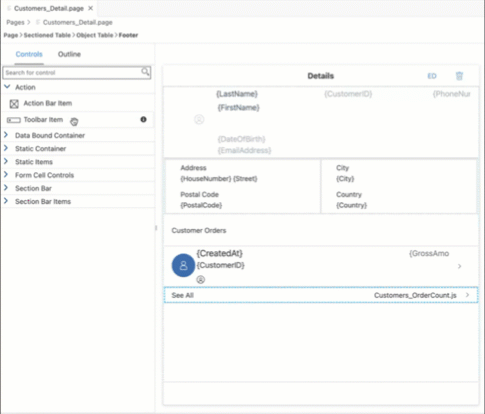

2. In the Properties pane, set **Caption** to **Create Order**.

    <!-- border -->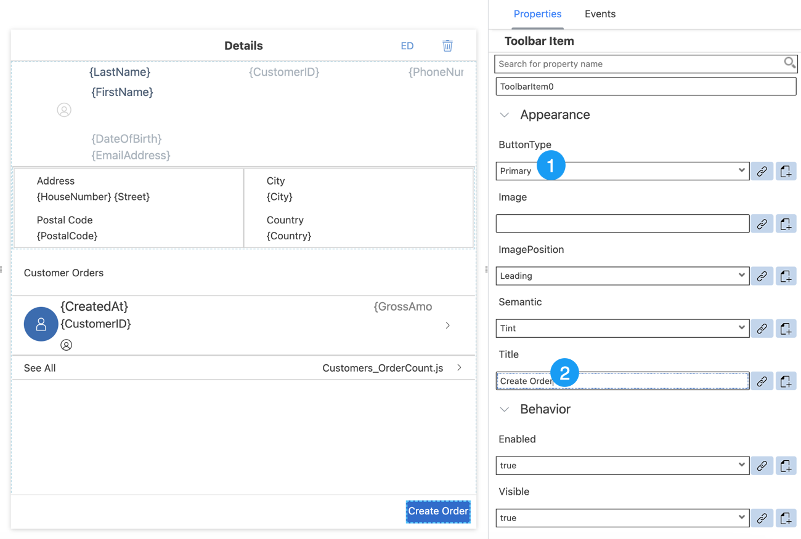

3. Navigate to the **Events** tab. Click the 3 dots icon for the `OnPress` property and select the `Create a rule/action`.    

    <!-- border -->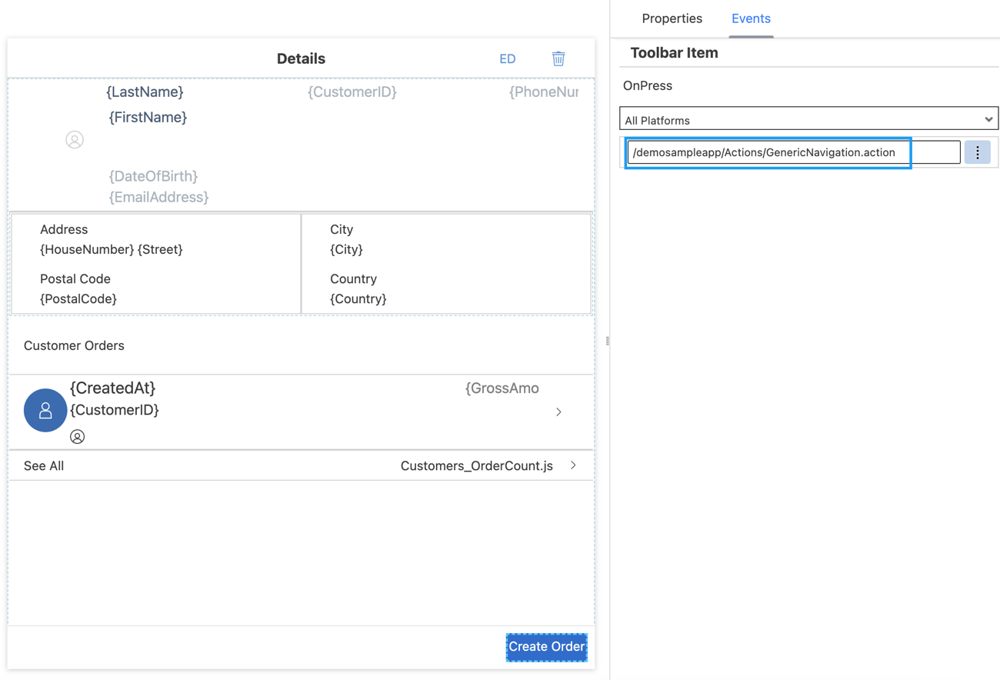

4. Keep the default selection for the *Object Type* as Action and *Folders* path.

    <!-- border -->     

5. In the **Template Selection** step, choose **UI** in **Category** | click **Navigation** | **Next**.

    <!-- border -->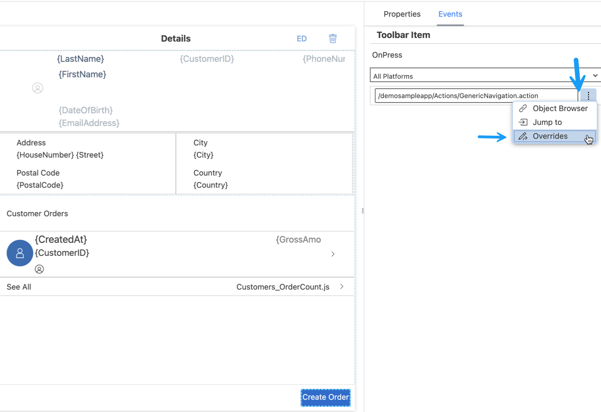

6. In the **Base Information** step, provide the below details:

    | Property | Value |
    |----|----|
    | `Name`| `NavToSalesOrderHeaders_Create` |
    | `PageToOpen` | Select `SalesOrderHeaders_Create.page` from the dropdown |
    | `ModalPage`| Select `true` from the dropdown |

    <!-- border -->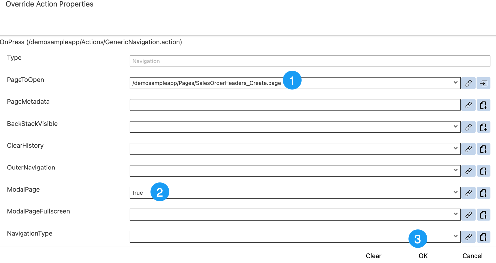

7. Click **Finish** to complete the action creation process.

### Add data subscription to Customer detail page

In `Customers_Detail.page` you added total number of order counts for a given customer. When a new `SalesOrder` is created, this count doesn't get updated automatically unless you navigate back and forth to this page.

> `DataSubscriptions` : it is a way to listen to data changes that when triggers should cause a UI element to redraw. If your control or section has a target, that target is automatically subscribed for data change events. Otherwise you can also explicitly subscribe to `DataSubscriptions` by specifying an entity set name or `readLink` in an array. You can find more details [here](https://help.sap.com/doc/69c2ce3e50454264acf9cafe6c6e442c/Latest/en-US/docs-en/reference/schemadoc/definitions/DataSubscriptions.schema.html).

In `Customers_Detail.page`, select **Customer Orders** Object Table control. In **Properties** section, click `+` icon under **Misc** | `DataSubscriptions` and double click `SalesOrderHeaders` and click **OK**.

<!-- border -->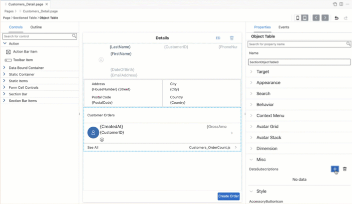

### Deploy the application

Deploy the updated application to your MDK client.

1. Right-click `Application.app` and select **MDK: Deploy**.

    <!-- border -->

2. Select deploy target as **Mobile & Cloud**.

    <!-- border -->

    You should see success message for both deployments.

    <!-- border -->

    >Alternatively, you can select *MDK: Redeploy* in the command palette (View menu>Find Command OR press Command+Shift+p on Mac OR press Ctrl+Shift+P on Windows machine), it will perform the last deployment.

    ><!-- border -->

### Run the app

>Make sure you are choosing the right device platform tab above.

[OPTION BEGIN [Android]]

1. Tap **Update** on the Main page, you will see a _New Version Available_ pop-up, tap **Now**.

    

2. Tap **Customers**, tap one of the available customer record, you will then navigate to Customer detail page.

3. You will see the **Create Order** option in customer detail page. Tap it to create a new sales order.

    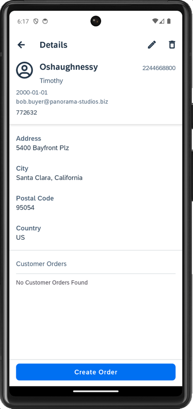

4. As you provided default values to the properties, you may change it if required. Tap **save** icon.

    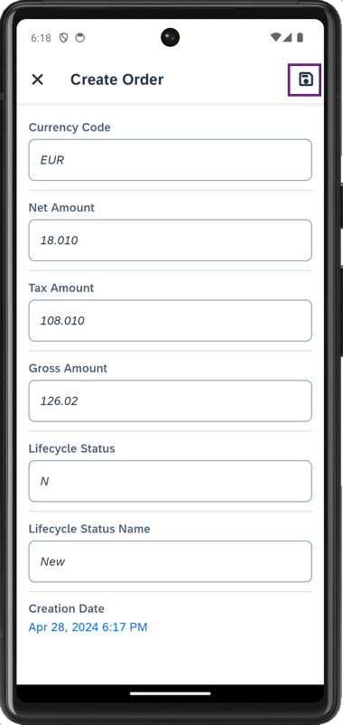

    Now, you will notice that new record has been created and count value for **See All** is now increased by one as you implemented in step 6.

    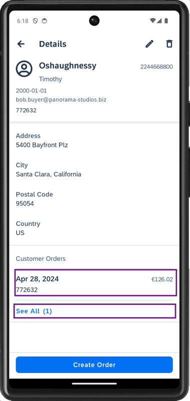

5. On Main page, tap **Sync** to send local changes to the backend, a successful message will be shown.

    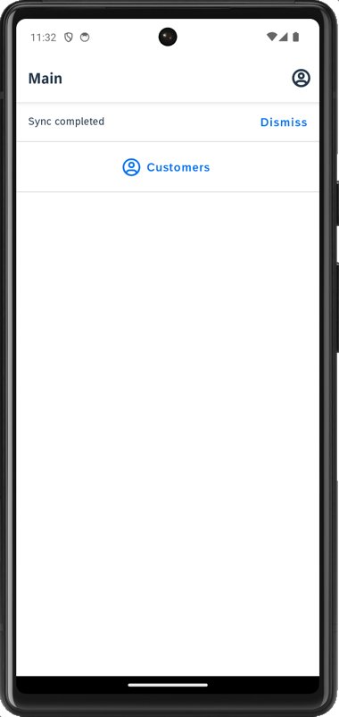
    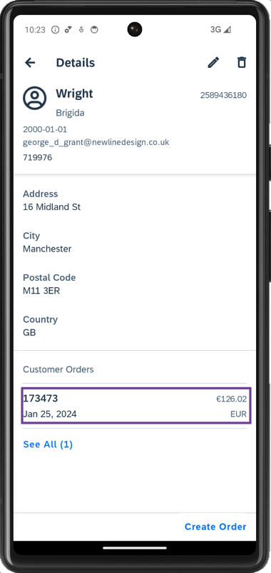

[OPTION END]

[OPTION BEGIN [iOS]]

1. Tap **Update** on the Main page, you will see a _New Version Available_ pop-up, tap **Now**.

    

2. Tap **Customers**, tap one of the available customer record, you will then navigate to Customer detail page.

3. You will see the **Create Order** option in customer detail page. Tap on it to create a new sales order.

    

4. As you provided default values to the properties, you may change it if required. Tap **Save**.

    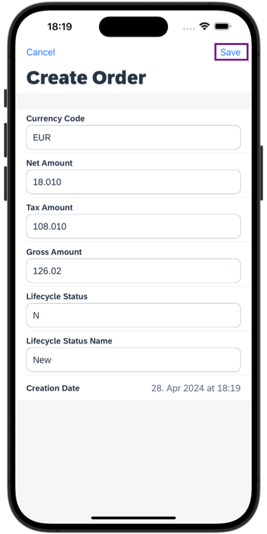

    Now, you will notice that new record has been created and count value for **See All** is increased by one as you implemented in step 6.

    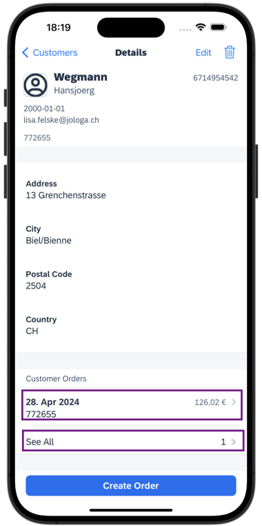

5. On Main page, tap **Sync** to send local changes to the backend, a successful message will be shown.

    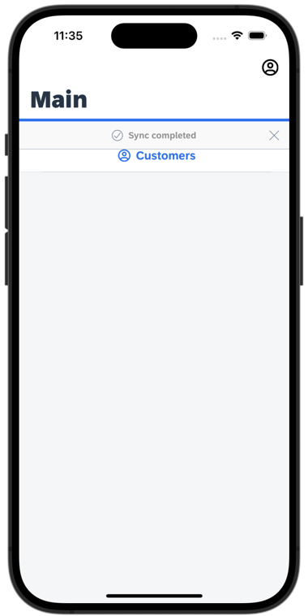  
      

[OPTION END]

[OPTION BEGIN [Web]]

1. Either click the highlighted button or refresh the web page to load the changes.

    <!-- border -->

    >If you see the error `404 Not Found: Requested route ('xxxxx-dev-nsdemosampleapp-approuter.cfapps.xxxx.hana.ondemand.com') does not exist.` while accessing the web application, make sure that in your space cockpit, highlight applications are in started state.

    ><!-- border -->

2. Click **Customers** | click one of the available customer record, you will then navigate to Customer detail page.

3. You will see the **Create Order** option in customer detail page. Click it to create a new sales order.

    <!-- border -->

4. As you provided default values to the properties, you may change it if required. Click **Save**.

    <!-- border -->

    Now, you will notice that new record has been created and count value for **See All** is increased by one as you implemented in step 6.

    <!-- border -->

[OPTION END]

Once you complete this tutorial, you can continue with [Level Up with the Mobile Development Kit](mission.mobile-dev-kit-level-up) mission.

---
