# Create Your First MDK Application Using MCP Server
<!-- description --> Use the MCP server with agentic AI to create a cross-platform SAP MDK application using a natural language prompt.

## You will learn
  - How to use the MCP server with an AI agent to generate an MDK offline project from a natural language prompt
  - How to deploy the generated MDK project to SAP Mobile Services using agentic tools
  
---


### Log On to the Cloud Foundry Environment

In this step, you will connect to your SAP BTP Cloud Foundry organization and space.

1. Create an empty folder on your machine and open it in **Visual Studio Code**. This folder will be used to generate your Mobile Services project.

2. In Visual Studio Code, open the terminal by choosing **View** &rarr; **Terminal**.

3. Run the following command using single sign-on (SSO). The Cloud Foundry CLI displays a login URL and prompts you to enter a temporary authentication code.

    ```bash
    cf login -a <API Endpoint URL> --sso
    ```

    >You can find your specific API endpoint of your Cloud Foundry organization on your SAP BTP subaccount overview page. 
    >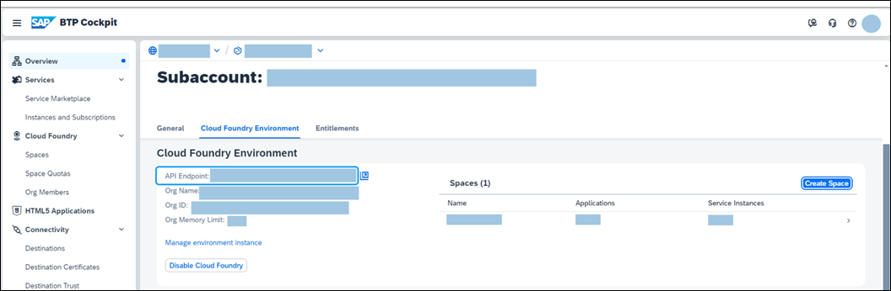

4. Open the URL displayed in the terminal to access the logon screen.
    If this is your first time logging in, or if your browser cookies have been cleared, you will be prompted to provide the origin key of your custom identity provider or choose the default identity provider. Otherwise, the sign-in page lists previously used identity providers.

5. Choose your identity provider account. If you do not have an active session, you will be prompted to log in. After successful authentication, you will receive a temporary authentication code.

6. Enter the passcode in the terminal window. Once logged in successfully, you can select your organization and space.

    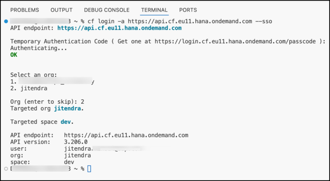

### Integration with SAP Mobile Services

To integrate with SAP Mobile Services, the MCP server  uses the Cloud Foundry CLI and a service metadata file. This file contains:

- Information about the mobile application defined in SAP Mobile Services
- OData service metadata describing the data model and capabilities of the backend service.

 This metadata file can be created or updated using the Mobile development kit extension for Visual Studio Code.

1. In Visual Studio Code, open the **Command Palette**:  
    - **Windows:** `Ctrl + Shift + P`  
    - **Mac:** `Cmd + Shift + P`

2. Type **MDK: Open Mobile App Editor** and select the command.

3. Click the **+** button to create a new Mobile Services app configuration or select an existing one. 

    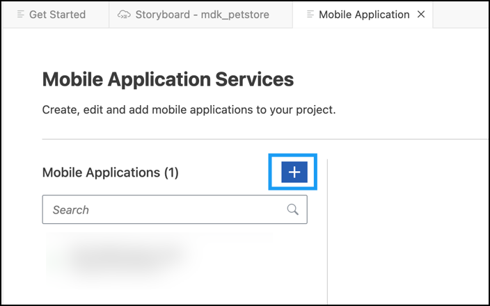

4. In the **Basic Information** step, enter the following values and choose **Finish**.

    | Field | Value |
    |----|----|
    | `Application Name` | `SAP MDK App` |
    | `Application ID` | `myapp.mdk.demo` |
    | `Security Settings` | Leave the default value as `XSUAA`  |   
    | `Add Mobile Sample OData ESPM` | Check this option |
        
    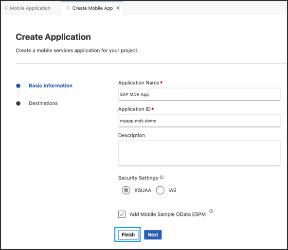

    >A sample OData Enterprise Sales and Procurement Model (ESPM) service is provided for development and testing. 

    Creating the mobile application may take 2-3 minutes. 
        
    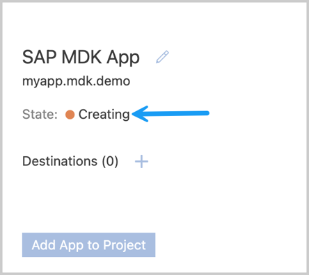

5. Once the application reaches the `Started` state, select the destination `com.sap.edm.sampleservice.v4` and choose **Add App to Project**. 

    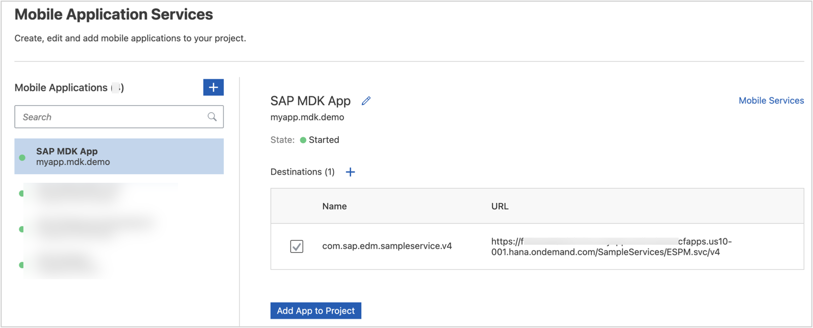

    A `.service.metadata` file is added to your project folder. This file contains information about your Mobile Services app and the OData service data model.

    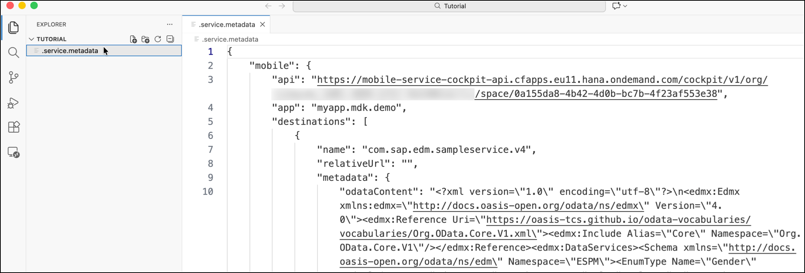

### Create Your First MDK Project with Agentic AI

You will now generate a new MDK project using the MCP server and an AI agent.

1. In Visual Studio Code, open **Cline** by clicking its icon in the left sidebar.

    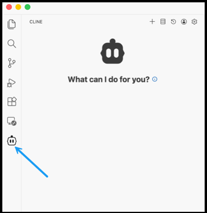

2. Execute the following prompt:

    ```bash
    Generate an MDK offline project displaying information about customers, products, sales order headers, and items. I should also be able to perform local transactions.
    ```

    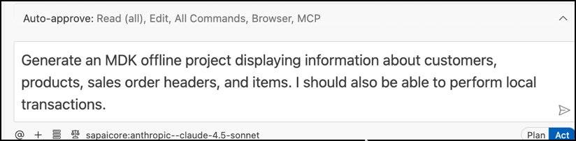

3. The MCP client (Cline) recognizes that the MDK MCP server should be used and executes the prompt using the `mdk-create` tool. You may be asked to approve certain steps.

    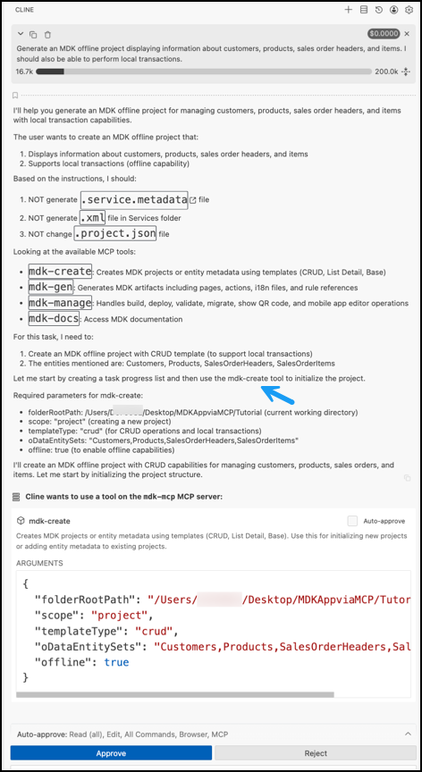

    Within a few seconds, the MDK project is generated in your workspace.
    
    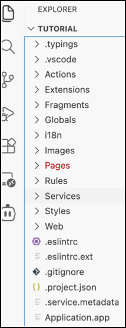

### Deploy Your Project

1. Execute the following prompt:

    ```bash
    Deploy the project and display on-boarding QR code.
    ```

    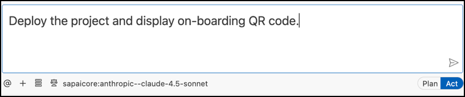

2. The MCP client (Cline) recognizes that the MDK MCP server should be used, which will use the `mdk-manage` tool to deploy the project to SAP Mobile Services. You may be asked to approve certain steps.

    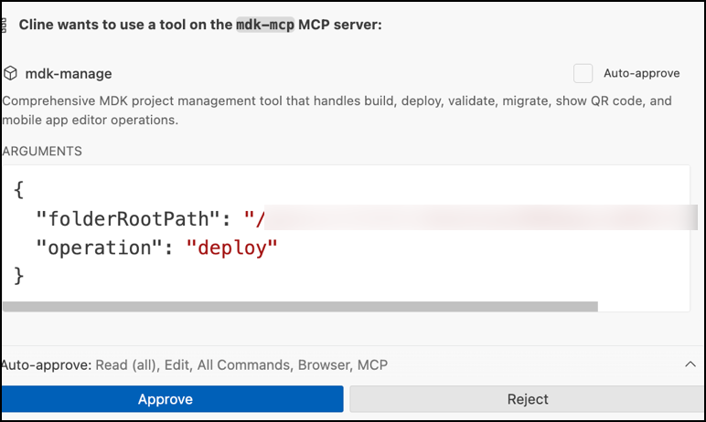

    After deployment completes successfully, the onboarding QR code is displayed.

    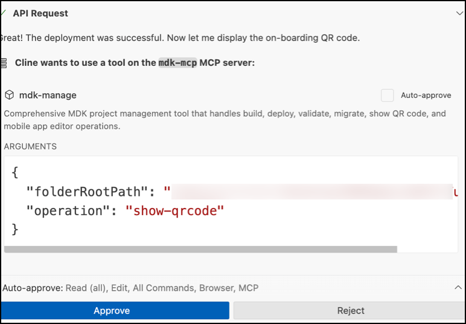

    The QR code is also stored in the `.build` folder of your project.

    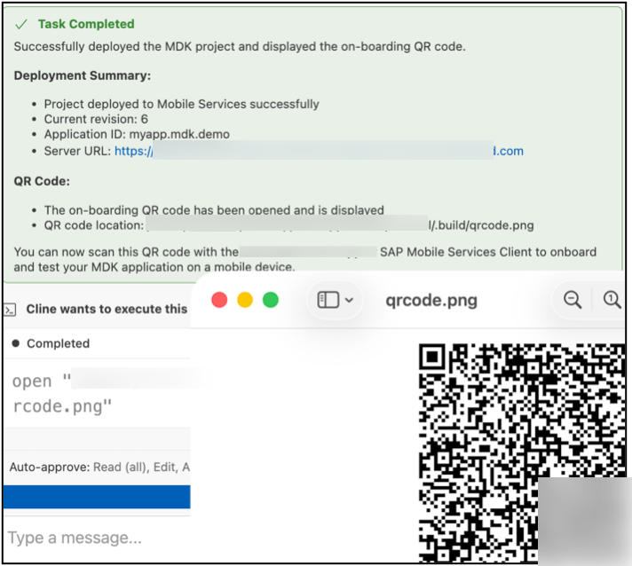

### Run the Project

[OPTION BEGIN [Android]]

>Ensure that you select the correct device platform tab above.  

1. Follow [these steps](https://github.com/SAP-samples/cloud-mdk-tutorial-samples/blob/main/Onboarding-Android-client/Onboarding-Android-client.md) to onboard the MDK client on your Android device.

2. After accepting the app update, you will see a list of entities on the **Main** page, along with a user menu that includes options such as syncing changes, accessing support, checking for updates, and resetting the app. An offline store will be initialized. By tapping any entity, you will navigate to a list page. If you select one of the items, the detail page will be displayed, allowing you to create, update, or delete the record. This record will be saved to the offline request queue database. You can navigate back to the main page and press the **Sync Changes** option in the user menu to upload any local changes to the backend. Once the upload is successful, the app will also download data from the backend to the offline store, ensuring both sides have the same dataset.


    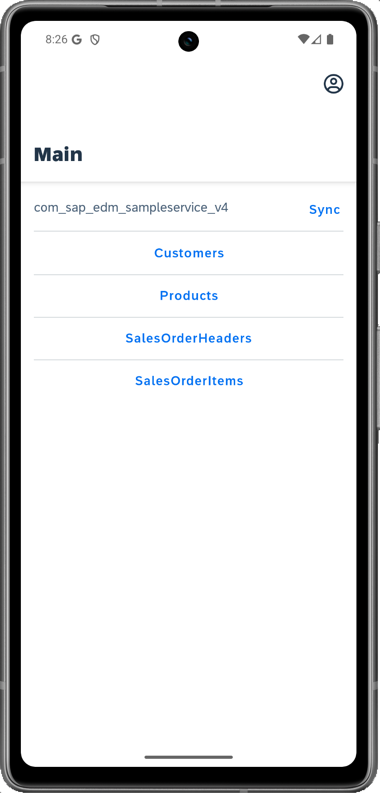

    >`com_sap_edm_sampleservice_v4` is the name of the service file generated in the project creation.

[OPTION END]

[OPTION BEGIN [iOS]]

>Ensure that you select the correct device platform tab above.  

1. Follow [these steps](https://github.com/SAP-samples/cloud-mdk-tutorial-samples/blob/main/Onboarding-iOS-client/Onboarding-iOS-client.md) to onboard the MDK client on your Android device.

2. After accepting the app update, you will see a list of entities on the **Main** page, along with a user menu that includes options such as syncing changes, accessing support, checking for updates, and resetting the app. An offline store will be initialized. By tapping any entity, you will navigate to a list page. If you select one of the items, the detail page will be displayed, allowing you to create, update, or delete the record. This record will be saved to the offline request queue database. You can navigate back to the main page and press the **Sync Changes** option in the user menu to upload any local changes to the backend. Once the upload is successful, the app will also download data from the backend to the offline store, ensuring both sides have the same dataset.

    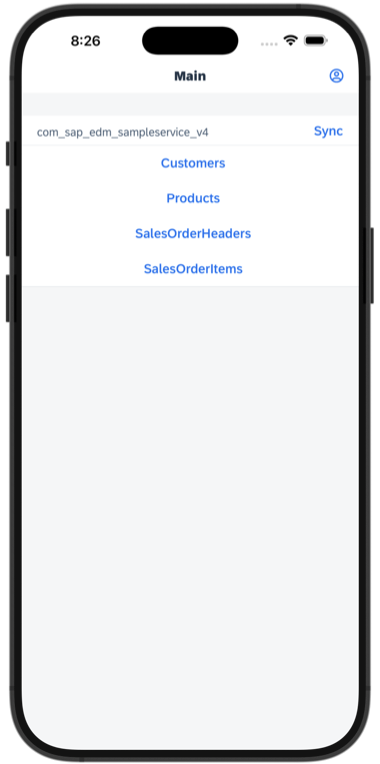

    >`com_sap_edm_sampleservice_v4` is the name of the service file generated in the project creation.

[OPTION END]

In this tutorial, you learned how to use agentic AI with the MCP server to generate a fully functional SAP MDK application from a simple natural language prompt. Using Visual Studio Code and Cline, you created, deployed, and ran an offline-capable MDK app with minimal manual effort—demonstrating how AI can accelerate mobile application development from start to finish.

---