# Evolve Your MDK App with Agentic AI using MCP Tools
<!-- description --> This tutorial demonstrates how to enhance an existing MDK project created with agentic AI by using MCP tools to modify pages, add features, and generate supporting artifacts. You will also learn how to access MDK documentation and client APIs directly through the MCP-enabled IDE for faster, context-aware development.

## You will learn
  - How to enhance an existing MDK application using agentic AI
  - How to access MDK documentation and Client APIs using MCP tools

---


### Ask the Agent - Explore MDK Capabilities and Best Practices via MCP

In this step, you will use the agent to ask project-aware questions about MDK. The agent responds in the context of your existing project, helping you understand Client APIs, implementation choices, and related documentation. You are free to ask the agent any questions related to MDK. To demonstrate this capability, the following steps use a concrete example from the generated project to explore a Client API and its documentation..

1. In the Cline window, copy and paste the following prompt into the input field and execute it.

    ```bash
    Explain this line.
    let result = clientAPI.actionResults.AppUpdate.data;
    ```

    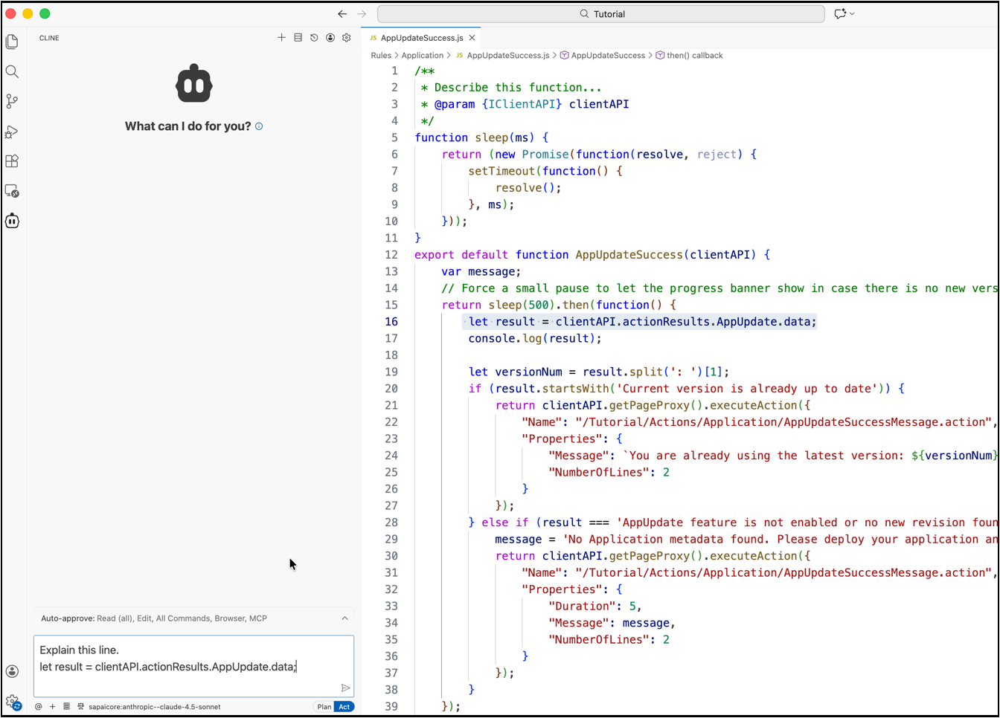

2. The MCP client analyzes the code and provides a detailed breakdown of the statement.

    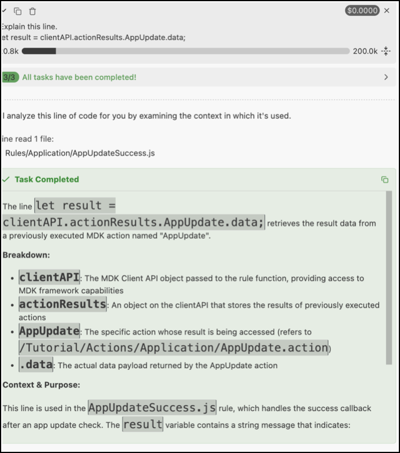

    >Generated responses may differ from the examples shown in this tutorial. Minor variations in code or output are expected.

3. In the Cline window, execute the following prompt:

    ```bash
    I want to allow business users to upload media files to the backend. However, I want to limit the file size to a maximum of 2 MB. Refer documentation and suggest how can I achieve this?
    ```

4. The MCP client (Cline) recognizes that the MDK MCP server should be used and executes the request using the `mdk-docs` tool. You may need to approve certain steps when prompted. 

    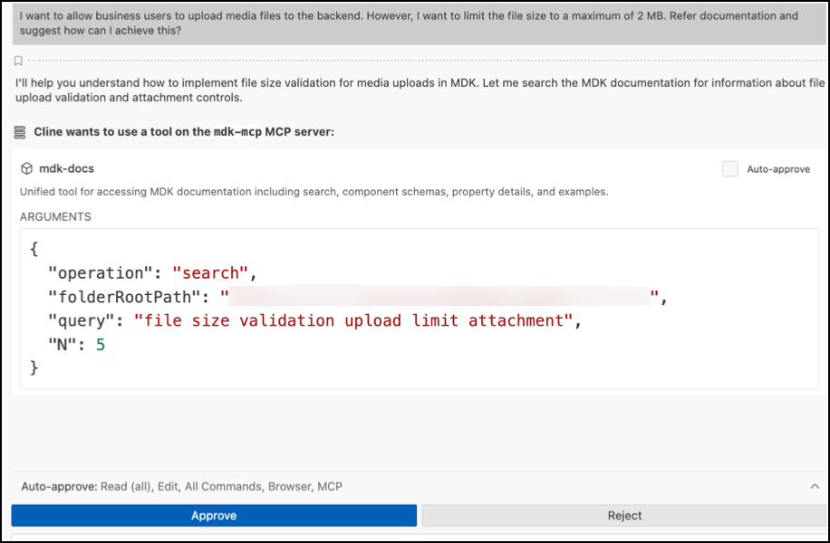

    The generated response includes examples showing how to restrict file size using a Form Cell Attachment control. It also generates a `README` file containing reference examples for different use cases.

    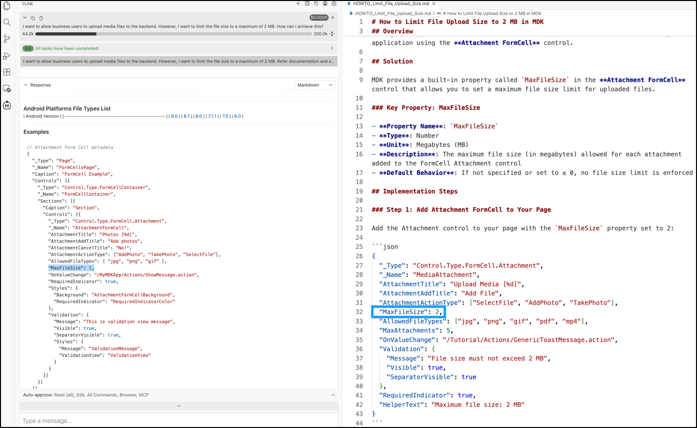 

    >Generated responses may differ from the examples shown in this tutorial. Minor variations in code or output are expected.

5. You can also ask general conceptual questions, for example:

    ```bash
    How does an offline app work on a mobile device?
    ```
    
    The MCP client provides a detailed explanation in the context of MDK offline applications.

### Enhance Existing UI Screens with Agentic Assistance

In this step, you will use the agent to modify existing UI screens based on your requirements. You will change the main page layout from a classic list to a bottom bar container and reorder the Sales Orders list page to display more meaningful information.

1. In the Cline window, execute the following prompt:

    ```bash
    Update main page displaying all information in a bottom bar and include icons for each item. Remove com_sap.. , page caption and Sync options. 
    Also re-generate the sales order list page displaying Order ID, Customer Name, price along with currency,  style the status property (generate style classes if needed), and display the Date value in Date Time (DT) formatter. Once done, validate and deploy project.
    ```

2. The MCP client generates the required updates, validates the project, and deploys it. You may need to approve certain steps when prompted.

    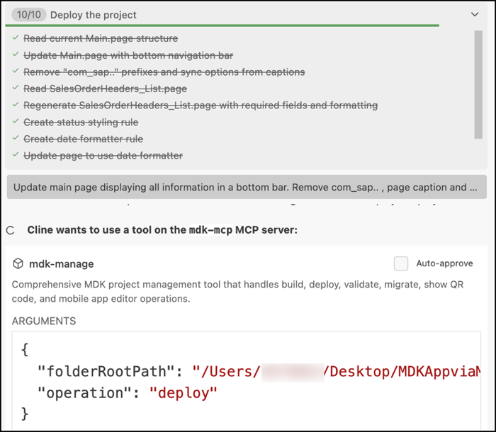 

    >Generated responses may differ from the examples shown in this tutorial. Minor variations in code or output are expected.

### Run the Project

>Ensure that you select the correct device platform tab above. 

[OPTION BEGIN [Android]]

1. On the **Main** page, open the user menu and tap **Check for Updates**, When the _New Version Available_ dialog appears, tap **Now**.

    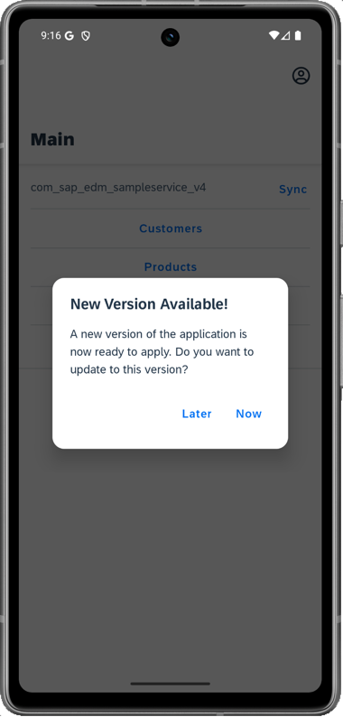

2. Observe that the main page has been redesigned to use a bottom navigation layout, providing quick access to all defined entities. 

    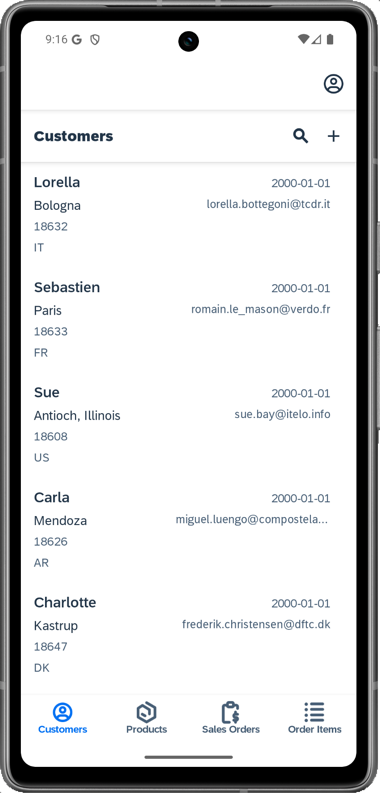

3. Tap **Sales Orders** to view the updated list page.

    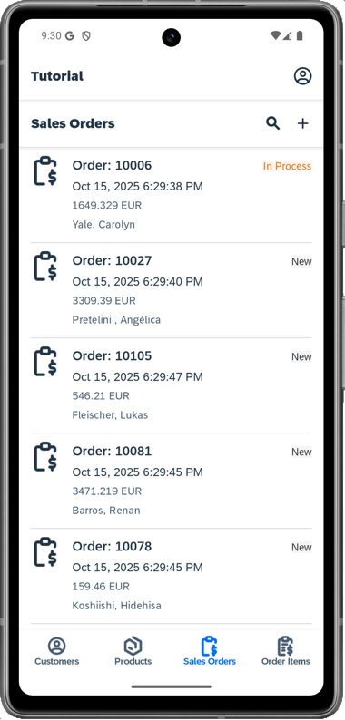


[OPTION END]

[OPTION BEGIN [iOS]]

1. On the **Main** page, open the user menu and tap **Check for Updates**, When the _New Version Available_ dialog appears, tap **Now**.

    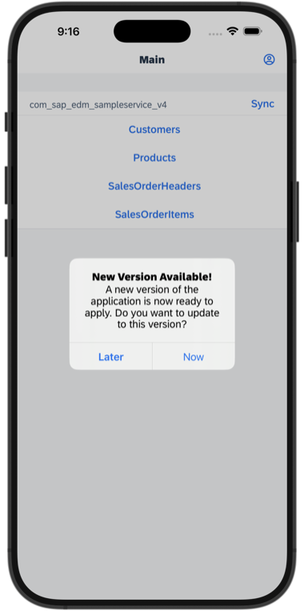

2. Observe that the main page has been redesigned to use a bottom navigation layout, providing quick access to all defined entities.  

    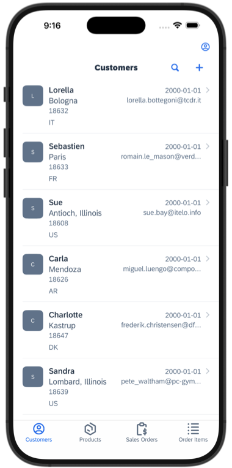

3. Tap **Sales Orders** to view the updated list page.

    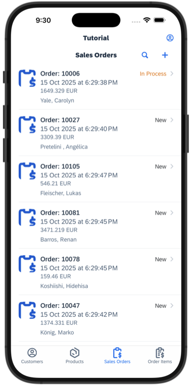

[OPTION END]

### Implement Business Logic using MDK Client APIs

In this step, you will use the MCP agent to generate business logic that dynamically updates application data.

1. In the Cline window, execute the following prompt:

    ```bash
    Instead of just displaying text for the caption property (line 11) on the sales order list page, I want to additionally display the total number of sales orders. 
    For example, Sales Orders (total count)
    ```

    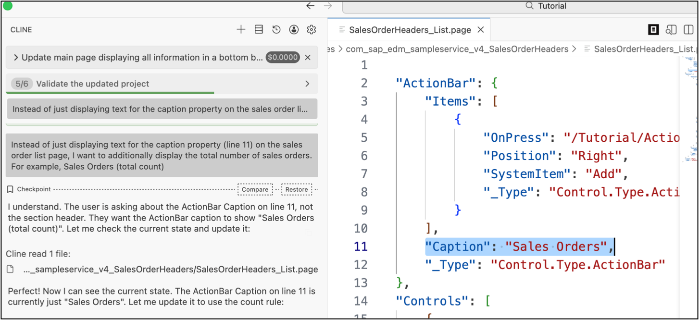

4. The MCP client generates a MDK rule in JavaScript containing the required logic and binds it to the caption property. After validation, the project is automatically deployed. 

    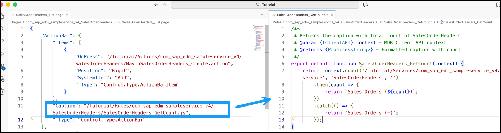

    >Generated responses may differ from the examples shown in this tutorial. Minor variations in code or output are expected.

### Test Your App

>Ensure that you select the correct device platform tab above.

[OPTION BEGIN [Android]] 

1. On the bottom navigation page, open the user menu and tap **Check for Updates**, When the _New Version Available_ dialog appears, tap **Now**.

    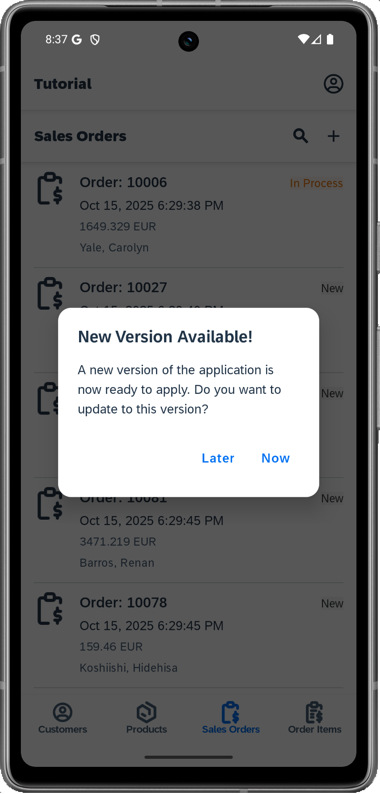

2. Navigate to **Sales Orders** and verify that the total count appears in the page caption.

    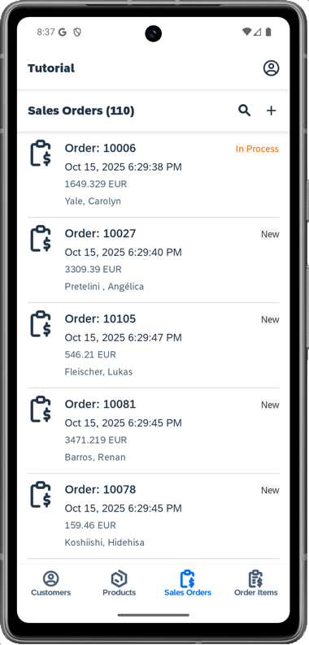


[OPTION END]

[OPTION BEGIN [iOS]]

1. On the bottom navigation page, open the user menu and tap **Check for Updates**, When the _New Version Available_ dialog appears, tap **Now**.

    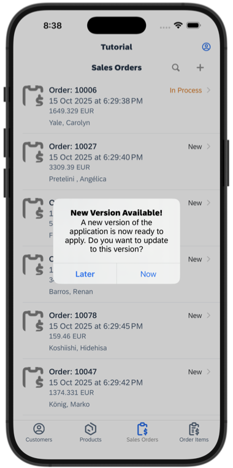

2. Navigate to **Sales Orders** and verify that the total count appears in the page caption.

    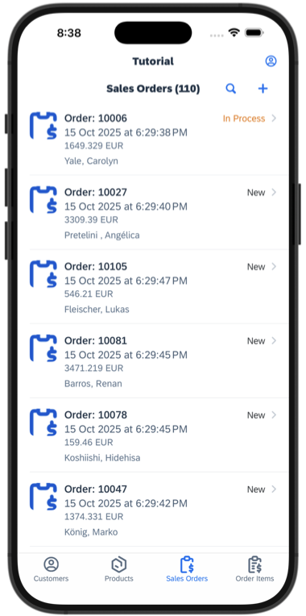

[OPTION END]

In this exercise, you enhanced an existing SAP MDK application using agentic AI powered by MCP tools. You learned how to interact with a project-aware agent to understand MDK Client APIs, explore documentation, and receive contextual guidance directly within the IDE. Using natural language prompts, you modified UI layouts, enhanced list pages, and implemented dynamic business logic.

With MCP-driven development, there are many opportunities to accelerate and simplify MDK application development. You are encouraged to apply these techniques in your own projects—experiment with different prompts, enhance additional features, and continue your MDK learning with agentic AI as your development companion.

---