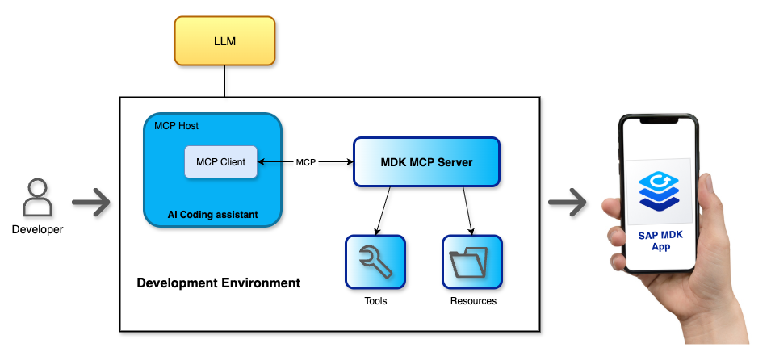
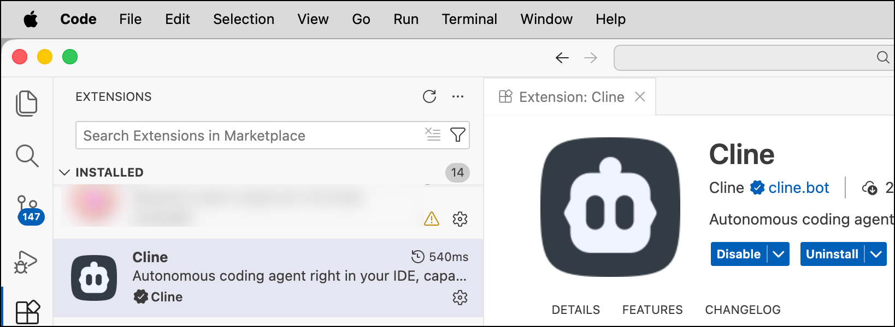
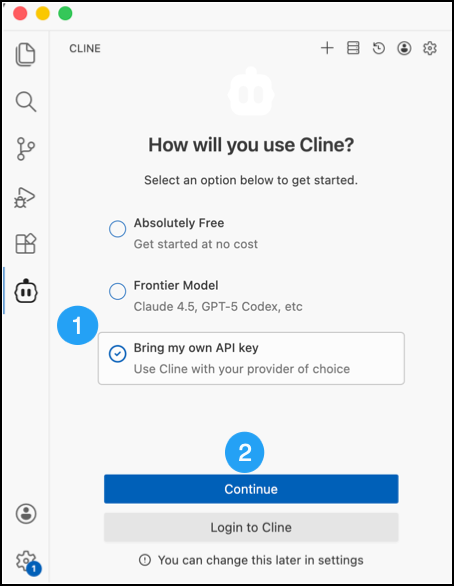
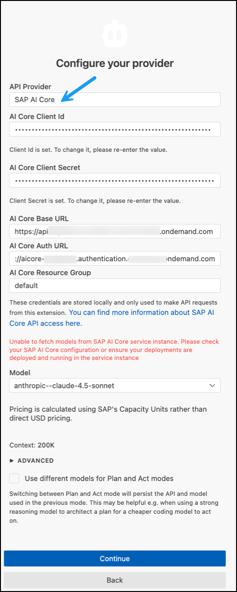
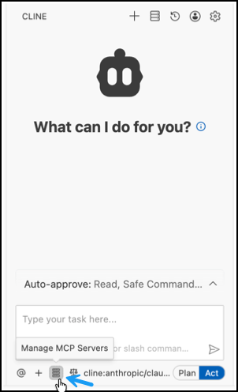
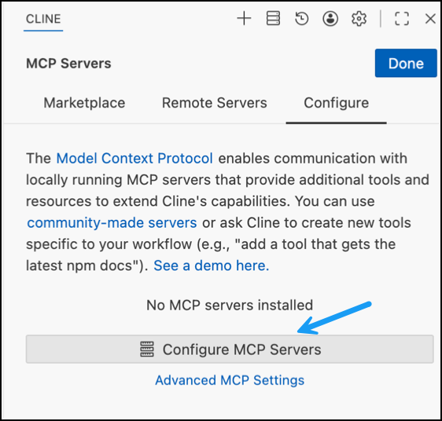
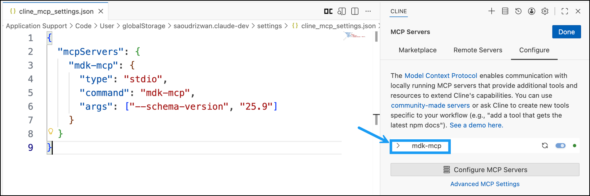
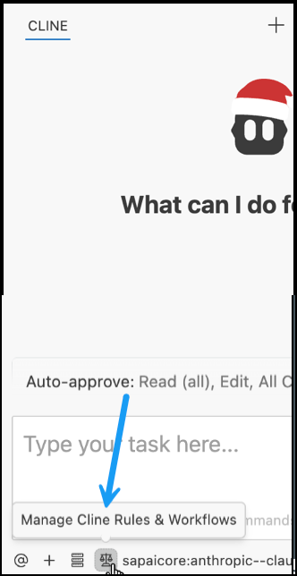
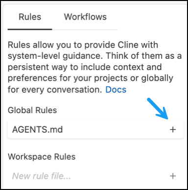
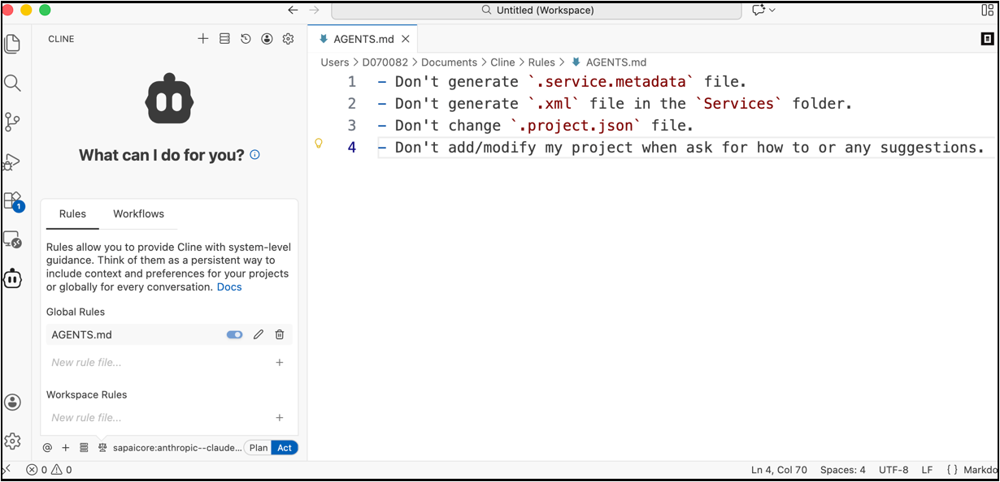

# Set Up MCP Server for MDK Development
<!-- description --> Configure your development environment to get started with an agentic coding experience using the MCP server for Mobile Development Kit (MDK).

## Prerequisites  
- You have [Signed up for a trial account on SAP BTP](https://developers.sap.com/tutorials/hcp-create-trial-account.html).
- SAP BTP production account to connect to the SAP AI core service.

## You will learn
- Set up your local machine for agentic MDK development
- Install and configure the MDK MCP server
- Configure an LLM provider for use with MCP
- Connect an MCP client (VS Code + Cline) to the MCP server
- Define rules to guide AI-assisted MDK development

---

### Understand the MCP server for Mobile Development Kit

**[MCP](https://modelcontextprotocol.io/docs/getting-started/intro)** (Model Context Protocol) is an open standard that helps AI models and tools work together in a structured and secure way. It defines a common way for AI coding assistants (powered by large language models) to connect with external tools, data, and workflows. 

MCP uses a client-server architecture to make communication between AI applications and external systems straightforward.

- **Host Application**: The AI application that users interact with, such as an LLM chat interface or an AI-powered code editor. It initiates requests and drives the workflow.
 - **MCP Client**: Embedded in the host application. It converts the host requests into the MCP standard and manages communication with MCP servers.
 - **MCP Server**: A service that exposes a specific tool or data source (for example, a GitHub repository, a database, or SAP tools) to the AI system using the MCP standard.

The **MCP server for Mobile Development Kit (MDK)** is an open-source server built specifically for MDK development. It provides AI agents with MDK-specific knowledge, such as:

- Best-practice guidelines
- Project-aware context
- Templates for creating new MDK projects
- Access to MDK CLI tools

These features enable AI agents to understand MDK projects more effectively, supporting an AI-assisted (agentic) development workflow. For more information, see this [blog post](https://community.sap.com/t5/technology-blog-posts-by-sap/developing-mobile-apps-with-ai-agents-introducing-the-mcp-server-for-mobile/ba-p/14237709).



### Install Required Tooling

1. Install [node.js 22.14.0](https://nodejs.org/dist/v22.14.0/).

2. Install Yeoman.

    ```bash
    npm i -g yo@4.3.1
    ```
    >Yeoman is a project scaffolding tool that helps generate and maintain consistent application structures using generators.    

3. Install the MDK MCP server using one of the following options:

    **Option A: Install from the public npm registry**

    ```bash
    npm install -g @sap/mdk-mcp-server 
    ```

    **Option B: Install from the open-source repository**

    ```bash
    git clone https://github.com/SAP/mdk-mcp-server.git 
    cd mdk-mcp-server 
    npm i --include=optional 
    npm run build
    npm i -g @sap/mdk-mcp-server@. 
    ```

4. Install **Cloud Foundry CLI** by following the [documentation](https://github.com/cloudfoundry/cli/wiki/V8-CLI-Installation-Guide). The guide provides machine specific installation steps and package manager options. `CF CLI` is required to connect to your SAP BTP Cloud Foundry organization and space. 


### Add Your LLM Provider and Model

Although this tutorial uses Cline as the example agent, the MCP server itself is agent-agnostic. You can use it with any MCP-compatible agent. Cline uses a built-in API provider by default. You can configure a different LLM provider via:

- Built-in provider with a free model
- Paid LLM provider with your API key
- SAP AI Core via SAP BTP production account

This step covers how to connect to **SAP AI Core** and access a deployed model from there.

1. Install [Visual Studio Code](https://code.visualstudio.com/download) on your machine.

2. Install the **Mobile Development Kit extension** from the  Visual Studio Code Marketplace.

    

3. Install the [Cline](https://marketplace.visualstudio.com/items?itemName=saoudrizwan.claude-dev) extension in VS Code Marketplace.

    

4. If you see `How will you use Cline?` window, then select  **Bring my own API key** and **Continue**.

    

5. Select your API provider (for example, SAP AI Core), enter the required credentials, and choose the AI model you want to use. For detailed configuration steps, see the [documentation](https://docs.cline.bot/provider-config/sap-aicore#sap-ai-core).

    


### Configure an MCP Client to Connect to the MCP Server

 If you are using a different agent, the setup will look very similar and follows the same MCP concepts.

1. Open the **Cline** extension. Below the prompt box, choose **Manage MCP Servers**. 

    

2. In the dialog, click **Settings**. 

    

3. On the MCP Servers page, select **Configure MCP Servers**.

    

4. In the `JSON` settings file, add the following configuration under the `mcpServers` section, then save the file. 

    ```json
    {
      "mcpServers": {
        "mdk-mcp": {
          "type": "stdio",
          "command": "mdk-mcp",
          "args": ["--schema-version", "25.9"]
        }
      }
    }
    ```

    >Supported schema versions include 25.9(default), 25.6, 24.11, and 24.7.      

5. After saving the file, the `mdk-mcp` server appears in the MCP Servers list. Once configured, your AI agent can access the MDK MCP server. [Here](https://github.com/SAP/mdk-mcp-server?tab=readme-ov-file#available-tools) are the detailed information about all the tools available in this MCP server.

    >If the MCP server or its tools do not appear immediately, restart Visual Studio Code.

    The MDK MCP server provides the following tools. You will learn more about them in the next tutorials.

    | Tools     | Description | 
    |----------|-----|
    | `mdk-create`    | Creates MDK projects or entity metadata using templates (CRUD, List Detail, Base). |
    | `mdk-gen`    | Generates MDK artifacts including pages, actions, i18n files, and rule references. |
    | `mdk-manage`    | Comprehensive MDK project management tool that handles build, deploy, validate, migrate, show QR code, and mobile app editor operations. |
    | `mdk-docs`    | Unified tool for accessing MDK documentation including search, component schemas, property details, and examples.  |

6. Click **Done** to close the MCP servers window.
    
    

### Create a Rule File for AI-Assisted Development

To ensure the AI assistant follows MDK project conventions and uses the MCP server correctly, it is recommended to define project-specific rules.

1. In the Cline extension, click **Manage Cline Rules & Workflows** below the prompt box.

    

2. Enter rule name as `AGENTS.md` and click **+** to create a new  file. 

    

3. Add the following content and save the file.

    ```markdown
    - Don't generate `.service.metadata` file.
    - Don't generate `.xml` file in the `Services` folder.
    - Don't change `.project.json` file.
    - Don't add/modify my project when ask for how to or any suggestions.
    ```
    
    

In this tutorial, you set up your development environment for agentic SAP MDK development using the MCP server. You learned how to install and configure the MDK MCP server, connect it to an MCP client in Visual Studio Code using the Cline extension, and enable AI-assisted development workflows.

---