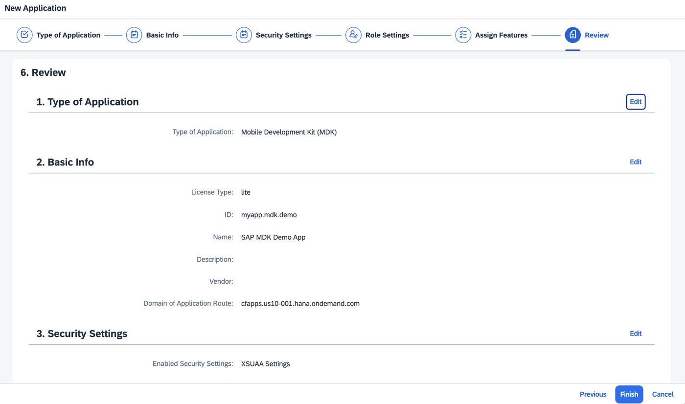
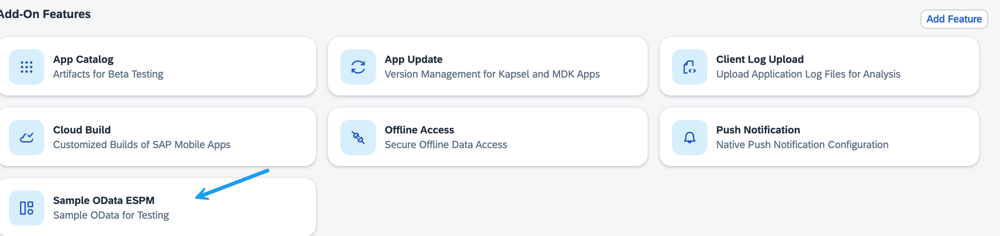
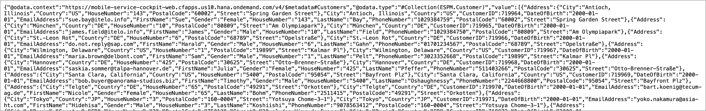

# Set Up Initial Configuration for an MDK App
<!-- description --> Configure initial setup for MDK Mobile applications development.

## Prerequisites
- **Tutorial:** [Access SAP Mobile Services](https://developers.sap.com/tutorials/fiori-ios-hcpms-setup.html)

## You will learn
  - How to configure MDK apps in the Mobile Services admin UI
  - How to configure destination for MDK Mobile applications

---

### Understand the SAP mobile development kit feature

The SAP Mobile Development Kit (MDK) enables developers and technical business users to build cross-platform mobile applications in an integrated development environment, and run it natively on mobile devices (Android & iOS).

You can find more details in the [SAP Mobile Development Kit developer page](https://pages.community.sap.com/topics/mobile-technology/mobile-development-kit).

<!-- border -->

### Set Up New MDK App Configuration in the Mobile Services Admin UI

Make sure that you have completed required prerequisites mentioned in this tutorial.

1. Navigate to the [SAP Mobile Services Admin UI](https://developers.sap.com/tutorials/fiori-ios-hcpms-setup.html).

2. On the home screen, click **Create New App** or navigate to **Mobile Applications** **&rarr;** **Native/MDK** **&rarr;** **New**.

    <!-- border -->

3. In the **Type of Application** step, select the **Mobile Development Kit (MDK)** and choose **Next**.

    <!-- border -->

4. In the **Basic Info** step, provide the required information and choose **Next**.

    | Field | Value |
    |----|----|
    | `ID` | myapp.mdk.demo |
    | `Name` | SAP MDK Demo App |

    <!-- border -->

    >Other fields are optional. For more information about these fields, see [Creating Applications](https://help.sap.com/doc/f53c64b93e5140918d676b927a3cd65b/Cloud/en-US/docs-en/guides/getting-started/admin/manage.html#creating-applications) in the SAP documentation.

5. In the **Security Settings** step, continue with the default settings and choose **Next**.

    <!-- border -->

6. In the **Role Settings** step, continue with the default settings and choose **Next**.

    <!-- border -->    

7. In the **Assign Features** step, select **Sample OData ESPM** from the feature list, and choose **Next**.

    <!-- border -->

    >A [sample OData](https://help.sap.com/doc/f53c64b93e5140918d676b927a3cd65b/Cloud/en-US/docs-en/guides/features/backend-connectivity/common/sample.html) Enterprise Sales and Procurement Model (ESPM) service is available in Mobile Services admin UI for developers to use during development and testing. For MDK tutorials, you will be using this service. You can of course add your OData or REST service connecting to your backend system as covered in the next step. 

8. In the **Review** step, you can verify the details of the application definition that you are creating. Make sure all the details are correct. Choose Edit to make any necessary modifications to the section. Choose **Finish** to create the mobile application configuration. This process may take 2-3 minutes.

    <!-- border -->

    >If you see a _Application is without Role Settings_ warning message, choose **OK**. You may assign roles after the app has been configured, if needed.

    Once you have created your application, you see a list of default features have been automatically assigned to the app.

    <!-- border -->

    >You can find more information on available features in SAP Mobile Services in [help documentation](https://help.sap.com/doc/f53c64b93e5140918d676b927a3cd65b/Cloud/en-US/docs-en/guides/getting-started/admin/features.html).

### Explore Mobile Sample OData Service

1. Click **Sample OData ESPM**. 

    <!-- border -->

2. By default, OData Version 4 is selected. You can explore through different options. For example, you can access the OData service document, view the metadata document, examine data, generate test data, or reset it to its initial state.

    

    >When you view the data, you might see something like this instead of the nicely formatted output from above.
    >
    >However, this doesn't mean you've made a mistake in the tutorial. Rather, this is the correct output without any formatting. If you'd like to see a formatted output in your browser, you can add an `JSON Formatter` extension to your browser. 

---
