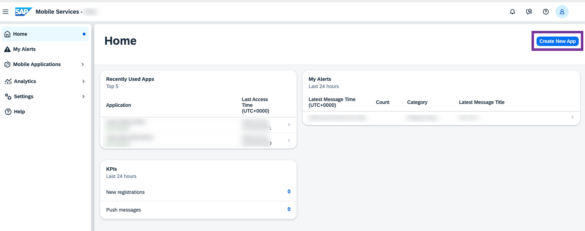
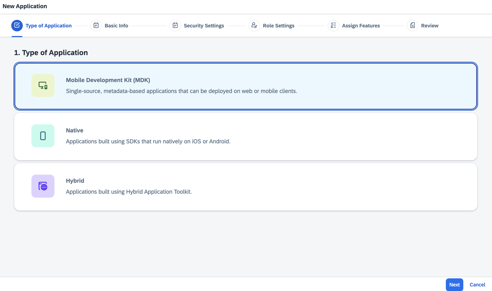
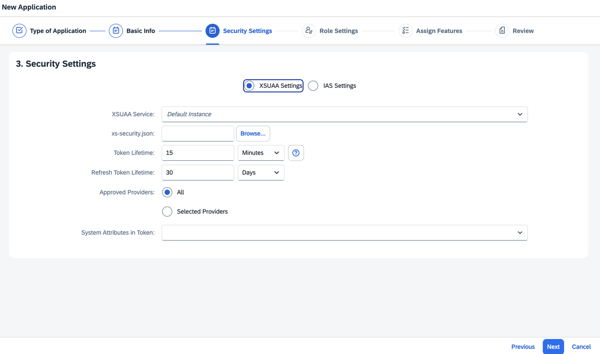
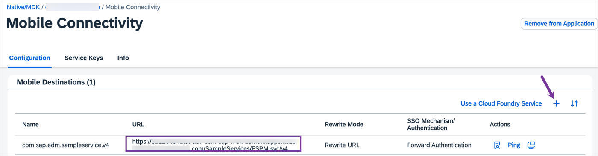
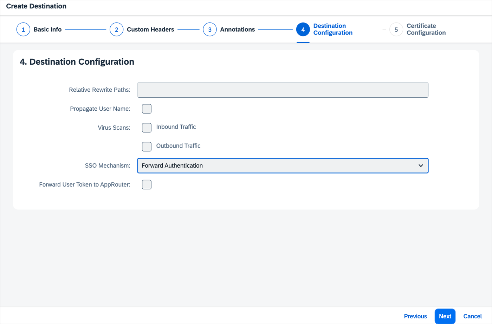

# Set Up Initial Configuration for an MDK App
<!-- description --> Configure initial setup for MDK Mobile and Web applications.

## Prerequisites
- **Tutorial:** [Access SAP Mobile Services](fiori-ios-hcpms-setup)

## You will learn
  - How to configure MDK apps in the Mobile Services cockpit
  - How to configure destination for MDK Mobile and applications

---

### Understand the mobile development kit feature

The Mobile Development Kit (MDK) enables developers and technical business users to build [multi-channel]((https://blogs.sap.com/2020/10/27/moving-to-multi-channel-with-mobile-development-kit/)) applications. It allows you to build your application once, in an integrated development environment, and run it natively on mobile devices (Android & iOS) and as a web application (online) in the browser.

You can find more details in the [Mobile Development Kit developer page](https://community.sap.com/topics/mobile-technology/mobile-development-kit).

<!-- border -->

### Configure a new MDK application in Mobile Services cockpit

Make sure that you have completed required prerequisites mentioned in this tutorial.

1. Navigate to [SAP Mobile Services cockpit](fiori-ios-hcpms-setup).

2. On the home screen, select **Create new app** or navigate to **Mobile Applications** **&rarr;** **Native/MDK** **&rarr;** **New**.

    <!-- border -->

3. In the **Basic Info** step, provide the required information and click **Next**.

    | Field | Value |
    |----|----|
    | `ID` | com.sap.mdk.demo |
    | `Name` | SAP MDK Demo App |

    <!-- border -->

    > If you are configuring this app in a trial account, make sure to select **License Type** as *lite*.

    >Other fields are optional. For more information about these fields, see [Creating Applications](https://help.sap.com/doc/f53c64b93e5140918d676b927a3cd65b/Cloud/en-US/docs-en/guides/getting-started/admin/manage.html#creating-applications) in the SAP documentation.

4. In the **XSUAA Settings** step, continue with the default settings and click **Next** to navigate to further steps.

    <!-- border -->

4. In the **Assign Features** step, choose **Mobile Development Kit Application** from the dropdown, select **Mobile Sample OData ESPM** to add a sample backend to your MDK app and then click **Finish**.

    <!-- border -->

    >If you see a _Confirm Finish_ window, click **OK**.

    Once you have created your application, you see a list of default features have been automatically assigned to the app.

    <!-- border -->

    >You can find more information on available features in SAP Mobile Services in [help documentation](https://help.sap.com/doc/f53c64b93e5140918d676b927a3cd65b/Cloud/en-US/docs-en/guides/getting-started/admin/features.html).

### Create a new destination to your MDK Mobile application

1. Click **Mobile Connectivity**.  

    <!-- border -->

2. Copy the URL from existing destination and click the **Create** icon to add a new destination.

    <!-- border -->

3. In **Basic Info** step, provide the required information and click **Next**.

    | Field | Value |
    |----|----|
    | `Destination Name` | SampleServiceV2 |
    | `URL` | paste the URL from above step  |

    <!-- border -->

4. For this tutorial, there is no Custom Headers, Annotations required. Click **Next** to navigate to further steps.

5. In **Destination Configuration** step, select **SSO Mechanism** as **Forward Authentication**, click **Next**.   

    <!-- border -->

6. For this tutorial, there is no configuration needed for the SSO mechanism. Click **Finish**.

    <!-- border -->

### Create a new destination to your MDK Web application

MDK Web application accesses the data sources via BTP destination. You will now create a new destination in BTP cockpit that will point to the same backend as your Mobile destination.

>The destination that you are going to create in this tutorial is very specific as this connects to the backend via Mobile Services and will use OAuth2JWTBearer authentication type. For other kinds of backend or services, you may skip the following steps and directly setup your BTP destination with the relevant authentication type that is required by the backend.

1. Click `com.sap.mdk.demo` to navigate to Mobile Services application details.

    <!-- border -->

2. Open the `APIs` tab, click _copy to clipboard_ icon to copy the highlighted URL and paste it in a text file. This URL will be used in configuring the  BTP destination.

    <!-- border -->

3. In your SAP BTP space cockpit page, navigate to the **Services** **&rarr;**  **Instances**, select **Authorization and Trust Management service** from the list, click `com-sap-mdk-demo-xsuaa` instance, choose trip dot icon **&rarr;** **View** to open the configuration details.

    <!-- border -->

4. Switch to **Form** tab, copy values for `clientid`, `clientsecret`, `url` parameters and paste these values in the text file. These parameters will be used in configuring the BTP destination.  

    <!-- border -->

5. Download the zip file from [here](https://github.com/SAP-samples/cloud-mdk-tutorial-samples/blob/main/0-Set-Up-for-the-Mobile-Development-Kit/SampleServiceV2.zip) and unzip it on your machine.

    <!-- border -->

6. Navigate to **Connectivity** **&rarr;** **Destinations** to create a BTP destination, click **Import Destination** to import the extracted file and provide the required information and click **Save**.

    | Field | Value |
    |----|----|
    | `URL` | Paste the URL from step 4.2 |
    | `Client ID` | Paste the value from step 4.4  |
    | `Client Secret` | Paste the value from step 4.4 |
    | `Token Service URL` | Replace the Token URL placeholder with the URL from step 4.4 , make sure the Token URL is appended by `/oauth/token` |
    | `Use Default JDK truststore` | Select the checkbox if not selected before |

    <!-- border -->

    >When checking the connection, if all your configurations are correct, you will see a success message saying `Connection to "SampleServiceV2" established. Response returned: "400: Bad Request"`. In this particular case, it is safe to ignore the `"400: Bad Request"` part of this message.

---
