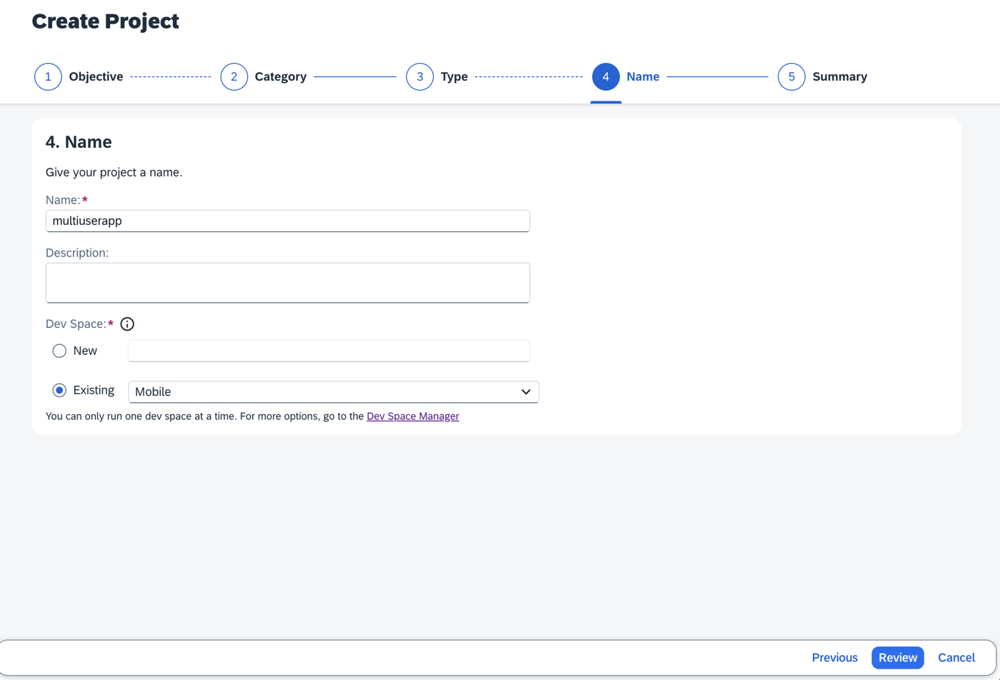
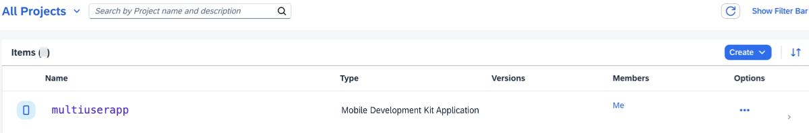
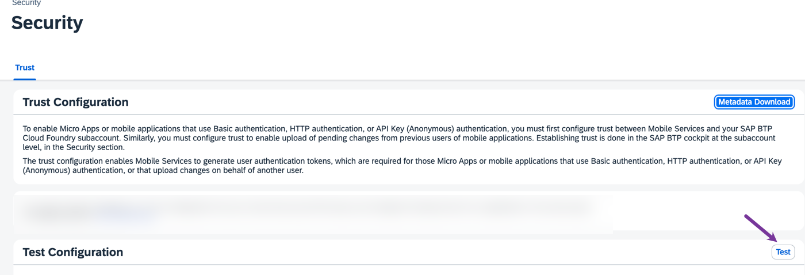
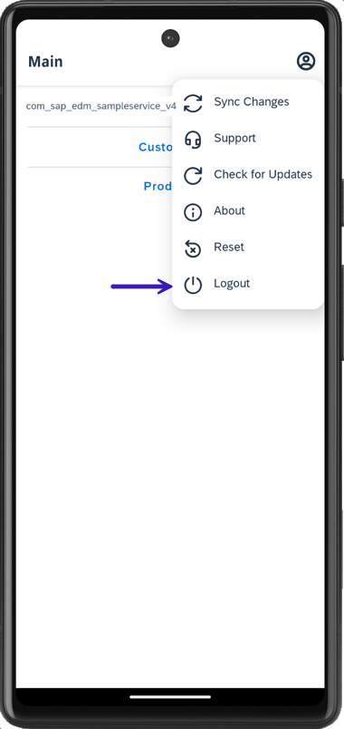
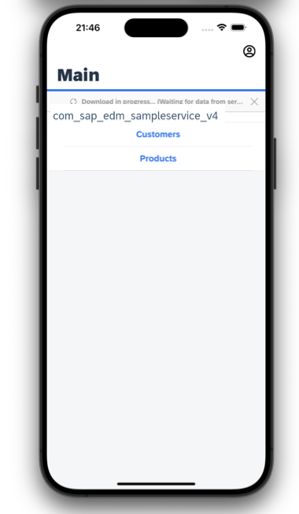

# Enable Multi-User Mode for MDK Application
<!-- description --> Set up the Mobile Development Kit client to enable the multi-user mode (one device, multiple users with secure access).

## Prerequisites
- **Tutorial**: [Set Up for the Mobile Development Kit (MDK)](group.mobile-dev-kit-setup)
- **Install SAP Mobile Services Client** on your [Android](https://play.google.com/store/apps/details?id=com.sap.mobileservices.client) device or [iOS](https://apps.apple.com/us/app/sap-mobile-services-client/id1413653544)
- **Download the latest version of Mobile Development Kit SDK if you want to enable multi-user mode in MDK custom client** either from the SAP community [trial download](https://developers.sap.com/trials-downloads.html?search=Mobile+Development+Kit) or [SAP Software Center](https://me.sap.com/softwarecenter) if you are a SAP Mobile Services customer. This is required you to build a branded client.

## You will learn
  - How to define an event on user switching
  - How to configure multi-user settings in mobile service cockpit
  - How to create an offline enabled MDK application that supports multiple users on the same device

## Intro
You may clone an existing metadata project from the [MDK Tutorial GitHub repository](https://github.com/SAP-samples/cloud-mdk-tutorial-samples/tree/main/5-Brand-Your-Customized-App-with-Mobile-Development-Kit-SDK/3-Enable-MultiUser-Mode-for-MDK-Application) and start directly with step 3 in this tutorial.

---
Multiple user mode is designed for enterprise scenarios where, for example, an employee uses a shared device during their shift. They may go offline while working in the field and return the device at the end of their shift. The next day, the employee might use a different device, while the device used previously could be assigned to another user. This is why it is called multiple user mode. In offline scenarios, multiple user mode ensures that the initial user's data, stored offline, is synchronized with the server before the second user logs in. This process preserves the previous user's changes to the data.

### Create a new MDK project in SAP Business Application Studio

This step includes creating the mobile development kit project in the editor.

1. Launch the [Dev space](cp-mobile-bas-setup) in SAP Business Application Studio.

2. Click **New Project from Template** on the `Get Started` page.

    <!-- border -->

    >If you do not see the `Get Started` page, you can access it by typing `>get started` in the center search bar.

    <!-- border -->

3. Select **MDK Project** and click **Start**. If you do not see the **MDK Project** option check if your Dev Space has finished loading or reload the page in your browser and try again.

    <!-- border -->

    >This screen will only show up when your CF login session has expired. Use either `Credentials` OR  `SSO Passcode` option for authentication. After successful signed in to Cloud Foundry, select your Cloud Foundry Organization and Space where you have set up the initial configuration for your MDK app and click Apply.

    ><!-- border -->

4. In *Basic Information* step, provide the below information and click **Next**:

    | Field | Value |
    |----|----|
    | `MDK Template Type`| Choose `CRUD` from the dropdown |
    | `Your Project Name` | Provide a name of your choice. `MultiUserApp` is used for this tutorial |
    | `Your Application Name` | <default name is same as project name, you can provide any name of your choice> |    
    | `Target MDK Client Version` | Leave the default selection as `MDK 23.4+ (For use with MDK 23.4 or later clients)` |  
    | `Choose a target folder` | By default, the target folder uses project root path. However, you can choose a different folder path |  

    <!-- border -->

5. In *Service Configuration* step, provide the below information and click **Next**:

    | Field | Value |
    |----|----|
    | `Data Source` | Select `Mobile Services` from the dropdown |
    | `Mobile Services Landscape` | Select `standard` from the dropdown |
    | `Application Id` | Select `com.sap.mdk.demo` from the dropdown |
    | `Destination` | Select `SampleServiceV4` from the dropdown |
    | `Enter a path to the OData service` | Leave it as it is |
    | `Enable Offline` | Choose `Yes` |  

    <!-- border -->

6. In *Data Collections* step, select `Customers` and `Products`. Click **Finish** to finish the project creation.

    <!-- border -->    

    >Data Collections step retrieves the entity sets information for the selected destination.
    
7. After clicking **Finish**, the wizard will generate your MDK Application based on your selections. You should now see the `MultiuserApp` project in the project explorer.

### Define an event when user switches

MDK provides an [`OnUserSwitch`](https://help.sap.com/doc/3642933ef2e1478fb1578ef2acba4ae9/Latest/en-US/reference/schemadoc/App.schema.html#onuserswitch) event that is called when the user is switched when the client is operating in Multi-User mode. This event is triggered after any pending Offline OData transactions from previous user are successfully synced.

The purpose of the `OnUserSwitch` event is to inform the application that a user switch has taken place. Upon receiving this event, the application can execute any necessary actions to handle the user switch. At a minimum, this would involve running a Download action to update the offline store with the new user-specific data, while removing the data associated with the previous user.

Since the underlying offline database is shared, it is the responsibility of the application developer to ensure that all necessary steps are taken to reinitialize the application for the new user to continue functioning properly.

1. Click the **Application.app** to open it in MDK Application Editor and then and select the link icon for the `OnUserSwitch` event.

    <!-- border --> 

2. Bind it to the `SyncStartedMessage.action`.

    <!-- border -->  

    >For this tutorial, since we are using the Sample Service, which does not contain any user-specific data, we will simply trigger a sync to demonstrate that the event has been triggered.

### Deploy the application

Now that the MDK application is created, you will deploy the application definitions to Mobile Services to use in the Mobile client.

1. Right-click `Application.app` and select **MDK: Deploy**.

    <!-- border -->

2. Select deploy target as **Mobile Services**.

    <!-- border -->

    If you want to enable source for debugging the deployed bundle, then choose **Yes**.

    <!-- border -->

    You should see **Deploy to Mobile Services successfully!** message.

    <!-- border -->

### Enable multi-user mode in SAP Mobile Services

1. Open SAP Mobile Services UI, click **Mobile Applications** **&rarr;** **Native/MDK** **&rarr;** click `com.sap.mdk.demo` app.

    <!-- border -->

2. Under Assigned Features, click **Mobile Settings Exchange**.

    <!-- border -->

3. Scroll through the page and enable the *Allow Upload of Pending Changes from Previous User (Enable Multiple User Mode)* checkbox under the **Shared Devices** section. This flag ensures that any pending offline changes from previous user are securely uploaded to the OData service. This is especially vital when the previous user has not uploaded the offline changes, and the app is being switched to a new user.

    <!-- border -->

4. As the Multiple user mode is enabled, you must configure **Passcode Policy**, if not done before.

    <!-- border -->

5. Once the passcode policy is set, click **Save**.    

### Configure Security trust

In a Multi-user scenario the client will automatically upload any pending transactions from the previous user before completing the user switch. In order for Mobile Services to perform this upload it needs to get a token for the previous user.  To do this `XSUAA` needs to trust Mobile Services. This is done by importing the Mobile Services key to the Trust Configuration in the BTP subaccount.

1. In SAP Mobile Services cockpit, click **Settings** **&rarr;** **Security**.

    <!-- border -->

2. Click **Metadata Download**. 

    <!-- border -->

3. Define the metadata expiration date up to ten years, or you can accept the one-year default date. Click **Download**. 

    <!-- border -->

    >In case the metadata has been expired, end user may encounter an error while switching. You need to re-download the Mobile Services key and import it to the Trust Configuration in the BTP subaccount again.

4. Save the `SAMLMetadata.xml` file locally on your machine. 

5. Navigate to your sub account on SAP BTP. In the Side navigation bar, click **Security** **&rarr;** **Trust Configuration** and click **`New SAML Trust Configuration`**.

    <!-- border -->

6. Click **Upload**, and select the XML file downloaded in the previous step, as a trusted identity provider. Enter a name, disable the **Available for User Login** checkbox and then click **Save**.

    <!-- border -->

    >The trusted Identity Provider is not a real identity provider and cannot be used for user login. Disabling the **Available for User Login** checkbox ensures the identity provider does not appear on the XSUAA login page.
    >For more information, see [documentation](https://help.sap.com/doc/f53c64b93e5140918d676b927a3cd65b/Cloud/en-US/docs-en/guides/features/security/admin/config.html#configuring-security-trust).

### Test metadata configuration

Find out, if the metadata has been established successfully as a trusted provider.

Switch to the SAP Mobile Services UI. Click **Settings** **&rarr;** **Security** **&rarr;** **Test** .

<!-- border -->

You should see a success message.

<!-- border -->

>If the trust configuration is not established correctly, you may see a message like *SAML metadata might not have been imported as trusted identity provider* and the multi-user functionality in MDK client will not work.

### Create Your MDK Client (required only for branded clients)

If you are using SAP Mobile Services Client (public store) to test the multi-user functionality, you can skip this step.

1. Follow steps 1 to 3 from [Build Your Mobile Development Kit Client Using MDK SDK](cp-mobile-dev-kit-build-client) and make sure to set the  `MultiUserEnabled` property to `true`. 

      <!-- border -->

2. Create your MDK client either using MDK SDK by following the step 4 from [Build Your Mobile Development Kit Client Using MDK SDK](cp-mobile-dev-kit-build-client) tutorial OR using SAP Cloud Build Service by following [Build Your Mobile Development Kit Client Using Cloud Build Service](cp-mobile-dev-kit-cbs-client) tutorial.

### Run the MDK Client

Choose an option above based on whether you are testing multi-user functionality in the SAP Mobile Services Client (public store) or in a branded client built using MDK SDK or Cloud Build service. 

[OPTION BEGIN [SAP Mobile Services Client]]

>For an existing single user app it is required to reset the client and re-login before multi-user capability can be enabled.

1. Switch to the SAP Business Application Studio UI. SAP Business Application Studio has a feature to display the QR code for onboarding in the Mobile client. Click on `Application.app` to open it in MDK Application Editor, and then click the **Application QR Code** icon.

    

    The Onboarding QR code is now displayed. You will notice that the `multiUser` parameter in the generated QR code is set to *true*. This is due to the flag *Allow Upload of Pending Changes from Previous User* being set in step 3 mobile services cockpit. The MDK client will set the user mode based on the scanned QR code. 

    

    >Alternatively, you can scan the QR code generated under *APIs* > *In-app Scanning Code* in the mobile services cockpit.

2. Make sure you have downloaded the **SAP Mobile Services Client** on your device from the App Store or Google Play as covered in the pre-requisites.

3. Onboard to the application. If you are using an Android device, follow [these steps](https://github.com/SAP-samples/cloud-mdk-tutorial-samples/blob/main/Onboarding-Android-client/Onboarding-Android-client.md) or if you are using an iOS device, follow [these steps](https://github.com/SAP-samples/cloud-mdk-tutorial-samples/blob/main/Onboarding-iOS-client/Onboarding-iOS-client.md).

[OPTION END]

[OPTION BEGIN [Branded Client]]

>For an existing single user app it is required to rebuild the client with above mentioned setting if the client doesn't allow scanning a QR to onboard. Once the client on a device is updated the user will have to reset the client and re-login before multi-user capability can be enabled.

Follow step 4 from [Build Your Mobile Development Kit Client Using MDK SDK](cp-mobile-dev-kit-build-client) to run and on-board your branded client on your device. 

[OPTION END]

### Test a multi-user scenario

[OPTION BEGIN [Android]]

>Ensure that you choose the correct device platform tab above. 

1. After accepting the app update, you will see a list of entities on the **Main** page, along with a user menu that includes options such as syncing changes, accessing support, checking for updates, and resetting the app. An offline store will be initialized. By tapping any entity, you will navigate to a list page. If you select one of the items, the detail page will be displayed, allowing you to create, update, or delete the record. This record will be saved to the offline request queue database. You can navigate back to the main page and press the **Sync Changes** option in the user menu to upload any local changes to the backend. Once the upload is successful, the app will also download data from the backend to the offline store, ensuring both sides have the same dataset.

    

2. Make any change in your app. For example, tap **Customers** **&rarr;** tap any record **&rarr;** edit and save the changes. 

    

3. Navigate back to the main page. The logged in user should ideally sync the local changes before logging out. Let's assume that user has forgotten to sync the changes and has logged out from the app. Tap on the **Logout** option in the user menu on the main page.

    

4. In the **Sign-In** screen, tap on the **Switch or add user** option. 

    

    >This screen also appears when you send the app in the background and bring it in foreground or swipe to close and relaunch it.

5. When switching users, the device needs to be connected to the network. Click on the highlighted icon to add a new user.

    

    >Ensure all users being onboarded have access to the BTP account. You can configure this in the users section under security on your SAP BTP sub-account.
    ><!-- border -->

6. Follow the onboarding flow for the second user. To protect your data from being accessed by another user, do not use the same passcode.

7. After confirming the passcode screen, you will notice a **Sync in Progress** screen. This ensures that any local changes made by the previous user are not lost if they forgot to upload their work at the end of the shift and the device is picked up by another user.

    

8. After a successful sync, the `OnUserSwitch` event has triggered.

    
    

9. Navigate to the customer record when previous user made changes. You should notice the updated data.

[OPTION END]

[OPTION BEGIN [iOS]]

>Ensure that you choose the correct device platform tab above. 

1. After accepting the app update, you will see a list of entities on the **Main** page, along with a user menu that includes options such as syncing changes, accessing support, checking for updates, and resetting the app. An offline store will be initialized. By tapping any entity, you will navigate to a list page. If you select one of the items, the detail page will be displayed, allowing you to create, update, or delete the record. This record will be saved to the offline request queue database. You can navigate back to the main page and press the **Sync Changes** option in the user menu to upload any local changes to the backend. Once the upload is successful, the app will also download data from the backend to the offline store, ensuring both sides have the same dataset.

    

2. Make any change in your app. For example, tap **Customers** **&rarr;** tap any record **&rarr;** edit and save the changes. 

    

3. Navigate back to the main page. The logged in user should ideally sync the local changes before logging out. Let's assume that user has forgotten to sync the changes and has logged out from the app. Tap on the **Logout** option in the user menu on the main page.

    

4. In the **Sign-In** screen, tap on the **Switch or add user** option. 

    

    >This screen also appears when you send the app in the background and bring it in foreground or swipe to close and relaunch it.

5. When switching users, the device needs to be connected to the network. Click on the highlighted icon to add a new user.

    

    >Ensure all users being onboarded have access to the BTP account. You can configure this in the users section under security on your SAP BTP sub-account.
    ><!-- border -->

6. Follow the onboarding flow for the second user. To protect your data from being accessed by another user, do not use the same passcode.

7. After confirming the passcode screen, you will notice a **Sync in Progress** screen. This ensures that any local changes made by the previous user are not lost if they forgot to upload their work at the end of the shift and the device is picked up by another user.

    

8. After a successful sync, the `OnUserSwitch` event has triggered.

    
    

9. Navigate to the customer record when previous user made changes. You should notice the updated data.

[OPTION END]

You have learned how to enable an Mobile Development Kit Client to support multi-user login capability. This means a Mobile Development Kit Client app on a device can now securely be shared across multiple users. Features such as adding a new user, switching between user sessions, searching for a particular user are supported by the client.
Find more information about Multi User in MDK in [help documentation](https://help.sap.com/doc/f53c64b93e5140918d676b927a3cd65b/Cloud/en-US/docs-en/guides/features/onboarding/mdk/multi-user.html).

---
