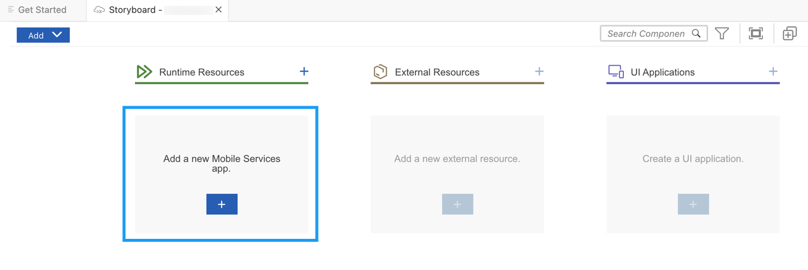
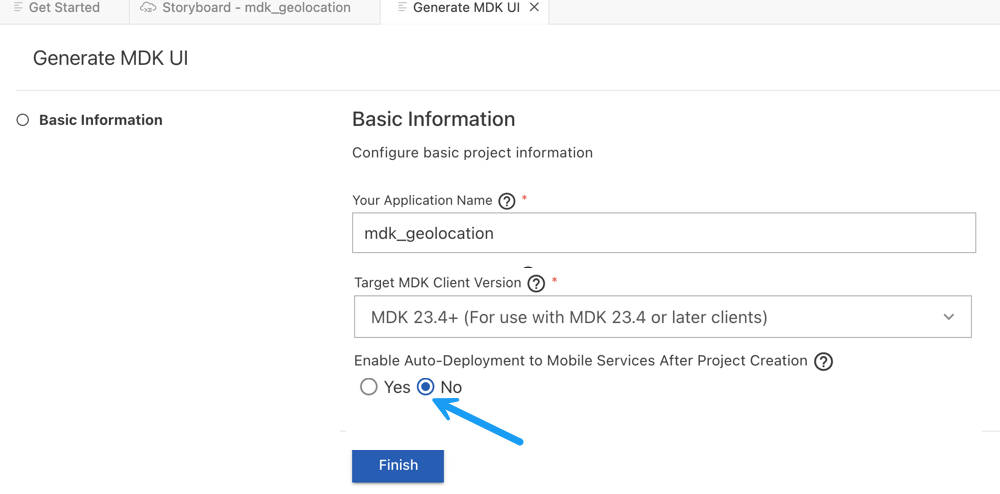
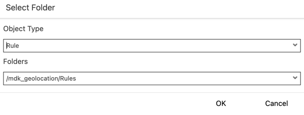
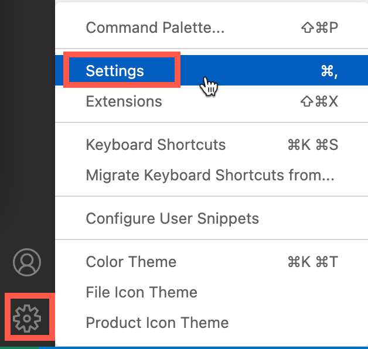
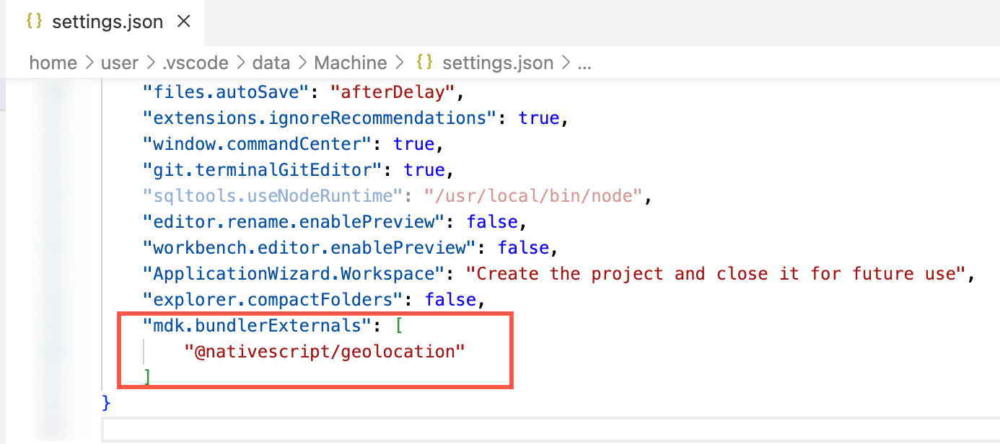
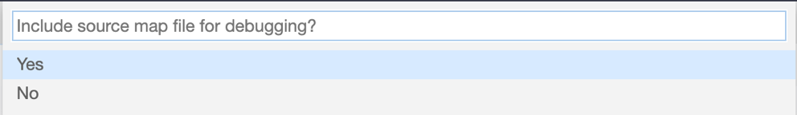
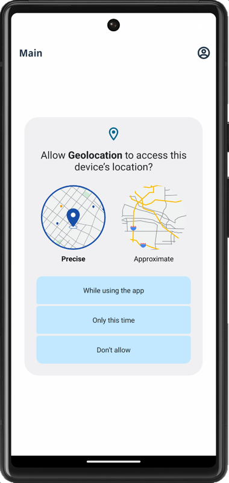
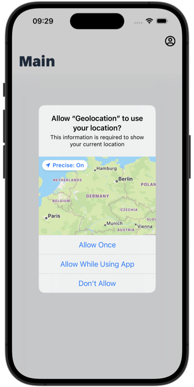
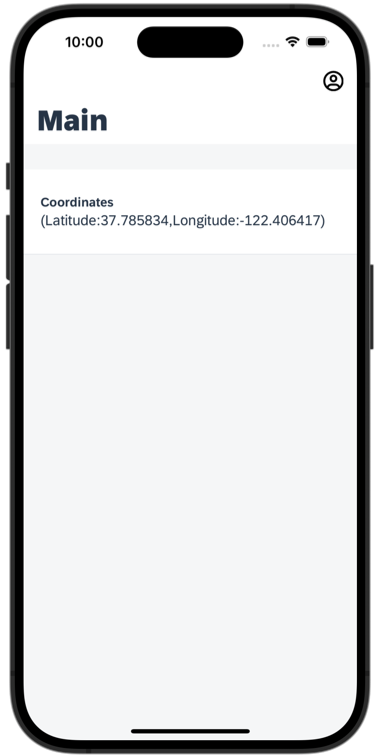

# Add NativeScript Plugins in an MDK App
<!-- description --> Build and run the Mobile Development Kit client with a non-visual extension functionality for Android and iOS platforms.

## Prerequisites
- **Tutorial**: [Set Up for the Mobile Development Kit (MDK)](https://developers.sap.com/group.mobile-dev-kit-setup.html)
- **Tutorial**: [Build Your Mobile Development Kit Client Using MDK SDK](https://developers.sap.com/tutorials/cp-mobile-dev-kit-build-client.html) (Steps 1 to 3)

## You will learn
  - How to reference the `NativeScript` Geolocation plugin from a rule
  - How to add a `NativeScript` plugin to your branded MDK client
  - How to build a Mobile development kit client for iOS & Android and connect to SAP Mobile application
  - How to capture the device's current location

## Intro
You may clone an existing metadata project from [GitHub repository](https://github.com/SAP-samples/cloud-mdk-tutorial-samples/tree/main/6-Create-Extension-Controls-in-Mobile-Development-Kit-Apps/2-Add-NativeScript-Plugin-in-an-MDK-App) and start directly with step 4 in this tutorial.

---

To extend the functionality, or customize the look and feel, and behavior of your client app, you can use the existing `NativeScript` plugins like nativescript-geolocation, nativescript-nfc etc. , add this to the client and reference it from a rule.

In this tutorial, you will use the existing `NativeScript` plugin nativescript-geolocation to capture the device location: latitude & longitude.


### Create a New Project Using SAP Build Code

This step includes creating a mobile project in SAP Build Lobby. 

1. In the SAP Build Lobby, click **Create** to start the creation process.

    <!-- border -->

2. Click the **Build an Application** tile.    

    <!-- border -->

3. Click the **SAP Build Code** tile to develop your project in SAP Business Application Studio, the SAP Build Code development environment, leveraging the capabilities of the services included in SAP Build Code.

    <!-- border -->

4. Click the **Mobile Application** tile. 

    <!-- border -->

5. Enter the project name `MDK_Geolocation` (used for this tutorial) , add a description (optional), and click **Create**. 

    <!-- border -->
    
    >SAP Build Code recommends the dev space it deems most suitable, and it will automatically create a new one for you if you don't already have one. If you have other dev spaces of the Mobile Application type, you can select between them. If you want to create a different dev space, go to the Dev Space Manager. See [Working in the Dev Space Manager](https://help.sap.com/docs/build_code/d0d8f5bfc3d640478854e6f4e7c7584a/ad40d52d0bea4d79baaf9626509caf33.html).

6. Your project is being created in the Project table of the lobby. The creation of the project may take a few moments.

    <!-- border -->

7. After you see a message stating that the project has been created successfully, click the project to open it. The project opens in SAP Business Application Studio, the SAP Build Code development environment.

    <!-- border -->  

    >When you open the SAP Business Application Studio for the first time, a consent window may appear asking for permission to track your usage. Please review and provide your consent accordingly before proceeding.
    > 

### Configure the Project Using Storyboard

The Storyboard provides a graphical view of the application's runtime resources, external resources, UI of the application, and the connections between them. This allows for a quick understanding of the application's structure and components.

- **Runtime Resources**: In the Runtime Resources section, you can see the mobile services application and mobile destination used in the project, with a dotted-line connected to the External Resources.
- **External Resources**: In the External Resources section, you can see the external services used in the project, with a dotted-line connection to the Runtime Resource or the UI app.
- **UI Application**: In the UI Applications section, you can see the mobile applications.

1. Click on **+** button in the **Runtime Resources** column to add a mobile services app to your project. 

    <!-- border --> 

    >This screen will only show up when your CF login session has expired. Use either `Credentials` OR  `SSO Passcode` option for authentication. After successful signed in to Cloud Foundry, select your Cloud Foundry Organization and Space where you have set up the initial configuration for your MDK app and click Apply.

    > 

2. Choose `myapp.mdk.demo` from the applications list in the **Mobile Application Services** editor and click **Add App to Project**. You do not require to add a destination for this tutorial.

    <!-- border -->  

    >You can access the mobile services admin UI by clicking on the Mobile Services option on the right hand side.

    In the storyboard window, the app will be added under the Runtime Resources column.

    <!-- border -->      

4. Click the **+** button in the UI application column header to add mobile UI for your project.

    <!-- border -->     

5. In the **Basic Information** step, leave the default values as they are, and click **Finish**.

    <!-- border -->  

7. After clicking **Finish**, the storyboard is updated displaying the UI component. The MDK project is generated in the project explorer based on your selections.
 
    <!-- border --> 

### Display the coordinates on a page

  1. Click the `Main.page`, drag & drop **Static Key Value** container to the page area.

    <!-- border -->

  2. In **Properties** | **Layout**, change `NumberOfColumns` to 1.

    <!-- border -->

  3. Drag & drop **Key Value Item** to the container.

    <!-- border -->

  4. Set `KeyName`as `Coordinates`. To bind it's value property, click on `create a rule`. You will create a new JavaScript file to capture the device location: latitude & longitude.

    <!-- border -->

  5. Keep the default selection for *Object Type* as **Rule** and *Folders*. Click **OK**.

    <!-- border -->

    >You can find more details about [writing a Rule](https://help.sap.com/doc/f53c64b93e5140918d676b927a3cd65b/Cloud/en-US/docs-en/guides/getting-started/mdk/development/rules.html).

   6. In the **Base Information**, enter the Rule name as `GetCoordinates` and click  **Finish**.

    <!-- border -->


   8. Replace the generated snippet with below code.

    ```JavaScript
    /**
    * Describe this function...
    * @param {IClientAPI} context
    */
    import * as geolocation from "@nativescript/geolocation";
    import { CoreTypes } from "@nativescript/core";
    export default async function GetCoordinates(context) {
        var logger = context.getLogger();
        console.log("Current Log Level: " + logger.getLevel());
        // check if geolocation is not enabled
        var locationIsEnabled = await geolocation.isEnabled();
        if (!locationIsEnabled) {
            // request for the user to enable it
            await geolocation.enableLocationRequest();
        }
        // Get current location with high accuracy
        return geolocation.getCurrentLocation({
            desiredAccuracy: CoreTypes.Accuracy.high, //This will return the finest location available
            updateDistance: 5, //Update distance filter in meters.
            timeout: 11000 //How long to wait for a location in ms.
        }).then(function (loc) {
            if (loc) {
                console.log(loc);
                console.log('\nCurrent Location: (' + loc.latitude + ',' + loc.longitude + ')');
                logger.log(loc.toString());
                var locMessage = '(' + "Latitude:" + loc.latitude + ',' + "Longitude:" + loc.longitude + ')';
                logger.log('Current Location: ' + locMessage, 'INFO');
                return locMessage;
            }
        }, function (e) {
            logger.log(e.message, 'ERROR');
        });
    }
    ```

### Enable the Loading Indicator on Sectioned Table in the Main page


When the Main page loads, you can display a loading indicator informing about something is being processed before the data appears.  

Enable the loading indicator at the Sectioned Table level by providing the following information:

| Property | Value |
|----|----|
| `Enabled`| `true` |
| `Text`| Enter `Loading, please wait...` |

<!-- border -->


### List the NPM modules as external reference


In `GetCoordinates.js` file, you referred `@nativescript/geolocation` plugin. You now need to list this module as external references in BAS configuration so when bundling, MDK editor knows not to worry about these references.

1. Click on the gear icon on the bottom left of the BAS window and select  **Settings**.

    <!-- border -->

2. Switch to the *Remote* tab.

    <!-- border -->

3. Search with `mdk`, click **Edit in settings.json**.

    <!-- border -->

4. Include below references in `mdk.bundlerExternals`.

    ```JSON
    "@nativescript/geolocation"
    ```

     <!-- border -->        


### Deploy the application


So far, you have learned how to build an MDK application in the SAP Business Application Studio editor. Now, you will deploy the application definitions to Mobile Services to use in the Mobile client.

1. Right-click `Application.app` and select **MDK: Deploy**.

    <!-- border -->

2. Select deploy target as **Mobile Services**.

    <!-- border -->

3. Select **Mobile Services Landscape**.

    <!-- border -->    

4. If you want to enable source for debugging the deployed bundle, then choose **Yes**.

    <!-- border -->    

    You should see **Deploy to Mobile Services successfully!** message.

    <!-- border -->

### Add NativeScript plugin and External dependencies in your local .mdkproject


In order to use the existing `NativeScript` plugin in MDK client, you will need to first add it in `.mdkproject` and then create your branded MDK client.

1. Make sure that you have already completed steps 1 to 3 from [Build Your Mobile Development Kit Client Using MDK SDK](https://developers.sap.com/tutorials/cp-mobile-dev-kit-build-client.html) tutorial.

2. Open `MDKProject.json` file and replace existing content with below. Provide an appropriate value to the `BundleID`, it should be a unique identifier for your application. 

    ```JSON
    {
      "AppDisplayName": "Geolocation",
      "AppName": "MDKGeolocation",
      "AppVersion": "1.0.0",
      "AndroidVersionCode": "Auto",
      "BundleID": "<Enter your bundle ID>",
      "Externals": ["@nativescript/geolocation"],
      "NSPlugins": ["@nativescript/geolocation"],
      "UrlScheme": "mdkgeolocation"
    }
    ```

<!-- border -->

### Add googlePlayServicesVersion and Permission in App Resources Merge folder(Required only for Android client)


With [Google Play services](https://developers.google.com/android/guides/overview), your app can take advantage of the latest, Google-powered features such as Maps, Google+, and more.

1. Add `app.gradle` and `AndroidManifest.xml` files as per below structure in your `DemoSampleApp.mdkproject`.

            DemoSampleApp.mdkproject
              ├── App_Resources_Merge
                  └── Android
                      ├── app.gradle
                      └── src
                          └── main
                              └── AndroidManifest.xml


      <!-- border -->

    >Files specified in the `.mdkproject/App_Resources_Merge` folder override a part of the files in `<generated-project>/app/App_Resources`. You can find more details about it in [help documentation](https://help.sap.com/doc/f53c64b93e5140918d676b927a3cd65b/Cloud/en-US/docs-en/guides/getting-started/mdk/custom-client/app-resources-merge.html).


2. Provide below information in the `app.gradle` file. Save the changes.

    ```Java
    // add gradle dependencies here
    project.ext {
    	googlePlayServicesVersion = "21.+"
    }
    dependencies {
    	def googlePlayServicesVersion = project.googlePlayServicesVersion
    	implementation "com.google.android.gms:play-services-location:$googlePlayServicesVersion"
    }
    ```

3. Provide below information in the `AndroidManifest.xml` file. Save the changes.

    ```XML
    <?xml version="1.0" encoding="utf-8"?>
    <manifest xmlns:android="http://schemas.android.com/apk/res/android">

    	<!-- Always include this permission -->
      <!-- This permission is for "approximate" location data -->
      <uses-permission android:name="android.permission.ACCESS_COARSE_LOCATION" />

      <!-- Include only if your app benefits from precise location access. -->
      <!-- This permission is for "precise" location data -->
      <uses-permission android:name="android.permission.ACCESS_FINE_LOCATION" />

      <!-- Required only when requesting background location access on
           Android 10 (API level 29) and higher. -->
      <uses-permission android:name="android.permission.ACCESS_BACKGROUND_LOCATION" />
    </manifest>
    ```


### Create & Run the MDK client


[OPTION BEGIN [Android]]

1. Create your MDK client either using MDK SDK by following the steps 4 & 5 from [Build Your Mobile Development Kit Client Using MDK SDK](https://developers.sap.com/tutorials/cp-mobile-dev-kit-build-client.html) tutorial OR using SAP Mobile Services Cloud Build by following [Build Your Mobile Development Kit Client Using Cloud Build Service](https://developers.sap.com/tutorials/cp-mobile-dev-kit-cbs-client.html) tutorial and run it in your device.

2. After you have accepted the app update, allow your app to access your location.

    

    In Main page, you will see device's current location.

    

[OPTION END]

[OPTION BEGIN [iOS]]

1. Create your MDK client either using MDK SDK by following the steps 4 & 5 from [Build Your Mobile Development Kit Client Using MDK SDK](https://developers.sap.com/tutorials/cp-mobile-dev-kit-build-client.html) tutorial OR using SAP Mobile Services Cloud Build by following [Build Your Mobile Development Kit Client Using Cloud Build Service](https://developers.sap.com/tutorials/cp-mobile-dev-kit-cbs-client.html) tutorial.

2. After you have accepted the app update, allow your app to access your location.

    

    In Main page, you will see device's current location.

    

[OPTION END]


---
