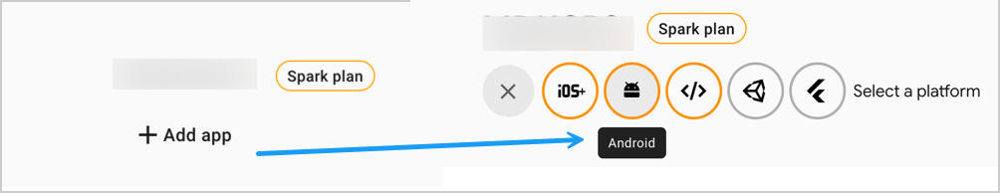
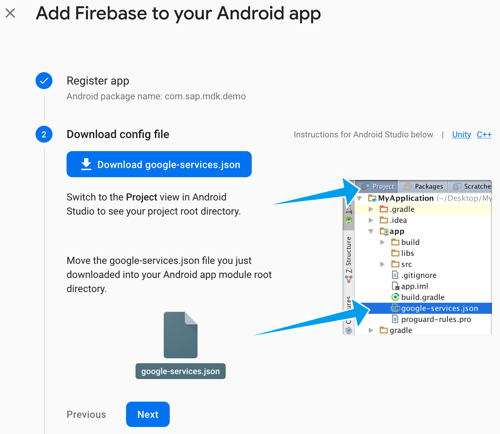
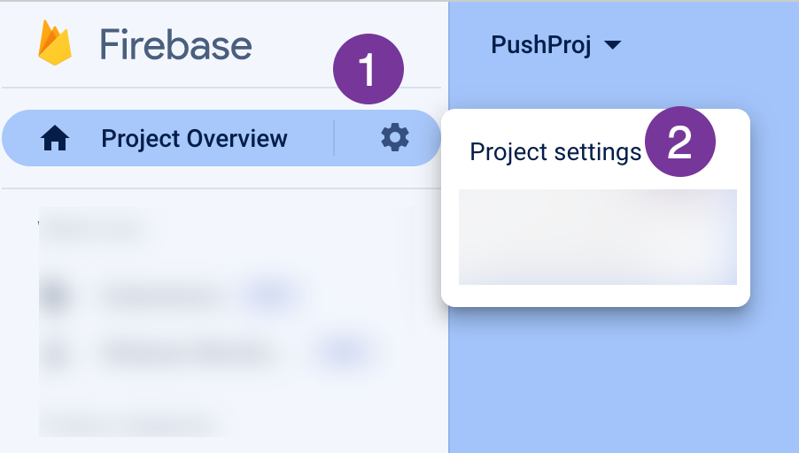
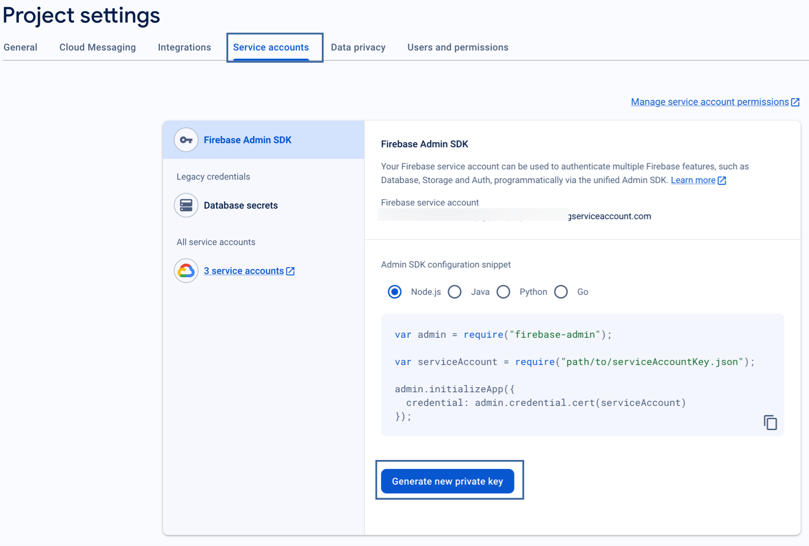
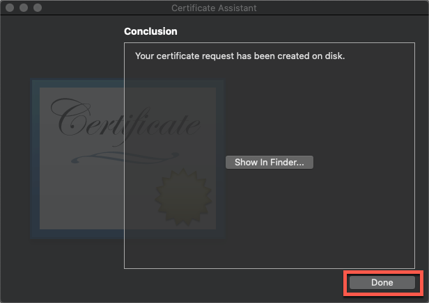
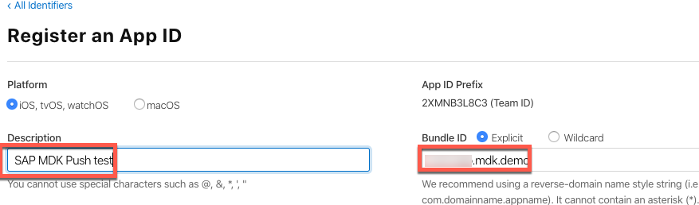
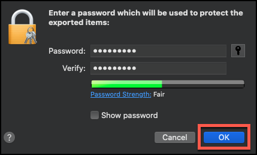
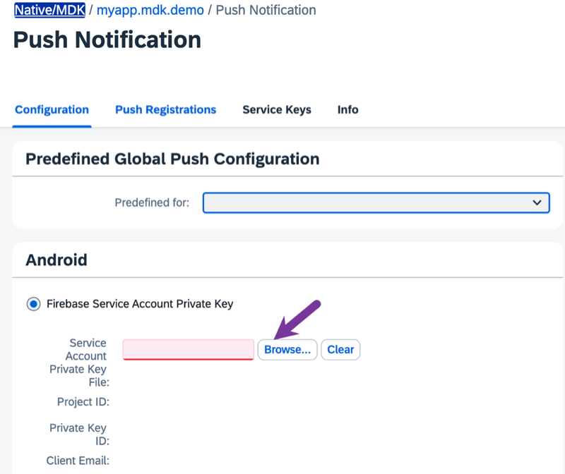
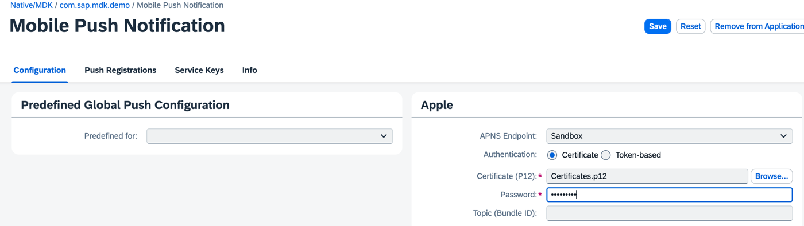

# Enable Push Notifications in Your Branded MDK Client
<!-- description --> Use the SAP Mobile Services to enable push notifications in your branded MDK client.

## Prerequisites
- **Tutorial**: [Set Up Initial Configuration for an MDK App](https://developers.sap.com/tutorials/cp-mobile-dev-kit-ms-setup.html)
- **Tutorial**: Follow steps 2-5 in [Enable Push Notifications in the MDK Public Store Client](https://developers.sap.com/tutorials/cp-mobile-dev-kit-push.html) to create an MDK metadata project
- **Tutorial**: Follow steps 1-3 in [Build Your Mobile Development Kit Client Using MDK SDK](https://developers.sap.com/tutorials/cp-mobile-dev-kit-build-client.html) to create your local MDK project
- **Apple ID**: A paid Apple developer account is required.

## You will learn
  - How to set up push notifications on an Apple Developer and Google Firebase account
  - How to configure push settings on SAP Mobile Services
  - How to send push notification in your branded MDK client

## Intro
You may clone an existing metadata project from [GitHub repository](https://github.com/SAP-samples/cloud-mdk-tutorial-samples/tree/main/5-Brand-Your-Customized-App-with-Mobile-Development-Kit-SDK/1-Enable-Push-Notifications-in-your-branded-MDK-client).

---


### Generate push configuration for Android/iOS device


>Make sure you are choosing the right device platform tab above.

[OPTION BEGIN [Android]]

1. Open the [Firebase console](https://console.firebase.google.com/u/0/?pli=1), login with your Google account and click **Create Project** or **Add Project** (you will see this option if you already have any existing projects).

    <!-- border -->

2. Provide a Project Name, click **Continue**.

    <!-- border -->

3. Uncheck **Enable Google Analytics for this project** option and click **Create Project**.

    <!-- border -->

4. Once the project is ready, click **Continue**.

    <!-- border -->

5. Click **Android** icon to add Firebase to your Android app.

    <!-- border -->

6. Provide a unique name to Android package name, click **Register app**.

    <!-- border -->

7. `Download goole-services.json` file, click **Next**.

    <!-- border -->

8. In **Add Firebase SDK** step, click **Next**.

9. In the following step, click **Next** and then click **Continue to console**.

    <!-- border -->    

10. Go to the **Project settings**. 

    <!-- border -->   
    
11. Select the **Service accounts** tab and click on the **Generate new private key**. 

    <!-- border -->  

12. Click the **Generate key** in the pop-up window and store the downloaded private key file securely because the key cannot be recovered if lost.

    <!-- border -->   

[OPTION END]

[OPTION BEGIN [iOS]]

In order to implement Push Notifications, a paid Apple developer account is required. Students or other developers with a personal Apple ID for their team will not be able to use push notifications, because they will not have access to the Developer Portal to generate the required certificate.

To enable your app for push notifications, you need to carry out the following tasks:

* Obtain a certificate signing request
* Create a new development certificate `.cer` file
* Install the `.cer` file and create the .p12 file
* Register an iOS App ID
* Register your device

1. Obtain a certificate signing request

    In order to use the **Apple Push Notification service**, you need to create a **CSR file**.

    On your Mac, open the **Keychain Access** application, and navigate to **Keychain Access > Certificate Assistant > Request a Certificate From a Certificate Authority...**

    <!-- border -->

    In the dialog, enter the email address which is associated with your Apple Developer account. Also, make sure you check the **Request is saved to disk** option.

    <!-- border -->

    Click **Continue**.

    Choose a folder to store the certificate -- it is good practice to store generated files in a separate folder for each project -- and click **Save**.

    Once you see a dialog saying the certificate is saved successfully, click **Done** to finish.

    <!-- border -->

2. Create a new development certificate `.cer` file

    Go to your [Apple Developer Account](https://developer.apple.com/account) and Click **Certificates**.

    <!-- border -->

    Click **+** icon to register a unique **Identifiers** for your application.

    <!-- border -->

    Select **App IDs** and click **Continue**.

    <!-- border -->

    Provide a unique **Bundle ID** name and **Description**.

    <!-- border -->

    Scroll down and select the **Push Notifications** capability from the list, click **Continue**.

    <!-- border -->

    In the following screen, select option for **Deployment Details** and then click **Continue**.

    Confirm your App ID by clicking on **Register**.

3. Create a new development certificate `.cer` file

    Under **Identifiers**, search for the App ID that you registered in previous step.

    <!-- border -->

    Scroll down and select the **Push Notifications** capability, click **Configure**.

    <!-- border -->

    To configure push notifications for the provided App ID, a Client SSL Certificate is required that will allow the notification server to connect to the Apple Push Notification Service. Each App ID requires its own Client SSL Certificate.

    Click **Create Certificate** to start the process for creating the needed `.cer` file.

    <!-- border -->

    Click **Choose File** and browse to the downloaded Signing Request `CSR` file, click **Continue**.

    Apple will now create a `.cer` file for you which is issued by the **Apple Worldwide Developer Relations Certification Authority**.

    <!-- border -->

    Click **Download** to download your certificate.

    <!-- border -->

4. Install the `.cer` file and create the .p12 file

    In order to configure the `APNS` on **SAP Mobile Services**, you need to install the `.cer` file and create the needed `.p12` file.

    >A `.p12` file is a encrypted container for the certificate and private key. This file is needed by Mobile Services for the `APNS` configuration.

    Locate your downloaded `.cer` file and double-click it in order to install the certificate.

    >In case the **Add Certificate** dialog pops up make sure to choose **Login** from the dropdown and click **Add**.

    If the certificate is added correctly to the Keychain you should see it in the `MyCertificates` section, make sure you selected **login** as keychain.

    <!-- border -->

    Select the certificate as well as the private key and right-click to export those two items.

    <!-- border -->

    Make sure that in the dropdown **Personal Information Exchange (.p12)** is selected and click **Save**. You will be prompted to enter a password, click **OK** to export the files.

    <!-- border -->

5. Register your device

    Click **+** icon to register your iOS device.

    <!-- border -->

    Provide **Device Name** & **Device ID (UDID)** and then click **Continue**.

    <!-- border -->

[OPTION END]


### Provide information to Mobile Services


>Make sure you are choosing the right device platform tab above.

[OPTION BEGIN [Android]]

1. In Mobile Services admin UI, navigate to `Mobile Applications` | `Native/MDK` | `myapp.mdk.demo` | `Mobile Push Notification`. 

2. If you have selected _Predefined for_ option, switch to the empty value. You should see Android option showing up on the page. Click **Browse…** to load the downloaded private key file. 

    <!-- border -->

3. You should see the values showing up, click **Save** to save the changes.

    <!-- border -->

[OPTION END]

[OPTION BEGIN [iOS]]

1. In Mobile Services admin UI, navigate to `Mobile Applications` | `Native/MDK` | `myapp.mdk.demo` | `Mobile Push Notification`.

2. If you have selected _Predefined for_ option, switch to the empty value. You should see options showing up on the page. Provide the following details to the **Apple** panel and click **Save**.


    |  Field Name     | Value |
    |  :------------- | :------------- |
    |  APNS Endpoint | Select `Sandbox` from the dropdown |
    |  Authenticate | Choose `Certificate` |
    |  Certificate | `Browse to the `.p12`certificate you just exported` |
    |  Password | Enter the password you provided during the export |

    <!-- border -->

You have now successfully configured the APNS Endpoint on the server side in Mobile Services admin UI.


[OPTION END]


### Place push files in local MDK project


>Make sure you are choosing the right device platform tab above.

[OPTION BEGIN [Android]]

Paste the downloaded `google-services.json` file to `/DemoSampleApp.mdkproject/App_Resources/Android/` path.

<!-- border -->

[OPTION END]

[OPTION BEGIN [iOS]]

1. Create a new file named as `app.entitlements` and place it under `/DemoSampleApp.mdkproject/App_Resources_Merge/iOS/` path.

    <!-- border -->

2. Open this file and copy & paste the below information:

    ```XML
    <?xml version="1.0" encoding="UTF-8"?>
    <!DOCTYPE plist PUBLIC "-//Apple//DTD PLIST 1.0//EN" "http://www.apple.com/DTDs/PropertyList-1.0.dtd">
    <plist version="1.0">
    <dict>
    	<key>aps-environment</key>
    	<string>development</string>
    </dict>
    </plist>
    ```

    >Assign a value of development or production to aps-environment key, depending only on which activity you are creating the provisioning profile for.

[OPTION END]


### Create MDK client

Follow step 4 from [Build Your Mobile Development Kit Client Using MDK SDK](https://developers.sap.com/tutorials/cp-mobile-dev-kit-build-client.html) tutorial to create your branded MDK client.

### Test a Simple Notification in your MDK client

>Make sure you are choosing the right device platform tab above.

[OPTION BEGIN [Android]]

1. Follow step 5 from [Build Your Mobile Development Kit Client Using MDK SDK](https://developers.sap.com/tutorials/cp-mobile-dev-kit-build-client.html) tutorial to create your branded MDK client.

2. Once you accept the App update, a message should show **Push Notification registered**. Click **OK**.

    

3. It is time now to send the first push notification from the **SAP Mobile Services push notification feature**.

    Navigate to Mobile Services admin UI. In **Mobile Push Notification** feature, switch to **Push Registrations** tab.

    There you will find information about user registered for push notification and also details about Push providers. Identify your Device ID and click **Send Notification**.

    <!-- border -->

4. In notification dialog, type a notification message and click **Send**.

    <!-- border -->

    You will see a success toast message.

    <!-- border -->

    After sending notification, mobile device should receive the message. This example uses the simplest notification that only contains the alert property. 

    

[OPTION END]

[OPTION BEGIN [iOS]]

1. Follow step 5 from [Build Your Mobile Development Kit Client Using MDK SDK](https://developers.sap.com/tutorials/cp-mobile-dev-kit-build-client.html) tutorial to create your branded MDK client.

2. After accepting the app update, allow the permission to display notifications. If push registration is successful, a message should show **Push Notification registered**. Click **OK**.

    
    

3. It is time now to send the first push notification from the **SAP Mobile Services push notification feature**.

    Navigate to Mobile Services admin UI. In **Mobile Push Notification** feature, switch to **Push Registrations** tab.

    There you will find information about user registered for push notification and also details about Push providers. Identify your Device ID and click **Send Notification**.

    <!-- border -->

4. In notification dialog, type a notification message and click **Send**.

    <!-- border -->

    You will see a success toast message.

    <!-- border -->

    After sending notification, mobile device should receive the message. This example uses the simplest notification that only contains the alert property. 

    

    If you have Apple watch connected to the iPhone device, you can also see same push notification on the Apple Watch.

    

    >MDK supports rich push notification. MDK does not run on smart watches or as an Apple watch application.

[OPTION END]

### Test an Advanced Notification in your MDK client

>Make sure you are choosing the right device platform tab above. 

[OPTION BEGIN [Android]]

1. Based on the device Operating System, notifications are handled differently. On Android, the notification is a data message and only handled by the apps notification callback. The callback is only called when the app is active. So, how can you make it visible always? You use the advanced Message properties: `gcm.title/gcm.body`for your message. For more information on Google/Firebase Cloud Messaging, see [documentation](https://help.sap.com/doc/f53c64b93e5140918d676b927a3cd65b/Cloud/en-US/docs-en/guides/features/push/api/provider/fcm.html). 

2. Send the Android client in the background or swipe close. 

3. Switch to the **Advanced** tab, provide below payload and click **Send**. 

    ```JSON
    {
        "alert": "Alert message",
        "gcm": {
            "title": "MDK Push",
            "body": "This is an advanced notification message"
        }
    }
    ```

    <!-- border -->

3. After sending notification, you will see a notification in the notification center. 

        

[OPTION END]

[OPTION BEGIN [iOS]]

1. Based on the device Operating System, notifications are handled differently. On `iOS` or `iPadOS` the notification is handled by the app when in foreground, but handled (and displayed) by the Notification Console and shown in the Lock Screen, when the app is in background. So, how can you make it visible always? You use the advanced Message properties: `apns.title/apns.body`for your message. For more information on Apple Remote Notification, see [documentation](https://help.sap.com/doc/f53c64b93e5140918d676b927a3cd65b/Cloud/en-US/docs-en/guides/features/push/api/provider/apns.html). 

2. Send the iOS client in the background or swipe close. 

3. Switch to the **Advanced** tab, provide below payload and click **Send**. 

    ```JSON
    {
        "alert": "Alert message",
        "apns": {
            "title": "MDK Push",
            "body": "This is an advanced notification message"
        }
    }
    ```

    <!-- border -->

3. After sending notification, you will see a notification in the notification center. 

     
  
[OPTION END]

Congratulations, you have successfully enabled push notification in your branded client and you can continue with the remaining tutorials in this mission.

---
