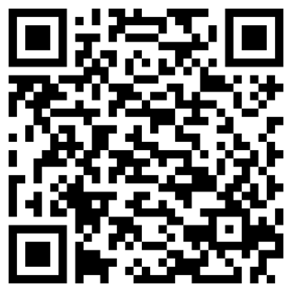
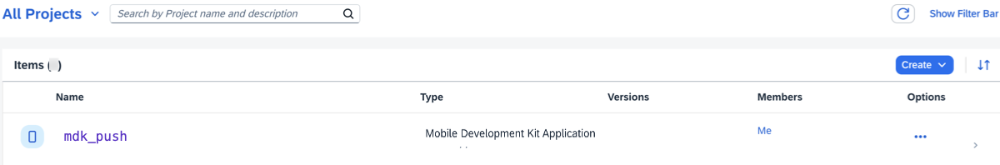
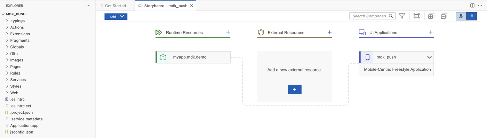
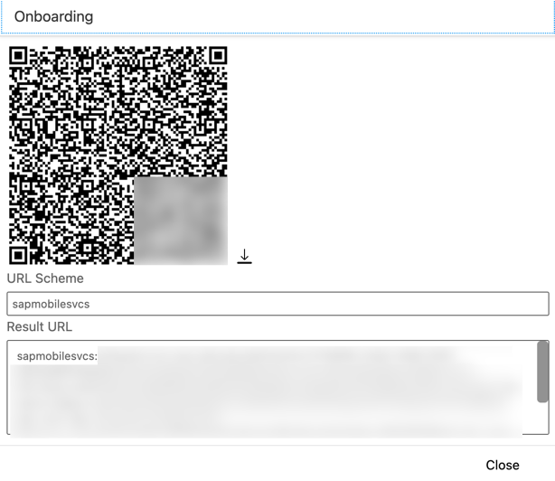

# Enable Push Notifications in the MDK Public Store Client
<!-- description --> Use the SAP Mobile Services to enable push notifications in the MDK public store client.

## Prerequisites
- **Tutorial group:** [Set Up for the Mobile Development Kit (MDK)](https://developers.sap.com/group.mobile-dev-kit-setup.html)
- **Install SAP Mobile Services Client** on your [Android](https://play.google.com/store/apps/details?id=com.sap.mobileservices.client) device or [iOS](https://apps.apple.com/us/app/sap-mobile-services-client/id1413653544)
<table><tr><td align="center"><!-- border --><br>Android</td><td align="center"><br>iOS</td></tr></table>
(If you are connecting to `AliCloud` accounts, you will need to brand your [custom MDK client](https://developers.sap.com/tutorials/cp-mobile-dev-kit-build-client.html) by allowing custom domains.)


## You will learn
  - How to use MDK push register action
  - How to use predefined push configuration for the public store version of SAP Mobile Services client (MDK client)
  - How to send push notification to an MDK app

## Intro
You may clone an existing metadata project from [GitHub repository](https://github.com/SAP-samples/cloud-mdk-tutorial-samples/tree/main/4-Level-Up-with-the-Mobile-Development-Kit/6-Enable-Push-Notifications-in-the-MDK-Public-Store-Client) and start directly with step 5 in this tutorial.

---


### Define push notification settings in app configuration

1. Open the [SAP Mobile Services admin UI](https://developers.sap.com/tutorials/cp-mobile-dev-kit-ms-setup.html), click **Push Notification** feature.

    <!-- border -->

    >You can add **Push Notification** feature by clicking on + icon in case feature is not already assigned to the application.

2. Select **SAP Mobile Services Client** under **Predefined for** option, click **Save**.

    <!-- border -->

    >Predefined push is supported only for the MDK (SAP Mobile Services client) public store client.

    >If you want to enable push notification in your custom MDK client then follow [Enable Push Notifications in Your Branded MDK Client](https://developers.sap.com/tutorials/cp-mobile-dev-kit-push-customclient.html) tutorial.


### Create a New Project Using SAP Build Code

This step includes creating a mobile project in SAP Build Lobby. 

1. In the SAP Build Lobby, click **Create** > **Create** to start the creation process.

    <!-- border -->

2. Click the **Build an Application** tile.    

    <!-- border -->

3. Click the **SAP Build Code** tile to develop your project in SAP Business Application Studio, the SAP Build Code development environment, leveraging the capabilities of the services included in SAP Build Code.

    <!-- border -->

4. Click the **Mobile Application** tile. 

    <!-- border -->

5. Enter the project name `mdk_push` (used for this tutorial) , add a description (optional), and click **Create**. 

    <!-- border -->
    
    >SAP Build Code recommends the dev space it deems most suitable, and it will automatically create a new one for you if you don't already have one. If you have other dev spaces of the Mobile Application type, you can select between them. If you want to create a different dev space, go to the Dev Space Manager. See [Working in the Dev Space Manager](https://help.sap.com/docs/build_code/d0d8f5bfc3d640478854e6f4e7c7584a/ad40d52d0bea4d79baaf9626509caf33.html).

6. Your project is being created in the Project table of the lobby. The creation of the project may take a few moments. After the project has been created successfully, click the project to open it. 

    <!-- border -->
    
7. The project opens in SAP Business Application Studio, the SAP Build Code development environment.

    <!-- border -->

    >When you open the SAP Business Application Studio for the first time, a consent window may appear asking for permission to track your usage. Please review and provide your consent accordingly before proceeding.
    > 

### Configure the Project Using Storyboard

The Storyboard provides a graphical view of the application's runtime resources, external resources, UI of the application, and the connections between them. This allows for a quick understanding of the application's structure and components.

- **Runtime Resources**: In the Runtime Resources section, you can see the mobile services application and mobile destination used in the project, with a dotted-line connected to the External Resources.
- **External Resources**: In the External Resources section, you can see the external services used in the project, with a dotted-line connection to the Runtime Resource or the UI app.
- **UI Application**: In the UI Applications section, you can see the mobile applications.

1. Click on **+** button in the **Runtime Resources** column to add a mobile services app to your project. 

    <!-- border --> 

    >This screen will only show up when your CF login session has expired. Use either `Credentials` OR  `SSO Passcode` option for authentication. After successful signed in to Cloud Foundry, select your Cloud Foundry Organization and Space where you have set up the initial configuration for your MDK app and click Apply.

    > 

2. Choose `myapp.mdk.demo` from the applications list in the **Mobile Application Services** editor and click **Add App to Project**. You do not require to add a destination for this tutorial.

    <!-- border -->  

    >You can access the mobile services admin UI by clicking on the Mobile Services option on the right hand side.

    In the storyboard window, the app will be added under the Runtime Resources column.

    <!-- border -->      

4. Click the **+** button in the UI application column header to add mobile UI for your project.

    <!-- border -->     

5. In the **Basic Information** step, select **No** for the **Enable Auto-Deployment to Mobile Services After Creation** property, and click **Finish**. You will modify the generated project in next step and will deploy it later.

    <!-- border -->  

7. After clicking **Finish**, the storyboard is updated displaying the UI component. The MDK project is generated in the project explorer based on your selections.
 
    <!-- border --> 

### Create MDK actions to register for push notifications


In this step, you will create the following actions:

* **Push Notification Register action**: this will register the device with SAP Mobile Services for push notification.

* **Message actions**: these will display a message if Push Notification Register action has succeeded or failed.


1. Create a Push Notification Register action.

    Right-click the **Actions** folder | **MDK: New Action** | choose **Other** in **Category** | click **Push Notification Register** | **Next**.

    <!-- border -->

    In the **Base Information** step, provide the below information and click **Finish** to complete the action creation process.

    | Property | Value |
    |----|----|
    | `Name`| `PushRegister` |

    <!-- border -->

    >More details on _Push Notification Action_ is available in [help documentation](https://help.sap.com/doc/69c2ce3e50454264acf9cafe6c6e442c/Latest/en-US/docs-en/reference/schemadoc/Action/PushNotificationRegister.schema.html).

2. Define a success message if the Push Register Notification action is succeeded.

    Right-click the **Actions** folder | **MDK: New Action** | choose **Message** in **Category** | click **Message** | **Next**.

    <!-- border -->
    
    In the **Base Information** step, provide the below information and Click **Finish**.

    | Property | Value |
    |----|----|
    | `Name`| `PushRegisterSuccessMessage` |
    | `Type` | Select `Message` from the dropdown |
    | `Message` | `Push Notification registered` |
    | `Title` | `Success` |
    | `OKCaption` | `OK` |
    | `OnOK` | `--None--` |
    | `CancelCaption` | leave it blank |
    | `OnCancel` | `--None--` |

    <!-- border -->

3. Define a failure message if the Push Register Notification action is failed.

    Right-click the **Actions** folder | **MDK: New Action** | choose **Message** in **Category** | click **Message** | **Next**.

    <!-- border -->

    In the **Base Information** step, provide the below information and Click **Finish**.

    | Property | Value |
    |----|----|
    | `Name`| `PushRegisterFailureMessage` |
    | `Type` | Select `Message` from the dropdown |
    | `Message` | `Push Notification didn't register` |
    | `Title` | `Failure` |
    | `OKCaption` | `OK` |
    | `OnOK` | `--None--` |
    | `CancelCaption` | leave it blank |
    | `OnCancel` | `--None--` |

    <!-- border -->

4. Define _Success_ and _Failure_ actions for `PushRegister.action`.

    In the action editor for the new action, expand the **Common Action Properties** and provide the below information:

    | Property | Value |
    |----|----|
    | `Success Action` | Click the link icon to bind it to `PushRegisterSuccessMessage.action` |
    | `Failure Action` | Click the link icon to bind it to `PushRegisterFailureMessage.action`  |

    >When `PushRegister.action` gets executed successfully then `PushRegisterSuccessMessage.action` will be triggered or if `PushRegister.action` fails then `PushRegisterFailureMessage.action` will be triggered.

    <!-- border -->


### Call the push register action


In the step, you will set and call the Push Register Notification action when app is updated with the new metadata.

>It is up to developers how they want to call a Push Register Notification action.

In `Application.app` file, bind the `OnDidUpdate` event to `PushRegister.action`.

<!-- border -->


### Deploy the Project


So far, you have learned how to build an MDK application in the SAP Business Application Studio editor. Now, you will Deploy the Project definitions to Mobile Services to use in the Mobile client.

1. Click the **Deploy** option in the `Application.app` header area, and then choose the deployment target as **Mobile Services** .

    <!-- border -->

2. Select deploy target as **Mobile Services**.

    <!-- border -->

3. Select **Mobile Services Landscape**.

    <!-- border -->  

5. If you want to enable source for debugging the deployed bundle, then choose **Yes**.

    <!-- border -->

    You should see **Deploy to Mobile Services successfully!** message.

    <!-- border -->


### Display the QR code for app onboarding the Mobile app

SAP Business Application Studio has a feature to display the QR code for onboarding in the Mobile client. To view the onboarding QR code, click the **Application QR Code** icon in the editor's header area.

<!-- border -->

The On-boarding QR code is now displayed.

<!-- border -->

>Leave the Onboarding dialog box open for the next step.

### Test a Simple Notification in MDK client

>Make sure you are choosing the right device platform tab above. Once you have scanned and on-boarded using the onboarding URL, it will be remembered. When you Log out and on-board again, you will be asked either to continue to use current application or to scan new QR code.

[OPTION BEGIN [Android]]

1. Follow [these steps](https://github.com/SAP-samples/cloud-mdk-tutorial-samples/blob/main/Onboarding-Android-client/Onboarding-Android-client.md) to successfully on-board the MDK client on your Android device.

2. After accepting the app update, a message should show **Push Notification registered**. Click **OK**.

    

3. It is time now to send the first push notification from the **SAP Mobile Services push notification feature**.

    Navigate to Mobile Services admin UI. In **Push Notification** feature, switch to **Push Registrations** tab.

    There you will find information about user registered for push notification and also details about Push providers. Identify your Device ID and click **Send Notification**.

    <!-- border -->

4. In notification dialog, type a notification message and click **Send**.

    <!-- border -->

    You will see a success toast message.

    <!-- border -->

    After sending notification, mobile device should receive the message. This example uses the simplest notification that only contains the alert property. 

        

[OPTION END]

[OPTION BEGIN [iOS]]

1. Follow [these steps](https://github.com/SAP-samples/cloud-mdk-tutorial-samples/blob/main/Onboarding-iOS-client/Onboarding-iOS-client.md) to successfully on-board the MDK client on your iOS device.

2. After accepting the app update, allow the permission to display notifications. If push registration is successful, a message should show **Push Notification registered**. Click **OK**.

    
    

3. It is time now to send the first push notification from the **SAP Mobile Services push notification feature**.

    In Mobile Services admin UI, navigate to **Mobile Applications** **&rarr;** **Native/MDK** **&rarr;** `myapp.mdk.demo`. Under the **Settings** > **Add-on Features**, click the **Push Notification** feature, and switch to **Push Registrations** tab.

    There you will find information about user registered for push notification and also details about Push providers. Identify your Device ID and click **Send Notification**.

    <!-- border -->

4. In notification dialog, type a notification message and click **Send**.

    <!-- border -->

    You will see a success toast message.

    <!-- border -->

    After sending notification, mobile device should receive the message. This example uses the simplest notification that only contains the alert property. 

    

    If you have Apple watch connected to the iPhone device, you can also see same push notification on the Apple Watch.

    <!-- border -->

    >MDK supports rich push notification. MDK does not run on smart watches or as an Apple watch application.

[OPTION END]

### Test an Advanced Notification in your MDK client

>Make sure you are choosing the right device platform tab above. 

[OPTION BEGIN [Android]]

1. Based on the device Operating System, notifications are handled differently. On Android, the notification is a data message and only handled by the apps notification callback. The callback is only called when the app is active. So, how can you make it visible always? You use the advanced Message properties: `gcm.title/gcm.body`for your message. For more information on Google/Firebase Cloud Messaging, see [documentation](https://help.sap.com/doc/f53c64b93e5140918d676b927a3cd65b/Cloud/en-US/docs-en/guides/features/push/api/provider/fcm.html). 

2. Send the Android client in the background or swipe close. 

3. Switch to the **Advanced** tab, provide below payload and click **Send**. 

    ```JSON
    {
        "alert": "Alert message",
        "gcm": {
            "title": "MDK Push",
            "body": "This is an advanced notification message"
        }
    }
    ```

    <!-- border -->

3. After sending notification, you will see a notification in the notification center. 

        

[OPTION END]

[OPTION BEGIN [iOS]]

1. Based on the device Operating System, notifications are handled differently. On `iOS` or `iPadOS` the notification is handled by the app when in foreground, but handled (and displayed) by the Notification Console and shown in the Lock Screen, when the app is in background. So, how can you make it visible always? You use the advanced Message properties: `apns.title/apns.body`for your message. For more information on Apple Remote Notification, see [documentation](https://help.sap.com/doc/f53c64b93e5140918d676b927a3cd65b/Cloud/en-US/docs-en/guides/features/push/api/provider/apns.html). 

2. Send the iOS client in the background or swipe close. 

3. Switch to the **Advanced** tab, provide below payload and click **Send**. 

    ```JSON
    {
        "alert": "Alert message",
        "apns": {
            "title": "MDK Push",
            "body": "This is an advanced notification message"
        }
    }
    ```

    <!-- border -->

3. After sending notification, you will see a notification in the notification center. 

     
  
[OPTION END]

>Once you have scanned and on-boarded using the onboarding URL, it will be remembered. When you Log out and on-board again, you will be asked either to continue to use current application or to scan new QR code.

---
