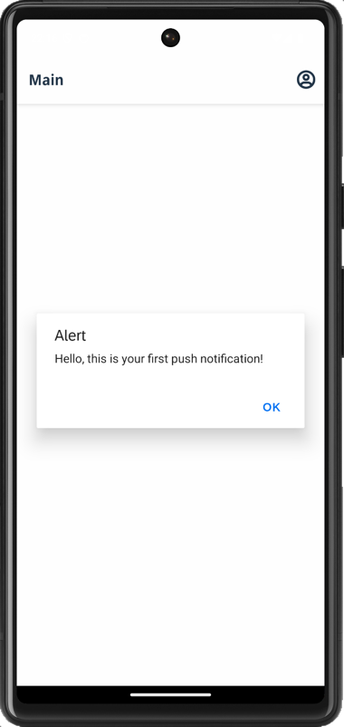
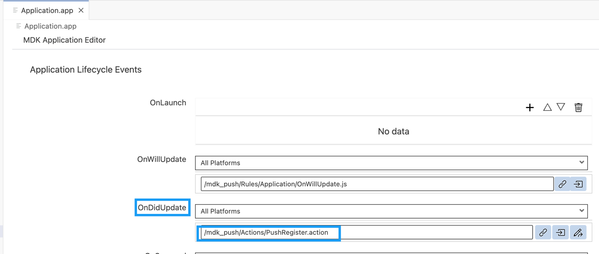
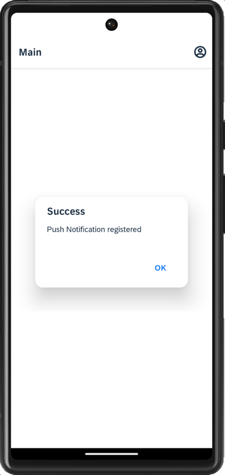
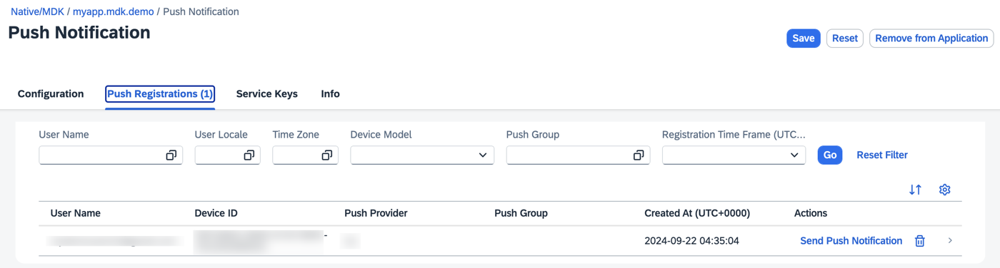
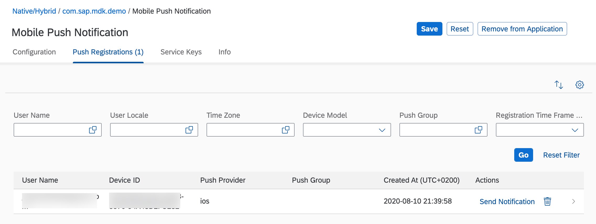

# Enable Push Notifications in the MDK Public Store Client
<!-- description --> Use the SAP Mobile Services to enable push notifications in the MDK public store client.

## Prerequisites
- **Tutorial group:** [Set Up for the Mobile Development Kit (MDK)](group.mobile-dev-kit-setup)
- **Install SAP Mobile Services Client** on your [Android](https://play.google.com/store/apps/details?id=com.sap.mobileservices.client) device or [iOS](https://apps.apple.com/us/app/sap-mobile-services-client/id1413653544)
<table><tr><td align="center"><!-- border --> Android</td><td align="center"> iOS</td></tr></table>
(If you are connecting to `AliCloud` accounts then you will need to brand your [custom MDK client](cp-mobile-dev-kit-build-client) by allowing custom domains.)

## You will learn
  - How to use MDK push register action
  - How to use predefined push configuration for the public store version of SAP Mobile Services client (MDK client)
  - How to send push notification to an MDK app

## Intro
You may clone an existing metadata project from [GitHub repository](https://github.com/SAP-samples/cloud-mdk-tutorial-samples/tree/main/4-Level-Up-with-the-Mobile-Development-Kit/6-Enable-Push-Notifications-in-the-MDK-Public-Store-Client) and start directly with step 5 in this tutorial.

---

### Define push notification settings in app configuration

1. Open the [SAP Mobile Services cockpit](cp-mobile-dev-kit-ms-setup), click **Mobile Push Notification** feature.

    <!-- border -->

    >You can add **Mobile Push Notification** feature by clicking on + icon in case feature is not already assigned to the application.

2. Select **SAP Mobile Services Client** under **Predefined for** option, click **Save**.

    <!-- border -->

    >Predefined push is supported only for the MDK (SAP Mobile Services client) public store client.

    >If you want to enable push notification in your custom MDK client then follow [Enable Push Notifications in Your Branded MDK Client](cp-mobile-dev-kit-push-customclient) tutorial.

### Create a new MDK project in SAP Business Application Studio

1. Launch the [Dev space](cp-mobile-bas-setup) in SAP Business Application Studio.

2. Click **Start from template** on the `Get Started` page.

    <!-- border -->

    >If you do not see the `Get Started` page, you can access it by typing `>get started` in the center search bar.

    <!-- border -->

3. Select **MDK Project** and click **Start**.

    <!-- border -->  

    >If you do not see the **MDK Project** option check if your Dev Space has finished loading or reload the page in your browser and try again.

    >This screen will only show up when your CF login session has expired. Enter your login credentials, click Sign in. After successful signed in to Cloud Foundry, select your Cloud Foundry Organization and Space where you have set up the initial configuration for your MDK app and click Apply.

    ><!-- border -->

4. In *Basic Information* step, provide the below information and click **Finish**:

    | Field | Value |
    |----|----|
    | `MDK Template Type`| Select `Empty` from the dropdown |
    | `Your Project Name` | Provide a name of your choice. `MDK_Push` is used for this tutorial |
    | `Your Application Name` | <default name is same as project name, you can provide any name of your choice> |
    | `Target MDK Client Version` | Leave the default selection as `MDK 23.4+ (For use with MDK 23.4 or later clients)` |
    | `Choose a target folder` | By default, the target folder uses project root path. However, you can choose a different folder path |

    <!-- border -->

    >More details on _MDK template_ is available in [help documentation](https://help.sap.com/doc/f53c64b93e5140918d676b927a3cd65b/Cloud/en-US/docs-en/guides/getting-started/mdk/bas.html#creating-a-new-project-cloud-foundry).  

5. After clicking **Finish**, the wizard will generate your MDK Application based on your selections. You should now see the `MDK_Push` project in the project explorer.

### Create MDK actions to register for push notifications

In this step, you will create the following actions:

* **Push Notification Register action**: this will register the device with SAP Mobile Services for push notification.

* **Message actions**: these will display a message if Push Notification Register action has succeeded or failed.

1. Create a Push Notification Register action.

    Right-click the **Actions** folder | **MDK: New Action** | choose **Other** in **Category** | click **Push Notification Register** | **Next**.

    <!-- border -->

    In the **Base Information** step, provide the below information and click **Finish** to complete the action creation process.

    | Property | Value |
    |----|----|
    | `Name`| `PushRegister` |

    <!-- border -->

    >More details on _Push Notification Action_ is available in [help documentation](https://help.sap.com/doc/69c2ce3e50454264acf9cafe6c6e442c/Latest/en-US/docs-en/reference/schemadoc/Action/PushNotificationRegister.schema.html).

2. Define a success message if the Push Register Notification action is succeeded.

    Right-click the **Actions** folder | **MDK: New Action** | choose **Message** in **Category** | click **Message** | **Next**.

    <!-- border -->
    
    In the **Base Information** step, provide the below information and Click **Finish**.

    | Property | Value |
    |----|----|
    | `Name`| `PushRegisterSuccessMessage` |
    | `Type` | Select `Message` from the dropdown |
    | `Message` | `Push Notification registered` |
    | `Title` | `Success` |
    | `OKCaption` | `OK` |
    | `OnOK` | `--None--` |
    | `CancelCaption` | leave it blank |
    | `OnCancel` | `--None--` |

    <!-- border -->

3. Define a failure message if the Push Register Notification action is failed.

    Right-click the **Actions** folder | **MDK: New Action** | choose **Message** in **Category** | click **Message** | **Next**.

    <!-- border -->

    In the **Base Information** step, provide the below information and Click **Finish**.

    | Property | Value |
    |----|----|
    | `Name`| `PushRegisterFailureMessage` |
    | `Type` | Select `Message` from the dropdown |
    | `Message` | `Push Notification didn't register` |
    | `Title` | `Failure` |
    | `OKCaption` | `OK` |
    | `OnOK` | `--None--` |
    | `CancelCaption` | leave it blank |
    | `OnCancel` | `--None--` |

    <!-- border -->

4. Define _Success_ and _Failure_ actions for `PushRegister.action`.

    In the action editor for the new action, expand the **Common Action Properties** and provide the below information:

    | Property | Value |
    |----|----|
    | `Success Action` | Click the link icon to bind it to `PushRegisterSuccessMessage.action` |
    | `Failure Action` | Click the link icon to bind it to `PushRegisterFailureMessage.action`  |

    >When `PushRegister.action` gets executed successfully then `PushRegisterSuccessMessage.action` will be triggered or if `PushRegister.action` fails then `PushRegisterFailureMessage.action` will be triggered.

    <!-- border -->

### Call the push register action

In the step, you will set and call the Push Register Notification action when app is updated with the new metadata.

>It is up to developers how they want to call a Push Register Notification action.

In `Application.app` file, bind the `OnDidUpdate` event to `PushRegister.action`.

<!-- border -->

### Deploy the application

So far, you have learned how to build an MDK application in the SAP Business Application Studio editor. Now, you will deploy the application definitions to Mobile Services to use in the Mobile client.

1. Right-click `Application.app` and select **MDK: Deploy**.

    <!-- border -->

2. Select deploy target as **Mobile Services**.

    <!-- border -->

3. Select **Mobile Services Landscape**.

    <!-- border -->  

4.  Select the application from Mobile Services.

    <!-- border -->

5. If you want to enable source for debugging the deployed bundle, then choose **Yes**.

    <!-- border -->

    You should see **Deploy to Mobile Services successfully!** message.

    <!-- border -->

### Display the QR code for app onboarding the Mobile app

SAP Business Application Studio has a feature to display the QR code for onboarding in the Mobile client.

Click the **Application.app** to open it in MDK Application Editor and then click the **Application QR Code** icon.

<!-- border -->

The On-boarding QR code is now displayed.

<!-- border -->

>Leave the Onboarding dialog box open for the next step.

### Run the app

>Make sure you are choosing the right device platform tab above. Once you have scanned and on-boarded using the onboarding URL, it will be remembered. When you Log out and on-board again, you will be asked either to continue to use current application or to scan new QR code.

[OPTION BEGIN [Android]]

1. Follow [these steps](https://github.com/SAP-samples/cloud-mdk-tutorial-samples/blob/main/Onboarding-Android-client/Onboarding-Android-client.md) to on-board the MDK client.

2. After you accept the app update, a message should show **Push Notification registered**. Click **OK**.

    

3. It is time now to send the first push notification from the **SAP Mobile Services push notification feature**.

    Navigate to Mobile Services cockpit. In **Mobile Push Notification** feature, switch to **Push Registrations** tab.

    There you will find information about user registered for push notification and also details about Push providers. Identify your Device ID and click **Send Notification**.

    <!-- border -->

12. In notification dialog, type a notification message and click **Send**.

    <!-- border -->

    You will see a success toast message.

    <!-- border -->

    After sending notification, mobile device should receive the message.

    

[OPTION END]

[OPTION BEGIN [iOS]]

1. Follow [these steps](https://github.com/SAP-samples/cloud-mdk-tutorial-samples/blob/main/Onboarding-iOS-client/Onboarding-iOS-client.md) to on-board the MDK client.

2. After you accept the app update, you will notice that it will first ask permission to display notifications.

    <!-- border -->

3. If push registration is successful, a message should show **Push Notification registered**. Click **OK**.

    

4. It is time now to send the first push notification from the **SAP Mobile Services push notification feature**.

    Navigate to Mobile Services cockpit. In **Mobile Push Notification** feature, switch to **Push Registrations** tab.

    There you will find information about user registered for push notification and also details about Push providers. Identify your Device ID and click **Send Notification**.

    <!-- border -->

12. In notification dialog, type a notification message and click **Send**.

    <!-- border -->

    You will see a success toast message.

    <!-- border -->

    After sending notification, mobile device should receive the message.

    

    If you have Apple watch connected to the iPhone device, you can also see same push notification on the Apple Watch.

    <!-- border -->

    >MDK supports rich push notification. MDK does not run on smart watches or as an Apple watch application.

[OPTION END]

>Once you have scanned and on-boarded using the onboarding URL, it will be remembered. When you Log out and on-board again, you will be asked either to continue to use current application or to scan new QR code.

---
