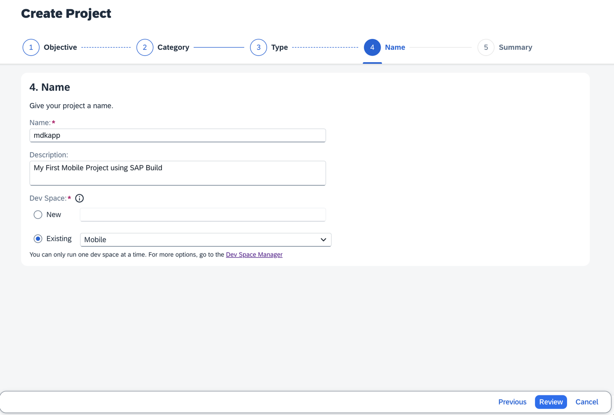
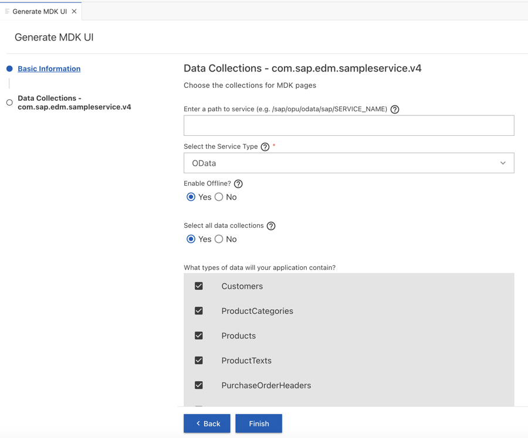
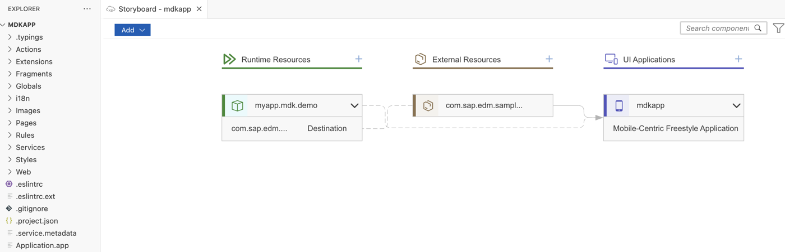
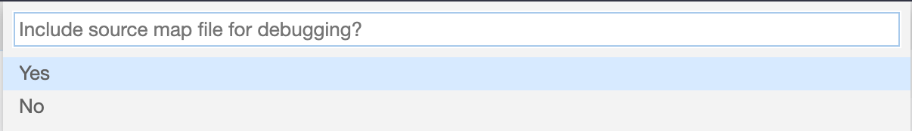
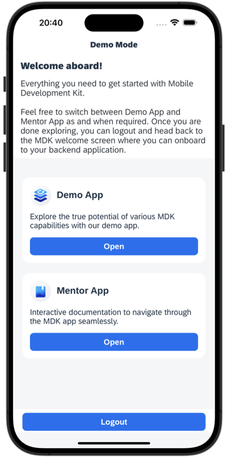

# Quick Start with the Mobile Development Kit (MDK)
<!-- description --> Create and examine your first mobile (offline) and web application using the MDK template connecting against a sample service.

## Prerequisites
- **Tutorial group:** [Set Up for the Mobile Development Kit (MDK)](https://developers.sap.com/group.mobile-dev-kit-setup.html)
- **Install SAP Mobile Services Client** on your [Android](https://play.google.com/store/apps/details?id=com.sap.mobileservices.client) or [iOS](https://apps.apple.com/us/app/sap-mobile-services-client/id1413653544) device
<table><tr><td align="center"> Android</td><td align="center"> iOS</td></tr></table>
(If you are connecting to `AliCloud` accounts, you will need to brand your [custom MDK client](https://developers.sap.com/tutorials/cp-mobile-dev-kit-build-client.html) by allowing custom domains.)

## You will learn
  - How to create a mobile project in SAP Build Lobby
  - How to create an MDK app in SAP Business Application Studio
  - How to deploy an MDK app to Mobile Services and run it in mobile client
  - How to deploy an MDK app to Cloud Foundry and run it as a Web application

---

### Create a New Project Using SAP Build Code

This step includes creating a mobile project in SAP Build Lobby. 

1. In the SAP Build Lobby, click **Create** to start the creation process.

    <!-- border -->

2. Click the **Build an Application** tile.    

    <!-- border -->

3. Click the **SAP Build Code** tile to develop your project in SAP Business Application Studio, the SAP Build Code development environment, leveraging the capabilities of the services included in SAP Build Code.

    <!-- border -->

4. Click the **Mobile Application** tile. 

    <!-- border -->

5. Enter a name for your project, add a description (optional), and click **Create**. 

    <!-- border -->
    
    >SAP Build Code recommends the dev space it deems most suitable, and it will automatically create a new one for you if you don't already have one. If you have other dev spaces of the Mobile Application type, you can select between them. If you want to create a different dev space, go to the Dev Space Manager. See [Working in the Dev Space Manager](https://help.sap.com/docs/build_code/d0d8f5bfc3d640478854e6f4e7c7584a/ad40d52d0bea4d79baaf9626509caf33.html).

6. Your project is being created in the Project table of the lobby. The creation of the project may take a few moments.

    <!-- border -->

7. After you see a message stating that the project has been created successfully, click the project to open it.

    <!-- border -->    

    The project opens in SAP Business Application Studio, the SAP Build Code development environment.

    <!-- border -->  

    >When you open the SAP Business Application Studio for the first time, a consent window may appear asking for permission to track your usage. Please review and provide your consent accordingly before proceeding.
    > 

### Configure the Project Using Storyboard

The Storyboard provides a graphical view of the application's runtime resources, external resources, UI of the application, and the connections between them. This allows for a quick understanding of the application's structure and components.

- **Runtime Resources**: In the Runtime Resources section, you can see the mobile services application and mobile destination used in the project, with a dotted-line connected to the External Resources.
- **External Resources**: In the External Resources section, you can see the external services used in the project, with a dotted-line connection to the Runtime Resource or the UI app.
- **UI Application**: In the UI Applications section, you can see the mobile applications.

1. Click on **+** button in the **Runtime Resources** column to add a mobile services app to your project. 

    <!-- border --> 

    >This screen will only show up when your CF login session has expired. Use either `Credentials` OR  `SSO Passcode` option for authentication. After successful signed in to Cloud Foundry, select your Cloud Foundry Organization and Space where you have set up the initial configuration for your MDK app and click Apply.

    > 

2. Choose `myapp.mdk.demo` from the applications list in the **Mobile Application Services** editor.

    <!-- border -->  

3. Select `SampleServiceV4` from the destinations list and click **Add App to Project**.

    <!-- border -->  

    >You can access the mobile services admin UI by clicking on the Mobile Services option on the right hand side.

    In the storyboard window, the app and mobile destination will be added under the Runtime Resources column. The mobile destination will also be added under the External Resources with a dotted-line connection to the Runtime Resource. The External Resource will be used to create the UI application.

    <!-- border -->      

4. Click the **+** button in the UI application column header to add mobile UI for your project.

    <!-- border -->     

5. In the **Basic Information** step, select the **MDK Template Type** as **CRUD**, leave the other options as they are, and click **Next**.

    <!-- border --> 

6. In the **Data Collections** step, provide the below information and click **Finish**:

    | Field | Value |
    |----|----|
    | `Enter a path to service (e.g. /sap/opu/odata/sap/SERVICE_NAME)` | Leave it as it is  |
    | `Enable Offline` | It's enabled by default |
    | `Select all data collections` | Leave it as it is |
    | `What types of data will your application contain?` | Select `Customers`, `Products`, `PurchaseOrderHeaders`, `PurchaseOrderItems`, `SalesOrderHeaders` and `SalesOrderItems` |

    <!-- border --> 

    Regardless of whether you are creating an online or offline application, this step is needed for app to connect to an OData service. When building an MDK Mobile application, it assumes the OData service created and the destination that points to this service is set up in Mobile Services. For MDK Web application, destination is set up in SAP BTP cockpit.
    
    >Since you have Enable Offline set to *Yes*, the generated application will be offline enabled in the MDK Mobile client and will run as online in Web environment.

    >Data Collections step retrieves the entity sets information for the selected destination.

7. After clicking **Finish**, the storyboard is updated displaying the UI component. The MDK project is generated in the project explorer based on your selections.
 
    <!-- border --> 

    Since we have Enable Offline set to Yes, the generated application will be offline enabled in the MDK Mobile client and will run as online in Web environment.

### Get familiar with generated project structure

This is how the project structure looks like within the workspace.

<!-- border -->

These are the [metadata definitions](https://help.sap.com/doc/69c2ce3e50454264acf9cafe6c6e442c/Latest/en-US/docs-en/reference/schemadoc/App.schema.html) available in the editor and the format in which these metadata definitions are stored in the editor. Just to brief on some of these:

- **`InitializeOffline.action`**: For Mobile applications, this action binds the application to the Mobile Services Offline OData server and downloads the required data from the `SampleServiceV4` to the offline store on the mobile device. For Web applications, it will initialize the `SampleServiceV4` service to be consumed in online mode.

- **`DownloadOffline.action`** and **`UploadOffline.action`**: These actions are applicable to Mobile client only. Using Mobile app initialization, data is downloaded to the offline store. If you want to have the application download any updated data from the backend server or upload changed data to the backend server (`SampleServiceV4`), these actions will be needed.

- **`Success & Failure Message action`**: Here are some messages showing up in the app on a successful or failure of data initialization, sync etc.

- **`Main.page`**: This is the first page of your MDK application that is shown. For this application you will use this as a launching page to get to application functionality.

- **`OnWillUpdate.js`**: This rule is applicable to Mobile client only. MDK applications automatically download updates and apply them to the client without the end-user needing to take any action. The `OnWillUpdate` rule empowers the user to run business logic before the new definitions are applied. This allows the app designer to include logic to prompt the user to accept or defer applying the new definitions based on their current activity. For example, if the end-user is currently adding new customer details or in the middle of a transaction, they will be able to defer the update. The app will prompt again the next time it checks for updates.

- **`Web`**: In this folder, you can provide web specific app resource files and configurations.

- **`Application.app`**: this is the main configuration file for your application from within SAP Business Application Studio. Here you define your start page (here in this tutorial, it is main.page), action settings for different stages of the application session lifecycle, push notifications, and more.

>Open the application settings in the application editor by clicking the `Application.app`.

><!-- border -->

### Deploy the application

So far, you have learned how to quickly get started with developing an MDK application in the SAP Business Application Studio editor. Now, you will deploy the application definitions to Mobile Services and Cloud Foundry to use it in the Mobile client and Web application respectively.

1. Right-click `Application.app` and select **MDK: Deploy**.

    <!-- border -->

2. Select the deploy target as **Mobile & Cloud**. The MDK editor will deploy the metadata to Mobile Services (for the Mobile application) followed by to Cloud Foundry (for the Web application).

    <!-- border -->

    >First web deployment takes 2-3 minutes as it creates five service instances for the application. You can find the details of these instances in the space cockpit.

    >-	XSUAA

    >- destination

    >- connectivity

    >- HTML Repo host

    >- HTML repo runtime

    Ensure that you see successful messages for both deployments.

    <!-- border -->

### Display the QR code for onboarding the Mobile app

SAP Business Application Studio has a feature to display the QR code for onboarding in the Mobile client. Click on `Application.app` to open it in MDK Application Editor, and then click the **Application QR Code** icon.

<!-- border -->

The On-boarding QR code is now displayed.

<!-- border -->

>Leave the Onboarding dialog box open for the next step.

### Explore the Demo Mode (Optional)

Ensure that you have downloaded the SAP Mobile Services Client from the public store, as mentioned in the prerequisites. This client provides a demo mode with Demo App and Mentor App.

**Demo App**: The Demo app is intended for you to explore the MDK capabilities. This app connects to the same Mobile Services sample backend to which your MDK app is connected.

**Mentor App**: The MDK Mentor app is interactive documentation that helps designers and developers discover the capabilities of the SAP Mobile Development Kit. You can view live previews of the UI components and change parameters to see the effects immediately. 

In both applications, the user popover menu provides an option to easily switch between the Demo and Mentor Apps. When you are done exploring, you can log out to return to the MDK Welcome screen, which resets any changes made and allows you to onboard to your backend application.

[OPTION BEGIN [Android]]

>Ensure that you choose the correct device platform tab above.

[OPTION END]

[OPTION BEGIN [iOS]]

>Ensure that you choose the correct device platform tab above.

[OPTION END]

### Run the app

[OPTION BEGIN [Android]]

>Ensure that you choose the correct device platform tab above. Once you have scanned and onboarded using the onboarding URL, it will be remembered. If you log out and onboard again, you will be prompted to either continue using the current application or scan a new QR code.

Follow [these steps](https://github.com/SAP-samples/cloud-mdk-tutorial-samples/blob/main/Onboarding-Android-client/Onboarding-Android-client.md) to successfully on-board the MDK client on your Android device.

After accepting the app update, you will see a list of entities on the **Main** page, along with a user menu that includes options such as syncing changes, accessing support, checking for updates, and resetting the app. An offline store will be initialized. By tapping any entity, you will navigate to a list page. If you select one of the items, the detail page will be displayed, allowing you to create, update, or delete the record. This record will be saved to the offline request queue database. You can navigate back to the main page and press the **Sync Changes** option in the user menu to upload any local changes to the backend. Once the upload is successful, the app will also download data from the backend to the offline store, ensuring both sides have the same dataset.

>`SampleServiceV4` is the name of the service file generated in the project creation.

Additionally, you can search through all properties of the objects displayed in the section by entering them manually or using a barcode scanner. For instance, in the Products list, you can scan the barcode to search for products belonging to the *MP3 Players* category.

[OPTION END]

[OPTION BEGIN [iOS]]

>Ensure that you choose the correct device platform tab above. Once you have scanned and onboarded using the onboarding URL, it will be remembered. If you log out and onboard again, you will be prompted to either continue using the current application or scan a new QR code.

Follow [these steps](https://github.com/SAP-samples/cloud-mdk-tutorial-samples/blob/main/Onboarding-iOS-client/Onboarding-iOS-client.md) to successfully on-board the MDK client on your iOS device.

After accepting the app update, you will see a list of entities on the **Main** page, along with a user menu that includes options such as syncing changes, accessing support, checking for updates, and resetting the app. An offline store will be initialized. By tapping any entity, you will navigate to a list page. If you select one of the items, the detail page will be displayed, allowing you to create, update, or delete the record. This record will be saved to the offline request queue database. You can navigate back to the main page and press the **Sync Changes** option in the user menu to upload any local changes to the backend. Once the upload is successful, the app will also download data from the backend to the offline store, ensuring both sides have the same dataset.

>`SampleServiceV4` is the name of the service file generated in the project creation.

Additionally, you can search through all properties of the objects displayed in the section by entering them manually or using a barcode scanner. For instance, in the Products list, you can scan the barcode to search for products belonging to the *MP3 Players* category.

[OPTION END]

[OPTION BEGIN [Web]]

>For this tutorial, the MDK web app will connect to the SAP Mobile Services' sample backend, which will register your user in Mobile Services application. If you encounter any registration count limit-related errors, please note that there is a limitation of [total 10 user registrations per app in trial accounts](https://help.sap.com/viewer/468990a67780424a9e66eb096d4345bb/Cloud/en-US/16439fd40a014138abc5dc262e816be5.html).

1. Click the highlighted button to open the MDK Web application in a browser. If prompted, enter your SAP BTP credentials.

    

    >You can also open the MDK web application by accessing its URL from the `.project.json` file.
    

    You will notice the list of entities on the **Main** page along with a user menu in the top right corner. The application data service will be initialized. Click on any entity; it will navigate to the detail page where you can create, update, and delete a record.

    

    >`SampleServiceV4` is the name of the service file generated in the project creation.

[OPTION END]

Once you complete this tutorial, you can continue with [these tutorials](https://developers.sap.com/mission.mobile-dev-kit-get-started.html) to create an MDK app from scratch.

---
