# Consume a REST API in an MDK App
<!-- description --> Create a fully functional multi-channel application consuming Petstore REST API.

## Prerequisites
- **Tutorial:** [Set Up Business Application Studio for Mobile Technologies](https://developers.sap.com/tutorials/cp-mobile-bas-setup.html)
- **Install SAP Mobile Services Client** on your [Android](https://play.google.com/store/apps/details?id=com.sap.mobileservices.client) device or [iOS](https://apps.apple.com/us/app/sap-mobile-services-client/id1413653544)
<table><tr><td align="center"><!-- border --><br>Android</td><td align="center"><br>iOS</td></tr></table>
(If you are connecting to `AliCloud` accounts, you will need to brand your [custom MDK client](https://developers.sap.com/tutorials/cp-mobile-dev-kit-build-client.html) by allowing custom domains.)

## You will learn
  - How to create a mobile project in SAP Build Lobby
  - How to configure a Mobile Services application in SAP Business Application Studio via Storyboard
  - How to configure a REST endpoint as a destination in Mobile Services application
  - How to define a REST endpoint as a destination in Cloud Foundry
  - How to create a MDK Service file pointing to REST endpoint destination
  - How to use `RestService SendRequest` Action to make directly call to `Petstore` API

## Intro
You may clone an existing metadata project from the [MDK Tutorial GitHub repository](https://github.com/SAP-samples/cloud-mdk-tutorial-samples/tree/main/4-Level-Up-with-the-Mobile-Development-Kit/7-Consume-rest-api-in-mdk-app) and start directly with step 15 in this tutorial but make sure you complete step 2&3.

---

Mobile Development Kit allows you to consume REST APIs. You need to first define REST endpoint as a destination and then easily bind a `RestServiceTarget` to an MDK control e.g., `ObjectTable`, `ContactCell`, `ObjectCollection` etc. This assumes the REST service returns JSON similar to how OData requests are returned.

A publicly available `Petstore` API from [swagger.io](https://petstore.swagger.io) is used as an example in this tutorial.


### Understand the Petstore API to retrieve data

1. Open *[`Swagger Petstore`](https://petstore.swagger.io/)*, find all pets with status as `available`.

    <!-- border -->

2. Click **Execute** to get the response.

    <!-- border -->

    By looking at results, you now have understood

    -	what is the Request URL to retrieve pet information
    -	what is header parameter to be passed in GET call
    -	what is the response code
    -	how the response body looks like

### Create a New Project Using SAP Build Code

This step includes creating a mobile project in SAP Build Lobby. 

1. In the SAP Build Lobby, click **Create** > **Create** to start the creation process.

    <!-- border -->

2. Click the **Build an Application** tile.    

    <!-- border -->

3. Click the **SAP Build Code** tile to develop your project in SAP Business Application Studio, the SAP Build Code development environment, leveraging the capabilities of the services included in SAP Build Code.

    <!-- border -->

4. Click the **Mobile Application** tile. 

    <!-- border -->

5. Enter the project name `MDK_Petstore` (used for this tutorial) , add a description (optional), and click **Create**. 

    <!-- border -->
    
    >SAP Build Code recommends the dev space it deems most suitable, and it will automatically create a new one for you if you don't already have one. If you have other dev spaces of the Mobile Application type, you can select between them. If you want to create a different dev space, go to the Dev Space Manager. See [Working in the Dev Space Manager](https://help.sap.com/docs/build_code/d0d8f5bfc3d640478854e6f4e7c7584a/ad40d52d0bea4d79baaf9626509caf33.html).

6. Your project is being created in the Project table of the lobby. The creation of the project may take a few moments. After the project has been created successfully, click the project to open it. 

    <!-- border -->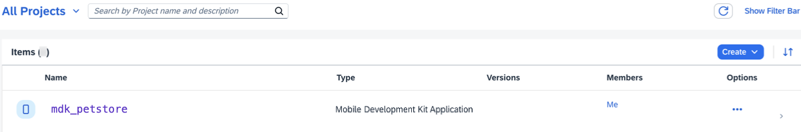
    
7. The project opens in SAP Business Application Studio, the SAP Build Code development environment.

    <!-- border -->  

    >When you open the SAP Business Application Studio for the first time, a consent window may appear asking for permission to track your usage. Please review and provide your consent accordingly before proceeding.
    > 

### Configure the Project Using Storyboard

The Storyboard provides a graphical view of the application's runtime resources, external resources, UI of the application, and the connections between them. This allows for a quick understanding of the application's structure and components.

- **Runtime Resources**: In the Runtime Resources section, you can see the mobile services application and mobile destination used in the project, with a dotted-line connected to the External Resources.
- **External Resources**: In the External Resources section, you can see the external services used in the project, with a dotted-line connection to the Runtime Resource or the UI app.
- **UI Application**: In the UI Applications section, you can see the mobile applications.

1. Click on the **+** button in the **Runtime Resources** column to add a mobile services app to your project. 

    <!-- border -->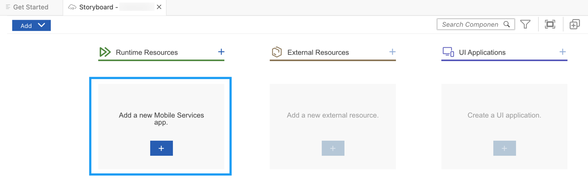 

    >This screen will only show up when your CF login session has expired. Use either `Credentials` OR  `SSO Passcode` option for authentication. After successful signed in to Cloud Foundry, select your Cloud Foundry Organization and Space where you have set up the initial configuration for your MDK app and click Apply.

    > 

2. Click on the **+** button to add a new mobile services app configuration.

    <!-- border --> 

3. In the **Basic Information** step, provide the required information and click **Next**.

    | Field | Value |
    |----|----|
    | `Application Name` | `SAP MDK REST API` |
    | `Application ID` | `myapp.mdk.restapi` |

    <!-- border -->

4. In the **Destinations** step, provide the required information and click **Create App**.

    | Field | Value |
    |----|----|
    | `Destination Name` | `swagger_petstore` |
    | `Destination Type` | `Internet Destination` |
    | `URL` | `https://petstore.swagger.io/v2` |
    | `SSO Mechanism` | `No Authentication` |

    <!-- border -->

5. Mobile Services App may take 2-3 minutes in creating the required configuration. You will notice the app state as `Creating`.  

    <!-- border -->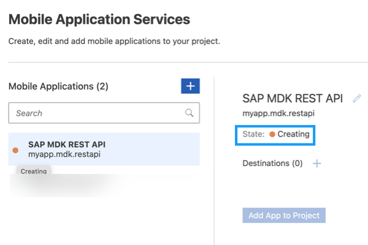

6. Once the app is in `Created` state, click **Add App to Project**.

    <!-- border -->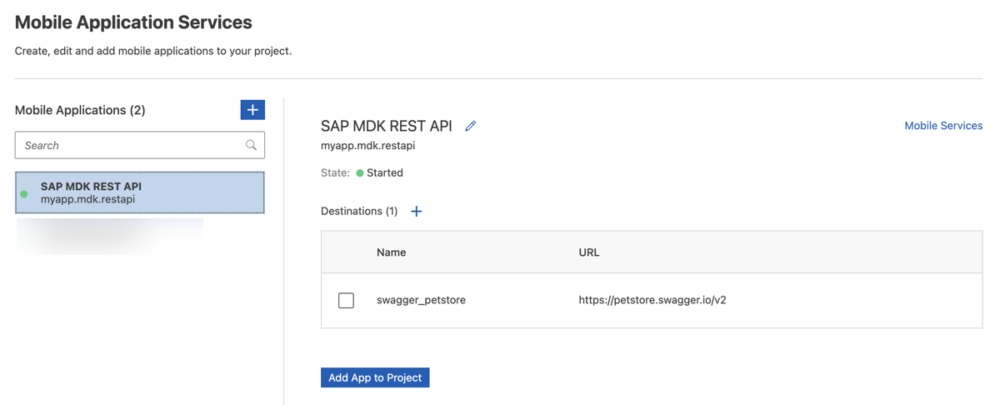  

    >You can access the mobile services admin UI by clicking on the Mobile Services option on the right hand side.

    In the storyboard window, the app will be added under the Runtime Resources column.

    <!-- border -->      

7. Click the **+** button in the UI application column header to add mobile UI for your project.

    <!-- border -->  

5. In the **Basic Information** step, leave the default values as they are, and click **Finish**.

    <!-- border -->  

7. After clicking **Finish**, the storyboard is updated displaying the UI component. The MDK project is generated in the project explorer based on your selections.
 
    <!-- border --> 

### Create a new MDK Service file

1. Right-click the **Services** folder | **MDK: New Service**.

    <!-- border -->

2. Provide the below information and click **Finish**.

    | Field | Value |
    |----|----|
    | `Name`| `petstore` |
    | `Data Source` | Select `Mobile Services` from the dropdown. You will be asked to select the Mobile services landscape where you have configured the MDK app |
    | `Destination` | Select `swagger_petstore` from the dropdown |
    | `Path Suffix` | Leave it as it is |
    | `Language URL Param` | Leave it as it is |
    | `REST Service` | choose this option |

    <!-- border -->

    `.service` and `.xml` (empty file) have been created under the **Services** folder.

    <!-- border -->


### Display Pets list in MDK page


You will add an **Object Table** control  item on `Main.page` to display the list of Pets.

1. In the Layout Editor, expand the **Controls** | **Data Bound Container** group, drag and drop the **Object Table** control onto the `Main.page` area.

    <!-- border -->

2. Provide the required information for **Target** section:

    | Field | Value |
    |----|----|
    | `Target` | Select `REST Service Target` from the dropdown |
    | `Service` | Select `petstore.service` from the dropdown |
    | `Path` | Enter `/pet/findByStatus?status=available` |

    <!-- border -->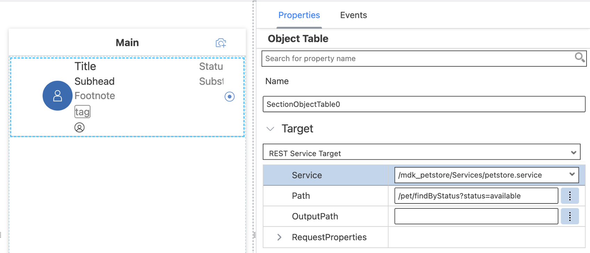

    >You can find more details on **Target** in [documentation](https://help.sap.com/doc/69c2ce3e50454264acf9cafe6c6e442c/Latest/en-US/docs-en/reference/schemadoc/definitions/Target.schema.html).

    >Method GET is pre-selected for binding the `ObjectTable` control to a `RestServiceTarget`.

3. Under **Appearance**, provide below information:

    | Property | Value |
    |----|----|
    | `Description`| leave it empty |
    | `Footnote`| leave it empty |
    | `PreserveIconStackSpacing` | Select `false` from the dropdown |
    | `ProgessIndicator`| leave it empty |
    | `Status` | `{status}` |
    | `Subhead` | `Pet Name: {name}` |
    | `Substatus` | leave it empty |
    | `Tags` | Click the `item0` and click the trash icon to delete the default item |
    | `Title` | `Pet ID: {id}` |

    <!-- border -->

4. In the **Avatar Grid** section of the **Properties** pane, remove the default Avatar.  First, click on the `item0`, a trash icon appears. Click on the trash icon to delete the default item.

    <!-- border -->    

5. In the **Avatar Stack** section of the **Property** pane, remove the default Avatar.  First, click on the `item0`, a trash icon appears. Click on the trash icon to delete the default item.

    <!-- border -->  

    >If you see any error in Main.page (code editor), ignore it as MDK editor currently can't validate such REST Service endpoint properties.


### Deploy the application

So far, you have learned how to build an MDK application in the SAP Business Application Studio editor. Now, you will deploy the application definitions to Mobile Services and Cloud Foundry to use it in the Mobile client and Web application respectively.

1. Right-click `Application.app` and select **MDK: Deploy**.

    <!-- border -->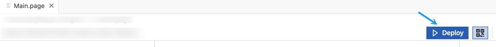

2. Select deploy target as **Mobile & Cloud**.

    MDK editor will deploy the metadata to Mobile Services (for Mobile application) followed by to Cloud Foundry (for Web application).

    <!-- border -->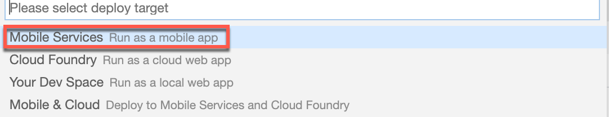

    Ensure that you see successful messages for both deployments.

    <!-- border -->


### Display the QR code for onboarding the Mobile app

SAP Business Application Studio has a feature to display the QR code for onboarding in the Mobile client. Click on `Application.app` to open it in MDK Application Editor, and then click the **Application QR Code** icon.

<!-- border -->

The On-boarding QR code is now displayed.

<!-- border -->

>Leave the Onboarding dialog box open for the next step.

### Run the app

[OPTION BEGIN [Android]]

>Ensure that you choose the correct device platform tab above. Once you have scanned and onboarded using the onboarding URL, it will be remembered. If you log out and onboard again, you will be prompted to either continue using the current application or scan a new QR code.

Follow [these steps](https://github.com/SAP-samples/cloud-mdk-tutorial-samples/blob/main/Onboarding-Android-client/Onboarding-Android-client.md) to successfully on-board the MDK client on your Android device.

After accepting the app update, you will see the Pets list on the **Main** page.

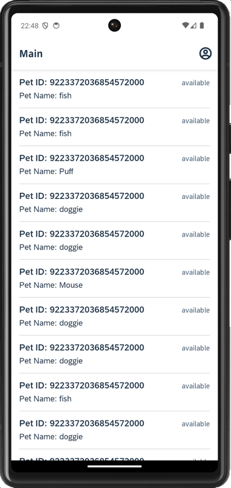

[OPTION END]

[OPTION BEGIN [iOS]]

>Ensure that you choose the correct device platform tab above. Once you have scanned and onboarded using the onboarding URL, it will be remembered. If you log out and onboard again, you will be prompted to either continue using the current application or scan a new QR code.

Follow [these steps](https://github.com/SAP-samples/cloud-mdk-tutorial-samples/blob/main/Onboarding-iOS-client/Onboarding-iOS-client.md) to successfully on-board the MDK client on your iOS device.

After accepting the app update, you will see the Pets list on the **Main** page.


[OPTION END]

[OPTION BEGIN [Web]]

Download the zip file from [here](https://github.com/SAP-samples/cloud-mdk-tutorial-samples/raw/main/4-Level-Up-with-the-Mobile-Development-Kit/7-Consume-rest-api-in-mdk-app/swagger_petstore.zip) and unzip it on your machine.

Navigate to **Connectivity** **&rarr;** **Destinations** to create a BTP destination, click **Import Destination** to import the extracted file and click **Save**.

<!-- border -->

Click the highlighted button to open the MDK Web application in a browser. Enter your SAP BTP credentials if asked.

<!-- border -->

>You can also open the MDK web application by accessing its URL from `.project.json` file.
<!-- border -->

You will see the Pets list on the **Main** page.

<!-- border -->


[OPTION END]

Congratulations, you have learned how to consume a REST API in MDK app to display Pets list.

Next, you will learn how to create a new pet record.


### Understand the Petstore API to create new record


1. In [`Swagger Petstore`](https://petstore.swagger.io/), add a new pet to the store.

    <!-- border -->

    There is payload example to be passed for adding a new pet.

2. For testing, use below payload.

    ```JSON
    {
      "name": "pet-test",
      "status": "available"
    }
    ```

3. Click **Execute** to get the response.

    <!-- border -->

    By looking at results, you now have understood

    -	what is the Request URL & body to create a new pet record
    -	what are header parameters to be passed in POST call
    -	what is the response code
    -	how the response body looks like

With above details, you will now create a new MDK rule to create a new Pet record.


### Create new page for new pet record

In this step, you will create a Section page with a Form Cell Section to contain the Form Cell controls. You will add the fields that will be editable by the end-user.

1. Right-click the **Pages** folder | **MDK: New Page** | **Section** | **Next**.

    <!-- border -->

2. In the **Base Information** step, enter the Page **Name** as `Pet_Create` and click **Finish**.

    <!-- border -->

3. In the **Properties** pane, set the **Caption** to **Create Pet**.

    <!-- border -->

4. Now, you will add the fields (Pet name and Status) for creating a new pet record by the end-user. In the Layout Editor, expand the **Static Container** group. Drag and drop **Form Cell** section onto the Page area. 

    <!-- border -->

    >Form Cell section is used to contain Form Cell controls in a section page.

5. You will now add Form Cell controls in the Form Cell Section. Expand the **Form Cell Controls** group, drag and drop a **Simple Property** onto the Page area.

    <!-- border -->

6. Drag and drop one more Simple Property control onto the page so you have two total controls.

    <!-- border -->

7. Select the first **Simple Property control** and provide the below information:

    | Property | Value |
    |----|----|
    | `Name`| `FCCreatePet` |
    | `Caption` | `Pet Name` |
    | `PlaceHolder`| `Enter Value` |

    <!-- border -->

8. Select the second **Simple Property control** and provide the below information:

    | Property | Value |
    |----|----|
    | `Name`| `FCCreateStatus` |
    | `Caption` | `Status` |
    | `PlaceHolder`| `Enter Value` |

    <!-- border -->    


### Send data to the Backend


After filling-up the details for creating a new pet record, you will send these data to the backend.   

1. In `Pet_Create.page`, drag & drop an action bar item to the right corner of the action bar.

    <!-- border -->

2. In the **Properties** pane, click the **link icon** to open the object browser for the **System Item** property. Double click the **Save** type and click **OK**.

    <!-- border -->

3. Navigate to **Events** tab, click three dots icon and click `create a new rule/action`.

    <!-- border -->

4. Keep the default selection for *Object Type* (as Action) and *Folder* path.   

    <!-- border -->

5. Choose **`REST Service`** in **Category** | select **`REST Service Send Request` Action** | **Next**.

    <!-- border -->        

6. In the **Base Information**, provide the below information:

    | Field | Value |
    |----|----|
    | `Name`| `CreatePet` |
    | `Service` | choose `petstore.service` from the dropdown |
    | `Path` | `/pet` |    

    <!-- border -->

8. For `RequestProperties` object, choose `POST` method from the dropdown. Under `Body`, switch to `object type` by clicking the icon, once it's color has changed, click on `Body[0]` to add array items, this should now display a create icon in front of `Body[0]`. Click Create icon to create an array item(0).

    Provide the below information:

    | Field | Value |
    |----|----|
    | `Key`| `name` |
    | `Value`| Bind it to input control `#Control:FCCreatePet/#Value` |

    <!-- border -->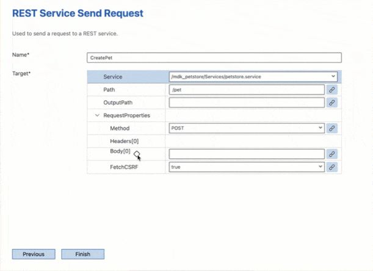

9. Click create icon to add another array item(1) and click **Finish**. 

    | Field | Value |
    |----|----|
    | `Key`| `status` |
    | `Value`| Bind it to input control `#Control:FCCreateStatus/#Value` |

    <!-- border -->

    >You can find more details about `SendRequest` action in [help documentation](https://help.sap.com/doc/69c2ce3e50454264acf9cafe6c6e442c/Latest/en-US/docs-en/reference/schemadoc/Action/RestService/SendRequest.schema.html).

10. When the `CreatePet.action` is successful, you may want to close the page. Expand the **Common Action Properties** and bind the **Success Action** to the `CloseModalPage_Complete.action`.

    <!-- border -->

### Add cancel button on create pet page

Now, you will add a button on the `Pet_Create.page` and set it's `onPress` to `ClosePage.action`.

1. Drag and drop an **Action Bar Item** to the left corner of the action bar.

    <!-- border -->

2. In the **Properties** pane, click the **link icon** to open the object browser for the **System Item** property. Double click the **Cancel** type and click **OK**.

    <!-- border -->

    >System Item are predefined system-supplied icon or text. Overwrites _Text_ and _Icon_ if specified.

3. Now, you will set the `onPress` event to `ClosePage.action`.

    In **Events** tab, click the 3 dots icon for the `OnPress` property to open the **Object Browser**.

    Double click the `ClosePage.action` and click **OK** to set it as the `OnPress` Action.

    <!-- border -->


### Navigate to create a new Pet Record


You will add a button to the `Main.page` called **Add**. When you click on this button, you want to navigate to the create pet page.

1. In `Main.page`, drag and drop an **Action Bar Item** to the upper right of the action bar.

2. Click the **link icon** to open the object browser for the `SystemItem` property.

    Double click the **Add** type and click **OK**.

    <!-- border -->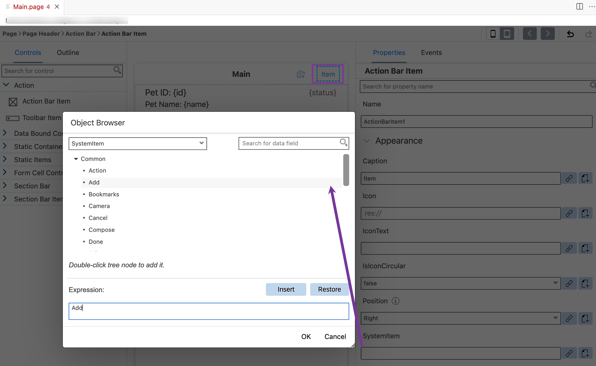

3. Navigate to the **Events** tab, click the 3 dots icon for the `OnPress` property to open the **Object Browser**.

    <!-- border -->

 4. Keep the default selection for *Object Type* (as Action) and *Folder* path.   

    <!-- border -->

5. Choose **UI** in **Category** | click **Navigation** | **Next**.

6. In the **Base Information**, provide the below information and click **Finish**.

    | Property | Value |
    |----|----|
    | `Name`| `NavToPet_Create` |
    | `PageToOpen` | Select `Pet_Create.page` from the dropdown |
    | `ModalPage`| Select `true` from the dropdown |

    <!-- border -->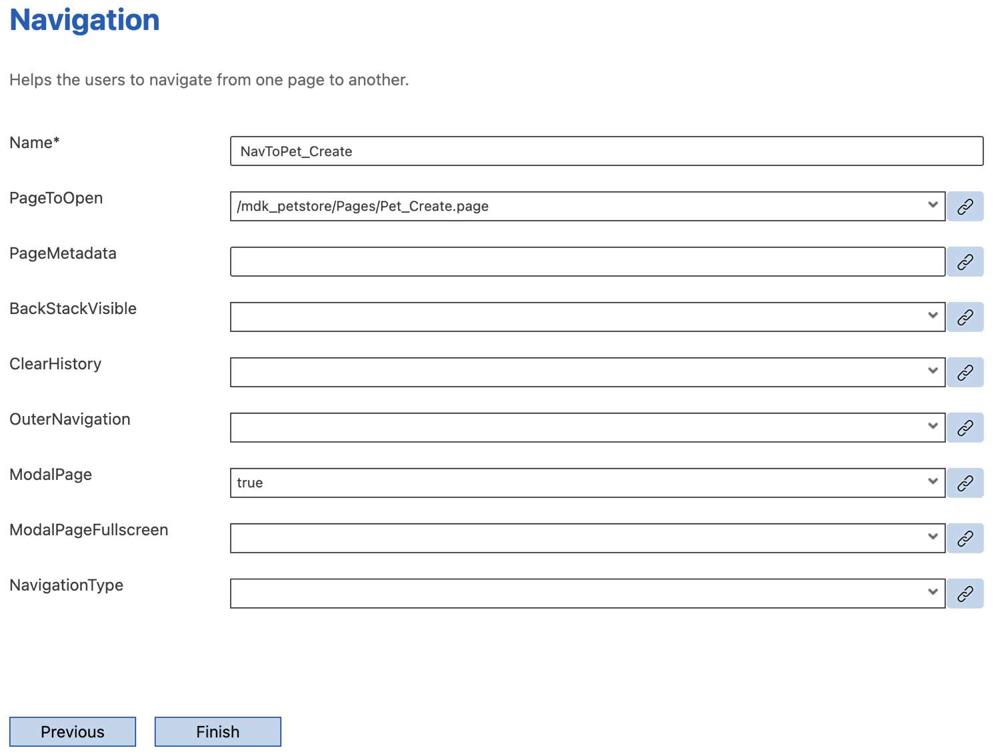

### Redeploy the application

Right-click the `Application.app` file in the project explorer pane,  select **MDK: Deploy** and then select deploy target as **Mobile & Cloud**.

>Alternatively, you can select *MDK: Redeploy* in the command palette (View menu>Find Command OR press Command+Shift+p on Mac OR press Ctrl+Shift+P on Windows machine), it will perform the last deployment.

><!-- border -->


### Update the app

[OPTION BEGIN [Android]]

1. Tap **Check for Updates** in the user menu on the Main page, you will see a _New Version Available_ pop-up, tap **Now**.

    

2. Tap **+** icon on `Main.page` to navigate to Create Pet page.

    

3.  Fill out the details to create a new Pet record.

    

[OPTION END]

[OPTION BEGIN [iOS]]

1. Tap **Check for Updates** in the user menu on the Main page, you will see a _New Version Available_ pop-up, tap **Now**.

    

2. Tap **+** icon on `Main.page` to navigate to Create Pet page.

    

3.  Fill out the details to create a new Pet record.

    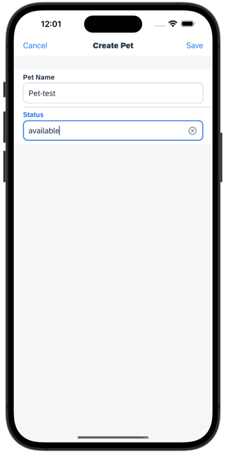

[OPTION END]

[OPTION BEGIN [Web]]

1. Either click the highlighted button or refresh the web page to load the changes.

    <!-- border -->

2. Tap Add button on `Main.page` to navigate to Create Pet page.

    <!-- border -->

3.  Fill out the details to create a new Pet record.

    <!-- border -->

[OPTION END]

You have created a new record consuming REST API. Similarly, you can also modify and delete an existing record.

---
