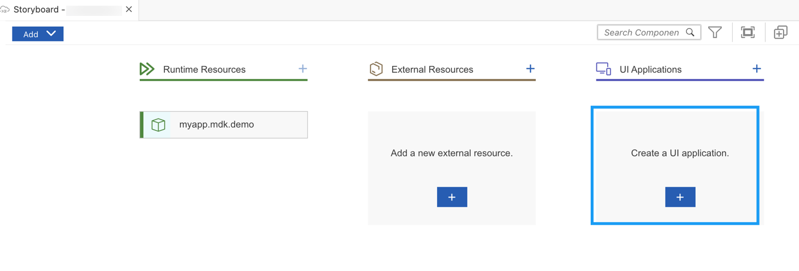
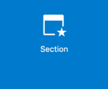
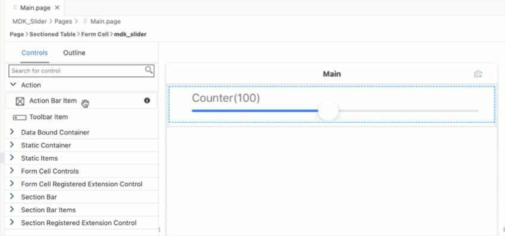
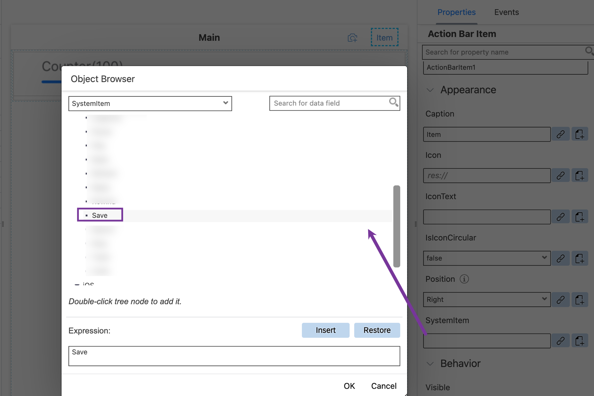
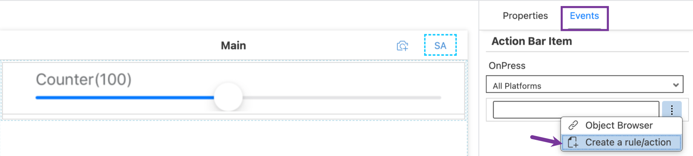
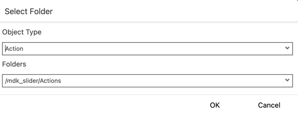
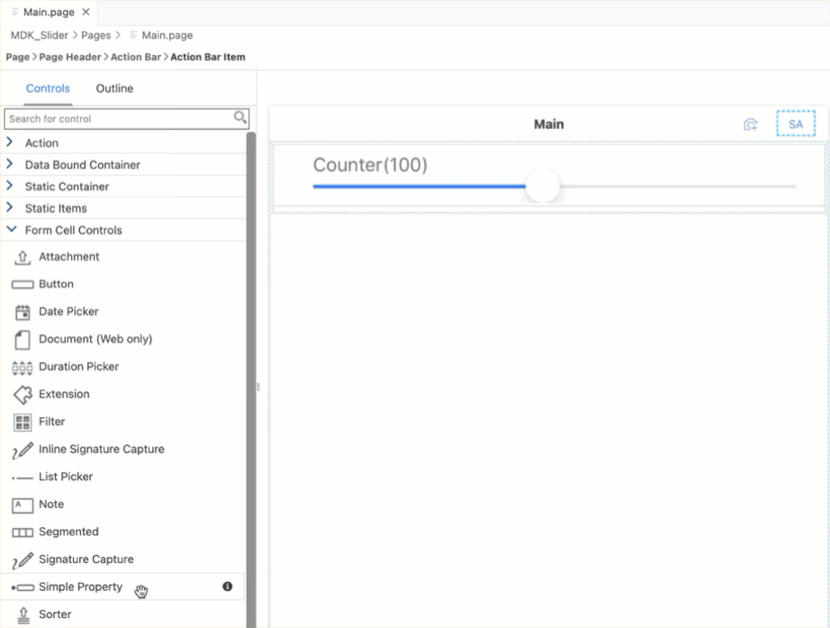
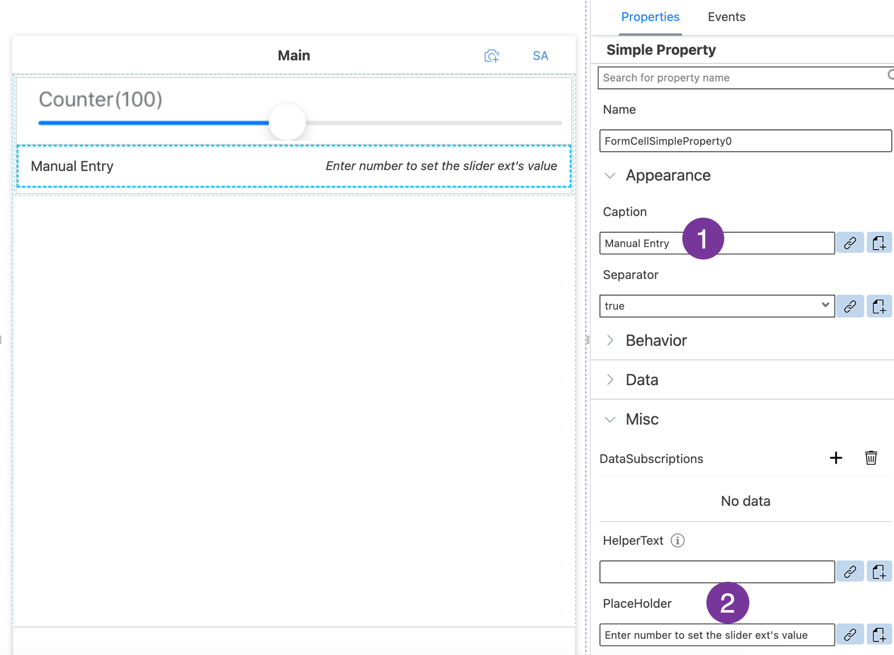
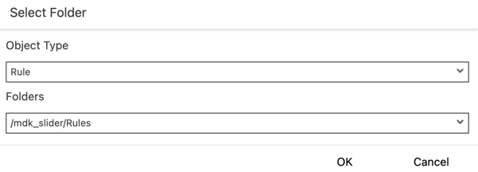

# Create a Slider Custom Control in an MDK App (Using Metadata Approach)
<!-- description --> Build and run the Mobile Development Kit client with slider custom control functionality for Android and iOS platforms.

## Prerequisites
- **Tutorial**: [Set Up for the Mobile Development Kit (MDK)](group.mobile-dev-kit-setup)
- **Install SAP Mobile Services Client** on your [Android](https://play.google.com/store/apps/details?id=com.sap.mobileservices.client) or [iOS](https://apps.apple.com/us/app/sap-mobile-services-client/id1413653544) device.
<table><tr><td align="center"><!-- border --><br>Android</td><td align="center"><br>iOS</td></tr></table>
(If you are connecting to `AliCloud` accounts then you will need to brand your [custom MDK client](cp-mobile-dev-kit-build-client) by allowing custom domains.)

## You will learn
  - How to register and consume an Extension control in MDK Metadata
  - How to implement an extension by writing Native Code in TypeScript via Marshalling
  - How to connect to SAP Mobile application

## Intro
You may clone an existing project from [GitHub repository](https://github.com/SAP-samples/cloud-mdk-tutorial-samples/tree/main/6-Create-Extension-Controls-in-Mobile-Development-Kit-Apps/1-Create-a-Slider-Custom-Control-Using-Metadata-Approach) and start directly with step 6 in this tutorial.

---

To extend the functionality, or customize the look and feel, and behavior of your client app, you can create extension controls other than the already existing MDK built-in controls by writing Native Code in TypeScript via Marshalling. `NativeScript` provide the ability to access platform-specific objects, class, and types in TypeScript / JavaScript via marshalling. `NativeScript` handles the conversion between JavaScript and native data types implicitly.

In this tutorial, you will create a Slider extension via `NativeScript` (in TypeScript language) which will be common for both device platforms.


### Create a new MDK project in SAP Business Application Studio


1. Launch the [Dev space](cp-mobile-bas-setup) in SAP Business Application Studio.

2. Click **Start from template** on the `Get Started` page.

    <!-- border -->

    >If you do not see the `Get Started` page, you can access it by typing `>get started` in the center search bar.

    <!-- border -->

3. Select **MDK Project** and click **Start**.

    <!-- border -->

    >If you do not see the **MDK Project** option check if your Dev Space has finished loading or reload the page in your browser and try again.

    >This screen will only show up when your CF login session has expired. Enter your login credentials, click Sign in. After successful signed in to Cloud Foundry, select your Cloud Foundry Organization and Space where you have set up the initial configuration for your MDK app and click Apply.

    ><!-- border -->

4. In *Type* step, select or provide the below information and click **Finish**:

    | Field | Value |
    |----|----|
    | `MDK Template Type`| Select `Empty` from the dropdown |
    | `Your Project Name` | Provide a name of your choice. `MDK_Slider` is used for this tutorial |
    | `Your Application Name` | <default name is same as project name, you can provide any name of your choice> |    
    | `Target MDK Client Version` | Leave the default selection as `MDK 23.4+ (For use with MDK 23.4 or later clients)` |
    | `Choose a target folder` | By default, the target folder uses project root path. However, you can choose a different folder path |

    <!-- border -->

    >More details on _MDK template_ is available in [help documentation](https://help.sap.com/doc/f53c64b93e5140918d676b927a3cd65b/Cloud/en-US/docs-en/guides/getting-started/mdk/bas.html#creating-a-new-project-cloud-foundry).

5. After clicking **Finish**, the wizard will generate your MDK Application based on your selections. You should now see the `MDK_Slider` project in the project explorer.


### Register an Extension Control


The extension control that you will be creating to extend the functionality of your app can be used as base controls by registering it using the MDK editor.

1. Download [this](https://github.com/SAP-samples/cloud-mdk-tutorial-samples/blob/main/Images/slider.png) image and save it locally. This image will be used as a display image on the page editor to represent the extension control.

2. Drag & drop `slider.png` file on **Images** folders.

    <!-- border -->

3. Right-click **Extensions** | select **MDK: Register Extension Control**.

    <!-- border -->

4. In the `Template Selection` step, select **New Metadata Extension Control**. Click **Next**.

    <!-- border -->

5. In the **Base Information** step, provide the below information and click **Next**.

    | Field | Value |
    |----|----|
    | `Control Name`| `mdk_slider` |
    | `Module` | `MySliderModule` |
    | `Control` | `MySliderExtension` |
    | `Class` | `MySliderClass` |
    | `Display` | click on the link icon and bind it to `slider.png` file  |

    Here is the basic definition for properties you defined above:

    **Module**: It is used to identify the extension control. The path to the extension module under `<MetadataProject>/Extensions/`.

    **Control**: The name of the file under the `<MetadataProject>/Extensions/<Module>/controls` that contains the extension class. If not specified, module name would be used as the value for this property.

    **Class**: The class name of your custom extension class. The client will check for this class at runtime and if it's found, your extension will be instantiated. Otherwise, a stub with an error message will be shown.

    **Display**: This property is used for the image to be displayed on the page editor to represent the extension control.

    <!-- border -->

6. In the **Extension Properties** step, fill schema details in **Schema** column and click **Finish**.

    ```JSON
    {
    	"type": "object",
    	"BindType": "",
    	"properties": {
    		"MaxValue": {
    			"type": "number",
    			"BindType": ""
    		},
    		"MinValue": {
    			"type": "number",
    			"BindType": ""
    		},
    		"Title": {
    			"type": "string",
    			"BindType": ""
    		}
    	}
    }
    ```

    <!-- border -->

    >Above schema will add these predefined properties (`MaxValue`, `MinValue` and `Title`) in the map extension control. You will provide values for these properties in next step.

    Some additional files and folders are added to the **Extensions** folder. You will learn more about it in following steps.

    <!-- border -->

    >You can find more details about registering extension control in [this](https://help.sap.com/doc/f53c64b93e5140918d676b927a3cd65b/Cloud/en-US/docs-en/guides/getting-started/mdk/advanced/extensions/registering-extension-in-bas.html) guide.


### Consume Extension Control in MDK Metadata


You will add this registered control as a Form Cell control in a section page.

1. Right-click the **Pages** folder | **MDK: New Page** | **Section** | **Next**.

    <!-- border -->

2. In the **Base Information** step, enter the page **Name** as `SliderExtension` and click  **Finish**.

    <!-- border -->

3. In the Layout Editor, expand the **Static Container** group. Drag and drop **Form Cell Section** onto the Page area.

    <!-- border -->

4. Expand the **Form Cell Registered Extension Control** group, drag and drop the `mdk_slider` onto the Page area.

    <!-- border -->

    >You can find more details about the `FormCell Extension` in [this](https://help.sap.com/doc/69c2ce3e50454264acf9cafe6c6e442c/Latest/en-US/docs-en/reference/schemadoc/Page/FormCell/Extension.schema.html) guide.    

5. In the **Properties** section, provide the below value:

    | Field | Value |
    |----|----|    
    | `Name`| `MyExtensionControlName` |
    | `Height` | 72 |
    | `MaxValue`| 200 |
    | `MinValue` | 10 |
    | `Title` | Counter |  

    <!-- border -->

6. You will add an item on action bar in `SliderExtension.page` and set an action on its `onPress` event.

    In `SliderExtension.page`, **drag and drop** an **Action Bar Item** to the upper right corner of the action bar.

    <!-- border -->

7. Click the **link** icon to open the object browser for the **System Item** property.

    Double click the **Save** type and click **OK**.

    <!-- border -->

8. Switch to the **Events** tab and click the 3 dots icon for the `OnPress` property to create a new action.

    <!-- border -->

9. Keep the default selection for **Object Type** (as Action) and **Folders** path. Click **OK**.

    <!-- border -->

10. In the template selection, choose **Message** in **Category** | click **Message** | **Next**.

    <!-- border -->

    Provide the below information:

    | Property | Value |
    |----|----|
    | `Name`| `ShowMessage` |
    | `Type` | keep the default selection as `Message` |
    | `Message` | `#Control:MyExtensionControlName/#Value` |
    | `Title` | `Value of the Slider is:` |
    | `OKCaption` | `OK` |
    | `OnOK` | `--None--` |
    | `CancelCaption` | leave it blank |
    | `OnCancel` | `--None--` |

    <!-- border -->

    >Here `MyExtensionControlName` is the name of the control that you renamed in code editor.

    Click **Finish**. This way a new action `ShowMessage.action` has been created on the fly and has been bound to an UI control event.

11. You can also add an input field where you can provide a manual entry for the slider value and set an event on it's value change so that the counter will adapt accordingly.

    In `SliderExtension.page`, drag and drop a **Simple Property** control below the slider control.

    <!-- border -->

12.  Provide the following information:

    | Property | Value |
    |----|----|
    | `Caption`| `Manual Entry` |
    | `placeholder` | `Enter number to set the slider ext's value` |

    <!-- border -->

13. When you input a value to the Simple Property control, an event will be triggered reflecting the slider value.

    You will create a new rule binding it to the `OnValueChange` event of the above control.

    Navigate to **Events** tab, click the 3 dots icon for the `OnValueChange` property to create a new rule.

    <!-- border -->

    For this, first you will write a business logic to set the extension value and then bind it to the input field.

14. Choose the *Object Type* as **Rule** and *Folders* path as it is. Click **OK**.

    <!-- border -->

15. In the **Base Information** step, enter the Rule **Name** `SetExtensionValue` and click **Finish**.

    <!-- border -->

16. Replace the generated snippet with below code.

    ```JavaScript
    export default function SetExtensionValue(context) {
        console.log("In SetExtensionValue");
        let srcValue = context.getValue();
        let targetCtrl = context.evaluateTargetPath("#Page:SliderExtension/#Control:MyExtensionControlName");
        targetCtrl.setValue(srcValue);
    }
    ```

17. Save the changes to the `SetExtensionValue.js` file if not saved already.


### Implement Extension using metadata approach


1. In **Extensions** folder, create additional files & folders. You will write individual implementation for Android and iOS platform. Final structure should look like as per below.

    <!-- border -->


        ├── Extensions
          ├── MySliderModule
           │   └── controls
           │       ├── MySliderExtension.ts
           │       └── MySliderPlugin
           │           ├── MySlider.ts
           │           ├── android
           │           │   └── MySlider.ts
           │           └── ios
           │               └── MySlider.ts
           └── mdk_slider.extension


2. In `MySliderPlugin/android/MySlider.ts` file, copy and paste the following code.

    ```JavaScript / TypeScript
    import { Observable } from '@nativescript/core/data/observable';
    import {​​​​​​ Device, View, Utils }​​​​​​ from'@nativescript/core';
    /*
      This is a way to keep iOS and Android implementation of your extension separate
      We will encapsulate the MySlider class definition inside a function called GetMySliderClass
      This is so that the class definition won't be executed when you load this javascript
      via require function.
      The class definition will only be executed when you execute GetMySliderClass
    */
    declare var com: any;
    declare var android: any;
    export function GetMySliderClass() {
        /**
         * IMPLEMENT THE ANDROID VERSION OF YOUR PLUGIN HERE
         * In this sample you have 2 controls a label and a seekbar (slider)
         * You extends this control with Observable (View) class so that you can accept listeners
         *  and notify them when UI interaction is triggered
         */
        function getPadding() {
            // Return left & right padding in dp
            // For tablet you want 24dp, for other type you use 16dp
            return Device.deviceType === 'Tablet' ? 24 : 16;
        }

        class MySlider extends View {
            private _androidcontext;
            private _label;
            private _labelText = "";
            private _seekbar;
            private _layout;
            private _value = 0;
            private _min = 0; //Used to track min for API 25 or lower

            private updateText() {
                this._label.setText(this._labelText + "(" + this._value + ")")
            }

            public constructor(context: any) {
                super();
                this._androidcontext = context;
                this.createNativeView();
            }

            /**
             * Creates new native controls.
             */
            public createNativeView(): Object {
                //Create an Android label
                this._label = new android.widget.TextView(this._androidcontext);
                const labelBottomPaddingInPx = Utils.layout.round(Utils.layout.toDevicePixels(8)); // For top & bottom padding, always 16dp
                this._label.setPadding(0, 0, 0, labelBottomPaddingInPx);
                this._label.setLayoutParams(new android.view.ViewGroup.LayoutParams(-1, -2));

                //Create an Android seekbar
                this._seekbar = new android.widget.SeekBar(this._androidcontext);
                this._seekbar.setLayoutParams(new android.view.ViewGroup.LayoutParams(-1, -2));

                //Create a LinearLayout container to contain the label and seekbar
                this._layout = new android.widget.LinearLayout(this._androidcontext);
                this._layout.setOrientation(android.widget.LinearLayout.VERTICAL);
                this._layout.setLayoutParams(new android.view.ViewGroup.LayoutParams(-1, -1));

                const hortPaddingInPx = Utils.layout.round(Utils.layout.toDevicePixels(getPadding()));
                const vertPaddingInPx = Utils.layout.round(Utils.layout.toDevicePixels(16)); // For top & bottom padding, always 16dp
                this._layout.setPadding(hortPaddingInPx, vertPaddingInPx, hortPaddingInPx, vertPaddingInPx);
                this._layout.addView(this._label);
                this._layout.addView(this._seekbar);
                this.setNativeView(this._layout);
                return this._layout;
            }

            /**
             * Initializes properties/listeners of the native view.
             */
            initNativeView(): void {
                console.log("initNativeView called");
                // Attach the owner to nativeView.
                // When nativeView is tapped you get the owning JS object through this field.
                (<any>this._seekbar).owner = this;
                (<any>this._layout).owner = this;
                super.initNativeView();

                //Attach a listener to be notified whenever the native Seekbar is changed so that you can notify the MDK Extension
                this._seekbar.setOnSeekBarChangeListener(new android.widget.SeekBar.OnSeekBarChangeListener({
                    onStartTrackingTouch(seekBar: any) {
                        // You do not have any use for this event, so do nothing here
                    },
                    //This handler function will be called when user let go of the handle
                    // This is where you will trigger an event called "OnSliderValueChanged" to the MDK Extension Class
                    onStopTrackingTouch(seekBar: any) {
                        var eventData = {
                            eventName: "OnSliderValueChanged",
                            object: seekBar.owner,
                            value: seekBar.owner._value
                        };
                        seekBar.owner.notify(eventData);
                    },
                    //This handler function will be called whenever the slider's value is changed
                    // i.e. whenever user drag the slider's handle
                    onProgressChanged(seekBar: any, progress: number, fromUser: boolean) {
                        seekBar.owner._value = progress;
                        seekBar.owner.updateText();
                    }
                }));
            }

            /**
             * Clean up references to the native view and resets nativeView to its original state.
             * If you have changed nativeView in some other way except through setNative callbacks
             * you have a chance here to revert it back to its original state
             * so that it could be reused later.
             */
            disposeNativeView(): void {
                // Remove reference from native view to this instance.
                (<any>this._seekbar).owner = null;
                (<any>this._layout).owner = null;

                // If you want to recycle nativeView and have modified the nativeView
                // without using Property or CssProperty (e.g. outside our property system - 'setNative' callbacks)
                // you have to reset it to its initial state here.
            }

            //Must return the native view of the control for MDK FormCell and Section Extension
            public getView(): any {
                return this._layout;
            }

            public setText(newText: string): void {
                if (newText != null && newText != undefined) {
                    this._labelText = newText;
                    this._label.setText(newText);
                }
            }

            public setValue(newVal: number): void {
                if (newVal != null && newVal != undefined) {
                    this._value = newVal;
                    this.updateText();
                    if (this._seekbar.getProgress() < this._min) {
                        this._seekbar.setProgress(this._min);
                    }
                    else {
                        this._seekbar.setProgress(newVal);
                    }
                }
            }

            public setMinValue(newMin: number): void {
                if (newMin != null && newMin != undefined) {
                    if (Device.sdkVersion >= 26) { //setMin is only available in set API Level 26 or newer
                        this._seekbar.setMin(newMin);
                    }
                    else {
                        this._min = newMin;
                        if (this._seekbar.getProgress() < this._min) {
                            this._seekbar.setProgress(this._min);
                        }
                    }
                }
            }

            public setMaxValue(newMax: number): void {
                if (newMax != null && newMax != undefined) {
                    this._seekbar.setMax(newMax);
                }
            }
        }
        return MySlider;
    }
    ```

    >In your import function, if you see errors related to `@nativescript/core`, you can ignore them. There is currently no reference of such libraries in the MDK editor.

3. Save the `MySliderPlugin/android/MySlider.ts` file if not saved already.

4. In `MySliderPlugin/iOS/MySlider.ts` file, copy and paste the following code.

    ```JavaScript / TypeScript
    import {​​​​​​View}​​​​​​ from'@nativescript/core';
    /*
      This is a way to keep iOS and Android implementation of your extension separate
      You will encapsulate the MySlider class definition inside a function called GetMySliderClass
      This is so that the class definition won't be executed when you load this javascript
      via require function.
      The class definition will only be executed when you execute GetMySliderClass
    */
    export function GetMySliderClass() {
        /**
         * IMPLEMENT THE IOS VERSION OF YOUR PLUGIN HERE
         */

        // This is a class that handles the native event callbacks
        @NativeClass()
        class SliderHandler extends NSObject {

            //This handler function will be called whenever the slider's value is changed
            // i.e. whenever user drag the slider's handle
            public valueChanged(nativeSlider: UISlider, nativeEvent: _UIEvent) {
                nativeSlider.value = Math.round(nativeSlider.value);
                const owner: MySlider = (<any>nativeSlider).owner;
                if (owner) {
                    owner.setValue(nativeSlider.value);
                }
            }

            //This handler function will be called when user let go of the handle
            // This is where you will trigger an event called "OnSliderValueChanged" to the MDK Extension Class
            public afterValueChanged(nativeSlider: UISlider, nativeEvent: _UIEvent) {
                nativeSlider.value = Math.round(nativeSlider.value);
                const owner: MySlider = (<any>nativeSlider).owner;
                if (owner) {
                    owner.setValue(nativeSlider.value);
                    var eventData = {
                        eventName: "OnSliderValueChanged",
                        object: owner,
                        value: nativeSlider.value
                    };
                    owner.notify(eventData);
                }
            }

            public static ObjCExposedMethods = {
                "valueChanged": { returns: interop.types.void, params: [interop.types.id, interop.types.id] },
                "afterValueChanged": { returns: interop.types.void, params: [interop.types.id, interop.types.id] }
            };
        }

        const handler = SliderHandler.new();

        class MySlider extends View {
            private _label;
            private _labelText = "";
            private _slider;
            private _layout;
            private _value = 0;

            private updateText() {
                this._label.text = this._labelText + "(" + this._value + ")";
            }

            public constructor(context: any) {
                super();
                this.createNativeView();
            }

            /**
             * Creates new native controls.
             */
            public createNativeView(): Object {
                //Create the Stack view - this is the main view of this extension
                this._layout = UIStackView.new();
                //Configuring the paddings around the stack view
                this._layout.autoresizingMask = [UIViewAutoresizing.FlexibleHeight, UIViewAutoresizing.FlexibleWidth];
                this._layout.layoutMarginsRelativeArrangement = true;
                let inset = new NSDirectionalEdgeInsets();
                inset.top = 8; inset.leading = 16; inset.bottom = 8; inset.trailing = 16;
                this._layout.directionalLayoutMargins = inset;
                // Set the layout stacking to be vertical
                this._layout.axis = UILayoutConstraintAxis.Vertical;

                //Create the label view
                this._label = UILabel.new();
                this._label.font = this._label.font.fontWithSize(15); //Set font size
                this._label.textColor = UIColor.colorWithRedGreenBlueAlpha(106 / 255, 109 / 255, 112 / 255, 1.0); //Set text color
                this._layout.setCustomSpacingAfterView(4, this._label); //Set the bottom margin of label

                //Create the slider control
                this._slider = UISlider.new();

                //Assign a handler for whenever value changed i.e. when user is dragging the slider handle
                this._slider.addTargetActionForControlEvents(handler, "valueChanged", UIControlEvents.ValueChanged);
                //Assign a handler for when user let go of the handle
                this._slider.addTargetActionForControlEvents(handler, "afterValueChanged", UIControlEvents.TouchUpInside | UIControlEvents.TouchUpOutside);

                //Add the label and slider to the stack view
                this._layout.addArrangedSubview(this._label);
                this._layout.addArrangedSubview(this._slider);

                //store the native view
                this.setNativeView(this._layout);

                //return the stack view
                return this._layout;
            }
            /**
             * Initializes properties/listeners of the native view.
             */
            initNativeView(): void {
                // Attach the owner to nativeViews.
                // When nativeViews are tapped you get the owning JS object through this field.
                (<any>this._slider).owner = this;
                (<any>this._layout).owner = this;
                super.initNativeView();
            }

            /**
             * Clean up references to the native view and resets nativeView to its original state.
             * If you have changed nativeView in some other way except through setNative callbacks
             * you have a chance here to revert it back to its original state
             * so that it could be reused later.
             */
            disposeNativeView(): void {
                // Remove reference from native view to this instance.
                (<any>this._slider).owner = null;
                (<any>this._layout).owner = null;

                // If you want to recycle nativeView and have modified the nativeView
                // without using Property or CssProperty (e.g. outside our property system - 'setNative' callbacks)
                // you have to reset it to its initial state here.
            }

            //Must return the native view of the control for MDK FormCell and Section Extension
            public getView(): any {
                return this._layout;
            }

            public setText(newText: string): void {
                if (newText != null && newText != undefined) {
                    this._labelText = newText;
                    this._label.text = newText;
                }
            }

            public setValue(newVal: number): void {
                if (newVal != null && newVal != undefined) {
                    this._value = newVal;
                    this.updateText();
                    this._slider.value = newVal;
                }
            }

            public setMinValue(newMin: number): void {
                if (newMin != null && newMin != undefined) {
                    this._slider.minimumValue = newMin;
                }
            }

            public setMaxValue(newMax: number): void {
                if (newMax != null && newMax != undefined) {
                    this._slider.maximumValue = newMax;
                }
            }
        }

        return MySlider;
    }
    ```

5. Save the `MySliderPlugin/iOS/MySlider.ts` file if not saved already.

6. In `MySliderPlugin/MySlider.ts` file, copy and paste the following code.

    ```JavaScript / TypeScript
    import * as application from '@nativescript/core/application';
    export let MySlider;
    let MySliderModule;
    /*
    This is a sample of how to implement iOS and Android codes separately in a metadata extension.
    Because all ts files in metadata Extensions folder will be bundled together using webpack,
    if you execute any iOS codes in Android vice versa, it will likely cause issue such as crash.

    By splitting the implementation into different files and encapsulate them in a function, it allows
    us to load only the required module for the platform at runtime.
    */
    if (!MySlider) {
        //Here you will check what platform the app is in at runtime.
        if (application.ios) {
            //if app is in iOS platform, load the MySlider module from ios folder
            MySliderModule = require('./ios/MySlider');
        } else {
            //otherise, assume app is in Android platform, load the MySlider module from android folder
            MySliderModule = require('./android/MySlider');
        }
        // calling GetMySliderClass() will return MySlider class for the correct platform.
        //  See the MySlider.ts in ios/andrid folder for details
        MySlider = MySliderModule.GetMySliderClass();
    }
    ```

7. Save the `MySliderPlugin/MySlider.ts` file if not saved already.

8. In `MySliderExtension.ts` file, replace the generated code with the following.

    ```JavaScript / TypeScript
    import { BaseControl } from 'mdk-core/controls/BaseControl';
    import { MySlider } from './MySliderPlugin/MySlider'

    export class MySliderClass extends BaseControl {
        private _slider: MySlider;
        private _minVal: number = 0;
        private _maxVal: number = 10000;

        public initialize(props) {
            super.initialize(props);

            //Create the Slider plugin control
            this.createSlider();
            //Assign the slider's native view as the main view of this extension
            this.setView(this._slider.getView());
        }

        private createSlider() {
            //Create MySlider and initialize its native view
            this._slider = new MySlider(this.androidContext());
            this._slider.initNativeView();

            this._slider.setMinValue(this._minVal);
            this._slider.setMaxValue(this._maxVal);

            //Set the slider's properties if "ExtensionProperties" is defined
            let extProps = this.definition().data.ExtensionProperties;
            if (extProps) {
                //In here you will use ValueResolver to resolve binding/rules for the properties
                // This will allow the app to use binding/rules to set the properties' value

                // Resolve title's value
                this.valueResolver().resolveValue(extProps.Title, this.context, true).then(function (title) {
                    this._slider.setText(title);
                }.bind(this));

                // Resolve min value
                this.valueResolver().resolveValue(extProps.MinValue, this.context, true).then(function (minVal) {
                    if (minVal !== null && minVal !== undefined) {
                        this._minVal = minVal;
                        this._slider.setMinValue(this._minVal);
                    }
                }.bind(this));

                // Resolve max value
                this.valueResolver().resolveValue(extProps.MaxValue, this.context, true).then(function (maxVal) {
                    if (maxVal !== null && maxVal !== undefined) {
                        this._maxVal = maxVal;
                        this._slider.setMaxValue(this._maxVal);
                    }
                }.bind(this));

                // Resolve value
                this.valueResolver().resolveValue(extProps.Value, this.context, true).then(function (value) {
                    this.setValue(value, false, false);
                }.bind(this));
            }

            //Set up listener for MySlider's OnSliderValueChanged event that will be triggered when user let of the slider's handle
            // It's eventData object contain a property 'value' that will contain the value of the slider
            this._slider.on("OnSliderValueChanged", function (eventData) {
                //We will call the setValue
                this.setValue(eventData.value, true, false);
            }.bind(this));
        }

        // Override
        protected createObservable() {
            let extProps = this.definition().data.ExtensionProperties;
            //Pass ExtensionProperties.OnValueChange to BaseControl's OnValueChange
            if (extProps && extProps.OnValueChange) {
                this.definition().data.OnValueChange = extProps.OnValueChange;
            }
            return super.createObservable();
        }

        public setValue(value: any, notify: boolean, isTextValue?: boolean): Promise<any> {
            //Check the value
            if (value != null && value != undefined && !isNaN(value)) {
                if (typeof value == "string" && value.trim() == "") {
                    return Promise.reject("Error: Value is not a number");
                }
                let val = Number.parseInt(value);
                //Don't let value go lower than permitted minimum or higher than permitted maximum
                val = val < this._minVal ? this._minVal : val;
                val = val > this._maxVal ? this._maxVal : val;

                if (this._slider) {
                    //Set the slider's value
                    this._slider.setValue(val);
                }
                //Store the value. The observable will trigger "OnValueChange" to the MDK app
                // MDK app can register to this event in the metadata with property "OnValueChange"
                return this.observable().setValue(val, notify, isTextValue);
            } else if (isNaN(value)) {
                return Promise.reject("Error: Value is not a number");
            }
            return Promise.resolve();
        }

        public viewIsNative() {
            return true;
        }
    }    
    ```

9. Save the `MySliderExtension.ts` file if not saved already.


### Set first page as the extension page


In the template generated project, there is already a page called `Main.page` which is also the page that opens after successful onboarding. For this tutorial, you will change the default behavior of the app launch.

Click the `Application.app` file, select the `SliderExtension.page` for the **Main Page** field.

<!-- border -->


### Deploy the application


So far, you have learned how to build an MDK application in the SAP Business Application Studio editor. Now, you will deploy the application definitions to Mobile Services to use in the Mobile client.

1. Right-click `Application.app` and select **MDK: Deploy**.

    <!-- border -->

2. Select deploy target as **Mobile Services**.

    <!-- border -->

3. Select **Mobile Services Landscape**.

    <!-- border -->    

4. Select the application from Mobile Services.

    <!-- border -->

    If you want to enable source for debugging the deployed bundle, then choose **Yes**.

    <!-- border -->

    You should see **Deploy to Mobile Services successfully!** message.

    <!-- border -->


### Display the QR code for onboarding the Mobile app


SAP Business Application Studio has a feature to display the QR code for onboarding in the Mobile client.

Click the **Application.app** to open it in MDK Application Editor and then click the **Application QR Code** icon.

<!-- border -->

The On-boarding QR code is now displayed.

<!-- border -->

>Leave the Onboarding dialog box open for the next step.


### Run the app


>Make sure you are choosing the right device platform tab above. Once you have scanned and on-boarded using the onboarding URL, it will be remembered. When you Log out and onboard again, you will be asked either to continue to use current application or to scan new QR code.

[OPTION BEGIN [Android]]

Follow [these steps](https://github.com/SAP-samples/cloud-mdk-tutorial-samples/blob/main/Onboarding-Android-client/Onboarding-Android-client.md) to on-board the MDK client.

Once you accept app update, you see Slider control.


[OPTION END]

[OPTION BEGIN [iOS]]

Follow [these steps](https://github.com/SAP-samples/cloud-mdk-tutorial-samples/blob/main/Onboarding-iOS-client/Onboarding-iOS-client.md) to on-board the MDK client.

Once you accept app update, you see Slider control.


[OPTION END]


---
