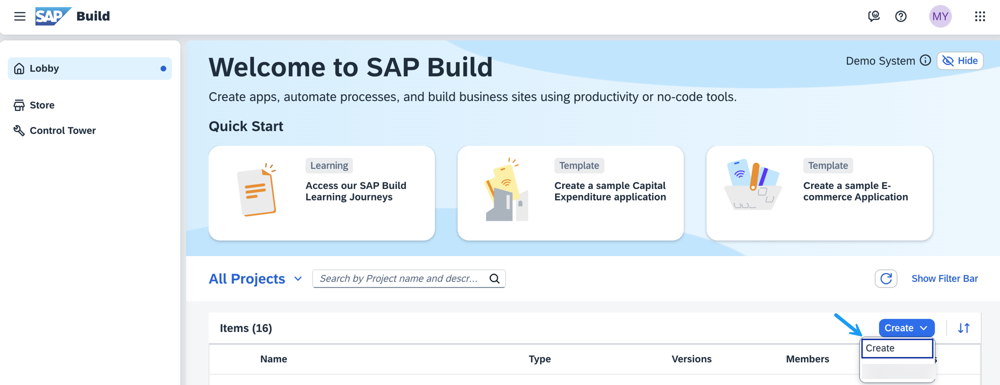
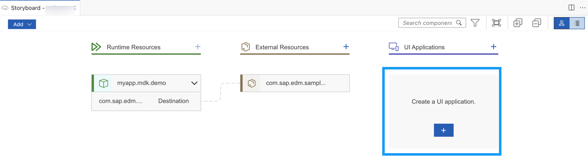
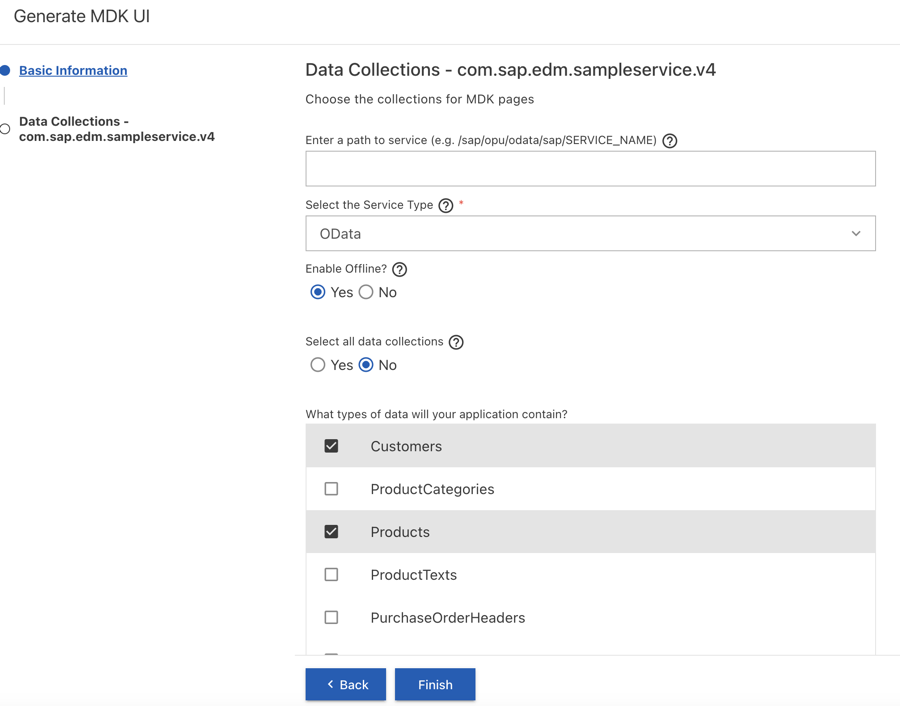
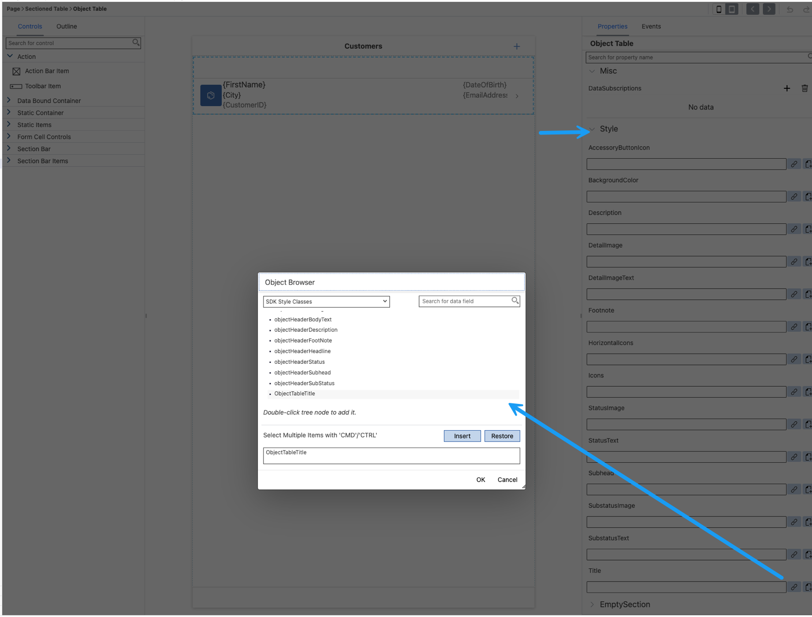
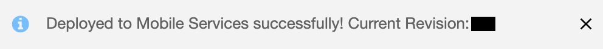
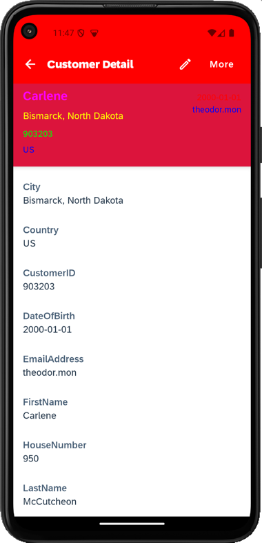

# Add Styling to an MDK App
<!-- description --> Customize an MDK app to display styling to its controls. 

## Prerequisites
- **Tutorial group:** [Set Up for the Mobile Development Kit (MDK)](https://developers.sap.com/group.mobile-dev-kit-setup.html)
- **Install SAP Mobile Services Client** on your [iOS](https://apps.apple.com/us/app/sap-mobile-services-client/id1413653544) or [Android](https://play.google.com/store/apps/details?id=com.sap.mobileservices.client) device
<table><tr><td align="center"><!-- border --><br>Android</td><td align="center"><br>iOS</td></tr></table>
(If you are connecting to `AliCloud` accounts, you will need to brand your [custom MDK client](https://developers.sap.com/tutorials/cp-mobile-dev-kit-build-client.html) by allowing custom domains.)


## You will learn
  - How to change color of action bar and tool bar
  - How to change font color and background color of MDK control properties in a section page

## Intro
You may clone an existing metadata project from the [MDK Tutorial GitHub repository](https://github.com/SAP-samples/cloud-mdk-tutorial-samples/tree/main/4-Level-Up-with-the-Mobile-Development-Kit/2-Add-Styling-to-an-MDK-App) and start directly with step 4 in this tutorial.

---


### Create a New Project Using SAP Build Code

This step includes creating a mobile project in SAP Build Lobby. 

1. In the SAP Build Lobby, click **Create** > **Create** to start the creation process.

    <!-- border -->

2. Click the **Application** tile.    

    <!-- border -->

3. Select the **Mobile** category.

    <!-- border -->

4. Select the **Mobile Application** to develop your mobile project in SAP Business Application Studio. 

    <!-- border -->

5. Enter the project name `mdk_styling` (used for this tutorial) , add a description (optional), and click **Review**. 

    <!-- border -->
    
    >SAP Build Code recommends the dev space it deems most suitable, and it will automatically create a new one for you if you don't already have one. If you have other dev spaces of the Mobile Application type, you can select between them. If you want to create a different dev space, go to the Dev Space Manager. See [Working in the Dev Space Manager](https://help.sap.com/docs/build_code/d0d8f5bfc3d640478854e6f4e7c7584a/ad40d52d0bea4d79baaf9626509caf33.html).

6. Review the inputs under the Summary tab. If everything looks correct, click **Create** to proceed with creating your project.

    <!-- border -->

7. Your project is being created in the Project table of the lobby. The creation of the project may take a few moments. After the project has been created successfully, click the project to open it. 

    <!-- border -->
    
8. The project opens in SAP Business Application Studio, the SAP Build Code development environment.

    <!-- border -->  

    >When you open the SAP Business Application Studio for the first time, a consent window may appear asking for permission to track your usage. Please review and provide your consent accordingly before proceeding.
    > 

### Configure the Project Using Storyboard

The Storyboard provides a graphical view of the application's runtime resources, external resources, UI of the application, and the connections between them. This allows for a quick understanding of the application's structure and components.

- **Runtime Resources**: In the Runtime Resources section, you can see the mobile services application and mobile destination used in the project, with a dotted-line connected to the External Resources.
- **External Resources**: In the External Resources section, you can see the external services used in the project, with a dotted-line connection to the Runtime Resource or the UI app.
- **UI Application**: In the UI Applications section, you can see the mobile applications.

1. Click on **+** button in the **Runtime Resources** column to add a mobile services app to your project. 

    <!-- border --> 

    >This screen will only show up when your CF login session has expired. Use either `Credentials` OR  `SSO Passcode` option for authentication. After successful signed in to Cloud Foundry, select your Cloud Foundry Organization and Space where you have set up the initial configuration for your MDK app and click Apply.

    > 

2. Choose `myapp.mdk.demo` from the applications list in the **Mobile Application Services** editor.

    <!-- border -->  

3. Select `com.sap.edm.sampleservice.v4` from the destinations list and click **Add App to Project**.

    <!-- border -->  

    >You can access the mobile services admin UI by clicking on the Mobile Services option on the right hand side.

    In the storyboard window, the app and mobile destination will be added under the Runtime Resources column. The mobile destination will also be added under the External Resources with a dotted-line connection to the Runtime Resource. The External Resource will be used to create the UI application.

    <!-- border -->      

4. Click the **+** button in the UI application column header to add mobile UI for your project.

    <!-- border -->     

5. In the **Basic Information** step, provide the below information and click **Next**. You will modify the generated project in next step and will deploy it later.

    | Field | Value |
    |----|----|
    | `MDK Template Type` | `CRUD`  |
    | `Enable Auto-Deployment to Mobile Services After Creation` | Select `No` |

    <!-- border -->  

    >The `CRUD` template generates the offline or online actions, rules, messages and pages to view, update, and manage records. More details on _MDK template_ is available in [help documentation](https://help.sap.com/doc/f53c64b93e5140918d676b927a3cd65b/Cloud/en-US/docs-en/guides/getting-started/mdk/bas.html#creating-a-new-project-cloud-foundry).

6. In the **Data Collections** step, provide the below information and click **Finish**. Data Collections step retrieves the entity sets information for the selected destination.

    | Field | Value |
    |----|----|
    | `Enter a path to service (e.g. /sap/opu/odata/sap/SERVICE_NAME)` | Leave it as it is  |
    | `Select the Service Type` | Leave the default value as `OData` |
    | `Enable Offline` | It's enabled by default |
    | `Select all data collections` | Leave it as it is |
    | `What types of data will your application contain?` | Select `Customers` and `Products` |

    <!-- border --> 

    Regardless of whether you are creating an online or offline application, this step is needed for app to connect to an OData service. When building an MDK Mobile application, it assumes the OData service created and the destination that points to this service is set up in Mobile Services. 

    >Since you have Enable Offline set to *Yes*, the generated application will be offline enabled in the MDK Mobile client.

    >Data Collections step retrieves the entity sets information for the selected destination.

7. After clicking **Finish**, the storyboard is updated displaying the UI component. The MDK project is generated in the project explorer based on your selections.
 
    <!-- border --> 

### Add style metadata in LESS file


The `LESS` stylesheet provides the ability to define styling styles that can be used to style the UI in the MDK app.

>You can find more details about [styling in MDK](https://help.sap.com/doc/69c2ce3e50454264acf9cafe6c6e442c/Latest/en-US/docs-en/reference/schemadoc/Styles.less.html).

1. In `MDK_Styling` project, expand the **Styles** folder and open the `Styles.less` file.

    <!-- border -->

2. Replace the generated code with below:

    ```LESS
    @mdkYellow1: #ffbb33;
    @mdkRed1: #ff0000;


    //// This style applies to all the ActionBars in the application
    ActionBar {
        color: white;
        background-color: red;
    }

    //// This style applies to all the ToolBars in the application
    ToolBar {
        color: white;
        background-color: gray; /* Android */
        bartintcolor: gray;     /* iOS */
    }

    //// LogoutToolbarItem is tool bar item for Logout in Main.page
    #LogoutToolbarItem  {
        color: brown;
    }

    //// UploadToolbarItem is tool bar item for Sync in Main.page
    #UploadToolbarItem  {
        color: blue;
    }

    //// By-Class style: These style classes can be referenced from rules and set using ClientAPI setStyle function
    //// below snippet is to style Customers button on Main.page
    .MyCustomerButton{
      font-color: @mdkRed1;
      background-color: cyan;
    }

    //// below snippet is to style Title property of an Object Table control in Customers_List.page
    .ObjectTableTitle {
     color: @mdkYellow1;
    }


    //// below snippet is to style Object Header control in Customers_Detail.page

    /* Object Header - BodyText */
    .objectHeaderBodyText {
      color: red;
    }

    /* Object Header - Description */
    .objectHeaderDescription {
      color: blue;
    }

    /* Object Header - Footnote */
    .objectHeaderFootNote {
      color: green;
    }

    /* Object Header - Headline */
    .objectHeaderHeadline {
      color: #ff00ff;
    }

    /* Object Header - Background */
    .objectHeaderBackground {
    background-color: #DC143C;
    }

    /* Object Header - StatusText */
    .objectHeaderStatus {
      color: red;
      font-style: italic;
      font-size: 18;
    }

    /* Object Header - Subhead */
    .objectHeaderSubhead {
      color: yellow;
    }

    /* Object Header - SubstatusText */
    .objectHeaderSubStatus {
      color: blue;
      font-style: italic;
      font-size: 18;
    }
    ```
    
    >`Styles.less` is already bound to _Styles_ properties in `Application.app` file.

    ><!-- border -->


### Set the styling for SDK controls

In this step, you will bind style classes:

* `MyCustomerButton` to `Customers` section button control on `Main.page`
* `ObjectTableTitle` to Title property of Object Table in `Customers_List.page`
* `objectHeaderBodyText` to `BodyText` property of Object Header in `Customers_Detail.page`
* `objectHeaderDescription` to `Description` property of Object Header in `Customers_Detail.page`
* `objectHeaderFootNote` to `Footnote` property of Object Header in `Customers_Detail.page`
* `objectHeaderHeadline` to `HeadlineText` property of Object Header in `Customers_Detail.page`
* `objectHeaderBackground` to `ObjectHeader` property of Object Header in `Customers_Detail.page`
* `objectHeaderStatus` to `StatusText` property of Object Header in `Customers_Detail.page`
* `objectHeaderSubhead` to `Subhead` property of Object Header in `Customers_Detail.page`
* `objectHeaderSubStatus` to `SubstatusText` property of Object Header in `Customers_Detail.page`

1.  In the `Main.page`, select `Customers` button, click **link** icon next to **Button** property under *Style*.

    In Object browser, double click `MyCustomerButton` class to bind style property and click **OK**.

    <!-- border -->

2. Navigate to **Pages** | `com_sap_edm_sampleservice_v4_Customers`, click `Customers_List.page`, select **Object Table** control, scroll-down to **Style** section.

    Click **link** icon next to **Title** property.

    In Object browser, double-click `ObjectTableTitle` class to bind style property and click **OK**.

    <!-- border -->

3. Navigate to **Pages** | `com_sap_edm_sampleservice_v4_Customers`, click `Customers_Detail.page`, select **Object Header** control, scroll-down to **Style** section and bind control properties to style properties.

    <!-- border -->


### Deploy the Project

So far, you have learned how to build an MDK application in the SAP Business Application Studio editor. Now, you will Deploy the Project definitions to Mobile Services to run  it in the Mobile client.

1. Click the **Deploy** option in the editor's header area, and then choose the deployment target as **Mobile Services** .

    <!-- border -->

2. Select deploy target as **Mobile Services**.

    <!-- border -->

    If you want to enable source for debugging the deployed bundle, then choose **Yes**.

    <!-- border -->

    You should see **Deploy to Mobile Services successfully!** message.

    <!-- border -->

### Display the QR code for onboarding the Mobile app

SAP Business Application Studio includes a feature that displays a QR code for onboarding in the mobile client. To view the onboarding QR code, click the **Application QR Code** icon in the editor's header area.

<!-- border -->

The On-boarding QR code is now displayed.

<!-- border -->

>Leave the Onboarding dialog box open for the next step.


### Run the Project


[OPTION BEGIN [Android]]

>Ensure that you choose the correct device platform tab above. Once you have scanned and onboarded using the onboarding URL, it will be remembered. If you log out and onboard again, you will be prompted to either continue using the current application or scan a new QR code.

1. Follow [these steps](https://github.com/SAP-samples/cloud-mdk-tutorial-samples/blob/main/Onboarding-Android-client/Onboarding-Android-client.md) to successfully on-board the MDK client on your Android device.

    After accepting the app update, you will see the list of entities on the **Main** page and a user menu that includes options to Sync changes, support, check for updates, reset the app. The Main page has been styled.

    

    >`com_sap_edm_sampleservice_v4` is the name of the service file generated in the project creation.

2. Tap **Customers** to navigate to Customer List. You will see that Title property has been styled.

    

3. Tap any record to navigate to Customer Detail page. You will see that Object Header control has been styled.

           

[OPTION END]

[OPTION BEGIN [iOS]]

>Ensure that you choose the correct device platform tab above. Once you have scanned and onboarded using the onboarding URL, it will be remembered. If you log out and onboard again, you will be prompted to either continue using the current application or scan a new QR code.

1. Follow [these steps](https://github.com/SAP-samples/cloud-mdk-tutorial-samples/blob/main/Onboarding-iOS-client/Onboarding-iOS-client.md) to successfully on-board the MDK client on your iOS device.

    After accepting the app update, you will see the list of entities on the **Main** page and a user menu that includes options to Sync changes, support, check for updates, reset the app. The Main page has been styled.

    

    >`com_sap_edm_sampleservice_v4` is the name of the service file generated in the project creation.

2. Tap **Customers** to navigate to Customer List. You will see that Title property has been styled.

    

3. Tap any record to navigate to Customer Detail page. You will see that Object Header control has been styled.

       

[OPTION END]

---
