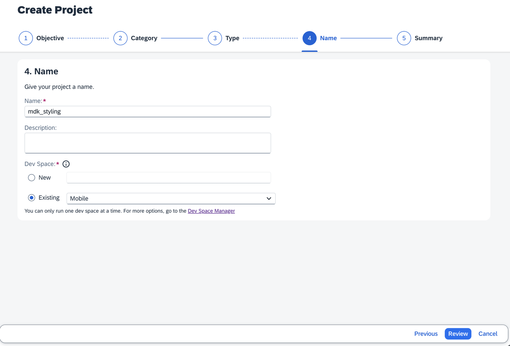
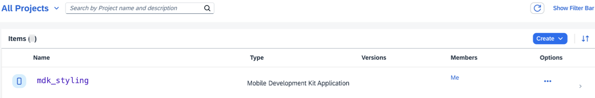
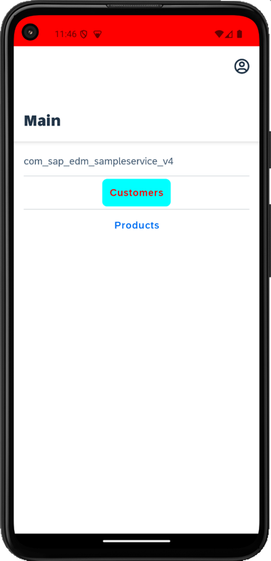
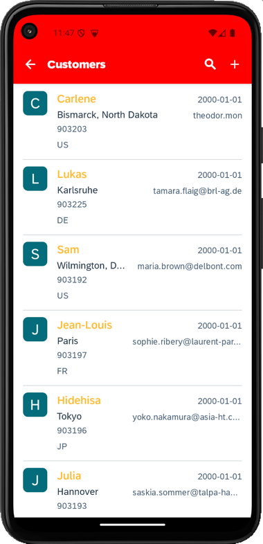
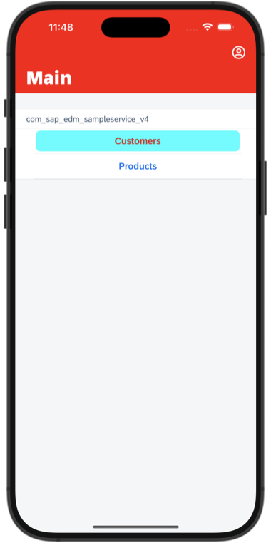
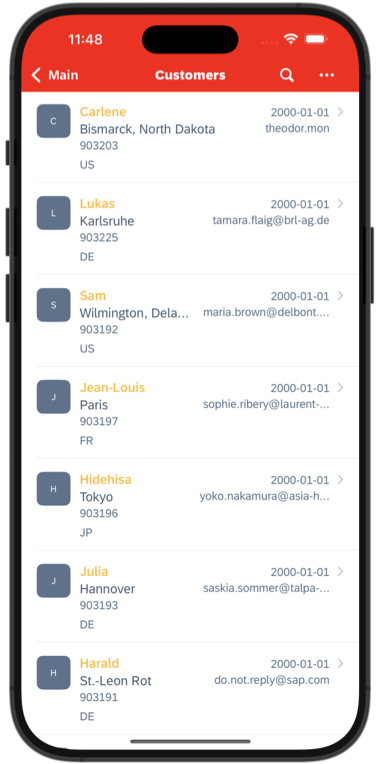

# Add Styling to an MDK App
<!-- description --> Customize an MDK app to display styling to its controls.

## Prerequisites
- **Tutorial group:** [Set Up for the Mobile Development Kit (MDK)](group.mobile-dev-kit-setup)
- **Install SAP Mobile Services Client** on your [iOS](https://apps.apple.com/us/app/sap-mobile-services-client/id1413653544) or [Android](https://play.google.com/store/apps/details?id=com.sap.mobileservices.client) device
<table><tr><td align="center"><!-- border --><br>Android</td><td align="center"><br>iOS</td></tr></table>
(If you are connecting to `AliCloud` accounts then you will need to brand your [custom MDK client](cp-mobile-dev-kit-build-client) by allowing custom domains.)


## You will learn
  - How to change color of action bar and tool bar
  - How to change font color and background color of MDK control properties in a section page

## Intro
You may clone an existing project from [GitHub repository](https://github.com/SAP-samples/cloud-mdk-tutorial-samples/tree/main/4-Level-Up-with-the-Mobile-Development-Kit/3-Add-Styling-to-an-MDK-App) and start directly with step 4 in this tutorial.

---


### Create a new MDK project in SAP Business Application Studio


This step includes creating the mobile development kit project in the editor.

1. Launch the [Dev space](cp-mobile-bas-setup) in SAP Business Application Studio.

2. Click **New Project from Template** on the `Get Started` page.

    <!-- border -->

    >If you do not see the `Get Started` page, you can access it by typing `>get started` in the center search bar.

    <!-- border -->

3. Select **MDK Project** and click **Start**. If you do not see the **MDK Project** option check if your Dev Space has finished loading or reload the page in your browser and try again.

    <!-- border -->

    >This screen will only show up when your CF login session has expired. Use either `Credentials` OR  `SSO Passcode` option for authentication. After successful signed in to Cloud Foundry, select your Cloud Foundry Organization and Space where you have set up the initial configuration for your MDK app and click Apply.

    ><!-- border -->

4. In *Type* step, select or provide the below information and click **Next**:

    | Field | Value |
    |----|----|
    | `MDK Template Type`| Select `CRUD` from the dropdown |
    | `Your Project Name` | Provide a name of your choice. `MDK_Styling` is used for this tutorial |
    | `Your Application Name` | <default name is same as project name, you can provide any name of your choice> |
    | `Target MDK Client Version` | Leave the default selection as `MDK 23.4+ (For use with MDK 23.4 or later clients)` |
    | `Choose a target folder` | By default, the target folder uses project root path. However, you can choose a different folder path |

    <!-- border -->

    >The `CRUD` template creates the offline or online actions, rules, messages, List Detail Pages with editable options. More details on _MDK template_ is available in [help documentation](https://help.sap.com/doc/f53c64b93e5140918d676b927a3cd65b/Cloud/en-US/docs-en/guides/getting-started/mdk/bas.html#creating-a-new-project-cloud-foundry).  

7. In *Service configuration* step, provide or select the below information and click **Next**:

    | Field | Value |
    |----|----|
    | `Data Source` | Select `Mobile Services` from the dropdown |
    | `Mobile Services Landscape` | Select `standard` from the dropdown |
    | `Application Id` | Select `com.sap.mdk.demo` from the dropdown |
    | `Destination` | Select `SampleServiceV2` from the dropdown |
    | `Enter a path to the OData service` | Leave it as it is |
    | `Enable Offline` | It's enabled by default |

    <!-- border -->

    Regardless of whether you are creating an online or offline application, this step is needed app to connect to an OData service. When building an Mobile Development Kit application, it assumes the OData service created and the destination that points to this service is set up in Mobile Services. Since we have Enable Offline set to Yes, the generated application will be offline enabled in the MDK Mobile client.

8. In *Data Collections* step, select `Customers` and `Products`. Click **Finish** to complete the project creation.

    <!-- border -->

9. After clicking **Finish**, the wizard will generate your MDK Application based on your selections. You should now see the `MDK_Styling` project in the project explorer.

### Add style metadata in LESS file


The `LESS` stylesheet provides the ability to define styling styles that can be used to style the UI in the MDK app.

>You can find more details about [styling in MDK](https://help.sap.com/doc/69c2ce3e50454264acf9cafe6c6e442c/Latest/en-US/docs-en/reference/schemadoc/Styles.less.html).

1. In `MDK_Styling` project, expand the **Styles** folder and open the `Styles.less` file.

    <!-- border -->

2. Replace the generated code with below:

    ```LESS
    @mdkYellow1: #ffbb33;
    @mdkRed1: #ff0000;


    //// This style applies to all the ActionBars in the application
    ActionBar {
        color: white;
        background-color: red;
    }

    //// This style applies to all the ToolBars in the application
    ToolBar {
        color: white;
        background-color: gray; /* Android */
        bartintcolor: gray;     /* iOS */
    }

    //// LogoutToolbarItem is tool bar item for Logout in Main.page
    #LogoutToolbarItem  {
        color: brown;
    }

    //// UploadToolbarItem is tool bar item for Sync in Main.page
    #UploadToolbarItem  {
        color: blue;
    }

    //// By-Class style: These style classes can be referenced from rules and set using ClientAPI setStyle function
    //// below snippet is to style Customers button on Main.page
    .MyCustomerButton{
      font-color: @mdkRed1;
      background-color: cyan;
    }

    //// below snippet is to style Title property of an Object Table control in Customers_List.page
    .ObjectTableTitle {
     color: @mdkYellow1;
    }


    //// below snippet is to style Object Header control in Customers_Detail.page

    /* Object Header - BodyText */
    .objectHeaderBodyText {
      color: red;
    }

    /* Object Header - Description */
    .objectHeaderDescription {
      color: blue;
    }

    /* Object Header - Footnote */
    .objectHeaderFootNote {
      color: green;
    }

    /* Object Header - Headline */
    .objectHeaderHeadline {
      color: #ff00ff;
    }

    /* Object Header - Background */
    .objectHeaderBackground {
    background-color: #DC143C;
    }

    /* Object Header - StatusText */
    .objectHeaderStatus {
      color: red;
      font-style: italic;
      font-size: 18;
    }

    /* Object Header - Subhead */
    .objectHeaderSubhead {
      color: yellow;
    }

    /* Object Header - SubstatusText */
    .objectHeaderSubStatus {
      color: blue;
      font-style: italic;
      font-size: 18;
    }
    ```

3. Save your changes to the `Styles.less` file.

    >`Styles.less` is already bound to _Styles_ properties in `Application.app` file.

    ><!-- border -->


### Set the styling for SDK controls


In this step, you will bind style classes:

* `MyCustomerButton` to `Customers` section button control on `Main.page`
* `ObjectTableTitle` to Title property of Object Table in `Customers_List.page`
* `objectHeaderBodyText` to `BodyText` property of Object Header in `Customers_Detail.page`
* `objectHeaderDescription` to `Description` property of Object Header in `Customers_Detail.page`
* `objectHeaderFootNote` to `Footnote` property of Object Header in `Customers_Detail.page`
* `objectHeaderHeadline` to `HeadlineText` property of Object Header in `Customers_Detail.page`
* `objectHeaderBackground` to `ObjectHeader` property of Object Header in `Customers_Detail.page`
* `objectHeaderStatus` to `StatusText` property of Object Header in `Customers_Detail.page`
* `objectHeaderSubhead` to `Subhead` property of Object Header in `Customers_Detail.page`
* `objectHeaderSubStatus` to `SubstatusText` property of Object Header in `Customers_Detail.page`

1.  In the `Main.page`, select `Customers` button, click **link** icon next to **Button** property under *Style*.

    In Object browser, double click `MyCustomerButton` class to bind style property and click **OK**.

    <!-- border -->

2. Navigate to **Pages** | **Customers**, click `Customers_List.page`, select **Object Table** control, scroll-down to **Style** section.

    Click **link** icon next to **Title** property.

    In Object browser, double-click `ObjectTableTitle` class to bind style property and click **OK**.

    <!-- border -->

3. Navigate to **Pages** | **Customers**, click `Customers_Detail.page`, select **Object Header** control, scroll-down to **Style** section and bind control properties to style properties.

    <!-- border -->


### Deploy the application


So far, you have learned how to build an MDK application in the SAP Business Application Studio editor. Now, you will deploy the application definitions to Mobile Services and Cloud Foundry to use it in the Mobile client and Web application respectively.

1. Right-click `Application.app` and select **MDK: Deploy**.

    <!-- border -->

2. Select deploy target as **Mobile & Cloud**.

    MDK editor will deploy the metadata to Mobile Services (for Mobile client) followed by to Cloud Foundry (for Web application).

    <!-- border -->

    You should see successful messages for both deployments.

    <!-- border -->


### Display the QR code for onboarding the Mobile app


SAP Business Application Studio has a feature to display the QR code for onboarding in the Mobile client.

Click the **Application.app** to open it in MDK Application Editor and then click the **Application QR Code** icon.

<!-- border -->

The On-boarding QR code is now displayed.

<!-- border -->

>Leave the Onboarding dialog box open for the next step.


### Run the app


[OPTION BEGIN [Android]]

>Make sure you are choosing the right device platform tab above. Once you have scanned and on-boarded using the onboarding URL, it will be remembered. When you Log out and onboard again, you will be asked either to continue to use current application or to scan new QR code.

1. Follow [these steps](https://github.com/SAP-samples/cloud-mdk-tutorial-samples/blob/main/Onboarding-Android-client/Onboarding-Android-client.md) to on-board the MDK client.

    After you accept the app update, you will see the list of entities on the **Main** page and a user menu that includes options to Sync changes, support, check for updates, reset the app. The Main page has been styled.

    

2. Tap **Customers** to navigate to Customer List. You will see that Title property has been styled.

    

3. Tap any record to navigate to Customer Detail page. You will see that Object Header control has been styled.

           

[OPTION END]

[OPTION BEGIN [iOS]]

>Make sure you are choosing the right device platform tab above. Once you have scanned and on-boarded using the onboarding URL, it will be remembered. When you Log out and onboard again, you will be asked either to continue to use current application or to scan new QR code.

1. Follow [these steps](https://github.com/SAP-samples/cloud-mdk-tutorial-samples/blob/main/Onboarding-iOS-client/Onboarding-iOS-client.md) to on-board the MDK client.

    After you accept the app update, you will see the list of entities on the **Main** page and a user menu that includes options to Sync changes, support, check for updates, reset the app. The Main page has been styled.

    

2. Tap **Customers** to navigate to Customer List. You will see that Title property has been styled.

    

3. Tap any record to navigate to Customer Detail page. You will see that Object Header control has been styled.

       

[OPTION END]

[OPTION BEGIN [Web]]

1. Click the highlighted button to open the MDK Web application in a browser. Enter your SAP BTP credentials if asked.

    <!-- border -->

    >You can also open the MDK web application by accessing its URL from `.project.json` file.
    <!-- border -->

    You will see the list of entities on the **Main** page and a user menu option. The Main page has been styled.

    <!-- border -->

2. Click **Customers** to navigate to Customer List. You will see that Title property has been styled.

    <!-- border -->

3. Click any record to navigate to Customer Detail page. You will see that Object Header control has been styled.

    <!-- border -->   

[OPTION END]


---
