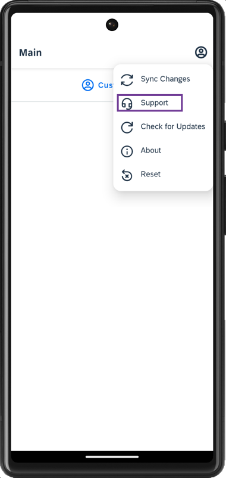
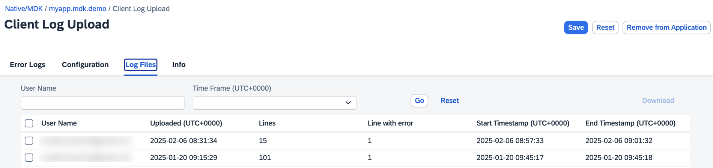

# Upload Logs from an MDK App
<!-- description --> Allow users to upload logs from an MDK app to SAP Mobile Services.

## You will learn
  - How to enable log upload feature in Mobile Services
  - How to upload logs from the app
  - How to examine log details for troubleshooting

## Intro
Managing issues with apps rolled out to a large number of users is a challenge and often requires deep insights into running applications to troubleshoot. For that purpose, SAP Mobile Services includes a Logging feature that enables you to gain insights into live apps. Use MDK to gather logs on client devices, to add contextual information and to automatically or manually upload them to mobile services for further inspection.  You may clone an existing metadata project from the [MDK Tutorial GitHub repository](https://github.com/SAP-samples/cloud-mdk-tutorial-samples/tree/main/3-Enhance-Your-First-MDK-App-with-Additional-Functionalities/2-cp-mobile-dev-kit-delete-customer) to start with this tutorial.

---

### Define client log policy in Mobile Services cockpit

SAP Mobile Services provides administrators, developers and support staff with extensive logs and traces functionality to troubleshoot application issues. You can control the amount of information that is captured by setting the log level for individual logging components.

In this step, you will enable client log upload policy in **SAP Mobile Services Cockpit** for a given MDK app.

1. Login to [Mobile Services Cockpit](fiori-ios-hcpms-setup), click `com.sap.mdk.demo` | **Mobile Client Log Upload**.

    <!-- border -->

2. Check **Log Upload** option and click **Save**.

    <!-- border -->

    >Other policy parameters like Log Level, Delete Uploaded Log After, Maximum Number of Logs and Maximum Log Size currently have no effect.

    >You can find more details about [Client Log Upload feature](https://help.sap.com/doc/f53c64b93e5140918d676b927a3cd65b/Cloud/en-US/docs-en/guides/features/logging/admin/config.html).

###  Understanding Logging & Tracing in MDK

Logs help you trace events that occur while your application is running. You can create logging actions, set their priority levels and upload stored log entries. using the MDK, you can set up logging in one of two ways:

* [Using Logging Actions](https://help.sap.com/doc/f53c64b93e5140918d676b927a3cd65b/Cloud/en-US/docs-en/guides/features/logging/mdk/logging.html#using-logging-actions)
    * [`SetState`](https://help.sap.com/doc/3642933ef2e1478fb1578ef2acba4ae9/Latest/en-US/reference/schemadoc/Action/Logger/SetState.schema.html): used to turn the logger On, Off or Toggle
    * [`SetLevel`](https://help.sap.com/doc/3642933ef2e1478fb1578ef2acba4ae9/Latest/en-US/reference/schemadoc/Action/Logger/SetLevel.schema.html): to set log level (Debug, Info, Warn or Error)
    * [`Upload`](https://help.sap.com/doc/3642933ef2e1478fb1578ef2acba4ae9/Latest/en-US/reference/schemadoc/Action/Logger/Upload.schema.html): to upload logs from app to Mobile Services
    * [`SetDebugSettings`](https://help.sap.com/doc/3642933ef2e1478fb1578ef2acba4ae9/Latest/en-US/reference/schemadoc/Action/SetDebugSettings.schema.html): enables `DebugSettings` during runtime or override the `DebugSettings` in `BrandedSettings.json`
* [Using the Client API in Rules](https://help.sap.com/doc/f53c64b93e5140918d676b927a3cd65b/Cloud/en-US/docs-en/guides/features/logging/mdk/logging.html#using-the-client-api-in-rules) 

The MDK template generates a project that includes a user menu with support options, making it easier for initial troubleshooting without having to create logging, tracing, or upload actions. YOf course, you can create your own actions or rules and add them to  your project when needed.

<!-- border -->

### Upload Logs from your App to SAP Mobile Services

[OPTION BEGIN [Android]]

1. Tap the **Support** option in the user menu on the main page.

    

2. Tap the **Activity Log** to open the user activity log page. As the page is loaded, logging is by default enabled and log level is set to *Error*.

    
        

3. You can send activity logs to SAP Mobile Services or change the log level to other options, for example, Warning, Info, Debug, or Trace to collect more details. When the log level is set to `Trace`, two new options **Tracing Categories** and **OData Tracing** appear on the activity log page.
    
    * **Tracing Categories** allow you to select one or more tracing categories (to capture information about any MDK action, binding, on-boarding, push etc.).  
    * **OData Tracing** captures tracing on OData operations, such as `uploadOfflineOData`, read, etc. 

    Once you have set the required settings, tap on **Send Activity Log** to upload client logs from app to SAP Mobile Services.

     

[OPTION END]

[OPTION BEGIN [iOS]]

1. Tap the **Support** option in the user menu on the main page.

    

2. Tap the **Activity Log** to open the user activity log page. As the page is loaded, logging is by default enabled and log level is set to *Error*.

    
        

3. You can send activity logs to SAP Mobile Services or change the log level to other options, for example, Warning, Info, Debug, or Trace to collect more details. When the log level is set to `Trace`, two new options **Tracing Categories** and **OData Tracing** appear on the activity log page.
    
    * **Tracing Categories** allow you to select one or more tracing categories (to capture information about any MDK action, binding, on-boarding, push etc.).  
    * **OData Tracing** captures tracing on OData operations, such as `uploadOfflineOData`, read, etc. 

    Once you have set the required settings, tap on **Send Activity Log** to upload client logs from app to SAP Mobile Services.

     

[OPTION END]

### Examine uploaded logs in Mobile Services cockpit

Open SAP Mobile Services Cockpit, click **Mobile Applications** **&rarr;** **Native/MDK** **&rarr;** click `com.sap.mdk.demo` app **&rarr;** **Mobile Client Log Upload** **&rarr;** **Log Files**.

<!-- border -->

A log file is created for each upload. All the uploaded files, including all levels, not just error or fatal will be listed here. You can select a file and download it locally on your machine for further examination.

>Check [documentation](https://help.sap.com/doc/f53c64b93e5140918d676b927a3cd65b/Cloud/en-US/docs-en/guides/features/logging/admin/config.html) for more details about Uploading and Viewing Client Logs.

---
