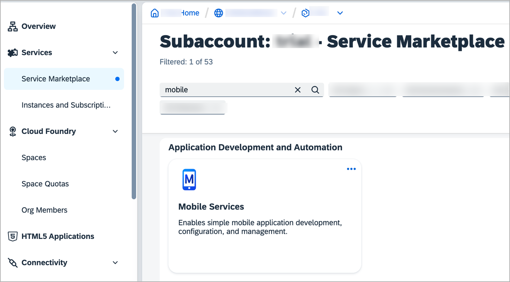
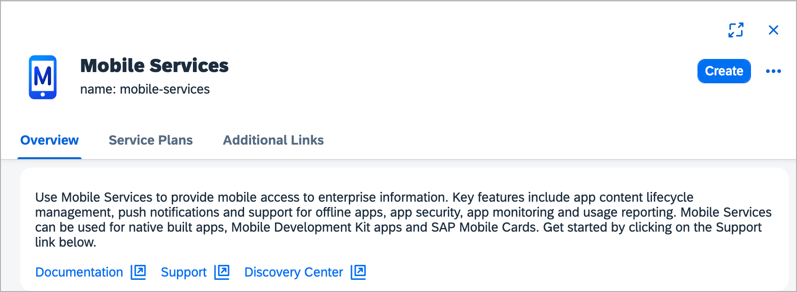
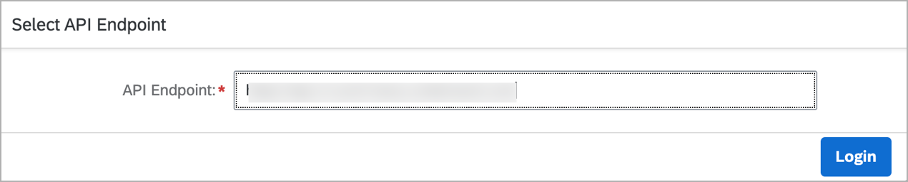
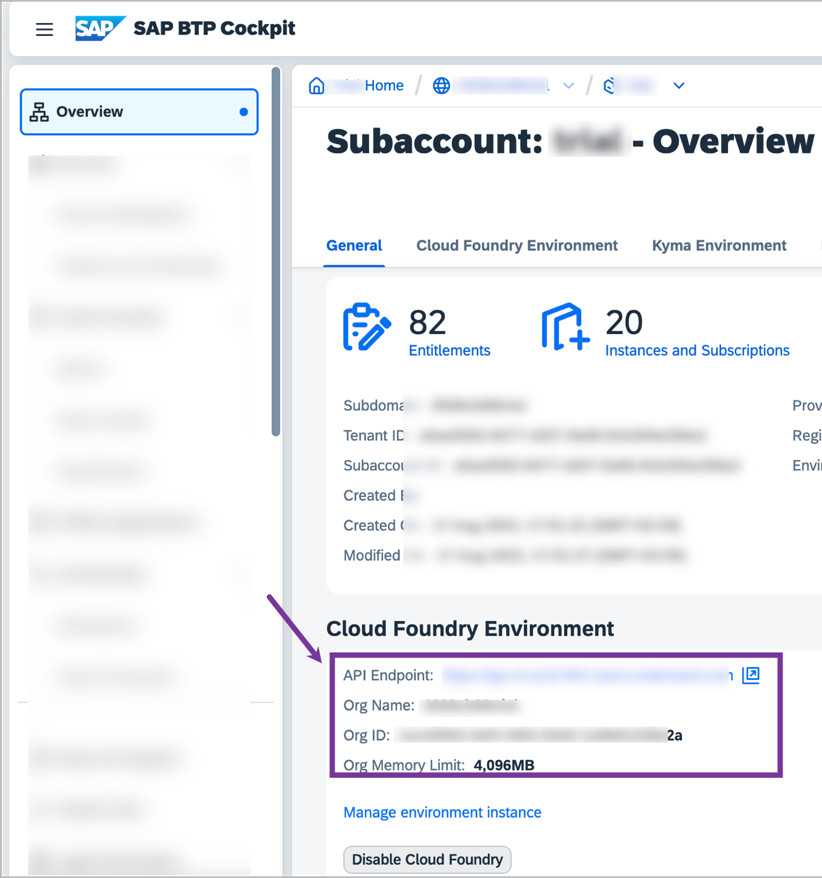
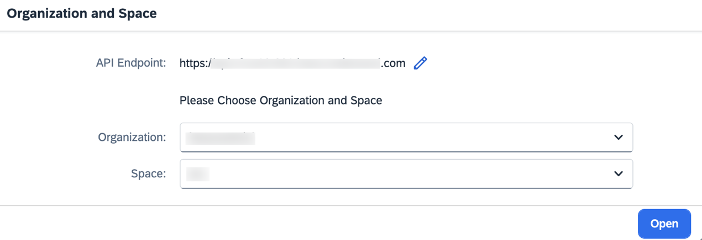

# Access SAP Mobile Services
<!-- description --> Access SAP Mobile Services within a SAP Business Technology Platform account and open the Mobile Services admin UI.

## Prerequisites  
- You have [Signed Up for a trial account on SAP BTP](https://developers.sap.com/tutorials/hcp-create-trial-account.html).

## You will learn
  - How to access SAP Mobile Services in your BTP account

## Intro
Once SAP Mobile Services is available, you can use its features in your Mobile development kit, SAP BTP SDK for iOS & Android apps.

---

### Go to your global account on SAP BTP

1. In your web browser, open the [SAP BTP Trial admin UI](https://account.hanatrial.ondemand.com/admin UI).

2. Provide the login details to log on to your account.

3. Navigate to the trial global account by clicking **Go To Your Trial Account**.

    <!-- border -->

### Launch SAP Mobile Services admin UI

1. Click subaccount available in your global account.

    

2. In the left pane, choose **Services** **&rarr;** **Service Marketplace**.

    >The **Service Marketplace** is where you can find services to attach to any of your applications. These services are provided by SAP BTP to create, and produce applications quickly and easily. Once a service has been created, it is known as a `service instance`.

    

3. Search for **Mobile**, and click **Mobile Services** tile.  

    

4. Choose **Support** to open **SAP Mobile Services Cockpit**.

    

5. The SAP mobile service admin UI dialog, **Select API Endpoint**, appears. Before you click on **Login**, make sure to provide the correct API endpoint belongs to your BTP subaccount. 

    

    >In order to find the API endpoint, navigate to your BTP subaccount > Overview > Cloud Foundry Environment. Copy the URL and paste it in the Mobile service admin UI dialog. This is mainly required if you are using Mobile Services in an Extended Landscape. 
    >

    Once you provide the correct API Endpoint, click on **Login** to continue.

6. You may asked to enter your Email or Username to continue and click **Next**.

7. After you log into the endpoint, the **Organization** and **Space** prompt appears. The current API Endpoint value appears. Choose the relevant **Organization** and **Space** from the dropdown list, and then choose **Open**.

    <!-- border -->

    >If the organization that you want to access is not listed, you might have used the wrong API Endpoint. In this case, you can log out and log in again, in order to input the correct API Endpoint value.
    You have now logged in to the SAP Mobile Services admin UI.

    <!-- border -->

    Bookmark the **Mobile Services admin UI URL** for quick access.

